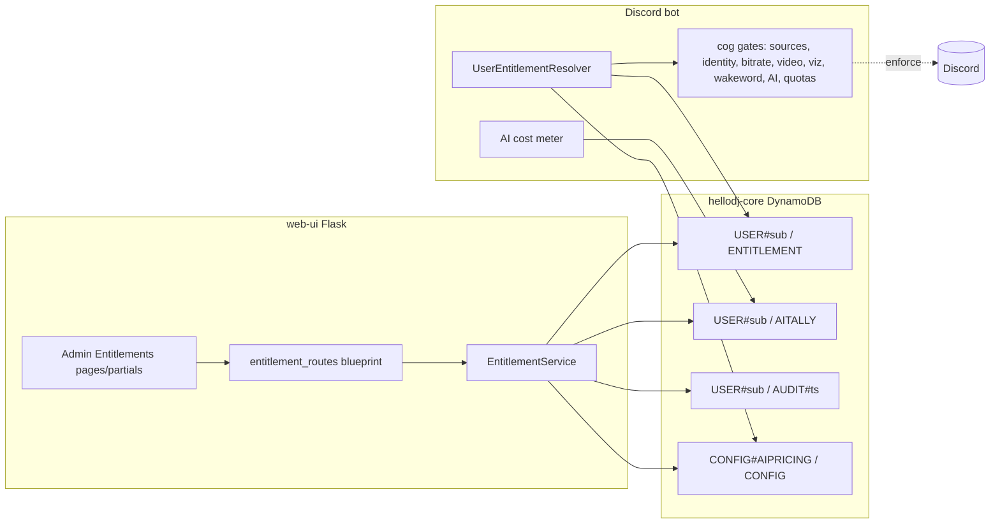
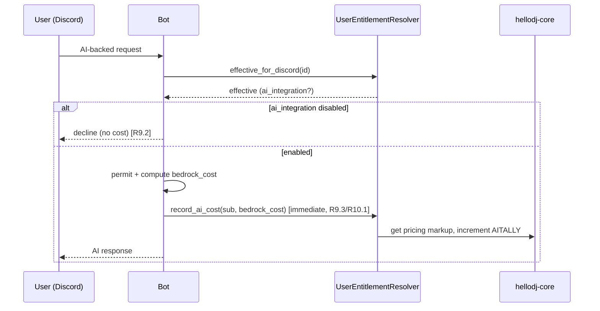

# Admin Entitlements Panel Design

## Overview

This feature adds a true administrative control plane to the HelloDJ web-ui plus
a runtime enforcement layer in the bot. Today the "admin" panel only lists
Cognito accounts and toggles role/enabled/delete (`pages.py`,
`admin_directory.py`); Dashboard/Config/Guilds are self-service. This design
introduces **per-user entitlements** — feature flags and numeric quotas stored on
the shared `hellodj-core` single table — authored by administrators in the web-ui
and read at runtime by the bot so that disabling a capability takes real effect
in Discord rather than being cosmetic.

The design follows the patterns already established in the codebase:

- **Storage**: one `hellodj_platform_logic.data_access.CoreTable` item per user
  for entitlements, mirroring `ConfigStore` / `GuildAdminService` single-table
  usage (`PK`/`SK`/`entityType`/`data`, optimistic-lock upsert).
- **Service layer**: a new `EntitlementService` built in `bootstrap.py` and
  hung on `app.extensions`, degrading to `None` when no datastore is configured
  (like every other service).
- **Web-ui routes**: new admin-only routes in a dedicated blueprint gated by the
  same `_is_admin()` check `pages.py` already uses.
- **Bot enforcement**: a `UserEntitlementResolver` in the bot (analogous to the
  existing `GuildCredentialResolver`) that reads the same `hellodj-core` item,
  merges explicit values over secure defaults, caches with a bounded TTL, and
  fails safe to defaults when the datastore is unavailable.
- **AI cost metering**: a per-user tally item plus a pricing table
  (Bedrock unit prices as data, not code), with a configurable markup (default
  100%).
- **Audit**: an append-only history of entitlement changes under the user's
  partition, written transactionally with the change (change blocked if the
  audit write fails).

The pure decision logic (merge defaults, quota checks, over-cap check, effective
cost) is factored into side-effect-free functions so they are unit- and
property-testable without AWS, matching `can_manage_guild`.

## Glossary

- **Entitlement**: A per-user record of allowed capabilities (boolean flags) and
  numeric quotas, stored as one `hellodj-core` item.
- **Effective entitlements**: The explicit stored record merged over the secure
  default set. What both the web-ui and bot actually enforce.
- **Default entitlement set**: The conservative, most-restrictive capability set
  applied when a user has no explicit value for a field (secure by default).
- **Entitlement flag**: A boolean capability toggle (e.g. `video_activities`).
- **Quota**: A numeric limit (e.g. `max_bots_per_guild`, `max_guilds`).
- **AI tally**: The accumulated effective AI cost for a user.
- **Bedrock unit price**: The per-model Amazon Bedrock price (per 1K input/output
  tokens or per request) used to compute cost. Stored as configuration data.
- **Markup**: A multiplier over Bedrock cost applied to a user's tally. Default
  100% (effective cost = 2× Bedrock cost).
- **Effective cost**: `bedrock_cost × (1 + markup)`, the amount added to a tally.
- **EntitlementService**: The web-ui service (`entitlement_service.py`) that
  reads/writes entitlement, tally, pricing, and audit items on `hellodj-core`.
- **UserEntitlementResolver**: The bot-side resolver (`bot/playback/`
  `user_entitlements.py`) that resolves a user's effective entitlements at
  runtime with caching and fail-safe defaults.
- **CoreTable**: `hellodj_platform_logic.data_access.CoreTable` over the
  `hellodj-core` DynamoDB single table.
- **Administrator**: An authenticated Cognito `admins` group member.
- **User**: A standard account governed by entitlements, keyed by Cognito sub.

## Architecture



### Key architectural decisions

1. **Keyed by Cognito subject (`sub`), not username.** Entitlements govern a
   platform account; the bot resolves the acting Discord user to a Cognito `sub`
   via the existing `UserProfileService` reverse index (Discord → sub) before
   resolving entitlements. This keeps a single stable identity across web-ui and
   bot. The admin UI displays username/email for humans but stores under `sub`.

2. **One entitlement item per user.** All flags + quotas live in one item's
   `data` map so a save is a single optimistic-lock upsert and a resolve is a
   single `get`. This mirrors `ConfigStore`'s per-scope `Config` item.

3. **Secure defaults live in code, not data.** The default set is a constant in a
   shared pure module so the web-ui (rendering "these are defaults") and the bot
   (fail-safe resolution) agree exactly. Absence of a field → default; an
   explicit field always overrides.

4. **Bot enforcement is the source of truth.** The web-ui gate is advisory (hides
   UI); the bot gate is authoritative because that is where the capability
   actually executes. The bot fails safe (restrictive) if it cannot resolve.

5. **AI pricing is data.** Bedrock per-model unit prices are stored in a
   `CONFIG#AIPRICING` item so a price change is a data edit (admin-editable or
   ops-updated), never a code change (R10.3).

6. **Audit is write-before-apply.** The entitlement change and its audit entry
   are written together; if the audit write fails the change is not applied
   (R15.2). Implemented via a DynamoDB `TransactWriteItems` (audit put + entitle
   update) when available, else a strict ordering (audit put first, then update;
   on update failure the audit row is marked orphaned) — see Error Handling.

## Data Models

### hellodj-core single table

All items use the established shape: `PK`, `SK`, `entityType`, `data`, plus the
optimistic-lock `version` attribute `CoreTable` maintains.

| Item | PK | SK | entityType | data (key fields) |
|------|----|----|-----------|-------------------|
| Entitlement | `USER#<sub>` | `ENTITLEMENT` | `Entitlement` | flags + quotas (see below) |
| AI tally | `USER#<sub>` | `AITALLY` | `AiTally` | `accumulated_cost`, `currency`, `updated_at`, `cap` |
| Audit entry | `USER#<sub>` | `AUDIT#<iso8601-ts>#<rand>` | `EntitlementAudit` | `admin_sub`, `field`, `old`, `new`, `at` |
| AI pricing | `CONFIG#AIPRICING` | `CONFIG` | `AiPricing` | `models`: `{modelId: {input_per_1k, output_per_1k, request}}`, `markup` |

Reverse lookup for "list all users' entitlements" is not needed — the admin panel
enumerates users from the Cognito `AdminDirectory` (existing) and fetches each
user's entitlement item by `sub` (or renders defaults if absent). Audit entries
sort chronologically by `SK` prefix, so the user's history is a single
`query_pk_prefix(USER#<sub>, sk_prefix="AUDIT#")` in reverse.

### Entitlement `data` shape

```json
{
  "sources": { "youtube": false, "youtube_music": false,
               "soundcloud": true, "spotify": false, "tidal": false },
  "custom_avatar": false,
  "custom_name": false,
  "audio_above_96k": false,
  "video_activities": false,
  "visualizations": false,
  "wakeword": false,
  "ai_integration": false,
  "max_bots_per_guild": 1,
  "max_bots_per_guild_enabled": false,
  "max_guilds": 1,
  "ai_spend_cap": null
}
```

Any field absent from a stored record takes the default (below). A source key
absent from `sources` takes the per-source default.

## Components and Interfaces

### Shared pure module — `entitlements_core.py` (web-ui) / mirrored constant (bot)

Side-effect-free, importable by both processes, unit/property testable.

```python
# Secure default entitlement set (R13). Most-restrictive permitted state.
DEFAULT_ENTITLEMENTS: dict[str, Any] = {
    "sources": {"youtube": False, "youtube_music": False,
                "soundcloud": True,   # baseline no-auth source permitted
                "spotify": False, "tidal": False},
    "custom_avatar": False,           # R13.2 custom identity restricted
    "custom_name": False,
    "audio_above_96k": False,
    "video_activities": False,
    "visualizations": False,
    "wakeword": False,
    "ai_integration": False,
    "max_bots_per_guild": 1,
    "max_bots_per_guild_enabled": False,
    "max_guilds": 1,
    "ai_spend_cap": None,
}

def merge_effective(stored: dict | None) -> dict:
    """Merge an explicit record over DEFAULT_ENTITLEMENTS (deep for sources).
    Absent field -> default; explicit field -> override (R13.3)."""

def source_allowed(effective: dict, provider: str) -> bool:
    """R3.2/R3.4 — is provider enabled in effective entitlements."""

def effective_max_bots_per_guild(effective: dict) -> int:
    """R11 — if enabled, the stored value; if disabled but stored>1, the
    stored value still applies (R11.3); else 1."""

def quota_reached(current: int, limit: int) -> bool:
    """True when current >= limit (used for both quotas)."""

def over_cap(accumulated: float, cap: float | None) -> bool:
    """R10.5 — True when cap is set and accumulated >= cap (equal counts)."""

def effective_cost(bedrock_cost: float, markup: float) -> float:
    """R10.1/R10.2 — bedrock_cost * (1 + markup); default markup 1.0."""

def validate_quota(value: int) -> int:
    """R12.2 — raise ValueError if value < 1; else return value."""
```

### `EntitlementService` (web-ui, `entitlement_service.py`)

```python
class EntitlementService:
    def __init__(self, core_table: CoreTable) -> None: ...

    def get_effective(self, sub: str) -> dict:
        """Stored record merged over defaults (R2.2)."""

    def get_raw(self, sub: str) -> dict | None:
        """The explicit record only, or None if unset (to flag 'defaults')."""

    def set_fields(self, sub: str, changes: dict, *, admin_sub: str) -> dict:
        """Validate, write audit + entitlement together (R2.3, R15).
        Raises on validation (R12.2) or audit-write failure (R15.2)."""

    def get_tally(self, sub: str) -> dict:
        """Accumulated AI cost + cap (R10.4)."""

    def add_cost(self, sub: str, effective_cost: float) -> dict:
        """Increment the tally (used by bot metering, R10.1)."""

    def reset_tally(self, sub: str, *, admin_sub: str) -> None:
        """Zero the tally, audited (R10.6)."""

    def get_pricing(self) -> dict:
        """AI pricing table + markup (R10.3)."""

    def history(self, sub: str) -> list[dict]:
        """Audit entries newest-first (R15.3)."""
```

Storage keys via module helpers: `user_pk(sub) -> "USER#<sub>"`,
`ENTITLEMENT_SK = "ENTITLEMENT"`, `AITALLY_SK = "AITALLY"`,
`audit_sk(ts) -> "AUDIT#<ts>#<rand>"`, `AIPRICING_PK = "CONFIG#AIPRICING"`.
Upserts reuse the `ConfigStore._upsert` pattern (`put_new` then
`update_with_lock`).

### Web-ui routes — `entitlement_routes.py` (new blueprint, admin-only)

A dedicated blueprint keeps the admin control plane distinct from the
self-service `pages` blueprint (R1.1). Every route repeats the existing
login + `_is_admin` guard and, per R1.3, a hardened fallback: if the guard
somehow passes a non-admin (bypass), the route returns a 403 error page /
forces logout rather than rendering admin content.

| Method | Path | Purpose | Requirements |
|--------|------|---------|-------------|
| GET | `/admin/entitlements` | User picker (reuses `AdminDirectory` list) | R1.1, R2.1 |
| GET | `/admin/entitlements/<sub>` | One user's flags/quotas/tally/history | R2.1, R2.2, R10.4, R15.3 |
| POST | `/admin/entitlements/<sub>/flags` | Toggle a flag (flip) | R2.3, R3–R9 |
| POST | `/admin/entitlements/<sub>/quotas` | Set max_bots_per_guild / max_guilds | R2.3, R11, R12 |
| POST | `/admin/entitlements/<sub>/ai/markup` | Set markup / cap | R10.2, R10.5 |
| POST | `/admin/entitlements/<sub>/ai/reset` | Reset tally | R10.6 |

Toggle routes flip the current effective value (R4.1/R4.2) and re-render the
HTMX partial. Quota routes validate ≥ 1 (R12.2) and render a field error on
violation. Any save failure (validation, persistence, timeout) renders an error
notice and does not report success (R2.4).

The admin nav gains an "Entitlements" entry (extending `ADMIN_NAV_ITEM` handling
in `pages.py` `_nav_for_current_user`), shown only to admins (R1.4).

### Bot enforcement — `UserEntitlementResolver` (`bot/playback/user_entitlements.py`)

```python
class UserEntitlementResolver:
    def __init__(self, core_table, *, ttl_seconds: int = 60) -> None: ...

    def effective_for_discord(self, discord_id: str) -> dict:
        """Resolve Discord id -> Cognito sub (UserProfileService reverse
        index) -> effective entitlements. Cached per sub with TTL (R14.2).
        On any datastore failure return DEFAULT_ENTITLEMENTS (R14.3)."""

    def record_ai_cost(self, sub: str, bedrock_cost: float) -> None:
        """effective_cost via pricing markup, increment tally (R10.1)."""
```

The resolver is constructed once at bot startup (like the planned
`GuildCredentialResolver` wiring) and reachable from the cogs. Enforcement points
call it before permitting a governed action:

| Capability | Enforcement point (bot) | Behavior |
|-----------|------------------------|----------|
| Sources (R3) | `player._resolve_and_play` source-map selection | reject disallowed source with message |
| Custom avatar/name (R4) | bot-identity applier (per `bot-identity-and-source-auth`) | reject set if flag off |
| Audio >96k (R5) | player track build / node request | cap bitrate at stream start |
| Video activities (R6) | `cogs/video.py` activity start | always respond; decline if off |
| Visualizations (R7) | `cogs/visualizer.py` start | decline if off |
| Wake-word (R8) | `voice/wakeword.py` / `cogs/voice.py` | require wake-word; block all voice if off |
| AI integration (R9) | `voice/llm_intent.py` / `voice/query_handler.py` | decline if off; block non-declined as error |
| Max bots/guild (R11) | orchestrator add-instance path | reject at limit |
| Max guilds (R12) | orchestrator activate-in-guild path | reject at limit |

Each gate resolves effective entitlements, applies the matching pure helper, and
either proceeds or returns a clear user-facing decline. The bot always returns a
response for video/AI requests (R6.3, R9.3).

### AI cost metering flow (R9, R10)



Metering happens immediately when the request is permitted (R9.3), using the
pricing item's per-model unit price × tokens/requests, then `effective_cost`
with the configured markup (default 100%).

## Correctness Properties

Property 1: Effective-entitlement merge is defaults-safe
_For any_ stored record (including `None` / missing fields), `merge_effective`
SHALL return a value where every field present in the stored record equals the
stored value and every absent field equals its `DEFAULT_ENTITLEMENTS` value; no
absent field SHALL resolve to a more-permissive value than the default.
**Validates: Requirements 2.2, 13.1, 13.2, 13.3**

Property 2: Source gate matches effective entitlements
_For any_ effective entitlement set and provider, playback SHALL be permitted iff
`source_allowed(effective, provider)` is true.
**Validates: Requirements 3.2, 3.3, 3.4**

Property 3: Quota enforcement
_For any_ current count and limit ≥ 1, an add/activate request SHALL be rejected
iff `quota_reached(current, limit)` is true; and `effective_max_bots_per_guild`
SHALL apply the stored value when the quota is enabled OR when disabled but the
stored value > 1, else 1.
**Validates: Requirements 11.2, 11.3, 11.4, 12.3**

Property 4: Quota validation rejects < 1
_For any_ submitted quota value, `validate_quota` SHALL raise for values < 1 and
return the value unchanged for values ≥ 1.
**Validates: Requirements 12.2**

Property 5: Effective cost with markup
_For any_ non-negative bedrock cost and markup, `effective_cost` SHALL equal
`bedrock_cost × (1 + markup)`, and SHALL equal `2 × bedrock_cost` when markup is
the default 1.0.
**Validates: Requirements 10.1, 10.2**

Property 6: Over-cap flag on equality
_For any_ accumulated tally and cap, `over_cap` SHALL be true iff the cap is set
and `accumulated >= cap` (equality counts), and being over cap SHALL NOT by
itself cause an AI request to be hard-blocked.
**Validates: Requirements 10.5**

Property 7: Fail-safe resolution
_For any_ resolver call where the datastore is unavailable, the resolved
entitlements SHALL equal `DEFAULT_ENTITLEMENTS` (restrictive), never a
fully-permissive set.
**Validates: Requirements 14.3**

Property 8: Change requires audit
_For any_ entitlement change, IF the audit write fails THEN the entitlement
record SHALL be unchanged (the change is not applied).
**Validates: Requirements 15.1, 15.2**

Property 9: Admin-only exposure
_For any_ request to an entitlement route by a non-admin session, the response
SHALL NOT contain admin entitlement content and SHALL be a redirect or an
explicit deny (error page / logout).
**Validates: Requirements 1.2, 1.3**

## Error Handling

- **Save failures (R2.4):** route wraps `set_fields` in try/except; any
  exception (validation `ValueError`, `CoreTable` conflict/`ClientError`,
  timeout) renders the form partial with an error notice and `saved=False`.
- **Audit-write failure (R15.2):** `set_fields` writes audit + entitlement in a
  DynamoDB `TransactWriteItems` (audit `Put` + entitlement `Update`) so both
  succeed or neither does. If `CoreTable` does not expose a transaction helper,
  the service performs audit `put_new` first and only then the entitlement
  update; if the update fails, the audit entry is marked
  `apply_status="orphaned"` and the change is reported failed — the user's
  effective entitlements are unchanged either way (Property 8).
- **Quota < 1 (R12.2):** `validate_quota` raises `ValueError`; the quota route
  catches it and renders a field-level validation error.
- **Resolver datastore unavailable (R14.3):** `UserEntitlementResolver` catches
  all boto3/lookup exceptions and returns `DEFAULT_ENTITLEMENTS`; a cache miss
  during an outage yields defaults (never all-permissive).
- **Unresolvable Discord→sub (bot):** if the acting Discord user has no linked
  Cognito account, the resolver returns `DEFAULT_ENTITLEMENTS` (restrictive).
- **Non-admin bypass (R1.3):** routes assert admin after the guard; on assertion
  failure return HTTP 403 with an error page (or clear the session).
- **Degraded mode (no datastore):** `EntitlementService` is `None`; entitlement
  routes render read-only defaults and report writes as unavailable, matching the
  existing degrade-gracefully convention.

## Testing Strategy

All tests use fakes (moto / DynamoDB Local / in-memory `CoreTable` fake), no live
AWS or Discord, consistent with the existing web-ui `tests/` and
`bot/playback/test_guild_credentials.py` styles.

### Unit / property tests (pure module)
- `merge_effective`, `source_allowed`, `effective_max_bots_per_guild`,
  `quota_reached`, `over_cap`, `effective_cost`, `validate_quota` — property
  tests with Hypothesis covering Properties 1–6 (defaults-safety, quota edges,
  markup math, over-cap equality).

### Service tests (`EntitlementService` over a fake CoreTable)
- get_raw vs get_effective (defaults indication), set_fields flip + persist,
  quota validation rejection, tally increment/reset, pricing read, history order.
- Audit-write-failure injects a transaction/put failure and asserts the
  entitlement item is unchanged (Property 8).

### Route tests (Flask test client)
- Admin sees entitlements page; non-admin is redirected/denied and the response
  body contains no admin content (Property 9).
- Toggle flips value and re-renders partial; quota < 1 shows validation error;
  save failure shows error notice and not "saved".

### Bot resolver tests
- Discord→sub→effective happy path with caching (second call within TTL does not
  re-read); datastore-unavailable returns defaults (Property 7); unlinked Discord
  id returns defaults; `record_ai_cost` applies markup and increments tally.

### Gate integration tests (per capability, with a fake resolver)
- Each enforcement point permits when enabled and declines/caps when disabled:
  source reject, bitrate cap at start, video/viz decline-with-response, wake-word
  block-all-when-off, AI decline-no-cost when off + block non-declined, quota
  reject at limit.

### Gate commands (must pass before completion)
- web-ui: `ruff check --target-version py314 . && python3 -m pytest tests/ -q`
  and `python3 platform/tools/check_line_count.py platform/components/web-ui`
  (500-line ceiling — split modules as needed: `entitlements_core.py`,
  `entitlement_service.py`, `entitlement_routes.py`).
- bot: entitlement/resolver tests from `bot/playback/`.
- infra (if `workloads-stack.ts` env/IRSA touched for pricing config or resolver
  IAM): `cd platform/infra && npx tsc --noEmit && npx jest`.

## Deployment Notes

- **web-ui source changes** (new `.py` + templates) deploy via CodeCommit push →
  pipeline rebuild → `kubectl rollout restart deploy/web-ui` (per steering).
- **Bot enforcement** ships in the bot image (on-prem + AWS build paths).
- **IAM**: the bot's IRSA role needs `dynamodb` read on `hellodj-core` for the
  entitlement/pricing items (it already reads guild secrets; extend the core
  grant if not present) and write on the `AITALLY` item for cost metering — an
  infra manifest change via `cdk deploy hellodj-eks`, flagged.
- **AI pricing seed**: the `CONFIG#AIPRICING` item is seeded with current Bedrock
  per-model prices and `markup: 1.0`; updating prices is a data edit, no redeploy
  (R10.3).
