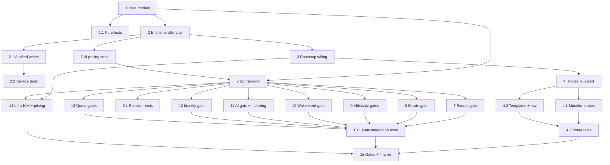

# Implementation Plan

## Overview

This plan builds the admin entitlements control plane bottom-up: first the shared
pure decision module (defaults + helpers), then the web-ui service, routes, and
templates, then the bot-side resolver and per-capability enforcement gates,
finishing with infra IAM/pricing wiring and the gate commands. The pure module is
the shared contract both the web-ui and bot depend on, so it comes first. Web-ui
authoring (tasks 2–5) and bot enforcement (tasks 6–13) can proceed in parallel
once the pure module exists.

## Tasks

- [x] 1. Create the shared pure entitlements module with secure defaults and decision helpers
  - Add `platform/components/web-ui/entitlements_core.py` with `DEFAULT_ENTITLEMENTS` and pure functions: `merge_effective`, `source_allowed`, `effective_max_bots_per_guild`, `quota_reached`, `over_cap`, `effective_cost`, `validate_quota`
  - Keep it side-effect free (no boto3, no Flask imports) so both web-ui and bot can import it
  - _Requirements: 13.1, 13.2, 13.3, 3.2, 11.3, 11.4, 12.2, 12.3, 10.1, 10.2, 10.5_

- [x] 1.1 Write property-based tests for the pure module
  - Add Hypothesis tests covering: merge is defaults-safe and never more permissive than default (Property 1); `source_allowed` matches the effective map (Property 2); `quota_reached`/`effective_max_bots_per_guild` edges incl. disabled-but-stored>1 (Property 3); `validate_quota` rejects <1 (Property 4); `effective_cost` = bedrock×(1+markup) and 2× at default (Property 5); `over_cap` true on equality (Property 6)
  - _Requirements: 13.1, 13.2, 13.3, 3.2, 11.3, 11.4, 12.2, 12.3, 10.1, 10.2, 10.5_

- [x] 2. Implement `EntitlementService` over CoreTable
  - Add `platform/components/web-ui/entitlement_service.py` with storage-key helpers (`user_pk`, `ENTITLEMENT_SK`, `AITALLY_SK`, `audit_sk`, `AIPRICING_PK`) and the service class
  - Implement `get_raw`, `get_effective` (merges via `entitlements_core.merge_effective`), `get_tally`, `get_pricing`, and `history` (newest-first via `query_pk_prefix` on `AUDIT#`)
  - Reuse the `ConfigStore._upsert` pattern (`put_new` then `update_with_lock`) for writes
  - _Requirements: 2.1, 2.2, 10.4, 15.3_

- [x] 2.1 Implement audited writes with write-before-apply semantics
  - Implement `set_fields(sub, changes, admin_sub)` to validate quotas (`validate_quota`), then write the audit entry and entitlement change together via DynamoDB `TransactWriteItems`; if no transaction helper exists on `CoreTable`, write audit `put_new` first then the entitlement update, marking the audit row orphaned and reporting failure if the update fails
  - Implement `reset_tally(sub, admin_sub)` (zero tally, audited) and `add_cost(sub, effective_cost)` (increment tally)
  - Ensure a failed audit write leaves the entitlement record unchanged
  - _Requirements: 2.3, 10.6, 15.1, 15.2_

- [x] 2.2 Write service tests over a fake/moto CoreTable
  - Test get_raw vs get_effective (defaults indication), flip+persist, quota validation rejection, tally increment/reset, pricing read, history ordering
  - Test that injecting a transaction/put failure leaves the entitlement item unchanged (Property 8)
  - _Requirements: 2.2, 2.3, 10.4, 10.6, 15.1, 15.2, 15.3_

- [x] 3. Wire `EntitlementService` into the web-ui bootstrap
  - In `platform/components/web-ui/bootstrap.py`, construct `EntitlementService(core)` when `core` is available and add it to the returned services dict under `entitlement_service`; leave it `None` in degraded mode
  - _Requirements: 2.1_

- [x] 4. Build the admin-only entitlement routes blueprint
  - Add `platform/components/web-ui/entitlement_routes.py` with `build_entitlement_blueprint()`; register it in `app.py`
  - Every route repeats the login + `_is_admin` guard and a hardened post-guard assertion that returns a 403 error page / forces logout for a non-admin bypass (no admin content rendered)
  - Add `GET /admin/entitlements` (user picker reusing `AdminDirectory.list_users`) and `GET /admin/entitlements/<sub>` (flags, quotas, tally, history)
  - _Requirements: 1.1, 1.2, 1.3, 2.1, 2.2, 10.4, 15.3_

- [x] 4.1 Implement flag, quota, markup, and reset mutation routes
  - `POST /admin/entitlements/<sub>/flags` flips the current effective value for the named flag and re-renders the HTMX partial (covers sources, custom avatar/name, audio>96k, video, viz, wakeword, AI toggles)
  - `POST /admin/entitlements/<sub>/quotas` validates ≥1 and renders a field-level error on violation
  - `POST /admin/entitlements/<sub>/ai/markup` sets markup/cap; `POST /admin/entitlements/<sub>/ai/reset` resets the tally
  - Any save failure (validation, persistence, timeout) renders an error notice and does not report success
  - _Requirements: 2.3, 2.4, 3.1, 4.1, 4.2, 5.1, 6.1, 7.1, 8.1, 9.1, 10.2, 10.5, 10.6, 11.1, 12.1, 12.2_

- [x] 4.2 Add the admin templates and navigation entry
  - Add `templates/pages/admin_entitlements.html` (user picker) and `templates/pages/admin_entitlement_detail.html` (per-user view) plus HTMX partials for the flag list, quota form, AI section, and history
  - Add an "Entitlements" admin nav entry in `pages.py` `_nav_for_current_user`, shown only to admins
  - _Requirements: 1.1, 1.4, 2.1, 2.2, 10.4, 15.3_

- [x] 4.3 Write route tests with the Flask test client
  - Admin reaches the pages; a non-admin is redirected/denied and the response body contains no admin content (Property 9)
  - Toggle flips value and re-renders partial; quota <1 shows validation error; save failure shows an error notice and not "saved"
  - _Requirements: 1.2, 1.3, 2.3, 2.4, 12.2_

- [x] 5. Seed the AI pricing configuration item
  - Add a small seeder/helper that writes `CONFIG#AIPRICING` (`models` map of per-model Bedrock unit prices + `markup: 1.0`) if absent, so price updates are data edits requiring no code change
  - Document that ops updates prices by editing this item
  - _Requirements: 10.2, 10.3_

- [x] 6. Implement the bot-side `UserEntitlementResolver`
  - Add `bot/playback/user_entitlements.py` mirroring the `DEFAULT_ENTITLEMENTS` constant (shared copy) and reading the same `hellodj-core` entitlement + pricing items
  - Implement `effective_for_discord(discord_id)`: resolve Discord id → Cognito sub via the `UserProfileService` reverse index, merge stored over defaults, cache per sub with a bounded TTL; return `DEFAULT_ENTITLEMENTS` on any datastore/lookup failure or unlinked id
  - Implement `record_ai_cost(sub, bedrock_cost)` applying the pricing markup and incrementing the `AITALLY` item
  - Construct the resolver once at bot startup and make it reachable from the cogs
  - _Requirements: 14.1, 14.2, 14.3, 10.1_

- [x] 6.1 Write bot resolver tests
  - Discord→sub→effective happy path with caching (second call within TTL does not re-read); datastore-unavailable returns defaults (Property 7); unlinked Discord id returns defaults; `record_ai_cost` applies markup and increments the tally
  - _Requirements: 14.1, 14.2, 14.3, 10.1_

- [x] 7. Enforce source entitlements in playback
  - In `bot/player.py` `_resolve_and_play` source selection, resolve effective entitlements for the acting user and permit only allowed sources; decline a disallowed source with a clear message
  - _Requirements: 3.2, 3.3, 3.4_

- [x] 8. Enforce audio bitrate cap at stream start
  - In the player track build / node request path, cap bitrate at 96 kbps at stream initiation when `audio_above_96k` is disabled; allow an in-progress stream to continue until it restarts
  - _Requirements: 5.2, 5.3_

- [x] 9. Enforce video activity and visualization entitlements
  - In `bot/cogs/video.py` activity-start, decline when `video_activities` is disabled and always return a response (permit or explicit decline)
  - In `bot/cogs/visualizer.py` start, decline when `visualizations` is disabled
  - _Requirements: 6.2, 6.3, 6.4, 7.2, 7.3_

- [x] 10. Enforce wake-word / voice entitlement
  - In `bot/voice/wakeword.py` / `bot/cogs/voice.py`, block all voice commands regardless of input method when `wakeword` is disabled; when enabled, require a wake-word activation before processing any voice input
  - _Requirements: 8.2, 8.3_

- [x] 11. Enforce AI integration entitlement and immediate metering
  - In the AI request path (`bot/voice/llm_intent.py` / `bot/voice/query_handler.py`), decline without cost when `ai_integration` is disabled; treat a non-declined AI request as an error and block it
  - When permitted, meter cost immediately via `record_ai_cost` before/at permit time (not deferred to AI completion); surface the over-cap warning without hard-blocking
  - _Requirements: 9.2, 9.3, 9.4, 10.1, 10.5_

- [x] 12. Enforce custom identity entitlements in the identity applier
  - Gate the bot-side per-guild identity applier (from `bot-identity-and-source-auth`) so a custom avatar set is rejected when `custom_avatar` is off and a custom name set is rejected when `custom_name` is off
  - _Requirements: 4.3, 4.4_

- [x] 13. Enforce multi-bot and multi-guild quotas in the orchestrator
  - In the orchestrator add-instance path, reject when the user's active bot instances in the guild reach `effective_max_bots_per_guild`
  - In the activate-in-guild path, reject when the user's active guild count reaches `max_guilds`; count each guild's bots toward its per-guild limit and distinct active guilds toward `max_guilds`
  - _Requirements: 11.2, 11.3, 11.4, 12.3_

- [x] 13.1 Write per-capability gate integration tests
  - With a fake resolver, assert each enforcement point permits when enabled and declines/caps when disabled: source reject, bitrate cap at start, video/viz decline-with-response, wake-word block-all-when-off, AI decline-no-cost + block non-declined, quota reject at limit
  - _Requirements: 3.2, 3.4, 5.2, 6.2, 6.3, 7.2, 8.2, 9.2, 9.3, 11.2, 12.3_

- [x] 14. Add IAM grants and pricing seed to infra
  - In `platform/infra/lib/workloads-stack.ts`, grant the bot IRSA role DynamoDB read on the `hellodj-core` entitlement/pricing items and write on the `AITALLY` item; confirm web-ui role can read/write the entitlement, tally, audit, and pricing items
  - _Requirements: 10.3, 14.1_

- [x] 15. Run gate commands and finalize
  - Run web-ui gates: `ruff check --target-version py314 .`, `python3 -m pytest tests/ -q`, and the 500-line ceiling check; split modules if any file approaches the ceiling
  - Run bot entitlement/resolver + gate tests from `bot/playback/`; run infra `npx tsc --noEmit && npx jest` if `workloads-stack.ts` was touched
  - Fix any failures before completion
  - _Requirements: 1.1, 2.4, 14.3, 15.2_

## Task Dependency Graph



```json
{
  "waves": [
    { "wave": 1, "tasks": ["1"] },
    { "wave": 2, "tasks": ["1.1", "2"] },
    { "wave": 3, "tasks": ["2.1", "3", "5", "6"] },
    { "wave": 4, "tasks": ["2.2", "4", "6.1", "7", "8", "9", "10", "11", "12", "13", "14"] },
    { "wave": 5, "tasks": ["4.1", "4.2", "13.1"] },
    { "wave": 6, "tasks": ["4.3"] },
    { "wave": 7, "tasks": ["15"] }
  ]
}
```

## Notes

- The pure module (task 1) is intentionally free of boto3/Flask so it can be
  imported by both the web-ui and the bot; task 6 mirrors the `DEFAULT_ENTITLEMENTS`
  constant on the bot side so both processes agree exactly.
- Enforcement is authoritative in the bot (tasks 7–13); the web-ui gate is
  advisory. The resolver fails safe to restrictive defaults (task 6) so an outage
  never grants a capability.
- Respect the 500-line ceiling: the web-ui logic is split into `entitlements_core.py`,
  `entitlement_service.py`, and `entitlement_routes.py`.
- Infra IAM/pricing (task 14) deploys via `cdk deploy hellodj-eks`; web-ui and bot
  source changes deploy via the CodeCommit pipeline per the project steering.
- Task 12 depends on the per-guild identity applier from the
  `bot-identity-and-source-auth` spec; coordinate if that work is not yet merged.

