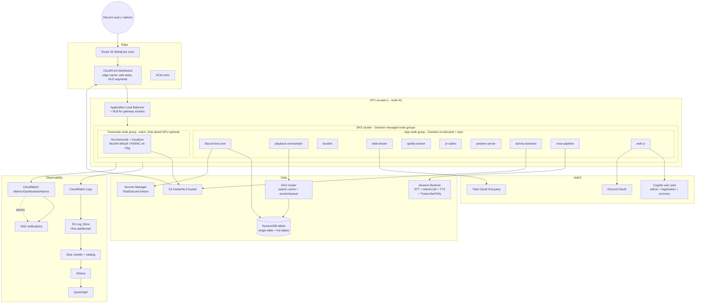
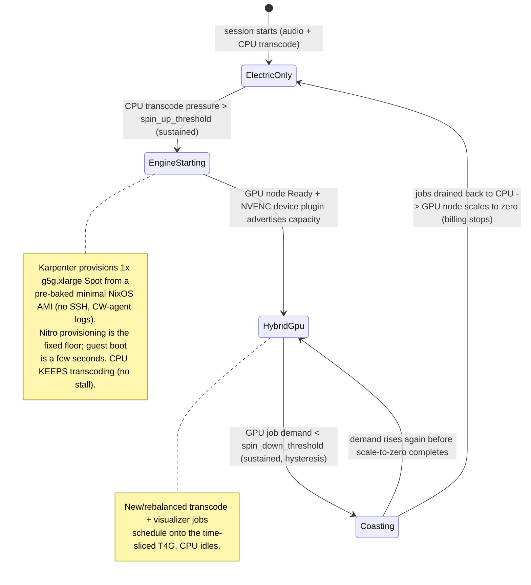
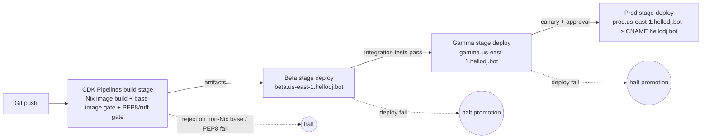
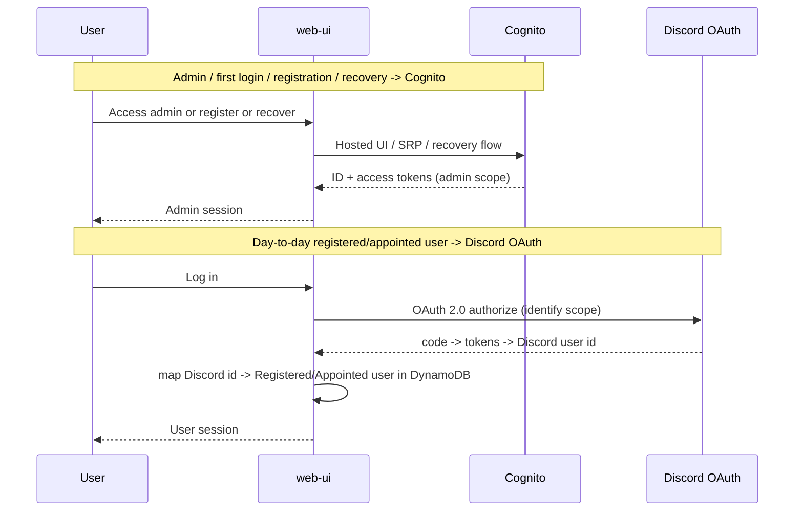
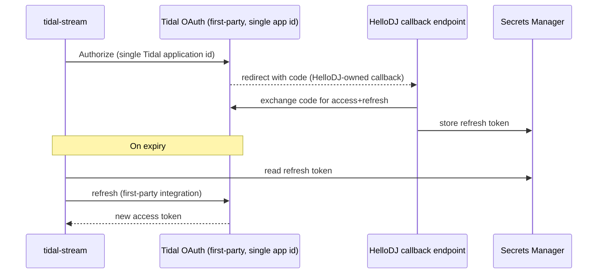

# Design Document

## Overview

This design describes the ground-up re-platform of HelloDJ from the on-premises NixOS/Kubernetes "gremlin" cluster (Intel iGPU QSV transcoding) to AWS. It converts the current single-pod, multi-container monolith into a fleet of independently deployable, independently versioned components, provisioned entirely through AWS CDK, backed by DynamoDB, authenticated through Cognito + Discord OAuth, observed through a CloudWatch/S3/Glue/Athena/QuickSight stack, and delivered through a Beta → Gamma → Prod pipeline behind a Route 53 zone for `hellodj.bot`.

Two decisions the requirements deferred are resolved here with justification:

1. **Orchestrator: Amazon EKS** (not ECS), because the GPU strategy hinges on **NVIDIA time-slicing on a single warm GPU node**, which is a first-class EKS capability and is not available on ECS. See [Decision D1](#decision-d1-orchestrator--amazon-eks).
2. **GPU placement: co-located in the cluster** (not a dedicated GPU node reached over the network), because inter-host streaming of raw/encoded media between an app node and a separate GPU node costs more than the alternative and adds latency. See [Decision D2](#decision-d2-gpu-placement--co-located).

The headline cost/latency finding, validated below, is that **software (libx264) transcode on the Graviton CPU the platform already pays for is the cheapest option that satisfies the 5-second interactive latency budget**, with sub-second warm start and zero incremental GPU bill. A warm, time-sliced **G5g** (Graviton2 + NVIDIA T4G) node is the recommended-with-headroom escalation if measured transcode load ever exceeds CPU capacity. Per-job GPU provisioning (including AWS Batch) is rejected for interactive work because its 1–3 minute cold start violates the latency budget.

All prices in this document are AWS **on-demand, us-east-1, verified 2026-08-24** (see [Cost Model](#cost-model) for the full basis and citations). us-east-1 is the launch region.

### Design Goals

- Every AWS resource defined in CDK; no console clicks (R1).
- Default to Graviton/ARM64 everywhere; x86-64 only per-component behind a verified compatibility gate (R4).
- Every container image built with Nix; no Ubuntu/Debian base layers (R5).
- DynamoDB as the only primary datastore; no PostgreSQL, no SQLite (R7).
- Preserve every existing user-facing feature through the refactor (R6).
- Zero-downtime deploys and scaling via connection draining (R17).
- Multi-region-ready without redesign, single-region at launch (R18).

### Non-Goals

- Multi-region active-active at launch (architected for, not enabled).
- Migrating legacy playback/session/playlist/config data (only the admin bootstrap credential migrates — R19).
- Replacing the Discord bot programming model (still discord.py/wavelink); this is a re-platform, not a rewrite of behavior.

## Architecture

### High-Level AWS Architecture

### Component Decomposition

The legacy single pod (`init: render-lavalink-config`, `bot`, `lavalink`, `tidal-stream`, `spotify-stream`) plus the separate `yt-cipher`, `potoken-server`, and `web-ui` deployments become the following **independently deployable, independently versioned Components** (R6, R13, R15). Each is its own Nix-built image, its own Helm/CDK-managed workload, its own semantic version, and its own CI/CD path.

| Component | Origin (legacy) | Runtime | CPU arch | Placement |
|---|---|---|---|---|
| `discord-bot-core` | `bot.py` gateway/cog shell | Python 3.11 discord.py/wavelink | Graviton | App node group |
| `playback-orchestrator` | `playback/` (router, classifier, filter, bans, persistence) | Python 3.11 | Graviton | App node group |
| `lavalink` | custom Lavalink.jar (fMP4 HLS + SABR + LavaSrc) | JVM 21 (temurin aarch64) | Graviton | App node group |
| `tidal-stream` | tidal sidecar | Python 3.11 (tidalapi) | Graviton | App node group |
| `spotify-stream` | spotify sidecar | Rust (librespot) | Graviton | App node group |
| `yt-cipher` | external image (rebuilt with Nix) | Node/JVM | Graviton | App node group |
| `potoken-server` | external image (rebuilt with Nix) | Node | Graviton | App node group |
| `activity-backend` | `video/activity_backend.py`, `ws_hub.py` | Python 3.11 aiohttp | Graviton | App node group |
| `hls-transcode` | `video/hls_transcode.py`, `activity_streamer.py`, visualizer engines | Python 3.11 + FFmpeg | Graviton (libx264) / G5g NVENC optional | Transcode node group |
| `voice-pipeline` | `voice/` (wakeword local; STT/intent/TTS via Bedrock) | Python 3.11 + onnxruntime (wakeword only) | Graviton | App node group |
| `web-ui` | Flask web UI | Python 3.11 Flask + HTMX/Alpine/Tailwind v4 | Graviton | App node group |
| `config-renderer` | `render_lavalink_config.py` | Python 3.11 (init/Job) | Graviton | Init container |

Each Component publishes and consumes typed contracts (HTTP/JSON, WebSocket, or Lavalink protocol) so transport, message handling, and UI stay decoupled and can be redeployed independently.

### Decision D1: Orchestrator — Amazon EKS

**Selected: Amazon EKS.** (R2.1–R2.5)

**Data-transfer cost analysis (R2.3):** In both ECS and EKS the app fleet lives in one VPC across multiple AZs. Cross-AZ traffic is billed at $0.01/GB each direction on both platforms, so the orchestrator choice is **cost-neutral on inter-AZ transfer** given identical placement. The lever that actually moves cost is *keeping chatty, high-bandwidth paths (Lavalink ↔ transcode ↔ media) on the same node/AZ*, which both platforms can do with pod/task placement constraints. EKS adds a control-plane fee ($0.10/cluster-hr ≈ $73/mo); with a single cluster shared across Beta/Gamma/Prod namespaces or a small number of clusters, this is a bounded, known cost.

**GPU and latency analysis (R2.4):** The deciding factor is GPU. The interactive transcode/visualizer workload barely taxes a single Intel iGPU today, so the cost-optimal GPU strategy is **one warm GPU shared across all concurrent jobs** rather than a GPU per job. NVIDIA **time-slicing via the GPU device plugin / GPU Operator is a native EKS capability** (`nvidia.com/gpu` replicas advertised to multiple pods on one physical T4G), letting many transcode pods share a single warm G5g node with sub-second scheduling. ECS has no equivalent GPU-sharing primitive — ECS assigns whole GPUs to tasks, which would force either a GPU per concurrent job (expensive) or a self-built sharing shim (operational risk). Time-slicing offers no hard memory isolation between pods, which is acceptable here because the GPU node is single-tenant to HelloDJ transcode.

**Conclusion:** EKS is selected because it uniquely enables the warm shared-GPU strategy that the cost model depends on, at a bounded control-plane premium, with cost-neutral data transfer. The full analysis is recorded in [Decision Records](#decision-records).

### Decision D2: GPU Placement — Co-located

**Selected: co-located GPU workloads within the EKS cluster** (a taint/label-isolated transcode node group in the same VPC/AZ as the app fleet), not a separate dedicated GPU host reached over the network. (R3.4–R3.6)

**Inter-host streaming vs egress analysis (R3.5, R3.6):** The transcode/visualizer path consumes a live PCM/media stream from Lavalink and produces HLS segments. If the GPU lived on a *separate* host, every second of audio/video would cross the network from the Lavalink/app node to the GPU node (inter-host/inter-AZ transfer at $0.01/GB each way, plus latency) *and then* the produced HLS would still have to reach viewers. Co-locating the transcode pods on the same node (or at least same AZ) as the media producers makes the producer→transcoder hop **loopback/intra-node (free)**, and the only unavoidable outbound cost is HLS egress to viewers — which is served through CloudFront regardless of GPU placement. Because inter-host streaming of the media strictly *adds* a transfer leg on top of the egress that must happen anyway, **inter-host streaming costs more than egress alone**, so per R3.6 the design specifies **co-located placement**.

**Instance-family choice (R3.7, R3.8):** Where a GPU node is provisioned, the design prefers **G5g (Graviton2 + NVIDIA T4G)** so the GPU node keeps the same ARM64 architecture as the rest of the fleet (no architecture split), sized to the **smallest** GPU instance meeting measured load (`g5g.xlarge`). x86 `g4dn.xlarge` is the documented fallback only if a required encoder path is unavailable on T4G/ARM64.

### Decision D3: GPU Acquisition Strategy

The design evaluates three strategies against the ≤5s Interactive_Latency_Budget (R3.10, R3.12, R3.13) and cost:

| Strategy | Warm start | Latency vs 5s budget | Incremental cost | Verdict |
|---|---|---|---|---|
| (a) Per-job GPU provisioning (incl. AWS Batch) | 1–3 min cold start to acquire/boot GPU instance | **Violates** budget for interactive requests | Pay per whole instance-second, but idle between jobs | **Rejected for interactive** (R3.12). Allowed only for future batch/offline jobs. |
| (b) Warm shared GPU (G5g + time-slicing on EKS) | Sub-second (node already warm, pod scheduled onto shared GPU) | Satisfies budget | ~$0.42/hr on-demand (~$307/mo) or ~$0.33/hr spot for one warm `g5g.xlarge`, shared across all jobs | **Recommended escalation** when CPU transcode is saturated |
| (c) Software transcode on Graviton CPU (libx264) | Sub-second (process already running on paid-for CPU) | Satisfies budget | **$0 incremental GPU** (uses CPU headroom already provisioned) | **Selected default** — cheapest strategy meeting the budget (R3.9, R3.10) |

**Selected default: (c) software transcode on Graviton (libx264), with a hybrid GPU-assist that scales to zero.** The current workload "barely taxes a single Intel iGPU," so a modest amount of already-paid-for Graviton vCPU can perform the same H.264 encode with sub-second warm start and no GPU bill. When demand climbs past what CPU headroom can serve, the platform brings up **one time-sliced `g5g.xlarge` Spot node**, migrates jobs to it, and **scales it back to zero** when demand subsides — so a GPU is present only while it is earning its cost. Per-job GPU / AWS Batch (strategy a) remains rejected for interactive playback.

#### The hybrid "gas/electric" transcode model

The GPU behaves like the gas engine in a hybrid car: the CPU (electric motor) always drives, and the GPU (gas engine) spins up only under load and shuts off when coasting. This is the default GPU-present configuration.

Design rules for the model:

- **CPU is always the floor.** libx264 on Graviton serves every interactive request immediately and covers the GPU-boot window, so the ≤5s Interactive_Latency_Budget holds even during a cold GPU spin-up (R3.12, R3.13).
- **Hysteresis prevents flapping.** `spin_up_threshold` and `spin_down_threshold` differ, and both require a sustained duration, so the GPU node does not oscillate at every red light.
- **GPU present ⇒ GPU preferred.** Once the GPU node is `Ready`, the transcode scheduler prefers NVENC for new and rebalanced jobs; the CPU path idles but stays available as instant fallback.
- **Scale-to-zero ⇒ pay-while-climbing.** The g5g Spot node is billed only between spin-up and scale-to-zero, so a bursty usage pattern costs far less than a 24/7 warm node.
- **Spot reclaim = graceful downshift.** A Spot interruption drains GPU jobs back to the CPU path via connection draining (R17), identical to a normal coast-down; playback is not interrupted.

#### Pre-baked minimal NixOS AMI for the GPU node

To make the GPU spin-up as fast as physically possible, the transcode node does **not** build or activate configuration at boot. The pipeline builds the NixOS system closure into an **EBS-backed AMI ahead of time** (via `nixos-generators` `amazon-image` format on aarch64), and Karpenter/the node group launches instances directly from that AMI. Boot is reduced to "kernel → initrd → mount pre-realized Nix store → start the transcode systemd unit" — no store download, no `nixos-rebuild`, no activation phase.

Host-hardening and trimming rules (all declarative in the NixOS config):

- **No interactive access.** OpenSSH, getty, and user accounts are removed. The node is immutable cattle; it is never logged into. This shrinks the boot critical path and tightens the security posture (no SSH surface).
- **Minimal closure.** Only the transcode/visualizer workload, the NVIDIA/NVENC userspace + kernel modules, the CloudWatch agent, and their transitive dependencies are included. Docs, locales, unused kernel modules, and non-essential systemd units are stripped. `initrd` is minimized to the drivers actually needed to mount root.
- **Logs via CloudWatch agent.** A lean `amazon-cloudwatch-agent` systemd service ships node/container logs and metrics to CloudWatch Logs (and on to the S3 Hive Log_Store), so observability does not depend on host login (R10.1, R10.2).
- **IAM instance role.** The node assumes an instance role for CloudWatch, ECR/Nix cache, and Bedrock/SDK access — no static credentials on the host.
- **Minimal root storage.** The trimmed closure plus tmpfs-backed HLS scratch means the root EBS volume is small (~8–16 GiB gp3); there is no large data disk on the GPU node. HLS segments live on RAM-backed tmpfs during transcode and are served/persisted via S3/CloudFront, so the ephemeral node needs almost no durable storage.
- **Boot-time expectation (honest floor).** NixOS/guest boot trims to a few seconds, but total "launch API call → node Ready" still includes AWS **Nitro** provisioning (ENI/EBS attach, VM launch) which is a fixed cost the guest cannot optimize away. Graviton instances boot via **UEFI** under Nitro (not U-Boot), so the win comes from the minimal baked image, not the bootloader. The CPU-transcode floor covers whatever provisioning time remains, so the Interactive_Latency_Budget holds regardless (R3.12, R3.13).
- **App-node images are OCI, not AMIs.** This baked-AMI approach is specific to the GPU transcode node group (where cold-boot latency matters). The app node group runs the Nix-built OCI container images on a standard Graviton NixOS/Bottlerocket-style node group; both paths remain 100% Nix-built with no Ubuntu/Debian base (R5).

### Deployment Pipeline (Beta → Gamma → Prod)

The pipeline is a CDK Pipelines (CodePipeline/CodeBuild) construct. The **build stage** enforces two gates before any deploy: (1) a **base-image gate** that rejects any image not produced by the Nix build (fails if an `ubuntu`/`debian` base or non-Nix layer is detected — R5.4), and (2) a **PEP8/line-count gate** (`ruff` + max-line-count check) that fails the build on style violations (R13.2–R13.4). A deploy failure in any stage halts promotion to the next stage (R11.4). Each Component has its own pipeline path so a single Component can be promoted without redeploying the others (R15.2).

### Auth Flows

**Auth routing rule (invariant):** every authentication request is routed by *purpose*. Admin authentication, initial registration, and account recovery route to **Cognito**; day-to-day login of a registered or appointed user routes to **Discord OAuth**. Tidal source auth routes to the **first-party Tidal OAuth** and is fully independent of Cognito (R8, R9.5). The legacy custom auth and the legacy two-client-id Tidal key-split are removed (R8.1, R9.3).

## Components and Interfaces

### discord-bot-core
- **Responsibility:** Discord gateway connection, cog/command registration, guild policy, background watchdogs (token refresh, gateway health). Delegates all playback to `playback-orchestrator`.
- **Interfaces:** Discord gateway (outbound WSS); internal gRPC/HTTP to orchestrator; reads/writes DynamoDB guild/session tables; reads Secrets Manager for Discord bot token.
- **Scaling:** Gateway is sharded; scales by shard count, not CPU. Runs on the app node group.

### playback-orchestrator
- **Responsibility:** Routing, content classification, per-guild content filtering, user bans, unified queue persistence. The single writer for session/queue state.
- **Interfaces:** HTTP/JSON to bot-core and web-ui; Lavalink protocol to `lavalink`; DAX for hot session/queue reads/writes; DynamoDB as backing store.

### lavalink
- **Responsibility:** Audio track loading and streaming (custom JAR: fMP4 HLS + SABR youtube-source + LavaSrc). Config rendered by `config-renderer` from Secrets Manager/DynamoDB.
- **Interfaces:** Lavalink v4 protocol (port 2333) to orchestrator; talks to `yt-cipher`, `potoken-server`, `tidal-stream`, `spotify-stream`.

### tidal-stream / spotify-stream
- **Responsibility:** Direct Tidal/Spotify audio streaming sidecars. Tidal uses the new first-party OAuth (single app id).
- **Interfaces:** HTTP to lavalink/orchestrator; Secrets Manager for tokens; Tidal/Spotify APIs.

### activity-backend
- **Responsibility:** Discord Activity server (video streaming control, whiteboard, visualizer control, lyrics), WebSocket hub for real-time sync.
- **Interfaces:** HTTPS + WSS through ALB/CloudFront (`/activity/`); emits transcode requests to `hls-transcode`; serves/reads HLS from S3 via CloudFront.

### hls-transcode (transcode node group)
- **Responsibility:** HLS transcode (libx264 default, NVENC on G5g when warm GPU present) and GPU visualizer rendering. Co-located with media producers (D2).
- **Interfaces:** Reads PCM/media over loopback/intra-node from lavalink/activity-backend; writes HLS segments to S3 (CloudFront origin); publishes GPU/CPU pressure metrics to CloudWatch for the Autoscaler.

### voice-pipeline
- **Responsibility:** Local wake word detection (ONNX, tiny CPU model) is the only on-box AI. Speech-to-text, intent/LLM reasoning, and text-to-speech are delegated to **Amazon Bedrock** (with Amazon Transcribe/Polly where they fit the flow better). All self-hosted AI (Kokoro TTS, faster-whisper/CTranslate2 STT, self-hosted LLM/Speaches) is removed.
- **Rationale:** Moving STT/intent/TTS to managed AWS AI deletes the heavy ARM64 build dependencies (PyTorch, CTranslate2, self-hosted model runtimes) from the fleet and the compatibility gate, shrinks the image, removes AI GPU pressure entirely (only video transcode/visualizer touches the GPU now), and scales elastically with no idle model-serving cost.
- **Interfaces:** Consumes Discord voice (opus) via bot-core; calls Bedrock (and Transcribe/Polly) over the AWS SDK using an IAM task role (no static keys); dispatches actions to orchestrator. Wake word ONNX runtime is the only remaining ARM64 dependency to verify in the gate.

### web-ui
- **Responsibility:** Configuration and administration UI. Flask + HTMX + Alpine.js + Tailwind v4, dark glassmorphism, WCAG AA (R14). Hosts Cognito and Discord OAuth flows and the Tidal OAuth callback.
- **Interfaces:** HTTPS through ALB/CloudFront; Cognito, Discord OAuth, Tidal OAuth; DynamoDB for config; Secrets Manager for credentials.

### config-renderer
- **Responsibility:** Renders complete `application.yml` for lavalink from Secrets Manager + DynamoDB config (replaces the legacy SQLite-backed renderer). Runs as an init container / pre-deploy Job.

## Data Models

DynamoDB is the sole primary datastore (R7.1–R7.3). The design uses a **single-table design** for entity data plus dedicated **hot tables** fronted by **DAX** for the search cache and session/queue state (R7.4–R7.6). No PostgreSQL, no SQLite anywhere.

### Core single-table (`hellodj-core`)

| Attribute | Type | Notes |
|---|---|---|
| `PK` | S | Partition key, e.g. `GUILD#<id>`, `USER#<discordId>`, `PLAYLIST#<id>` |
| `SK` | S | Sort key, e.g. `META`, `CONFIG`, `MEMBER#<id>`, `TRACK#<n>` |
| `entityType` | S | `Guild`\|`User`\|`Playlist`\|`Config`\|`Appointment` |
| `data` | M | Entity payload |
| `version` | N | Optimistic-lock version |
| `updatedAt` | N | Epoch ms |
| GSI1 (`GSI1PK`/`GSI1SK`) | | e.g. map Discord id → user, appointer → appointees |

### Hot table: search cache (`hellodj-search-cache`, DAX-fronted, TTL)

| Attribute | Type | Notes |
|---|---|---|
| `queryKey` | S | Hash of normalized query + source |
| `results` | M | Cached resolved tracks |
| `ttl` | N | DynamoDB TTL (auto-expire) |

### Hot table: session/queue (`hellodj-session`, DAX-fronted)

| Attribute | Type | Notes |
|---|---|---|
| `PK` | S | `GUILD#<id>` |
| `SK` | S | `SESSION` \| `QUEUE#<seq>` |
| `state` | M | voice/text channel, current track, repeat mode, filters, autoplay |
| `version` | N | Optimistic-lock version (single-writer = orchestrator) |

### Auth/identity mapping

- **Cognito user pool** holds admin + registered identities; the `Admin_Bootstrap_Credential` seeds the first admin (R19).
- Discord OAuth logins map `Discord user id → USER#<discordId>` in `hellodj-core` (GSI1). Appointment edges (`Appointment` items) capture who appointed whom (R8.4, Appointed_User).

### Secrets

All tokens/keys (Discord bot token, Tidal OAuth refresh, Spotify, yt-cipher shared secret) live in **AWS Secrets Manager**, not in the datastore. AI services (Bedrock, Transcribe, Polly) are accessed via **IAM task roles**, so there are no self-managed AI/LLM API keys to store. The legacy encrypted-SQLite credential store is removed (R7.3).

### DNS naming model (R12)

- Zone: `hellodj.bot` (Route 53).
- Non-prod env record: `<stage>.<region>.hellodj.bot` (e.g. `beta.us-east-1.hellodj.bot`, `gamma.us-east-1.hellodj.bot`).
- Prod env record: `prod.<region>.hellodj.bot`, created when a region's Prod stage is provisioned (R12.4).
- Apex: a **CNAME (alias) from the production environment name to `hellodj.bot`** (R12.3). The naming is region-parameterized so adding a region only adds `<stage>.<newRegion>.hellodj.bot` records — no redesign (R18.3).

## Correctness Properties

*A property is a characteristic or behavior that should hold true across all valid executions of a system — essentially, a formal statement about what the system should do. Properties serve as the bridge between human-readable specifications and machine-verifiable correctness guarantees.*

Most of this feature is infrastructure-as-code and managed-service configuration, which is verified with CDK snapshot/assertion tests, integration tests, and smoke tests rather than property-based tests (see [Testing Strategy](#testing-strategy)). The properties below capture the subset of behavior that is **pure decision/derivation logic with meaningful input variation** — these are the parts where property-based testing adds real value. Each is implemented as a pure function so it can be tested independently of AWS.

### Property 1: DNS environment-naming invariant

*For any* deployment stage and any AWS region, the DNS name derivation function SHALL produce `<stage>.<region>.hellodj.bot` for every non-production stage and `prod.<region>.hellodj.bot` for the production stage; every produced name SHALL be a subdomain of the `hellodj.bot` zone, and for production an apex alias from the production name to `hellodj.bot` SHALL exist. Generating arbitrary regions demonstrates a new region introduces only new, non-colliding names (no redesign).

**Validates: Requirements 12.2, 12.3, 12.4, 18.3**

### Property 2: Auth-routing by purpose

*For any* authentication request characterized by (purpose, user type), the auth-routing function SHALL route administrator authentication, initial registration, and account recovery to Cognito; SHALL route day-to-day login of a registered or appointed user to Discord OAuth; and SHALL never route Tidal source authentication to Cognito.

**Validates: Requirements 8.2, 8.3, 8.4, 8.5, 8.6, 9.5**

### Property 3: GPU acquisition strategy selection

*For any* set of candidate GPU acquisition strategies each annotated with (incremental cost, warm-start latency), the selection function SHALL return the lowest-cost strategy whose latency is ≤ the Interactive_Latency_Budget (5 seconds), and SHALL never return a strategy whose latency exceeds the budget when a feasible strategy exists.

**Validates: Requirements 3.9, 3.10, 3.12, 3.13**

### Property 4: GPU placement decision

*For any* pair of costs (inter-host streaming cost, egress cost), the placement decision function SHALL select co-located placement within the cluster whenever the inter-host streaming cost is greater than the egress cost.

**Validates: Requirements 3.6**

### Property 5: Graviton/x86 dependency-gate decision

*For any* component described by a map of its runtime dependencies to their ARM64 (Graviton) compatibility, the Dependency_Compatibility_Gate SHALL select ARM64-only if and only if every dependency is ARM64-compatible; if any dependency is incompatible, it SHALL select x86-64 (or a documented substitute) and SHALL never select ARM64-only.

**Validates: Requirements 4.1, 4.2, 4.3**

### Property 6: Non-Nix base-image gate

*For any* container image base descriptor, the build-stage base-image gate SHALL reject the image if and only if the base was not produced by the Nix build system (for example an Ubuntu or Debian base), and SHALL accept it only when it is Nix-produced.

**Validates: Requirements 5.4**

### Property 7: Autoscaling decision over CPU, RAM, and GPU pressure

*For any* triple of utilization readings (CPU, RAM, GPU pressure) and their configured scale-out and scale-in thresholds, the autoscaling decision function SHALL decide scale-out when any signal exceeds its scale-out threshold, SHALL decide scale-in only when all signals are below their scale-in thresholds, SHALL otherwise hold, and SHALL be monotonic (raising a signal never turns a scale-out decision into a hold or scale-in).

**Validates: Requirements 3.2, 3.3, 16.2, 16.3, 16.4, 16.5**

### Property 8: Connection-draining state machine

*For any* host/container/GPU_Node carrying a set of in-flight tasks with arbitrary remaining durations and a defined drain timeout, once draining begins the state machine SHALL accept no new connections, SHALL allow every task that finishes within the drain timeout to complete normally, and SHALL for every task still running at the timeout terminate it and record exactly one termination event.

**Validates: Requirements 17.1, 17.2, 17.3, 17.5**

### Property 9: Pipeline promotion ordering and halt-on-failure

*For any* sequence of per-stage deployment results, the promotion controller SHALL deploy in the fixed order Beta → Gamma → Prod, SHALL never deploy a stage unless its predecessor succeeded, and SHALL halt all further promotion at the first failing stage.

**Validates: Requirements 11.2, 11.3, 11.4**

### Property 10: Data-layer persistence round-trip and idempotence

*For any* valid session/queue record or search-cache record, writing the record to the DynamoDB data-access layer and then reading it back SHALL return an equivalent record; and writing the same search-cache record more than once SHALL leave the stored value identical to writing it once (idempotence).

**Validates: Requirements 7.4, 7.5**

### Property 11: Hive log-partition key derivation round-trip

*For any* log event with a timestamp and partition fields, the S3 key derivation function SHALL produce a Hive-partitioned key (for example `.../year=YYYY/month=MM/day=DD/hour=HH/...`), and parsing that key SHALL recover exactly the original partition values.

**Validates: Requirements 10.1**

### Property 12: Clean-slate migration filter

*For any* legacy dataset containing an arbitrary mix of admin bootstrap credential, playback, session, playlist, and configuration records, the migration filter SHALL output only the admin bootstrap credential present in the input and SHALL exclude every playback, session, playlist, and configuration record.

**Validates: Requirements 19.1, 19.2, 19.4**

### Property 13: Cost-tier monotonicity and itemization

*For any* set of non-negative itemized line items (compute, GPU, Data_Layer, Edge_Cache_Service, Log_Store, Observability_Stack) across the three tiers, where the Recommended-with-Headroom tier equals the Recommended tier plus a non-negative reserve, the Cost_Model SHALL itemize all six categories in every tier and SHALL satisfy total(Minimum) ≤ total(Recommended) ≤ total(Recommended-with-Headroom).

**Validates: Requirements 20.1, 20.2, 20.5, 20.6**

### Property 14: Tidal token refresh via first-party path

*For any* Tidal token state, when the token is expired the refresh operation SHALL produce a non-expired token obtained through the HelloDJ-owned first-party OAuth integration (single application id), and SHALL never obtain the token through the legacy two-client-id key-split path.

**Validates: Requirements 9.4**

### Property 15: Hybrid GPU spin-up / scale-to-zero state machine

*For any* sequence of transcode-demand readings with defined `spin_up_threshold`, `spin_down_threshold` (where `spin_down_threshold` < `spin_up_threshold`), and sustained-duration windows, the hybrid transcode controller SHALL keep the CPU path serving at all times, SHALL request a GPU node only after demand stays above `spin_up_threshold` for the sustained window, SHALL prefer GPU for new jobs only while the GPU node is Ready, SHALL scale the GPU node to zero only after demand stays below `spin_down_threshold` for the sustained window, and SHALL never leave an interactive request unserved during a GPU spin-up (the CPU path covers the boot window).

**Validates: Requirements 3.2, 3.3, 3.9, 3.10, 3.12, 3.13**

## Error Handling

- **CDK/deploy failures:** CloudFormation rolls back a failed stack change; the pipeline halts promotion (Property 9). Failed Beta/Gamma deploys never reach Prod (R11.4).
- **Base-image / lint gate failures:** the build stage fails fast and reports the offending image or file; no artifact is produced (R5.4, R13.4, Properties 6).
- **DynamoDB throttling / DAX miss:** DAX miss falls through to DynamoDB; on `ProvisionedThroughputExceeded`/throttle, the data-access layer retries with exponential backoff and jitter, then surfaces a typed error to the caller. Optimistic-lock (`version`) conflicts on session/queue writes retry the read-modify-write.
- **Auth failures:** Cognito and Discord OAuth errors return typed auth errors to the web-ui; recovery is routed to Cognito (R8.5). Expired Tidal tokens trigger first-party refresh (Property 14); a failed refresh degrades Tidal source gracefully without crashing the bot (matches legacy graceful-degradation behavior).
- **Transcode failures:** if GPU (NVENC) is unavailable, `hls-transcode` falls back to software libx264 (R3.9); a failed segment is retried, and persistent failure surfaces to the Activity UI without tearing down the audio session.
- **Connection draining timeout:** tasks exceeding the drain timeout are force-terminated and a termination event is recorded to CloudWatch (R17.5, Property 8).
- **Autoscaler:** metric gaps are treated as "hold" (no scale action) to avoid flapping; scale-in requires all signals below their scale-in thresholds (Property 7).
- **Untrusted external content:** all data from Discord, streaming sources, LLM, and web is treated as untrusted; inputs are validated before use.

## Testing Strategy

### Approach

A dual approach: **property-based tests** for the pure decision/derivation logic enumerated in [Correctness Properties](#correctness-properties), and **unit / snapshot / integration / smoke tests** for everything that is infrastructure, managed-service wiring, or UI.

### Property-Based Testing

- **Library:** `hypothesis` (Python) for the pure-logic functions; the repo already uses Hypothesis (`.hypothesis/` present).
- Each of Properties 1–14 is implemented by a **single** property-based test.
- **Minimum 100 iterations** per property test.
- Each test is tagged with a comment referencing its design property, format: **Feature: aws-saas-replatform, Property {number}: {property_text}**.
- The functions under test (DNS naming, auth routing, GPU strategy/placement selection, dependency gate, base-image gate, autoscaling decision, draining state machine, promotion controller, data-access round-trip against DynamoDB Local/moto, Hive-partition key derivation, migration filter, cost-tier model, Tidal refresh against a mock) are pure or mock-backed so no live AWS calls are made.

### Non-PBT Testing (IaC, managed services, UI)

- **CDK assertion / snapshot tests** (`aws-cdk-lib/assertions`): verify resource presence and shape — EKS cluster + Graviton node groups + taint-isolated transcode node group (R2, R3.7/3.8/3.11), DynamoDB tables + DAX (R7), Cognito user pool (R8), Route 53 records (R12), CloudFront behaviors (R18.2), CloudWatch/S3/Glue/Athena/QuickSight resources (R10), and absence of Prometheus (R10.9). Snapshot tests guard against drift.
- **Build-stage gates:** Nix-provenance/base-image scan (R5), `ruff` + max-line-count check (R13.2–R13.4).
- **Integration/smoke tests** (run against Beta): CDK deploys with no manual step (R1.2), CloudWatch alarm → SNS notification fires on breach (R10.5), per-component feature preservation (R6.1–R6.5), first admin login via Cognito with bootstrap credential (R19.3).
- **Web UI:** snapshot tests + automated contrast checks (axe) for WCAG AA (R14.4); note that full WCAG AA validation requires manual testing with assistive technologies and expert review.

### Defined thresholds and limits (design-phase settings)

- **Interactive_Latency_Budget:** ≤ 5 s (R3.13).
- **Max Python file line count:** 500 lines (R13.3), enforced at build.
- **Drain timeout:** 120 s default for app/transcode workloads (R17.3), tunable per component.
- **Autoscaling:** scale-out at CPU/RAM > 70% or GPU pressure > 70%; scale-in when all < 40% (R16).

### AWS access for deployment (local dev / CI)

- **Credential profile:** deployment and AWS-touching tasks authenticate with the named AWS CLI profile **`hellodj`** (stored in `~/.aws/credentials` on the developer/CI host). Use `AWS_PROFILE=hellodj` or `--profile hellodj` for `cdk bootstrap`, `cdk deploy`, AMI build/registration, and Beta integration/smoke tests.
- **No secrets in the repo or spec.** Only the profile *name* is recorded here; access keys are never committed, logged, or embedded in CDK code. Runtime components use IAM roles (task roles / instance roles), not static keys.
- **Which tasks need live AWS:** only `cdk bootstrap`/`cdk deploy`, the pre-baked NixOS GPU AMI build+register (task 16.2), and the Beta integration/smoke tests (tasks 19.2, 20.2). All pure-logic work, property tests, and `cdk synth`/assertion/snapshot tests run entirely offline with no account access.
- **Cost/safety guardrail:** any resource-creating step (deploy, AMI registration) is confirmed with the platform owner before execution, since it provisions billable AWS resources.

## Cost Model

**Region: us-east-1. Pricing verified: 2026-08-24 (on-demand).** Prices change frequently; re-verify before committing spend. Sources are cited at the end of this section (content rephrased for licensing compliance). Line items cover the six required categories: compute, GPU, Data_Layer, Edge_Cache_Service (CloudFront), Log_Store (S3), and Observability_Stack (R20.2).

### Verified unit prices (us-east-1, 2026-08-24)

| Resource | Unit price | Source |
|---|---|---|
| EKS control plane | $0.10 / cluster-hr (~$73/mo) | AWS EKS pricing |
| Fargate Graviton (ARM) | ~20% below x86 ($0.03238/vCPU-hr, $0.00356/GB-hr) | AWS Fargate pricing / Graviton announcement |
| g5g.xlarge (4 vCPU, 8 GiB, 1× T4G) | $0.42/hr on-demand (~$307/mo); ~$0.33/hr spot | AWS EC2 / doit.com |
| g4dn.xlarge (x86 fallback) | ~$0.526/hr (~$384/mo) | AWS EC2 |
| DynamoDB on-demand | ~$1.25 / M write request units; $0.25 / M read request units; $0.25 / GB-mo storage | AWS DynamoDB on-demand pricing |
| DAX (smallest node, e.g. t-class) | ~$0.04 / node-hr (~$29/mo) | AWS DAX pricing / usage.ai |
| CloudFront (US/EU) | $0.085 / GB first 10 TB/mo; 1 TB + 10M requests free tier | AWS CloudFront pricing 2026 |
| S3 Standard | ~$0.023 / GB-mo | AWS S3 pricing |
| CloudWatch/Glue/Athena/QuickSight | Logs ~$0.50/GB ingest; Athena $5/TB scanned; QuickSight ~$24/author-mo | AWS pricing pages |
| Bedrock / Transcribe / Polly | Pay-per-use: Bedrock per-token by model; Transcribe ~$0.024/min; Polly ~$4/M chars (neural) | AWS Bedrock / Transcribe / Polly pricing |

### Three-tier estimate (monthly, single region)

Assumes light launch traffic (well within CloudFront's 1 TB free tier and modest DynamoDB request volume). Numbers are estimates for budgeting, not a quote.

| Category | Minimum | Recommended | Recommended-with-Headroom |
|---|---|---|---|
| **Compute** (EKS control plane + Graviton app nodes/Fargate) | $73 (EKS) + ~$40 spot app tasks = **~$113** | $73 + ~$150 right-sized app nodes = **~$223** | $73 + ~$280 (larger + warm spare) = **~$353** |
| **GPU / transcode** (hybrid, scale-to-zero g5g Spot) | **$0** (software libx264 only; GPU never spins up at min load) | g5g.xlarge Spot up only during peaks, e.g. ~4 hr/day ≈ **~$40** | heavier duty-cycle + on-demand fallback ≈ **~$180** |
| **AI** (Bedrock STT/intent/TTS + Transcribe/Polly, pay-per-use) | light voice usage ≈ **~$15** | moderate voice/LLM usage ≈ **~$60** | heavy usage + reserve ≈ **~$150** |
| **Data_Layer** (DynamoDB + DAX) | on-demand DynamoDB only ≈ **~$15** | DynamoDB + 1 DAX node (~$29) ≈ **~$50** | DynamoDB (provisioned + reserve) + DAX (2 nodes) ≈ **~$110** |
| **Edge_Cache (CloudFront)** | within free tier ≈ **~$0** | ~1–3 TB egress ≈ **~$100** | ~5 TB egress + spare ≈ **~$300** |
| **Log_Store (S3, Hive)** | 30-day retention ≈ **~$5** | 90-day ≈ **~$15** | 1-year + lifecycle ≈ **~$40** |
| **Observability_Stack** (CWL/metrics/Glue/Athena/QuickSight) | minimal logs + 1 dashboard ≈ **~$20** | full dashboards + crawler + Athena + 1 QuickSight author ≈ **~$90** | extended retention + more authors + scheduled jobs ≈ **~$180** |
| **Tier total (approx.)** | **~$168/mo** | **~$578/mo** | **~$1,313/mo** |

- **Minimum** (R20.5): lowest-cost viable config that still satisfies functional requirements — software transcode (GPU never spins up), Bedrock pay-per-use for light voice, on-demand DynamoDB without DAX, CloudFront within free tier, minimal retention. Still delivers every feature; trades performance headroom and analytics depth.
- **Recommended:** right-sized Graviton compute, hybrid scale-to-zero g5g Spot GPU that runs only during transcode peaks, Bedrock for STT/intent/TTS, DAX for hot paths, full observability.
- **Recommended-with-Headroom** (R20.6): adds reserve capacity above Recommended — heavier GPU duty-cycle with on-demand fallback, higher Bedrock allowance, provisioned DynamoDB with reserve, larger compute, extended log/analytics retention — for demand spikes.

Note the scale-to-zero GPU plus Bedrock swap *lowered* the Recommended tier from the previous warm-node estimate (~$818/mo → ~$578/mo): you now pay for the GPU only while it is carrying load, and there is no idle self-hosted AI model-serving cost.

The tier totals are **monotonically non-decreasing** (Minimum ≤ Recommended ≤ Recommended-with-Headroom), and the headroom tier is strictly the Recommended tier plus reserve, satisfying [Property 13](#property-13-cost-tier-monotonicity-and-itemization).

### Cost model citations (rephrased for compliance)

- AWS EKS pricing ($0.10/cluster-hr) — atmosly.com EKS pricing breakdown; AWS EKS pricing page.
- AWS Fargate pricing + Graviton ~20% lower cost / ~40% better price-performance — AWS Fargate pricing page; AWS Graviton2-for-Fargate announcement.
- g5g.xlarge $0.42/hr on-demand, ~$0.33/hr spot — AWS EC2 G5g page; doit.com us-east-1 g5g.xlarge.
- DynamoDB on-demand ($1.25/M WRU, $0.25/M RRU, $0.25/GB) and DAX (~$0.04/node-hr) — AWS DynamoDB on-demand pricing; AWS DAX pricing; usage.ai.
- CloudFront $0.085/GB first 10 TB (US/EU), 1 TB free tier — AWS CloudFront pricing 2026; blazingcdn analysis.
- Bedrock per-token model pricing, Transcribe ~$0.024/min, Polly neural ~$4/M chars — AWS Bedrock / Transcribe / Polly pricing pages. AI cost is pay-per-use with no idle floor.

## Decision Records

### D1 — Orchestrator: EKS (Requirement 2)
Chosen because NVIDIA GPU **time-slicing** on a single warm node — the linchpin of the cost-optimal GPU strategy — is a native EKS capability with no ECS equivalent. Inter-AZ transfer is cost-neutral between ECS and EKS given identical placement; EKS adds a bounded control-plane fee. Full analysis in [Decision D1](#decision-d1-orchestrator--amazon-eks).

### D2 — GPU placement: co-located (Requirement 3.4–3.6)
Chosen because a separate GPU host adds an inter-host media-streaming leg on top of the HLS egress that must happen regardless; inter-host streaming therefore costs more than egress alone, so R3.6 mandates co-location. Full analysis in [Decision D2](#decision-d2-gpu-placement--co-located).

### D3 — GPU acquisition: hybrid CPU-default with scale-to-zero time-sliced G5g (Requirement 3.9–3.13)
Software libx264 on already-paid-for Graviton CPU is the cheapest option meeting the ≤5s budget with sub-second warm start. When demand climbs, the platform spins up **one time-sliced `g5g.xlarge` Spot node** ("gas engine") from a **pre-baked minimal NixOS AMI** (no SSH, CloudWatch-agent logging, trimmed closure — guest boot in a few seconds), migrates jobs to NVENC, and **scales the node to zero** when demand subsides — so a GPU is billed only while it is carrying load. The CPU path always covers the GPU boot + Nitro provisioning window, so latency holds. Per-job/AWS Batch provisioning is rejected for interactive work (1–3 min cold start). Full analysis in [Decision D3](#decision-d3-gpu-acquisition-strategy) and the hybrid state machine.

### D5 — AI services: Amazon Bedrock (Requirement 6.3)
STT, intent/LLM reasoning, and TTS are delegated to Amazon Bedrock (plus Transcribe/Polly where they fit better). Self-hosted AI (Kokoro TTS, faster-whisper/CTranslate2, self-hosted LLM/Speaches) is removed. This deletes the heavy ARM64 build dependencies from the fleet and the compatibility gate, removes all AI GPU pressure (only video transcode touches the GPU), eliminates self-managed AI keys (IAM task-role access), and scales elastically with no idle model-serving cost. The wake word remains a tiny local ONNX model. Existing voice features (R6.3) are preserved through Bedrock-backed equivalents.

### D4 — CPU architecture: Graviton default, x86 per-component fallback behind a gate (Requirement 4)
No hard ARM64 blocker found in the current stack (see research notes). By moving STT/intent/TTS to Bedrock, the heaviest ARM64 build items (PyTorch, CTranslate2, self-hosted model runtimes) leave the fleet entirely; the only remaining build-from-source-under-Nix item is the tiny wake-word `onnxruntime`, which the all-Nix strategy already covers. The Dependency_Compatibility_Gate must pass before any component formally drops x86, but its scope is now much smaller.
