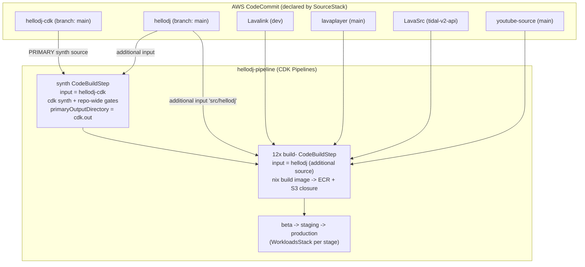

# Design Document: cdk-standalone-package

## Overview

Today the HelloDJ CDK app lives inside the `hellodj` monorepo at `platform/infra/`, and everything `cdk synth` and the repo-wide gates touch (`platform/tools/`, `platform/secrets/`, `platform/closures.toml`, `platform/pins*.toml`, `platform/pyproject.toml`, and the pure-logic Python package `platform/components/hellodj_platform_logic`) is co-located with the bot-adjacent workload sources under `platform/components/*`. The consequence is that a CDK-only change forces a commit against the bot repo, and the pipeline's synth source is coupled to the bot source of truth.

This feature migrates the CDK app and everything synth/gates depend on into a new standalone package and CodeCommit repo, `hellodj-cdk` (workspace folder `/home/celes/sources/celesrenata/hellodj-cdk`). After the move, the deployment pipeline's **primary synth source** is the `hellodj-cdk` repo, while the 12 per-component Nix image builds take the `hellodj` repo as an **additional source input** (mirroring the established 4-fork `additionalInputs` pattern). Net effect: CDK-only changes go to `hellodj-cdk` and trigger the pipeline without touching the bot repo — the user's stated goal — while bot/component source changes still flow from `hellodj`.

The design resolves three hard decisions explicitly: (1) where the repo boundary sits, (2) the ownership/sharing story for `hellodj_platform_logic` (imported by BOTH the CDK/gates and the bot components), and (3) how to reconcile the user's "deployed to the pipeline as it synths" phrasing with the documented `selfMutation: false` reality. It also carries the steering rule that the deploy-workflow and repo-layout changes must be reflected in `session-context.md`, `hellodj-architecture.md`, and `website-debug-context.md` in the same change.

## Architecture

### Source-repo topology (target state)



Key change from today: the synth step's `input` moves from `hellodj` to `hellodj-cdk`, and the per-component build steps take `hellodj` as an additional input. The 4 JVM forks remain additional inputs to the component builds exactly as they are now.

### What moves vs. what stays

| Path today (in `hellodj`) | Destination | Rationale |
|---|---|---|
| `platform/infra/` (bin, lib, test, cdk.json, package.json, tsconfig.json, jest.config.js) | `hellodj-cdk/infra/` | The CDK app itself. Synth's primary source. |
| `platform/tools/` (gate_base_image.py, gate_style.py, gate_pins.py, gate_dependencies.py, resolve_closure.py, migrate_repos.py, check_line_count.py, _migration_helpers.py) | `hellodj-cdk/tools/` | Repo-wide gates run in the synth step. |
| `platform/secrets/` (nix-cache-key.sec.enc, .sops.yaml) | `hellodj-cdk/secrets/` | Decrypted in synth/component install commands (`sops --decrypt`). |
| `platform/closures.toml`, `platform/pins.toml`, `platform/pins.upstream.toml` | `hellodj-cdk/` (repo root) | Consumed by `resolve_closure.py`, `gate_pins.py`. |
| `platform/pyproject.toml` | `hellodj-cdk/pyproject.toml` | Configures ruff/pytest for the Python tooling that moves with it. |
| `platform/components/hellodj_platform_logic/` | **DECISION — see below** | Imported by BOTH CDK tests/gates AND bot components. |
| `platform/components/*` (12 workload sources: discord-bot-core, playback-orchestrator, lavalink, tidal-stream, spotify-stream, yt-cipher, potoken-server, activity-backend, hls-transcode, voice-pipeline, web-ui, config-renderer) | **STAYS in `hellodj`** | Bot-adjacent; the per-component Nix builds keep sourcing from `hellodj`. |
| `bot/`, `kube/`, training, etc. | **STAYS in `hellodj`** | Pure bot repo content. |

### The `hellodj_platform_logic` ownership decision

`hellodj_platform_logic` is a pure-logic Python package with no side effects. It is imported by:

- **CDK-side**: the 226 CDK jest tests and the Python gates (`gate_*.py`, `resolve_closure.py`, `migrate_repos.py`) mirror its decision logic (migration order, promotion order, closure resolution, dependency gating).
- **Bot-side**: the 12 per-component Nix builds vendor it into each component tree (`cp -r $CODEBUILD_SRC_DIR/platform/components/hellodj_platform_logic ./hellodj_platform_logic` then commit) so the flake can hash a stable git tree.

Because both sides depend on it, moving it naively breaks one side. Three options:

| Option | How it works | Pros | Cons | Recommendation |
|---|---|---|---|---|
| **A. Move to `hellodj-cdk`, components vendor from an additional input** | `hellodj_platform_logic` lives at `hellodj-cdk/shared/hellodj_platform_logic/`. Component build steps get `hellodj-cdk` as an additional input (`shared/`) and vendor the package from there instead of from `platform/components/`. | Single source of truth; CDK owns the logic it tests; no duplication. | Every component build now also depends on the `hellodj-cdk` input; a `hellodj_platform_logic` change rebuilds components (correct — they embed it). Slightly more wiring in `getComponentBuildCommands`. | **RECOMMENDED** |
| B. Duplicate into both repos | Copy the package into `hellodj-cdk/shared/` and keep a copy in `hellodj/platform/components/`. | No new cross-repo input wiring. | Two copies drift; violates the "no config drift" steering rule; defeats the point of a pure shared package. | Rejected |
| C. Publish as a versioned artifact | Build `hellodj_platform_logic` as a wheel / Nix package, publish to an internal index, both repos depend on a pinned version. | Cleanest dependency semantics; explicit versioning. | Heaviest: needs a publish pipeline, an index (CodeArtifact), and version bumps on every logic change. Overkill for a single-owner monorepo split. | Defer (future) |

**Recommended: Option A.** It preserves a single source of truth, keeps the logic co-located with the CDK tests that assert it, and the extra component-build input is a small, well-understood extension of the existing `additionalInputs` pattern. The tradeoff — component builds now trigger on `hellodj_platform_logic` changes — is actually correct behavior, since the components embed that code.

## Components and Interfaces

### Component 1: `hellodj-cdk` package layout

**Purpose**: The standalone CDK app + everything synth/gates touch.

**Proposed directory layout**:

```
hellodj-cdk/
  infra/                      # was platform/infra/
    bin/hellodj.ts
    lib/*.ts                  # 13 stacks incl. source-stack.ts, pipeline-stack.ts
    test/*.ts                 # 226 jest tests
    cdk.json  package.json  tsconfig.json  jest.config.js
  tools/                      # was platform/tools/
    gate_base_image.py  gate_style.py  gate_pins.py  gate_dependencies.py
    resolve_closure.py  migrate_repos.py  check_line_count.py  _migration_helpers.py
  shared/
    hellodj_platform_logic/   # was platform/components/hellodj_platform_logic/  (Option A)
  secrets/                    # was platform/secrets/
    nix-cache-key.sec.enc  .sops.yaml
  closures.toml               # was platform/closures.toml
  pins.toml                   # was platform/pins.toml
  pins.upstream.toml          # was platform/pins.upstream.toml
  pyproject.toml              # was platform/pyproject.toml
  README.md
```

**Responsibilities**:
- Own the CDK app and its tests (the 226 jest tests must still pass after the move).
- Own the repo-wide gates and the manifests they read.
- Own the shared pure-logic package (Option A).

### Component 2: `SourceStack` (declarative repo provisioning)

**Purpose**: Declaratively provision the CodeCommit repos, now including `hellodj-cdk`.

**Interface (existing `SourceRepoSpec` + `SOURCE_REPOS`)**:
```typescript
export interface SourceRepoSpec {
  readonly name: string;
  readonly upstreamUrl?: string;
  readonly buildBranch: string;
}
export const SOURCE_REPOS: readonly SourceRepoSpec[] = [ /* ... */ ];
```

**Responsibilities**:
- Extend `SOURCE_REPOS` with `{ name: 'hellodj-cdk', buildBranch: 'main' }` (no `upstreamUrl` — like `hellodj`, it has no upstream). This is the ONLY edit needed here; the existing loop provisions the repo, grants `repo.grantPull(role)` to build roles, and emits clone-URL + build-branch `CfnOutput`s.

### Component 3: `PipelineStack` (source + synth rewiring)

**Purpose**: Make `hellodj-cdk` the primary synth source and `hellodj` a component-build additional input.

**Interface (existing `PipelineStackProps`)**:
```typescript
export interface PipelineStackProps extends cdk.StackProps {
  readonly repoString?: string;   // synth primary source repo name
  readonly branch?: string;
  // ...
}
```

**Responsibilities** (see Low-Level section for exact edits):
- Default the synth primary source to `hellodj-cdk`.
- Rewrite synth commands' working directories from `platform/infra` -> `infra`, `platform` -> repo root.
- Add `hellodj` (and `hellodj-cdk`, for the shared logic under Option A) as additional inputs to the per-component build steps.
- Add the `hellodj-cdk` repo ARN to the `codecommit:GitPull` policy.
- Keep `primaryOutputDirectory` pointing at the (relocated) `infra/cdk.out`.

### Component 4: `migrate_repos.py` (one-time seeding)

**Purpose**: Create + seed the `hellodj-cdk` CodeCommit repo with the moved CDK history.

**Responsibilities**:
- Extend the `REPOS` list (or reuse the pattern) with a `CodeCommitRepo(name="hellodj-cdk", build_branch="main", upstream_url=None)` entry so the transactional migrator creates the repo and `git push --mirror`s the new package's history, then verifies history preservation.

## Data Models

### `SourceRepoSpec` (TypeScript, unchanged shape)
```typescript
{ name: string; upstreamUrl?: string; buildBranch: string }
```
**Validation rule**: `name` must equal the intended CodeCommit repository name; `hellodj-cdk` uses `buildBranch: 'main'`, `upstreamUrl` omitted.

### `CodeCommitRepo` (Python, unchanged shape)
```python
CodeCommitRepo(name: str, build_branch: str, upstream_url: str | None)
```
**Validation rule**: `hellodj-cdk` entry has `upstream_url=None` (no upstream), matching the `hellodj` app-repo convention.

## Low-Level Design

### L1. `source-stack.ts` — add the repo (1-line array extension)

```typescript
export const SOURCE_REPOS: readonly SourceRepoSpec[] = [
  { name: 'hellodj', buildBranch: 'main' },
  { name: 'hellodj-cdk', buildBranch: 'main' },   // NEW — CDK app + gates + shared logic
  { name: 'Lavalink', upstreamUrl: 'https://github.com/lavalink-devs/Lavalink', buildBranch: 'dev' },
  { name: 'lavaplayer', upstreamUrl: 'https://github.com/lavalink-devs/lavaplayer', buildBranch: 'main' },
  { name: 'LavaSrc', upstreamUrl: 'https://github.com/topi314/LavaSrc', buildBranch: 'tidal-v2-api' },
  { name: 'youtube-source', upstreamUrl: 'https://github.com/lavalink-devs/youtube-source', buildBranch: 'main' },
] as const;
```
The existing loop then provisions the repo, grants pull, and emits outputs. `SourceStack` now declares **six** repos.

### L2. `pipeline-stack.ts` — primary synth source default

```typescript
// BEFORE
const repo = codecommit.Repository.fromRepositoryName(
  this, 'SourceRepo', props.repoString ?? 'hellodj',
);
// AFTER — synth reads the CDK repo by default
const repo = codecommit.Repository.fromRepositoryName(
  this, 'SourceRepo', props.repoString ?? 'hellodj-cdk',
);
```
`bin/hellodj.ts` must pass (or leave defaulting to) `repoString: 'hellodj-cdk'` for the pipeline stack.

### L3. `pipeline-stack.ts` — add `hellodj` (and `hellodj-cdk`) component-build inputs

Add `hellodj` to the additional-source map alongside the forks, following the exact existing pattern:

```typescript
const botSource = CodePipelineSource.codeCommit(
  codecommit.Repository.fromRepositoryName(this, 'BotRepo', 'hellodj'),
  props.branch ?? 'main',
);
// forkSources built as today...
```
Per-component build steps then receive `hellodj` (component sources) and — under Option A — `hellodj-cdk` (for `shared/hellodj_platform_logic`) as additional inputs.

### L4. Synth command path rewrites (`getBuildCommands` / `getInstallCommands`)

The synth primary input is now the `hellodj-cdk` repo ROOT, so `$CODEBUILD_SRC_DIR` is the CDK repo. Rewrite:

```
# BEFORE (paths relative to hellodj repo root)
cd $CODEBUILD_SRC_DIR/platform/infra && npm ci
cd $CODEBUILD_SRC_DIR/platform/infra && npx cdk synth
cd $CODEBUILD_SRC_DIR/platform && python3 tools/resolve_closure.py --ami --verify
cd $CODEBUILD_SRC_DIR/platform && python3 tools/gate_base_image.py
cd $CODEBUILD_SRC_DIR/platform && python3 tools/gate_style.py
cd $CODEBUILD_SRC_DIR/platform && python3 tools/gate_pins.py

# AFTER (paths relative to hellodj-cdk repo root)
cd $CODEBUILD_SRC_DIR/infra && npm ci
cd $CODEBUILD_SRC_DIR/infra && npx cdk synth
cd $CODEBUILD_SRC_DIR && python3 tools/resolve_closure.py --ami --verify
cd $CODEBUILD_SRC_DIR && python3 tools/gate_base_image.py
cd $CODEBUILD_SRC_DIR && python3 tools/gate_style.py
cd $CODEBUILD_SRC_DIR && python3 tools/gate_pins.py
```

In `getInstallCommands`/`getNixInstallCommands`, the sops decrypt path moves:
```
# BEFORE
sops --decrypt ... $CODEBUILD_SRC_DIR/platform/secrets/nix-cache-key.sec.enc > /tmp/nix-cache-key.sec
# AFTER (synth input is hellodj-cdk root)
sops --decrypt ... $CODEBUILD_SRC_DIR/secrets/nix-cache-key.sec.enc > /tmp/nix-cache-key.sec
```
Note: the component build steps run under a DIFFERENT primary input. For the component builds, the sops key and gates that live in `hellodj-cdk` must be referenced via the `hellodj-cdk` additional input mount path (e.g. `$CODEBUILD_SRC_DIR/hellodj-cdk/secrets/...`) rather than `$CODEBUILD_SRC_DIR`. Precise additional-input mount prefixes are finalized in the requirements/task phase; the invariant is: gates/secrets resolve from wherever `hellodj-cdk` is mounted, component sources from wherever `hellodj` is mounted.

### L5. `primaryOutputDirectory`

```typescript
// BEFORE
primaryOutputDirectory: 'platform/infra/cdk.out',
// AFTER
primaryOutputDirectory: 'infra/cdk.out',
```

### L6. `codecommit:GitPull` resource ARN addition

```typescript
resources: [
  `arn:aws:codecommit:${this.region}:${this.account}:hellodj`,
  `arn:aws:codecommit:${this.region}:${this.account}:hellodj-cdk`,   // NEW
  `arn:aws:codecommit:${this.region}:${this.account}:Lavalink`,
  `arn:aws:codecommit:${this.region}:${this.account}:lavaplayer`,
  `arn:aws:codecommit:${this.region}:${this.account}:LavaSrc`,
  `arn:aws:codecommit:${this.region}:${this.account}:youtube-source`,
],
```

### L7. Per-component build command vendor-path rewrite (`getComponentBuildCommands`)

Under Option A the vendored `hellodj_platform_logic` moves from the `hellodj` tree to the `hellodj-cdk` `shared/` input:

```
# BEFORE
cp -r $CODEBUILD_SRC_DIR/platform/components/hellodj_platform_logic ./hellodj_platform_logic
# AFTER (source from the hellodj-cdk additional input mount)
cp -r <hellodj-cdk-input>/shared/hellodj_platform_logic ./hellodj_platform_logic
```
The component source `cd` target also moves from `$CODEBUILD_SRC_DIR/platform/components/<component>` to the `hellodj` input mount `<hellodj-input>/platform/components/<component>` (components stay in `hellodj`).

### L8. `migrate_repos.py` — seed the CDK repo

```python
REPOS: list[CodeCommitRepo] = [
    CodeCommitRepo(name="hellodj", build_branch="main", upstream_url=None),
    CodeCommitRepo(name="hellodj-cdk", build_branch="main", upstream_url=None),  # NEW
    CodeCommitRepo(name="Lavalink", build_branch="dev", upstream_url="https://github.com/lavalink-devs/Lavalink"),
    # ... rest unchanged
]
```
`locate_local_repo("hellodj-cdk")` must resolve to `/home/celes/sources/celesrenata/hellodj-cdk`. The existing attempt callback then runs `aws codecommit create-repository`, (no upstream), `git push --mirror`, and `verify_history`. Prefer running `--dry-run` first.

## CodeCommit Provisioning Path & Bootstrap Ordering

There is a chicken-and-egg problem: the `SourceStack` that declares `hellodj-cdk` lives IN the CDK, which is what we're moving. Recommended ordering:

1. **Prepare the package in place**: create the `hellodj-cdk` working tree at `/home/celes/sources/celesrenata/hellodj-cdk` with the moved files and layout (L1–L7 applied so `cdk synth` + jest pass locally against the new paths). Do NOT yet delete from `hellodj`.
2. **Declare the repo from the CURRENT in-repo CDK**: with the `SOURCE_REPOS` edit (L1) deployed from the existing `platform/infra` location, run `cd platform/infra && npx cdk deploy hellodj-source` to create the empty `hellodj-cdk` CodeCommit repo. (Alternative: create it out-of-band once with `aws codecommit create-repository --repository-name hellodj-cdk`, then let `SourceStack` adopt it as declarative metadata — the CDK create is idempotent against an existing repo name only if imported; prefer the CDK-declared path.)
3. **Seed history**: run `python tools/migrate_repos.py --dry-run` then the real run to `git push --mirror` the new package into `hellodj-cdk`.
4. **Cut the pipeline over**: apply L2–L7, then (because `selfMutation: false`) `cd infra && npx cdk deploy hellodj-pipeline` from the `hellodj-cdk` package, and start a fresh pipeline execution.
5. **Remove moved files from `hellodj`** once the pipeline is green from `hellodj-cdk`.

**Recommendation**: use the CDK-declared path (step 2 via `hellodj-source` deploy from the current location) rather than out-of-band creation, so the repo's existence stays declarative infrastructure consistent with the "everything in CDK" goal. Create out-of-band only if a deploy-before-move is impractical.

## "Parsed and deployed to the pipeline as it synths" — reconciliation

The user asked that the CDK be "parsed and deployed to the pipeline as it synths." Concretely:

- **Synth (parse)**: the pipeline's Build stage runs `cdk synth` reading from `hellodj-cdk`, producing the cloud assembly (`infra/cdk.out`) and running the repo-wide gates. A push to `hellodj-cdk` triggers this automatically. ✅ This is the "parsed as it synths" behavior and it works with the source rewiring above.
- **Deployed (pipeline definition)**: `selfMutation: false` is deliberate (documented reason: stage stacks apply K8s manifests via the EKS kubectl handler Lambda; self-mutation triggers cross-stack custom-resource failures). So changes to the pipeline DEFINITION itself (`pipeline-stack.ts`) do NOT auto-apply on a push — they require the manual `cd infra && npx cdk deploy hellodj-pipeline` + a fresh execution.

**Recommendation on `selfMutation`**: keep it **off** for now. Moving the pipeline definition to its own repo does not remove the underlying reason it's disabled — the stage stacks still apply K8s manifests via the EKS kubectl handler Lambda, and self-mutation would still attempt to redeploy the pipeline stack (which references those stage stacks), re-triggering the cross-stack custom-resource failure. Re-enabling `selfMutation` is a separate, riskier investigation that should only happen after confirming the kubectl-handler cross-stack issue is resolved; it is out of scope for the repo split. The design therefore keeps the documented manual `cdk deploy hellodj-pipeline` workflow, updated for the new path (`cd infra` instead of `cd platform/infra`). This must be reflected in the steering docs.

## Correctness Properties

These are candidate properties for later property-based testing (PBT) and assertion tests.

These are candidate properties for later property-based testing (PBT) and assertion tests. Because this is a design-first spec, the requirement IDs referenced below are placeholders (to be finalized when requirements are derived from this design in the next phase).

### Property 1: hellodj-cdk is always declared
For the synthesized template of `SourceStack`, the set of CodeCommit repository names ALWAYS includes `hellodj-cdk` (∀ synth: `hellodj-cdk ∈ declaredRepoNames`). Assertable via the existing CDK jest template assertions.

**Validates: Requirements 1.1** (repo topology — SourceStack declares hellodj-cdk)

### Property 2: Six repos, correct branches
`SOURCE_REPOS` has exactly 6 entries; `hellodj-cdk` has `buildBranch === 'main'` and no `upstreamUrl`.

**Validates: Requirements 1.2** (repo topology — repo set + build branches)

### Property 3: Synth source invariant
The pipeline synth step's primary input resolves to `hellodj-cdk` (given no `repoString` override).

**Validates: Requirements 2.1** (pipeline rewiring — primary synth source)

### Property 4: CDK-only change isolation
For any change set confined to the CDK app, the changed paths intersect `platform/components/*` = ∅ (a CDK-only change touches no bot component paths). Expressible as a path-partition property over the two repos' file sets.

**Validates: Requirements 3.1** (user goal — CDK changes do not touch the bot repo)

### Property 5: Synth path invariants
Every synth command's working directory resolves under the `hellodj-cdk` layout (`infra/` for CDK, repo root for `tools/`), and no synth command references a `platform/infra` or `platform/tools` path.

**Validates: Requirements 2.2** (pipeline rewiring — synth command path correctness)

### Property 6: GitPull ARN coverage
The `codecommit:GitPull` policy resource list includes the `hellodj-cdk` ARN (and retains the other five).

**Validates: Requirements 2.3** (pipeline rewiring — IAM source access)

### Property 7: Tests preserved
The moved package keeps the 226 CDK jest tests green (`cd infra && npx tsc --noEmit && npx jest`), and the Python tooling still passes ruff + pytest under the moved `pyproject.toml`.

**Validates: Requirements 4.1** (migration correctness — no regression from the move)

### Property 8: Migration idempotence/transactionality
Adding `hellodj-cdk` to `REPOS` preserves the transactional halt-on-first-failure semantics; a re-run against an already-created repo reports `created` without error.

**Validates: Requirements 4.2** (migration correctness — transactional seeding)

## Error Handling

| Scenario | Condition | Response | Recovery |
|---|---|---|---|
| Synth path not found | A synth command still points at `platform/infra` after the move | `cdk synth`/gate fails in Build stage | Fix the path rewrite (L4); re-run synth |
| Component build can't find shared logic | Vendor path still points at `hellodj/platform/components/hellodj_platform_logic` under Option A | Nix build fails or embeds stale logic | Repoint vendor copy to the `hellodj-cdk` `shared/` input (L7) |
| GitPull denied for `hellodj-cdk` | ARN not added to the policy (L6) | CodeBuild source resolution / flake input fails with AccessDenied | Add the ARN, `cdk deploy hellodj-pipeline` |
| Bootstrap ordering violated | Attempt to deploy pipeline cutover before the repo exists / is seeded | Pipeline has no source to read | Follow the ordering: declare repo, seed, then cut over |
| Pipeline-def change didn't take effect | Pushed `pipeline-stack.ts` change without `cdk deploy` (selfMutation off) | Old buildspec keeps running | `cd infra && npx cdk deploy hellodj-pipeline` + fresh execution |

## Testing Strategy

### Unit / assertion testing
- Reuse the existing CDK jest suite (226 tests) against the moved package; add assertions for the six-repo `SourceStack` template and the synth primary-source name.
- Add a path-partition unit test for the CDK-only-change-isolation property (property 4).

### Property-based testing
- **Library**: Hypothesis (Python) for the `hellodj_platform_logic` migration/promotion logic (already in use in the repo per `.hypothesis/`), and CDK `Template` assertions for the TS invariants.
- Property targets: repo-set membership (property 1/2), GitPull ARN coverage (property 6), migration transactionality (property 8).

### Integration testing
- Dry-run `migrate_repos.py --dry-run` and verify the `hellodj-cdk` entry appears with the correct target URL and no upstream.
- End-to-end: after cutover, push a no-op CDK change to `hellodj-cdk` and confirm the pipeline synths without any `hellodj` commit; push a component change to `hellodj` and confirm the component rebuilds.

## Dependencies

- AWS CDK (aws-cdk-lib, CDK Pipelines, `@aws-cdk/lambda-layer-kubectl-v36`) — unchanged, moves with `infra/`.
- Node 22 (synth), ruff 0.16.4, Nix (Determinate installer), sops 3.9.4, AWS CLI + git credential helper — unchanged; only the paths they read change.
- `hellodj_platform_logic` (pure Python) — relocated to `hellodj-cdk/shared/` under Option A.
- AWS CodeCommit repo `hellodj-cdk` — new, provisioned by `SourceStack`.

## Documentation / Steering Sync (design concern → task input)

Per the "Keep Architecture Docs in Sync" steering rule, the repo layout and deploy workflow change materially, so the following must be updated in the same change and captured as explicit tasks:

- `session-context.md` — the "Pipeline Architecture", "Key Commands", and the `selfMutation` gotcha section: `cd platform/infra` becomes `cd infra` (in the `hellodj-cdk` repo); note the primary synth source is now `hellodj-cdk`; the source-repo count becomes 6.
- `hellodj-architecture.md` — the Repository Layout table gains a `hellodj-cdk` row (`codecommit::us-east-1://hellodj-cdk`, branch `main`), and the note that CDK/gates/`hellodj_platform_logic` now live there while `platform/components/*` stay in `hellodj`.
- `website-debug-context.md` — the "CRITICAL WORKFLOW RULES" (self-mutation, `cd platform/infra` deploy commands) and the pipeline source description updated to the new repo/paths.
