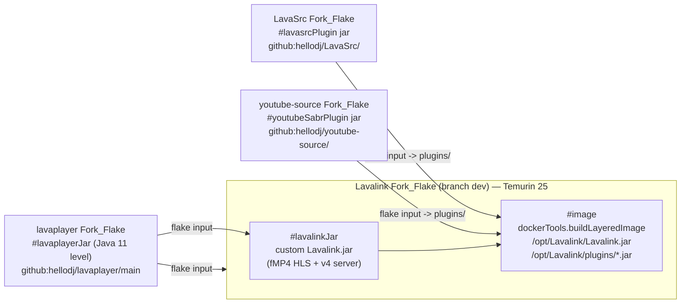
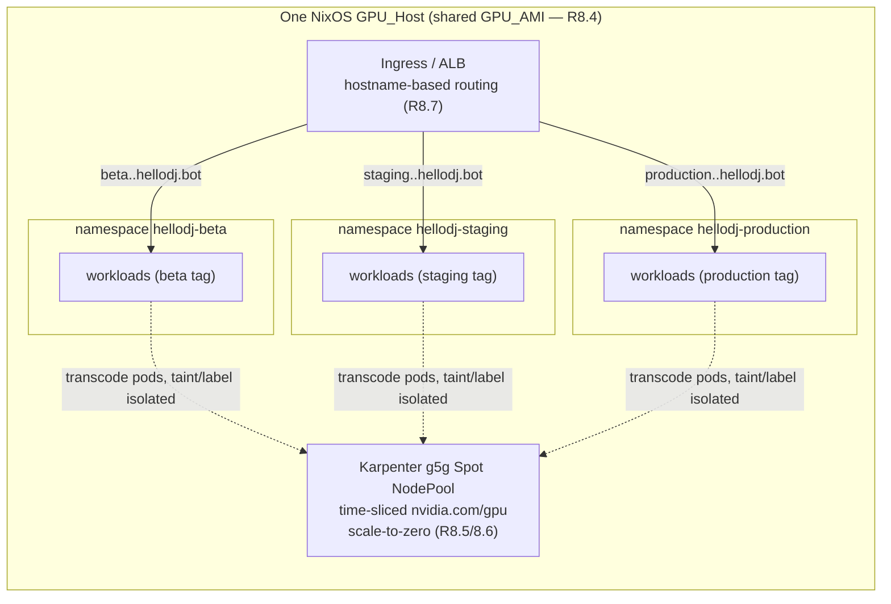

# Design Document

## Overview

This design turns the twelve EARS requirements of `hellodj-nix-native-delivery` into a concrete,
buildable plan. It has three intertwined goals, all traced to requirements:

1. **Migrate** the four JVM forks (`Lavalink`, `lavaplayer`, `LavaSrc`, `youtube-source`) into the
   `hellodj` account as independent repositories, each with its `upstream` remote preserved and its
   own Nix-wrapped Gradle build (Requirements 1, 2).
2. **Build everything with Nix, natively, on the latest verified upstream versions**, with **no
   distro base image anywhere** — OCI images via `dockerTools.buildLayeredImage`, the GPU AMI via
   `nixos-generators -f amazon`, and JVM jars via hermetic Nix-wrapped Gradle. This includes
   migrating all JVM forks and the Lavalink image base to **Temurin 25 (LTS)** and wiring the real
   plugin jars into the Lavalink image, replacing the current placeholder derivations (Requirements
   3, 4, 5, 11).
3. **Deliver cheaply**: no persistent paid build server, a build-once/deploy-thrice Nix binary
   cache, and Beta/Staging/Production consolidated onto a **single GPU host isolated by endpoint**
   with GPU scale-to-zero, promoted in fixed order and halting on failure (Requirements 6, 7, 8, 9,
   10, 12).

This is a **delivery-and-build** spec. It changes *how* artifacts are built, versioned, migrated,
and promoted — not the application's runtime behaviour. It builds on and reconciles with two
existing efforts under `platform/`:

- **`aws-saas-replatform`** (fully implemented): CDK Pipelines (`infra/lib/pipeline-stack.ts`), the
  native-Nix GPU AMI (`infra/ami/`), the Nix OCI image flakes for `lavalink`/`spotify-stream`/
  `yt-cipher`/`potoken-server`, the base-image gate (`tools/gate_base_image.py` +
  `base_image_gate.check_base`), and the stage/DNS/promotion logic in `hellodj_platform_logic`.
- **`nix-image-packaging`** (companion, `platform/NIX-CONVERSION-CONTEXT.md`): the 7 Python
  components that still lack a Nix image flake. That work is a **prerequisite/parallel** dependency:
  the base-image gate must reach a state where it **PASSES** for every component and **SKIPS zero**
  (Requirement 5.6/5.8). This design does not re-specify those 7 flakes; it depends on them landing
  so the gate enforces rather than skips.

### Verified upstream versions (at spec authoring time)

Requirement 11 forbids memory-based versions. Versions verified live against upstream during
authoring:

| Input | Verified latest (pin target) | Source | Requirement |
|---|---|---|---|
| Eclipse Temurin (JDK/JRE) | **25 LTS** — 25.0.x line (25.0.0+36-LTS released 2025-09-22; patch line current, e.g. 25.0.x) | Eclipse Adoptium release announcements; `adoptium/temurin25-binaries` releases | 3.7, 11.2 |
| nixpkgs Temurin attribute | `temurin-bin-25` / `temurin-jre-bin-25` (also `temurin-bin.jre-25`) | nixpkgs; NixOS discourse/wiki | 3.5, 11.1 |
| Lavalink | v4 line (DAVE/E2EE-capable v4 releases current); fork tracks branch `dev` | `lavalink-devs/Lavalink` releases + lavalink.dev changelog | 1.3, 11.1 |
| LavaSrc | 4.8.x (fork currently produces `lavasrc-plugin-4.8.3.jar`) | `topi314/LavaSrc` releases | 4.4, 11.1 |
| lavaplayer | fork snapshot consumed by Lavalink (`dev.arbjerg:lavaplayer` snapshot pinned in Lavalink `settings.gradle.kts`) | `lavalink-devs/lavaplayer` | 2.2, 11.1 |
| youtube-source | SABR-capable fork (`youtube-plugin-sabr.jar`) | `lavalink-devs/youtube-source` | 4.4, 11.1 |

> **Note on Temurin non-LTS:** Temurin 26 exists (a non-LTS feature release). Requirement 3.7
> explicitly forbids any Temurin feature release other than 25, so **25 is the target** even though a
> higher-numbered feature release is available.

Because the pin target must equal the *latest verified* identifier at *pin time* (R11.1/11.2), the
exact patch revision is captured by `flake.lock` at pin execution, and the pinning workflow (§
Components — Upstream version pinning) rejects a pin whose resolved identifier does not match
upstream (R11.5/11.6).

### Requirements coverage map

| Requirement | Where addressed |
|---|---|
| 1 — Migrate forks to `hellodj` account | Architecture (repo topology); Components (fork repos, migration procedure) |
| 2 — Per-fork Nix-wrapped Gradle | Components (Fork_Flake build recipe, gradle2nix decision) |
| 3 — Temurin 25 migration | Components (per-fork toolchain analysis + Lavalink base) |
| 4 — Wire real plugin jars | Components (Lavalink_Image flake, plugin boundary) |
| 5 — All Nix, no distro base | Architecture; Components (base-image gate integration) |
| 6 — No paid build server | Architecture (build dataflow); Components (Build_Trigger decision + cost) |
| 7 — Binary cache, build once deploy thrice | Components (cache backend decision + cost); Data Models |
| 8 — Single GPU host, endpoint isolation | Architecture; Components (isolation mechanism) |
| 9 — Stage rename beta/staging/production | Components (enum + dns_naming + promotion + CDK rename); Data Models |
| 10 — Fixed-order promotion, halt on failure | Components (promotion controller); Correctness Properties |
| 11 — Latest verified pins | Overview (version table); Components (pinning workflow) |
| 12 — Verifiable reproducible path | Testing Strategy |

## Architecture

### Build-and-deploy dataflow (push → Nix build with no paid server → cache + ECR → CDK deploy → single host)

The core cost decision (R6) is: **the build never runs on paid, persistently-billed compute.** The
selected `Build_Trigger` is **GitHub Actions with Nix** (justified in Components); it publishes Nix
closures to the `Nix_Binary_Cache` and OCI images to ECR. CDK Pipelines is **retained for
orchestration/deploy only** — its synth/gate steps run cheap metadata operations and it *pulls
prebuilt closures/images* rather than compiling artifacts on CodeBuild (R6.3/6.4).

```mermaid
flowchart TD
    subgraph src["hellodj account (source of truth, R1)"]
      A1["Lavalink (branch dev)"]
      A2["lavaplayer"]
      A3["LavaSrc"]
      A4["youtube-source"]
      A5["hellodj app repo + platform/"]
    end

    A1 & A2 & A3 & A4 & A5 -->|push to tracked branch| GH["GitHub Actions runner + Nix\n(Build_Trigger, no idle bill — R6.1/6.5)"]

    GH -->|nix build .#jar / .#image| BUILD["Nix build\n(hermetic Gradle, Temurin 25 — R2/R3)"]
    BUILD -->|push closures + verify retrievable R7.7| CACHE["Nix_Binary_Cache\n(S3-backed — R7.1)"]
    BUILD -->|push OCI images| ECR["ECR Container_Registry (R6.2)"]
    BUILD -->|nixos-generate -f amazon| AMI["GPU_AMI closure -> register AMI (R5.2)"]

    GH -->|base-image gate PASS, zero SKIP R5.6/5.7| GATE{"gate_base_image.py"}
    GATE -->|fail: block compliance R5.9| STOP1["halt build (R10.2)"]

    ECR & CACHE & AMI --> CDK["CDK Pipelines\n(orchestrate + deploy only — R6.4)"]
    CDK -->|pull closure by store-path-hash R7.2/7.3| PROMO["Promotion_Controller\nBeta -> Staging -> Production (R10)"]

    PROMO --> HOST["Single NixOS GPU_Host (R8.1/8.3/8.4)"]
    subgraph HOST_endpoints["Stage_Endpoints on the one host (R8.2)"]
      EB["beta.<region>.hellodj.bot\nns hellodj-beta"]
      ES["staging.<region>.hellodj.bot\nns hellodj-staging"]
      EP["production.<region>.hellodj.bot\nns hellodj-production"]
    end
    HOST --> EB & ES & EP
    HOST -->|no active transcode 60-900s (default 300s) -> GPU scale-to-zero R8.5| ZERO["GPU billed only under load"]
```

Key architectural invariants:

- **Store-path-hash identity is the build-once/deploy-thrice mechanism** (R7.2/7.3). An artifact is a
  Nix closure identified by its store path hash. All three stages pull *the same* closure by hash; if
  the hash already exists in the cache, it is reused and never rebuilt.
- **A missing closure halts a stage** (R7.4). Deploy never substitutes an artifact from any source
  other than the cache; a missing store path stops that stage and surfaces the missing path.
- **The base-image gate is a hard pipeline gate** (R5.7/5.9). Compliance is never claimed unless the
  gate ran and reported PASS for every component with zero SKIP.

### Fork-flake dependency graph (Lavalink ← lavaplayer / LavaSrc / youtube-source)

Each fork is a standalone flake output; the Lavalink flake consumes the sibling forks as
`github:hellodj/<repo>/<branch>` inputs (R1.5, R4.1) and replaces the placeholder derivations
(R4.5).



- **lavaplayer** feeds the custom `Lavalink.jar` (the fMP4 HLS patch is a lavaplayer-level change
  consumed by the Lavalink server build) — so it is both a dependency of the Lavalink *jar* build and
  a standalone flake output (R2.2).
- **LavaSrc** and **youtube-source** produce plugin jars that land in `/opt/Lavalink/plugins/`
  (R4.4).
- The Lavalink flake's `#image` output is the only runnable container among the forks; the plugins
  are jar outputs consumed by it (plugin packaging boundary decision, Components).

### Single-host, three-endpoint topology



The isolation mechanism (decided in Components) is **EKS namespaces + Ingress hostnames** (one per
stage) on the single shared cluster/host, *not* separate GPU instances (R8.2/8.3). The GPU is a
single shared, time-sliced Karpenter-provisioned node pool that all three namespaces' transcode pods
schedule onto, and it scales to zero after the idle window (R8.5).

## Components and Interfaces

This section resolves every design decision the migration context (§4) enumerated, per fork and per
subsystem, with rationale and cost impact.

### 1. Fork repositories in the `hellodj` account (R1)

Four independent repositories are created under the `hellodj` account:

| Repo | Upstream (preserved as `upstream` remote) | Build branch | Produces |
|---|---|---|---|
| `hellodj/Lavalink` | `lavalink-devs/Lavalink` | `dev` (R1.3) | custom `Lavalink.jar` + `#image` (Lavalink_Image) |
| `hellodj/lavaplayer` | `lavalink-devs/lavaplayer` | `main` | lavaplayer jar (fMP4 HLS patch) |
| `hellodj/LavaSrc` | `topi314/LavaSrc` | release/`main` | `lavasrc-plugin` jar |
| `hellodj/youtube-source` | `lavalink-devs/youtube-source` | `main` | `youtube-plugin-sabr` jar |

**Interface — git remotes.** Each repo has `origin → github:hellodj/<repo>` and `upstream → <original
upstream>` (R1.2), so `nix flake update` (and future `git fetch upstream`) keep sync possible
(R11.3/11.4).

**Migration procedure (transactional, R1.6).** Migration processes the four repos in a fixed list.
For each: create the `hellodj` repo, push the working branch, add the `upstream` remote, and verify
the remote resolves. If any repo cannot be created or its `upstream` remote cannot be established,
migration **stops at that repo**, reports an error naming the affected `Fork_Repo`, and leaves the
already-migrated repos unchanged (no rollback of prior successes; no processing of later repos). This
is the same "process in order, halt on first failure, leave prior state untouched" shape as the
promotion controller and is modeled by a pure `migrate_forks` decision function (Data Models).

**Source ownership (R1.4).** Once the `hellodj` app repo and forks are in the account, the pipeline
builds and promotes only from `github:hellodj/*` sources — no `celesrenata/*` or other-account
inputs remain in any flake input in a build-driving position.

### 2. Per-fork Nix-wrapped Gradle build (R2) — the gradle2nix decision

**Decision: use `gradle2nix` (v2) to produce a hermetic, vendored dependency lock per fork, consumed
by a `stdenv.mkDerivation` Gradle build.** Rationale and the rejected alternative:

- Gradle builds are network-heavy (they resolve dependencies from Maven Central,
  `maven.lavalink.dev`, `jitpack.io`, etc.). R2.5 requires **zero outbound network requests for
  dependency resolution during the Nix build phase**. Two hermetic approaches exist:
  - **`gradle2nix`**: runs Gradle once outside the sandbox to capture a lock of every artifact +
    hash, commits that lock to the fork repo, and at build time serves dependencies from a Nix-built
    offline Maven repo. Chosen because it mechanically enumerates the (large, transitive) Lavalink/
    Spring/Kotlin dependency graph rather than hand-maintaining it.
  - **Hand-vendored fixed-output `mkDerivation`** (rejected as the primary approach): a single
    fixed-output derivation that pre-fetches a hand-listed dependency set. Rejected because the
    Lavalink dependency closure (Spring Boot 3.3, Kotlin 2.1.20, koe, udpqueue/libdave natives across
    9–10 platforms — see `settings.gradle.kts`) is too large and volatile to hand-maintain without
    drift; a captured lock is more reliable and reproducible.
- **Per-fork application.** Each Fork_Flake commits its own `gradle2nix` lock (`gradle.lock` /
  `deps.json`) and offline repo derivation. The build sets `--offline` and points Gradle at the
  Nix-built Maven repo, guaranteeing R2.5.

**Interface — flake outputs per fork.**

| Fork | `packages.<jar>` output | Notes |
|---|---|---|
| `lavaplayer` | `lavaplayerJar` | consumed by Lavalink jar build + published for the plugin builds |
| `LavaSrc` | `lavasrcPlugin` (`lavasrc-plugin-<ver>.jar`) | plugin subproject only |
| `youtube-source` | `youtubeSabrPlugin` (`youtube-plugin-sabr.jar`) | plugin subproject; version has `-SNAPSHOT` stripped (see its `build.gradle.kts`) |
| `Lavalink` | `lavalinkJar`, `image` | jar consumes lavaplayer; image consumes plugins |

**Build correctness (R2.6/2.8).** A jar output is a real jar: its manifest declares a `Main-Class`
(Lavalink server) or plugin entrypoint, and it contains compiled `.class` files — never a zero-byte
or `PLACEHOLDER ARTIFACT` marker. A compilation error or unresolved dependency makes the derivation
exit non-zero with no jar in `result/` and an error naming the failure (fail-fast).

**Check (R2.7).** Each fork exposes `checks.<system>.<jar>` (and `checks.image-builds` for Lavalink)
so `nix flake check` evaluates to completion with exit 0.

### 3. Temurin 25 migration — per-fork toolchain analysis (R3)

Each fork's *declared* Java/Kotlin toolchain level was read from its build files. The Fork_Flake
sets the Gradle toolchain to a Nix-built Temurin 25 (`pkgs.temurin-bin-25`) and records the confirmed
declared level (R3.6). The declared *language level* stays as-is (it is a compile target, satisfied
by a newer JDK); only the *build toolchain JDK* becomes Temurin 25.

| Fork | Declared level (from build files) | Compatible under Temurin 25? | How the flake sets the toolchain |
|---|---|---|---|
| **Lavalink** | Kotlin `JvmTarget.JVM_21`, `kotlin { jvmToolchain(21) }`; Kotlin 2.1.20; Spring Boot 3.3 | **Yes.** Kotlin 2.1.20 supports building on JDK 25; `jvmToolchain(21)` requests a *language target* of 21, which a JDK 25 toolchain satisfies. The flake overrides toolchain auto-provisioning to use the Nix Temurin 25. | Provide `org.gradle.java.installations.paths` pointing at `${temurin-bin-25}`; set `JAVA_HOME=${temurin-bin-25}`; keep `jvmToolchain(21)` target. Disable Gradle toolchain auto-download (offline, R2.5). |
| **lavaplayer** | Java `sourceCompatibility/targetCompatibility = VERSION_11` | **Yes.** JDK 25 compiles `--release 11`-level sources. `VERSION_11` is a target; JDK 25 as the compiler is compatible. | `JAVA_HOME=${temurin-bin-25}`; leave source/target at 11. |
| **LavaSrc** | Kotlin JVM plugin 1.9.0 (Groovy `build.gradle`); `compileJava` UTF-8; no explicit toolchain pin | **Yes, with a pin bump.** Kotlin 1.9.0's Gradle plugin does not officially support JDK 25 as the *build JVM*; build under a JDK 25 toolchain requires either running Gradle on 25 while compiling Kotlin to a supported target, or bumping the Kotlin plugin. The flake sets JAVA_HOME to Temurin 25 and, if Kotlin 1.9.0 rejects JDK 25, records the incompatibility and fails per R3.8 unless the Kotlin plugin is bumped in the fork. **Recommended: bump LavaSrc's Kotlin plugin to a JDK-25-supporting release as part of migration** (the fork is owned now, R1). | `JAVA_HOME=${temurin-bin-25}`; document Kotlin-plugin compatibility; bump if needed. |
| **youtube-source** | Java `sourceCompatibility/targetCompatibility = VERSION_1_8` | **Yes.** JDK 25 still compiles `--release 8`? — **No: JDK 25 dropped `-source/-target 8` support paths in some toolchains.** JDK 25 `javac` supports `--release` down to 8 via historical data, but plain `sourceCompatibility=1.8` may emit an obsolete-source warning or error. The flake sets JAVA_HOME to Temurin 25 and, if `1_8` is rejected, records it and fails per R3.8; **recommended: raise youtube-source's source/target to a level JDK 25 accepts (e.g. 11 or 17)** as part of migration. | `JAVA_HOME=${temurin-bin-25}`; verify `1_8` acceptance; raise level if rejected and record. |

**Lavalink image base (R3.5).** The Lavalink_Image runtime base changes from `temurin-jre-bin-21` to
**`temurin-jre-bin-25`** (a Nix-built Temurin 25 JRE reporting Java feature version 25 at startup).

**Failure behaviour (R3.8).** If any fork's Gradle build fails under Temurin 25 due to
toolchain-resolution, language-level, or compilation error, the Fork_Flake fails with an error
naming the incompatible fork and level, and produces no artifact for that fork.

### 4. Lavalink image flake — wiring real plugin jars (R4)

The `platform/components/lavalink/flake.nix` `mkPlaceholderJar` derivations (`Lavalink.jar`,
`youtube-plugin-sabr.jar`, `lavasrc-plugin-4.8.3.jar`, each currently emitting `PLACEHOLDER
ARTIFACT`) are **removed and replaced** by real artifacts sourced from the sibling Fork_Flakes
(R4.5). Two equivalent wirings are possible; the design chooses **the Lavalink Fork_Flake as the
authoritative image builder** and treats `platform/components/lavalink/flake.nix` as a thin consumer
of it (keeping one image definition, avoiding drift):

- **Plugin packaging boundary (decision):** each of `lavaplayer`, `LavaSrc`, `youtube-source` is a
  **standalone flake output (jar)**, consumed by the Lavalink flake as a `github:hellodj/<repo>/
  <branch>` input (R4.1). Plugins are *not* built inline in the Lavalink flake. Rationale: they live
  in separate repos (R1), so separate flakes with the Lavalink flake taking them as inputs is the
  clean boundary and lets each fork build/version independently.

**Interface — image layout (R4.2/4.3/4.4/4.8).**

```
/opt/Lavalink/Lavalink.jar                       # from Lavalink #lavalinkJar
/opt/Lavalink/plugins/lavasrc-plugin-<ver>.jar   # from LavaSrc #lavasrcPlugin
/opt/Lavalink/plugins/youtube-plugin-sabr.jar    # from youtube-source #youtubeSabrPlugin
# application.yml is NOT present in the image; read only from the runtime-mounted
# /opt/Lavalink/application.yml injected at container start (config-renderer) — R4.8
```

- Built with `pkgs.dockerTools.buildLayeredImage` (R4.2), base = Temurin 25 JRE (R3.5), `pkgs.cacert`
  for TLS, `WorkingDir=/opt/Lavalink`, exposes 2333, entrypoint `java … -jar
  /opt/Lavalink/Lavalink.jar` (mirrors the current flake's config).
- **No placeholder marker** may appear in any bundled jar (R4.6): the jars are the real Fork_Flake
  outputs, each containing compiled classes.
- **Fail-fast (R4.7):** if a plugin jar or the custom `Lavalink.jar` cannot be resolved from its
  source Fork_Flake, the Lavalink flake build fails, produces no image, and names the missing
  artifact.

### 5. Every artifact Nix-produced, no distro base — base-image gate integration (R5)

- Every component OCI image is `dockerTools.buildLayeredImage` (R5.1); the GPU AMI is
  `nixos-generators` `amazon-image` (R5.2).
- **`Lavalink/Dockerfile.custom` (`FROM eclipse-temurin:21-jre-alpine`) is deleted / demoted to
  non-authoritative reference** and replaced by the Nix Lavalink_Image (R5.3). The Alpine base is the
  anti-pattern this migration removes.
- **`web-ui` Debian Dockerfile** (`node:22-slim` + `python:3.11-slim`) is replaced by a Nix image
  (R5.4) — delivered by the companion `nix-image-packaging` spec; this design depends on it.
- **No `Distro_Base` in a base-declaring position** in any Fork_Flake or Component_Flake (R5.5).

**Base-image gate (R5.6–5.9).** The gate (`tools/gate_base_image.py` +
`base_image_gate.check_base`) is kept **unchanged** in its pure logic and its Property 6 test (per the
task instruction). Its behaviour is unchanged: a component with a `flake.nix` that builds via
`dockerTools.*Image` and references no `ubuntu`/`debian` base is PASS; a component with no flake is
SKIP. **The end-state this spec targets is PASS for every component and SKIP for zero** — reached
once the companion `nix-image-packaging` flakes land for the 7 Python components. The gate runs as a
hard pipeline build step (already wired in `getBuildCommands`), and compliance is claimed only when
it reports PASS for every component with zero SKIP and zero distro-base references (R5.7); otherwise
the build step fails, blocks the compliance claim, and names the offender (R5.9).

> The gate's forbidden-base matcher only matches Alpine indirectly today (it lists `ubuntu`/`debian`).
> Since R5 also forbids Alpine, and the only Alpine reference is `Lavalink/Dockerfile.custom` which is
> being deleted, no Alpine reference remains in a base-declaring position after migration. The gate
> reads the authoritative `flake.nix` (not the demoted Dockerfile), so the Lavalink component PASSes
> on its Nix flake.

### 6. Where builds run without a paid server — the Build_Trigger decision (R6)

**Decision: GitHub Actions with Nix** (exactly one `Build_Trigger` selected, R6.5). Cost
justification comparing all three candidates:

| Build_Trigger | Idle cost | Per-build cost | Verdict |
|---|---|---|---|
| **GitHub Actions with Nix (selected)** | **$0 idle** — runners are ephemeral, billed only while a job runs; free minutes for the account tier, and Nix caching (cache + `magic-nix-cache`/S3) avoids rebuilds. | Low: minutes per build; aarch64 via GitHub-hosted ARM runners or an aarch64 remote builder. | **Selected.** Zero idle bill (R6.1), integrates with the Nix cache + ECR push (R6.2), and CDK Pipelines only deploys prebuilt closures (R6.3/6.4). |
| local-on-GPU-host | Low but **non-zero risk**: builds contend with the production GPU host; the host is kept minimal/immutable (no build toolchain) per `gpu-node.nix`. | $0 extra compute but couples build to prod host. | Rejected: the GPU AMI is deliberately a minimal, no-login immutable image; adding a Nix build toolchain to it violates that hardening and risks build load on the serving host. |
| on-demand ephemeral builder | $0 idle (torn down after) but adds provisioning/teardown machinery and spot-price exposure. | Spot instance minutes + orchestration. | Rejected as primary; retained as the *fallback* for large aarch64 builds that exceed hosted-runner limits, governed by R6.6/6.7/6.8. |

**Reconciliation with `pipeline-stack.ts` (R6.4).** CDK Pipelines is **kept for orchestration and
deploy**; the `getBuildCommands`/`getComponentBuildCommands` steps do **metadata-only** work (cdk
synth, gates) and **pull prebuilt closures/images** — they do **not** compile images or the AMI on
CodeBuild. The per-component `CodeBuildStep`s become "resolve + verify closure from cache/ECR" steps
rather than "build" steps, so **no CodeBuild compute is billed for building images or the AMI**.

**Ephemeral-compute safety (only when the fallback ephemeral builder is used):**

- Torn down within **300 s** of build completion (success or failure) (R6.6).
- Hard **max lifetime 10800 s (3 h)**; forcibly terminated even if teardown fails or the build
  crashes (R6.7).
- If forced termination does not confirm the compute stopped, emit an **alert** naming the
  still-running compute so ongoing cost is surfaced (R6.8).
- On completion, record confirmation no build compute remains running, retaining the ephemeral
  resource id + teardown timestamp (R6.9). Modeled by the pure `ephemeral_teardown` decision function
  (Data Models).

### 7. Nix binary cache backend — build once, deploy thrice (R7)

**Decision: S3-backed binary cache** (exactly one selected, R7.1). Cost evaluation of all three
candidates (idle monthly + per-artifact storage/transfer):

| Backend | Estimated idle monthly cost | Estimated per-artifact storage + transfer | Notes |
|---|---|---|---|
| **S3-backed (selected)** | **Lowest**: S3 has **no idle compute** — pay only for GB-stored + requests. No server to run. ~$0.023/GB-month storage; intra-region transfer to EKS is free. | Storage per closure (tens–hundreds of MB) + GET requests on deploy. | **Selected.** Lowest recorded idle cost (no always-on server), signed with a cache key, read by all stages. Native `nix copy --to s3://…` + `narinfo` signing. |
| attic | Non-zero: a persistent attic server (small instance + Postgres/S3 backing) bills while idle. | Similar storage cost but adds server compute. | Rejected on idle cost — an always-on server violates the cost-first rule. |
| cachix | SaaS subscription (per-seat/plan) bills monthly regardless of use. | Included in plan up to quota. | Rejected on idle cost — subscription bills while idle. |

**Build-once/deploy-thrice by store-path-hash identity (R7.2/7.3).** After GitHub Actions builds an
artifact, its closure is pushed to the S3 cache. Beta, Staging, and Production each pull the closure
whose **Nix store path hash is identical** to the pushed artifact. If a closure with a matching store
path hash already exists in the cache, it is reused and **not rebuilt for any stage**.

**Push + verify (R7.7).** On build completion the closure is pushed to the cache and its
retrievability is confirmed (a read-back/`narinfo` check) **before** the artifact is marked available
for stage deployment.

**Missing-closure halt (R7.4).** If a required closure is absent at deploy time, the stage **halts**,
surfaces the missing closure **by store path**, and never substitutes an artifact from any non-cache
source. Modeled by the pure `resolve_closure` decision function (Data Models).

**Explicit rebuild (R7.5).** An explicit rebuild request is permitted to rebuild and re-push the
closure.

**Cache-unreachable fallback (R7.6).** If the cache does not respond within **30 s** or fails after
**3 consecutive retries** during a build, the build may **rebuild locally** and records that the
rebuild occurred due to cache unreachability. Modeled by `cache_fetch_policy` (Data Models).

### 8. Single GPU host, three endpoints — isolation mechanism (R8)

**Decision: EKS namespaces + Ingress hostnames** (one namespace + one hostname per stage) on the
single shared cluster/host — *not* per-stage NixOS service instances and *not* per-stage ports.
Rationale:

- The platform already runs EKS on the fleet (`eks-stack.ts`), workloads are namespaced, and the
  edge already routes by hostname/path (`component-workloads.ts` ingress paths). Namespaces +
  hostnames reuse that machinery with the least new surface and give clean cross-stage routing
  isolation.
- Per-stage NixOS service instances would multiply systemd units and complicate the single immutable
  AMI; per-stage ports are brittle and leak stage identity into every client. Namespaces give
  Kubernetes-native isolation (RBAC, network policy) for free.

**Mapping (R8.1/8.2/8.3/8.4).** All three stages run on the single GPU_Host, each isolated by a
distinct `Stage_Endpoint` = (namespace, port, DNS hostname):

| Stage | Namespace | DNS hostname (per region) | GPU |
|---|---|---|---|
| Beta | `hellodj-beta` | `beta.<region>.hellodj.bot` | shared time-sliced g5g pool |
| Staging | `hellodj-staging` | `staging.<region>.hellodj.bot` | shared time-sliced g5g pool |
| Production | `hellodj-production` | `production.<region>.hellodj.bot` | shared time-sliced g5g pool |

- **No separate GPU instance per stage** (R8.3); **one shared GPU_AMI** across all three (R8.4). The
  Karpenter `transcode-gpu` NodePool (from `eks-stack.ts`) is the single shared, time-sliced GPU
  fleet all namespaces' transcode pods target.
- **GPU scale-to-zero (R8.5):** after a continuous idle window with no active transcode workload —
  **default 300 s, configurable within 60–900 s** — the GPU scales to zero (Karpenter
  `consolidationPolicy: WhenEmpty` + the idle window; the CPU floor covers latency). Modeled by the
  pure `gpu_idle_decision` function (Data Models).
- **Scale-up (R8.6):** a workload requiring the GPU while it is at zero triggers scale-up to serve it.
- **Cross-stage routing isolation (R8.7):** a request targeting one `Stage_Endpoint` routes only to
  that stage's workload (hostname → namespace Service), never to another stage's workload. Modeled by
  the pure `route_endpoint` function (Data Models).

### 9. Stage rename beta / gamma / prod → beta / staging / production (R9)

The prior `GAMMA` member becomes **Staging**; `BETA` and `PROD` are retained but the reconciled
identifiers are `beta`, `staging`, `production` (R9.1). Every location that referenced a stage
identifier is updated (R9.2):

| File | Current | Reconciled |
|---|---|---|
| `hellodj_platform_logic/types.py` `DeploymentStage` | `BETA="beta"`, `GAMMA="gamma"`, `PROD="prod"` | `BETA="beta"`, `STAGING="staging"`, `PRODUCTION="production"` |
| `hellodj_platform_logic/promotion.py` | `PROMOTION_ORDER` derives from enum order | unchanged code; order now Beta→Staging→Production (R9.6) |
| `hellodj_platform_logic/dns_naming.py` | `<stage>.<region>.hellodj.bot`; prod special-case | same scheme; `staging`/`production` labels; zero `gamma` (R9.2/9.3) |
| `infra/lib/pipeline-stack.ts` | `PROMOTION_ORDER = ['beta','gamma','prod']`; `HelloDjStageProps.promotionStage` | `['beta','staging','production']`; stage names/types renamed |
| Route 53 records | `gamma.<region>.hellodj.bot` | `staging.<region>.hellodj.bot`; production `production.<region>.hellodj.bot` |

- **dns_naming require-both-params (R9.3/9.4/9.5).** When a stage **and** a region are both provided,
  `dns_naming` returns a subdomain of `hellodj.bot` including both the reconciled stage name and the
  region. If invoked with a stage but no region, or a region but no stage, it returns no name and
  raises an error indicating both are required. (The current `derive_env_name` already requires both
  positionally; the reconciliation makes the "both required" contract explicit and keeps the
  subdomain invariant.)
- **Fixed order preserved (R9.6).** The reconciled naming keeps Beta → Staging → Production, driven by
  the enum declaration order (single source of truth shared by `promotion.py` and
  `pipeline-stack.ts`).

### 10. Promotion in fixed order, halt on failure (R10)

The pure `promote` controller in `promotion.py` is **kept as-is** (its logic already implements
fixed-order + halt-on-failure + skip-remaining); only the stage *names* change via the enum. The CDK
`PipelineStack` adds one stage per `PROMOTION_ORDER` entry; CDK Pipelines runs them sequentially and
halts on failure, which realizes `promote()`:

- On a push to the tracked branch, build all artifacts; only after the build succeeds, begin
  promotion Beta → Staging → Production (R10.1).
- If the build fails before any stage deploys, halt, deploy nothing, record a build-failure result
  naming the failed build step (R10.2).
- A stage deploys only after every earlier stage reached SUCCEEDED (deployed + post-deploy
  verification passed) (R10.3).
- If a stage does not reach SUCCEEDED, halt, deploy no later stage, and explicitly record every later
  stage as SKIPPED (R10.4).
- Beta is always attempted once the build succeeds (no predecessor) (R10.5).

### 11. Upstream version pinning + `nix flake update` sync (R11)

- All flake inputs pin upstream via **`github:owner/repo/branch`** (R11.3) — never `path:` inputs (per
  NixOS steering). `flake.lock` pins the exact revision.
- **Pin-time verification (R11.1/11.2/11.5/11.6).** At pin time, each input's pinned version
  identifier must equal the identifier resolved from that input's upstream at pin time. The Temurin
  pin must equal Temurin 25 and the latest LTS patch published by Adoptium at pin time. A pinning
  step (`verify_pin`, Data Models) resolves the upstream identifier and:
  - **rejects** the pin and identifies the mismatched input, **retaining the prior pinned revision**,
    if the pinned identifier ≠ upstream identifier (R11.5);
  - **fails** the pin for that input, identifying the unresolved input, **retaining the prior pinned
    revision**, if the upstream source cannot be resolved (R11.6).
- **Sync workflow (R11.4).** `nix flake update <input>` followed by a rebuild updates that input's
  pinned revision to the current upstream revision of the referenced branch and rebuilds from the
  updated pin, consistent with the declarative NixOS workflow.

## Data Models

All models are pure data (frozen dataclasses / enums) in `hellodj_platform_logic`, importable by both
the CDK layer and property tests. Existing models are reused where present; new ones are added for the
build/cache/migration/GPU-idle/pinning decisions.

### Reconciled DeploymentStage (modifies existing `types.py`)

```python
class DeploymentStage(Enum):
    """Fixed promotion order Beta -> Staging -> Production (R9.1, R9.6)."""
    BETA = "beta"
    STAGING = "staging"       # replaces the prior GAMMA member (R9.1)
    PRODUCTION = "production"  # value reconciled from "prod" (R9.1/9.2)

    @property
    def order(self) -> int:
        return list(DeploymentStage).index(self)

    @property
    def is_production(self) -> bool:
        return self is DeploymentStage.PRODUCTION
```

`StageResult` (`SUCCEEDED`/`FAILED`/`SKIPPED`) is unchanged.

### Flake input pin record (new)

```python
@dataclass(frozen=True)
class FlakeInputPin:
    """One github:owner/repo/branch flake input and its pinned identifier (R11)."""
    input_name: str          # e.g. "lavalink", "temurin", "nixpkgs"
    owner: str               # e.g. "hellodj", "NixOS"
    repo: str
    branch: str              # github:owner/repo/branch
    pinned_identifier: str   # revision/tag/version captured in flake.lock at pin time

@dataclass(frozen=True)
class PinVerification:
    """Outcome of verifying a pin against upstream at pin time (R11.5/11.6)."""
    input_name: str
    accepted: bool
    upstream_identifier: str | None  # None when upstream could not be resolved (R11.6)
    reason: str = ""                 # set when rejected/unresolved; prior pin retained
```

### Stage_Endpoint mapping (new)

```python
@dataclass(frozen=True)
class StageEndpoint:
    """A single stage's isolated endpoint on the shared GPU host (R8.2)."""
    stage: DeploymentStage
    namespace: str   # hellodj-beta / hellodj-staging / hellodj-production
    port: int
    hostname: str    # <stage>.<region>.hellodj.bot (from dns_naming, R9.3)
```

### Binary-cache closure records (new)

```python
@dataclass(frozen=True)
class ClosureRef:
    """A Nix closure identified by its store path hash (R7.2/7.3)."""
    store_path: str          # /nix/store/<hash>-<name>
    store_path_hash: str     # the <hash> segment — the build-once identity key

@dataclass(frozen=True)
class ClosureResolution:
    """Deploy-time resolution of a required closure from the cache (R7.4)."""
    requested: ClosureRef
    present_in_cache: bool
    halt: bool               # True (and no substitution) when absent (R7.4)
    reason: str = ""

@dataclass(frozen=True)
class CacheFetchOutcome:
    """Cache reachability outcome during a build (R7.6)."""
    responded_within_timeout: bool  # 30 s budget
    retries_exhausted: bool          # 3 consecutive retries
    rebuilt_locally: bool            # True when falling back to local rebuild
    reason: str = ""
```

### Ephemeral-build-compute record (new; only for the fallback ephemeral trigger)

```python
@dataclass(frozen=True)
class EphemeralCompute:
    """An ephemeral builder's lifecycle facts (R6.6/6.7/6.8/6.9)."""
    resource_id: str
    teardown_deadline_seconds: float = 300.0     # torn down within 300 s (R6.6)
    max_lifetime_seconds: float = 10800.0        # hard 3 h cap (R6.7)

@dataclass(frozen=True)
class TeardownResult:
    """Result of tearing down ephemeral build compute (R6.8/6.9)."""
    resource_id: str
    confirmed_stopped: bool
    teardown_timestamp: str          # retained on confirmation (R6.9)
    alert_emitted: bool = False      # True when stop not confirmed (R6.8)
```

### Fork migration record (new)

```python
@dataclass(frozen=True)
class ForkMigration:
    """One fork's migration outcome (R1.6)."""
    repo: str                        # Lavalink / lavaplayer / LavaSrc / youtube-source
    created: bool
    upstream_remote_ok: bool
    error: str = ""                  # names the affected fork on failure (R1.6)
```

### GPU idle decision (new)

```python
@dataclass(frozen=True)
class GpuIdleConfig:
    """Idle-window config for GPU scale-to-zero (R8.5)."""
    idle_window_seconds: float = 300.0   # default; valid range [60, 900]

    def __post_init__(self) -> None:
        if not (60.0 <= self.idle_window_seconds <= 900.0):
            raise ValueError("idle window must be within 60-900 seconds (R8.5)")
```

### Pure decision functions (new, in `hellodj_platform_logic`)

| Function | Signature (conceptual) | Requirement |
|---|---|---|
| `migrate_forks` | `list[str] -> list[ForkMigration]` (halt on first failure, prior unchanged) | 1.6 |
| `verify_pin` | `(FlakeInputPin, upstream_identifier: str \| None) -> PinVerification` | 11.5, 11.6 |
| `resolve_closure` | `(ClosureRef, cache_contents: set[str]) -> ClosureResolution` | 7.4 |
| `cache_fetch_policy` | `(responded: bool, retries: int) -> CacheFetchOutcome` | 7.6 |
| `ephemeral_teardown` | `(EphemeralCompute, stopped_confirmed: bool, ts: str) -> TeardownResult` | 6.6, 6.8, 6.9 |
| `gpu_idle_decision` | `(GpuIdleConfig, idle_elapsed_s: float, active_jobs: int) -> bool` (scale-to-zero?) | 8.5 |
| `route_endpoint` | `(hostname: str, endpoints: list[StageEndpoint]) -> StageEndpoint \| None` | 8.7 |
| `promote` | *(existing, unchanged)* | 10 |
| `derive_env_name` | *(existing, reconciled names)* | 9.3, 9.4, 9.5 |
| `check_base` | *(existing, unchanged)* | 5.6 |

## Correctness Properties

*A property is a characteristic or behavior that should hold true across all valid executions of a
system — essentially, a formal statement about what the system should do. Properties serve as the
bridge between human-readable specifications and machine-verifiable correctness guarantees.*

These properties target this spec's **pure decision logic** (in `hellodj_platform_logic`:
migration, promotion, dns_naming, base-image gate, closure resolution, cache policy, ephemeral
lifecycle, GPU idle, endpoint routing, pin verification) and the **build-artifact invariants** (no
placeholder markers, real compiled jars). They do **not** apply to the Nix builds themselves, the
image/AMI layout, the pipeline wiring, or the git-hosting topology — those are covered by integration,
smoke, and example checks in the Testing Strategy. The properties below were derived from the prework
analysis and reduced to eliminate redundancy (see the Property Reflection at the end of the prework).

### Property 1: Fork migration halts on first failure and leaves prior repos unchanged

*For any* ordered list of forks to migrate and *any* position at which a fork fails to be created (or
its `upstream` remote cannot be established), the migration processes forks in order, stops at the
first failing fork, records an error naming exactly that fork, marks every fork before it as
successfully migrated and unchanged, and processes no fork after it.

**Validates: Requirements 1.6**

### Property 2: Built jars are real and contain no placeholder marker

*For any* jar produced by a Fork_Flake (`Lavalink.jar`, lavaplayer, `lavasrc-plugin`,
`youtube-plugin-sabr`) or bundled into the Lavalink_Image, the jar's manifest declares a `Main-Class`
or plugin entrypoint, the jar contains at least one compiled `.class` entry, and the jar contains no
`PLACEHOLDER ARTIFACT` marker bytes and is not zero-byte.

**Validates: Requirements 2.6, 4.6**

### Property 3: Base-image gate accepts iff Nix-produced and not a forbidden base

*For any* base-image descriptor, the base-image gate accepts it if and only if it was produced by the
Nix build system and its base name is not a forbidden distro base (Ubuntu/Debian/Alpine-form); a
forbidden base name is rejected even when the descriptor is mislabeled as Nix-produced.

**Validates: Requirements 5.5** *(this is the existing Property 6 of `base_image_gate.check_base`,
kept unchanged)*

### Property 4: Ephemeral build compute is always torn down within bounded time

*For any* ephemeral build compute and *any* build completion outcome (success or failure) and *any*
teardown scenario (including teardown failure or a crashed build process): the teardown deadline is at
most 300 seconds after completion, a forced termination is scheduled at a maximum lifetime not
exceeding 10800 seconds, an alert naming the resource is emitted exactly when the stop is not
confirmed, and when the stop is confirmed the record retains the resource identifier and teardown
timestamp.

**Validates: Requirements 6.6, 6.7, 6.8, 6.9**

### Property 5: Build-once identity — every stage resolves the same store-path-hash and reuses it

*For any* artifact pushed to the binary cache with store-path hash H, the closure that Beta, Staging,
and Production each resolve for that artifact has a store-path hash equal to H, and when a closure
with hash H is already present in the cache the resolution reuses it and marks no rebuild for any
stage.

**Validates: Requirements 7.2, 7.3**

### Property 6: A missing required closure halts the stage without substitution

*For any* required closure that is absent from the binary cache at deploy time, the stage's resolution
halts, reports the missing closure by its store path, and does not substitute an artifact obtained
from any source other than the cache.

**Validates: Requirements 7.4**

### Property 7: Cache unreachability permits a recorded local rebuild

*For any* cache-fetch scenario during a build in which the cache does not respond within the 30-second
budget or fails after 3 consecutive retries, the policy permits a local rebuild and records that the
rebuild occurred due to cache unreachability; for any scenario where the cache responds within budget
and retries are not exhausted, no cache-unreachability rebuild is forced.

**Validates: Requirements 7.6**

### Property 8: GPU scales to zero exactly when idle beyond the window with no active work

*For any* idle-window configuration within the valid range [60, 900] seconds and *any* combination of
elapsed idle time and active transcode job count, the GPU scale-to-zero decision returns "scale to
zero" if and only if there are zero active jobs and the elapsed idle time is at least the configured
window; when a GPU-requiring workload is present the decision never scales to zero (it scales up /
stays up), and a configuration outside [60, 900] is rejected.

**Validates: Requirements 8.5, 8.6**

### Property 9: A request routes only to the stage whose endpoint it targets

*For any* set of distinct Stage_Endpoints and *any* request hostname that equals one endpoint's
hostname, the routing decision returns exactly that endpoint's stage and never a different stage; a
hostname matching no endpoint returns no route.

**Validates: Requirements 8.7**

### Property 10: Promotion runs in fixed order and halts on the first failure

*For any* mapping of per-stage deploy outcomes, the promotion controller realizes stages in the fixed
order Beta → Staging → Production; the first stage (Beta) is always deployed with its own outcome; a
stage is deployed only when every earlier stage succeeded; and as soon as a deployed stage fails,
promotion halts and every later stage is recorded as SKIPPED and never deployed.

**Validates: Requirements 9.6, 10.3, 10.4, 10.5**

### Property 11: DNS naming yields a zone subdomain that includes both stage and region

*For any* deployment stage and *any* valid region label, `dns_naming` returns a strict subdomain of
`hellodj.bot` whose labels include both the reconciled stage name and the region.

**Validates: Requirements 9.3**

### Property 12: DNS naming requires both a stage and a region

*For any* invocation that supplies a stage but no (or an empty/invalid) region, or a region but no
(or an invalid) stage, `dns_naming` returns no name and raises an error indicating that both a stage
and a region are required.

**Validates: Requirements 9.4, 9.5**

### Property 13: Pin verification accepts equal identifiers and otherwise retains the prior pin

*For any* flake input pin and *any* upstream identifier resolved at pin time: the pin is accepted if
and only if the pinned identifier equals the resolved upstream identifier; if they differ, the pin is
rejected, the offending input is named, and the prior pinned revision is retained; if the upstream
identifier cannot be resolved, the pin fails for that input, the input is named, and the prior pinned
revision is retained.

**Validates: Requirements 11.1, 11.5, 11.6**

## Error Handling

Error handling follows the requirements' fail-fast, halt-and-record, and preserve-prior-state
patterns. Each row names the trigger, behaviour, and the requirement it satisfies.

| Error condition | Handling | Requirement |
|---|---|---|
| A fork cannot be created or its `upstream` remote cannot be established during migration | Migration halts at that fork, reports an error naming the affected `Fork_Repo`, and leaves already-migrated repos unchanged (no rollback, no later processing) | 1.6 |
| Fork_Flake hits a compilation error or unresolved dependency | Build exits non-zero, produces no jar in `result/`, emits an error naming the compilation/dependency failure (fail-fast) | 2.8 |
| A dependency would require network at build time | The hermetic offline Maven repo (gradle2nix lock) satisfies all deps; a missing lock entry fails the build offline rather than reaching the network | 2.5, 2.8 |
| Fork_Flake fails under Temurin 25 (toolchain-resolution / language-level / compile) | Build fails with an error naming the incompatible fork and level; no artifact produced for that fork | 3.8 |
| A plugin jar or the custom `Lavalink.jar` cannot be resolved from its source Fork_Flake | Lavalink flake build fails fast, produces no Lavalink_Image, and emits an error naming the missing artifact | 4.7 |
| Base-image gate detects a distro base or a component not reporting PASS | The pipeline build step fails, blocks the compliance claim, and identifies the offending component | 5.9 |
| Ephemeral build compute completes | Torn down within 300 s of completion (success or failure) | 6.6 |
| Ephemeral teardown fails or the build crashes | Forced termination at the ≤10800 s max lifetime regardless | 6.7 |
| Forced termination cannot confirm the compute stopped | Emit an alert naming the still-running compute so ongoing cost is surfaced | 6.8 |
| Required closure absent from the cache at deploy time | Halt that stage, surface the missing closure by store path, never substitute from a non-cache source | 7.4 |
| Cache unresponsive (>30 s) or failing after 3 retries during a build | Permit a local rebuild and record that it occurred due to cache unreachability | 7.6 |
| Build fails before any stage deploys | Pipeline halts, deploys no stage, records a build-failure result naming the failed build step | 10.2 |
| A stage does not reach SUCCEEDED | Promotion halts, no later stage deploys, every later stage recorded SKIPPED | 10.4 |
| `dns_naming` invoked missing a stage or a region | Returns no name; raises an error indicating both are required | 9.4, 9.5 |
| A pinned identifier ≠ upstream identifier at pin time | Reject the pin, name the input, retain the prior pinned revision | 11.5 |
| Upstream source for an input cannot be resolved at pin time | Fail the pin for that input, name it, retain the prior pinned revision | 11.6 |
| Any verification command (R12.1–6) exits non-zero / reports a failure | Treat verification as failed; identify the failing command and artifact | 12.7 |

## Testing Strategy

A dual approach: **property tests** verify the universal invariants above across many generated
inputs; **unit / example / integration / smoke tests** verify specific behaviours, build outputs,
image layout, pipeline wiring, and the reproducible command path. PBT is applied only where a
meaningful "for all inputs" statement exists (the pure decision logic and jar-content invariants);
the Nix builds, image/AMI layout, and topology are covered by integration and smoke tests, not PBT.

### Property-based tests

- **Library:** the existing platform PBT stack — **Hypothesis** for the Python pure-logic properties
  (the repo already uses Hypothesis; `.hypothesis/` is present), and **fast-check** for any
  TypeScript-side assertions on the CDK stage model. Do not implement property testing from scratch.
- **Iterations:** each property test runs a **minimum of 100 iterations**.
- **Tagging:** each property test is tagged with a comment referencing its design property, in the
  format **`Feature: hellodj-nix-native-delivery, Property {number}: {property_text}`**.
- **One property, one test:** each of the 13 Correctness Properties is implemented by a single
  property-based test.
- **Mapping:**
  - Property 1 → `migrate_forks` (Hypothesis: generated fork list + failure index).
  - Property 2 → jar-content invariant over the fork jar outputs (Hypothesis over the set of built
    jar paths / synthetic jar structures asserting no `PLACEHOLDER ARTIFACT` and a manifest + `.class`
    entries; the real `nix build` outputs are checked in integration).
  - Property 3 → `base_image_gate.check_base` (existing Property 6 test, kept unchanged).
  - Property 4 → `ephemeral_teardown` lifecycle (Hypothesis over completion/teardown scenarios).
  - Property 5 → `resolve_closure` store-path-hash identity + reuse (Hypothesis over artifacts +
    cache contents).
  - Property 6 → `resolve_closure` missing-closure halt branch.
  - Property 7 → `cache_fetch_policy` (Hypothesis over (responded, retries)).
  - Property 8 → `gpu_idle_decision` (Hypothesis over config in/out of range, elapsed, active jobs).
  - Property 9 → `route_endpoint` (Hypothesis over endpoint sets + hostnames).
  - Property 10 → `promote` (existing Property 9 test, extended to the reconciled stage names).
  - Property 11 → `derive_env_name` subdomain-includes-both (existing Property 1 test, reconciled).
  - Property 12 → `derive_env_name` requires-both (missing stage/region raises).
  - Property 13 → `verify_pin` accept/reject/retain (Hypothesis over pinned vs upstream identifiers).

### Unit / example tests

- Enum shape: `DeploymentStage` == {BETA, STAGING, PRODUCTION}, no GAMMA (9.1).
- Static scans: zero `gamma` occurrences across `dns_naming.py`, `promotion.py`, `pipeline-stack.ts`,
  Route 53 records (9.2); no `mkPlaceholderJar` for Lavalink/plugin jars (4.5); no authoritative
  `FROM eclipse-temurin:21-jre-alpine` (5.3); every input uses `github:owner/repo/branch`, zero
  `path:` inputs (11.3); Temurin pin feature version == 25 (3.7, 11.2).
- Flake-input form: Lavalink flake declares the three sibling forks as `github:hellodj/<repo>/
  <branch>` (1.5, 4.1); each component flake uses `buildLayeredImage` (5.1, 4.2).
- Pipeline wiring: `getBuildCommands` includes `python3 tools/gate_base_image.py` and the step fails
  the build on non-PASS (5.7); component build steps resolve/verify closures rather than compiling
  images on CodeBuild (6.3, 6.4); synth/build precedes stage deploys (10.1).
- Endpoint distinctness: the three `StageEndpoint`s have distinct namespace + hostname; one shared
  GPU AMI/pool (8.1, 8.2, 8.3, 8.4).
- Explicit-rebuild permission (7.5).

### Integration tests (1–3 examples each, not PBT)

- `nix flake check` for every Fork_Flake and Component_Flake exits 0 (12.1, 2.7).
- `nix build .#<jar>` / `.#image` for each fork and component produces a real jar/OCI image (12.2,
  2.1–2.4, 4.3, 4.4).
- Hermetic build: build each Fork_Flake in the network-disabled Nix sandbox and assert success (2.5).
- Temurin 25: build each fork under Temurin 25 (3.1–3.4, 3.6); run the Lavalink image's JRE and assert
  Java feature version 25 (3.5).
- Lavalink image layout: `Lavalink.jar` at `/opt/Lavalink/Lavalink.jar`, plugins at
  `/opt/Lavalink/plugins/`, and `application.yml` absent from the image filesystem (4.3, 4.4, 4.8).
- Fail-fast: break a plugin input and assert no image + named artifact (4.7); induce a compile/dep
  failure and assert non-zero + no result + message (2.8, 3.8).
- Cache push+verify: push a closure and confirm read-back before marking available (7.7); closure
  published to cache and image to ECR on a build (6.2).
- `nixos-generate -f amazon` (or the `infra/ami` flake) builds the GPU_AMI (12.4, 5.2).
- `npx cdk synth` synthesizes with reconciled stage names and single-host endpoints (12.5).
- `nix flake update <input>` updates the pin to upstream and rebuilds (11.4).
- Verification-harness failure aggregation: induce one failing command and assert it is reported as
  failed with the command/artifact named (12.7).

### Smoke tests (single execution)

- Four repos exist under the `hellodj` account, each with a resolving `upstream` remote and (for
  Lavalink) a `dev` branch (1.1, 1.2, 1.3).
- `python3 tools/gate_base_image.py` reports **PASS for every component, SKIP for zero**, and zero
  distro-base references (5.6, 12.3) — the acceptance signal that depends on the companion
  `nix-image-packaging` flakes landing.
- No persistent build server resource is provisioned; the design records exactly one `Build_Trigger`
  selection with a written cost justification (6.1, 6.5).
- The design records the three-backend cache cost evaluation and selection (7.1).
- The documentation provides the enumerated, copy-runnable reproducible command path: push →
  Nix build (no paid server) → cache + ECR → promote Beta → Staging → Production on the single
  GPU_Host (12.8).
- `jest` suite passes green (12.6).
