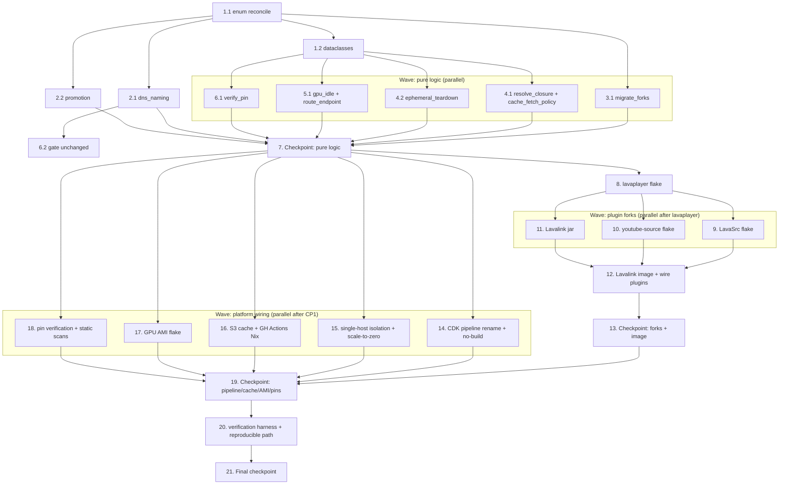

# Implementation Plan: HelloDJ Nix-Native Delivery

## Overview

This plan converts the twelve-requirement `hellodj-nix-native-delivery` design into an incremental,
test-driven implementation. The sequencing respects the design's stated dependency order:

1. **Pure decision logic + data models first** (`hellodj_platform_logic`) — they are independently
   testable, carry 13 correctness properties, and unblock the CDK / stage / promotion / cache / GPU
   wiring.
2. **Per-fork Nix-wrapped Gradle flakes** in dependency order — `lavaplayer` → `LavaSrc` /
   `youtube-source` → Lavalink `#lavalinkJar` → Lavalink `#image`.
3. **Pipeline / cache / AMI / stage-isolation wiring** (`platform/infra`), reconciling with the
   existing `aws-saas-replatform` CDK code so no CodeBuild compute is billed for building.
4. **End-to-end verification path** (nix flake check, nix build, gate, cdk synth, jest, smoke).

The four fork repos are independent workspace roots: `/home/celes/sources/celesrenata/Lavalink`,
`/lavaplayer`, `/LavaSrc`, `/youtube-source`. Fork flakes reference siblings via
`github:hellodj/<repo>/<branch>` inputs (never `path:`), per the NixOS steering. Repo-migration steps
that involve git remote and flake wiring are in scope; nothing outside the repos is done manually.

**Language:** Python (pure logic, gate), Nix (flakes/AMI), TypeScript (CDK), plus GitHub Actions YAML.
This is fixed by the design; no language selection is required.

**Testing stacks:** Hypothesis for the Python pure-logic properties, fast-check for the TypeScript
CDK stage-model assertions. Each of the 13 correctness properties is one property test, minimum 100
iterations, tagged `Feature: hellodj-nix-native-delivery, Property {n}: {property_text}`. Property 3
(`base_image_gate.check_base`) and the existing `promote` / `derive_env_name` property tests are
**reused/extended**, not rewritten from scratch.

**External dependency:** the base-image gate reaching PASS-for-all / zero-SKIP depends on the
companion `nix-image-packaging` work landing the 7 remaining Python-component flakes. Those flakes are
**not** authored here; this plan wires and verifies the gate against them.

## Tasks

- [x] 1. Reconcile stage naming and data models in `hellodj_platform_logic`
  - [x] 1.1 Reconcile the `DeploymentStage` enum to Beta / Staging / Production
    - In `platform/components/hellodj_platform_logic/types.py`, replace the `GAMMA="gamma"` member
      with `STAGING="staging"` and reconcile `PROD="prod"` to `PRODUCTION="production"`, keeping
      `BETA="beta"`; preserve the `order` and `is_production` properties and the enum declaration
      order as the single source of promotion order
    - Leave `StageResult` (`SUCCEEDED`/`FAILED`/`SKIPPED`) unchanged
    - _Requirements: 9.1, 9.6_
  - [x] 1.2 Add the new frozen dataclasses for the build/cache/migration/GPU/pin decisions
    - In `platform/components/hellodj_platform_logic/types.py` (or a sibling module imported by it),
      add frozen dataclasses `FlakeInputPin`, `PinVerification`, `StageEndpoint`, `ClosureRef`,
      `ClosureResolution`, `CacheFetchOutcome`, `EphemeralCompute`, `TeardownResult`, `ForkMigration`,
      and `GpuIdleConfig` exactly as specified in the design Data Models
    - `EphemeralCompute` defaults: `teardown_deadline_seconds=300.0`, `max_lifetime_seconds=10800.0`;
      `GpuIdleConfig.__post_init__` rejects `idle_window_seconds` outside `[60, 900]`
    - _Requirements: 6.6, 6.7, 6.8, 6.9, 7.2, 7.3, 7.4, 7.6, 8.2, 8.5, 11.1_
  - [x] 1.3 Write unit tests for the enum reconciliation and dataclass invariants
    - Assert `DeploymentStage` == {BETA, STAGING, PRODUCTION} with no GAMMA member and order
      Beta→Staging→Production
    - Assert `GpuIdleConfig` raises for windows <60 or >900 and accepts the 300 default
    - _Requirements: 9.1, 8.5_

- [x] 2. Implement the stage-naming pure logic (dns_naming + promotion reconciliation)
  - [x] 2.1 Reconcile `dns_naming.py` to the new stage labels and make "both required" explicit
    - In `platform/components/hellodj_platform_logic/dns_naming.py`, ensure `derive_env_name` returns
      a strict subdomain of `hellodj.bot` that includes both the reconciled stage name and the region
      when both are provided, and raises an error indicating both a stage and a region are required
      when either is missing/empty; ensure zero `gamma` occurrences remain
    - _Requirements: 9.2, 9.3, 9.4, 9.5_
  - [x] 2.2 Reconcile `promotion.py` naming without changing its control logic
    - In `platform/components/hellodj_platform_logic/promotion.py`, keep the fixed-order + halt +
      skip-remaining `promote` logic unchanged; ensure `PROMOTION_ORDER` derives from the reconciled
      enum and contains zero `gamma` references
    - _Requirements: 9.2, 9.6, 10.3, 10.4, 10.5_
  - [x] 2.3 Extend the existing `derive_env_name` property test for Property 11 (subdomain includes both)
    - **Property 11: DNS naming yields a zone subdomain that includes both stage and region**
    - **Validates: Requirements 9.3**
    - Extend the existing Property 1 test in `platform/components/hellodj_platform_logic/tests/` to
      the reconciled stage names; Hypothesis over stage × valid region label, min 100 iterations;
      tag `Feature: hellodj-nix-native-delivery, Property 11: ...`
  - [x] 2.4 Write the property test for Property 12 (dns_naming requires both)
    - **Property 12: DNS naming requires both a stage and a region**
    - **Validates: Requirements 9.4, 9.5**
    - Hypothesis over (stage, missing/invalid region) and (missing/invalid stage, region); assert no
      name returned and an error indicating both are required; min 100 iterations; tag accordingly
  - [x] 2.5 Extend the existing `promote` property test for Property 10 (fixed order, halt on failure)
    - **Property 10: Promotion runs in fixed order and halts on the first failure**
    - **Validates: Requirements 9.6, 10.3, 10.4, 10.5**
    - Extend the existing Property 9 `promote` test to the reconciled stage names; Hypothesis over
      per-stage deploy outcomes; assert Beta always attempted, later stages deploy only after earlier
      SUCCEEDED, and every later stage SKIPPED after first failure; min 100 iterations; tag accordingly

- [x] 3. Implement the fork-migration decision function
  - [x] 3.1 Implement `migrate_forks` in `hellodj_platform_logic`
    - Add `migrate_forks(forks: list[str]) -> list[ForkMigration]` to
      `platform/components/hellodj_platform_logic/migration.py`, processing forks in order, halting at
      the first fork that cannot be created or whose `upstream` remote cannot be established, recording
      an error naming exactly that fork, marking every prior fork migrated-and-unchanged, and
      processing no fork after the failure
    - _Requirements: 1.6_
  - [x] 3.2 Write the property test for Property 1 (migration halts on first failure)
    - **Property 1: Fork migration halts on first failure and leaves prior repos unchanged**
    - **Validates: Requirements 1.6**
    - Hypothesis over generated fork list + failure index; assert stop-at-first-failure, prior forks
      unchanged, no later fork processed; min 100 iterations; tag accordingly

- [x] 4. Implement the binary-cache and ephemeral-compute decision functions
  - [x] 4.1 Implement `resolve_closure` and `cache_fetch_policy`
    - Add `resolve_closure(ref: ClosureRef, cache_contents: set[str]) -> ClosureResolution` and
      `cache_fetch_policy(responded: bool, retries: int) -> CacheFetchOutcome` to a new
      `hellodj_platform_logic` module (e.g. `binary_cache.py`); `resolve_closure` matches by store
      path hash, reuses when present (no rebuild), and halts without substitution when absent;
      `cache_fetch_policy` permits a recorded local rebuild only when the cache did not respond within
      budget or 3 consecutive retries were exhausted
    - _Requirements: 7.2, 7.3, 7.4, 7.6_
  - [x] 4.2 Implement `ephemeral_teardown`
    - Add `ephemeral_teardown(compute: EphemeralCompute, stopped_confirmed: bool, ts: str) ->
      TeardownResult` to a new `hellodj_platform_logic` module (e.g. `ephemeral_build.py`); honor the
      ≤300s teardown deadline and ≤10800s max lifetime, emit an alert exactly when stop is not
      confirmed, and retain resource id + teardown timestamp on confirmation
    - _Requirements: 6.6, 6.7, 6.8, 6.9_
  - [x] 4.3 Write the property test for Property 5 (build-once store-path-hash identity + reuse)
    - **Property 5: Build-once identity — every stage resolves the same store-path-hash and reuses it**
    - **Validates: Requirements 7.2, 7.3**
    - Hypothesis over artifacts + cache contents; assert Beta/Staging/Production resolve identical
      hash H and reuse (no rebuild) when H present; min 100 iterations; tag accordingly
  - [x] 4.4 Write the property test for Property 6 (missing closure halts without substitution)
    - **Property 6: A missing required closure halts the stage without substitution**
    - **Validates: Requirements 7.4**
    - Hypothesis over required closures absent from cache; assert halt, missing store path surfaced,
      no non-cache substitution; min 100 iterations; tag accordingly
  - [x] 4.5 Write the property test for Property 7 (cache unreachability permits recorded rebuild)
    - **Property 7: Cache unreachability permits a recorded local rebuild**
    - **Validates: Requirements 7.6**
    - Hypothesis over (responded, retries); assert rebuild permitted+recorded on timeout/exhausted
      retries and not forced otherwise; min 100 iterations; tag accordingly
  - [x] 4.6 Write the property test for Property 4 (ephemeral teardown bounded time)
    - **Property 4: Ephemeral build compute is always torn down within bounded time**
    - **Validates: Requirements 6.6, 6.7, 6.8, 6.9**
    - Hypothesis over completion outcome × teardown scenario (incl. teardown failure / crashed
      build); assert ≤300s deadline, ≤10800s forced-termination cap, alert iff stop unconfirmed,
      id+timestamp retained on confirmation; min 100 iterations; tag accordingly

- [x] 5. Implement the GPU-idle and endpoint-routing decision functions
  - [x] 5.1 Implement `gpu_idle_decision` and `route_endpoint`
    - Add `gpu_idle_decision(cfg: GpuIdleConfig, idle_elapsed_s: float, active_jobs: int) -> bool` and
      `route_endpoint(hostname: str, endpoints: list[StageEndpoint]) -> StageEndpoint | None` to a new
      `hellodj_platform_logic` module (e.g. `gpu_idle.py` / `endpoint_routing.py`);
      `gpu_idle_decision` returns scale-to-zero iff zero active jobs and elapsed ≥ configured window
      (and never scales to zero with active work); `route_endpoint` returns exactly the stage whose
      hostname matches, else None
    - _Requirements: 8.5, 8.6, 8.7_
  - [x] 5.2 Write the property test for Property 8 (GPU scale-to-zero exactly when idle beyond window)
    - **Property 8: GPU scales to zero exactly when idle beyond the window with no active work**
    - **Validates: Requirements 8.5, 8.6**
    - Hypothesis over config in/out of [60,900], elapsed, active jobs; assert iff-condition, never
      scale-to-zero with active work, and out-of-range config rejected; min 100 iterations; tag
      accordingly
  - [x] 5.3 Write the property test for Property 9 (request routes only to targeted stage)
    - **Property 9: A request routes only to the stage whose endpoint it targets**
    - **Validates: Requirements 8.7**
    - Hypothesis over distinct endpoint sets + hostnames; assert exact-stage match and None for
      no-match; min 100 iterations; tag accordingly

- [x] 6. Implement pin verification and keep the base-image gate intact
  - [x] 6.1 Implement `verify_pin`
    - Add `verify_pin(pin: FlakeInputPin, upstream_identifier: str | None) -> PinVerification` to a
      new `hellodj_platform_logic` module (e.g. `pinning.py`); accept iff pinned identifier equals the
      resolved upstream identifier; on mismatch reject and name the input (prior pin retained); on
      unresolved upstream (`None`) fail for that input and name it (prior pin retained)
    - _Requirements: 11.1, 11.5, 11.6_
  - [x] 6.2 Confirm `base_image_gate.check_base` and its Property 6 test remain unchanged
    - Verify `platform/components/hellodj_platform_logic/base_image_gate.py` `check_base` logic and
      its existing property test are unmodified by this feature (the design mandates keeping them
      as-is); do not rewrite
    - _Requirements: 5.5, 5.6_
  - [x] 6.3 Write the property test for Property 13 (pin verification accept/reject/retain)
    - **Property 13: Pin verification accepts equal identifiers and otherwise retains the prior pin**
    - **Validates: Requirements 11.1, 11.5, 11.6**
    - Hypothesis over pinned vs upstream identifiers (incl. `None`); assert accept-iff-equal,
      reject+name on mismatch, fail+name on unresolved, prior pin retained in both failure paths; min
      100 iterations; tag accordingly
  - [x] 6.4 Reuse the existing Property 3 test for `check_base` (kept unchanged)
    - **Property 3: Base-image gate accepts iff Nix-produced and not a forbidden base**
    - **Validates: Requirements 5.5**
    - Confirm the existing `base_image_gate` property test (design's Property 6) runs green under this
      feature; do not rewrite; tag reference `Feature: hellodj-nix-native-delivery, Property 3: ...`
      if a cross-reference is added

- [x] 7. Checkpoint — pure logic and data models complete
  - Ensure all `hellodj_platform_logic` unit and property tests pass, ask the user if questions arise.

- [x] 8. Author the `lavaplayer` fork flake (root of the fork dependency graph)
  - [x] 8.1 Add `upstream` remote wiring and `flake.nix` to `/home/celes/sources/celesrenata/lavaplayer`
    - Ensure `origin → github:hellodj/lavaplayer` and add remote `upstream →
      lavalink-devs/lavaplayer`; create `flake.nix` with `github:owner/repo/branch` inputs only (no
      `path:`), `nixpkgs` pinned, and a `stdenv.mkDerivation` Gradle build wired to the gradle2nix
      offline Maven repo
    - Set `JAVA_HOME=${temurin-bin-25}`, keep declared `sourceCompatibility/targetCompatibility = 11`,
      disable Gradle toolchain auto-download, run `--offline`
    - _Requirements: 1.2, 1.5, 2.2, 2.5, 3.2, 3.6, 11.1, 11.3_
  - [x] 8.2 Vendor the gradle2nix lock and expose the `lavaplayerJar` output + check
    - Run gradle2nix once to capture the dependency lock, commit `gradle.lock`/`deps.json` and the
      offline Maven repo derivation into the repo; expose `packages.<system>.lavaplayerJar` and
      `checks.<system>.lavaplayerJar` so the jar contains compiled `.class` files and a manifest, and
      `nix flake check` exits 0
    - Fail fast (non-zero, no `result/` jar, named error) on compile/dependency failure
    - _Requirements: 2.2, 2.5, 2.6, 2.7, 2.8, 3.2, 3.8_
  - [x] 8.3 Add the hermetic-build integration check for lavaplayer
    - Build `lavaplayerJar` in the network-disabled Nix sandbox and assert success; assert the output
      jar has compiled classes and no `PLACEHOLDER ARTIFACT` marker
    - _Requirements: 2.5, 2.6_

- [x] 9. Author the `LavaSrc` fork flake
  - [x] 9.1 Add `upstream` remote wiring and `flake.nix` to `/home/celes/sources/celesrenata/LavaSrc`
    - Ensure `origin → github:hellodj/LavaSrc` and add remote `upstream → topi314/LavaSrc`; create
      `flake.nix` with `github:owner/repo/branch` inputs only, `JAVA_HOME=${temurin-bin-25}`, gradle2nix
      offline repo, `--offline`; bump the Kotlin plugin to a JDK-25-supporting release if 1.9.0 rejects
      JDK 25, and record the confirmed declared level
    - _Requirements: 1.2, 1.5, 2.3, 2.5, 3.3, 3.6, 3.8, 11.1, 11.3_
  - [x] 9.2 Vendor the gradle2nix lock and expose the `lavasrcPlugin` output + check
    - Commit the dependency lock and offline Maven repo derivation; expose
      `packages.<system>.lavasrcPlugin` (`lavasrc-plugin-<ver>.jar`, plugin subproject only) and its
      `check`; jar must be real (manifest + `.class`), fail fast on compile/dep error
    - _Requirements: 2.3, 2.5, 2.6, 2.7, 2.8, 3.3, 3.8_
  - [x] 9.3 Add the hermetic-build integration check for LavaSrc
    - Build `lavasrcPlugin` offline in the sandbox; assert success, compiled classes, no placeholder
    - _Requirements: 2.5, 2.6_

- [x] 10. Author the `youtube-source` fork flake
  - [x] 10.1 Add `upstream` remote wiring and `flake.nix` to `/home/celes/sources/celesrenata/youtube-source`
    - Ensure `origin → github:hellodj/youtube-source` and add remote `upstream →
      lavalink-devs/youtube-source`; create `flake.nix` with `github:owner/repo/branch` inputs only,
      `JAVA_HOME=${temurin-bin-25}`, gradle2nix offline repo, `--offline`; verify `1_8` acceptance
      under JDK 25 and raise source/target to a level JDK 25 accepts (11 or 17) if rejected, recording
      the confirmed level
    - _Requirements: 1.2, 1.5, 2.4, 2.5, 3.4, 3.6, 3.8, 11.1, 11.3_
  - [x] 10.2 Vendor the gradle2nix lock and expose the `youtubeSabrPlugin` output + check
    - Commit the dependency lock and offline Maven repo derivation; expose
      `packages.<system>.youtubeSabrPlugin` (`youtube-plugin-sabr.jar`, `-SNAPSHOT` stripped) and its
      `check`; jar must be real (manifest + `.class`), fail fast on compile/dep error
    - _Requirements: 2.4, 2.5, 2.6, 2.7, 2.8, 3.4, 3.8_
  - [x] 10.3 Add the hermetic-build integration check for youtube-source
    - Build `youtubeSabrPlugin` offline in the sandbox; assert success, compiled classes, no placeholder
    - _Requirements: 2.5, 2.6_

- [x] 11. Author the `Lavalink` fork jar build (consumes lavaplayer)
  - [x] 11.1 Add `upstream` remote wiring, `dev` branch, and `flake.nix` to `/home/celes/sources/celesrenata/Lavalink`
    - Ensure `origin → github:hellodj/Lavalink`, add remote `upstream → lavalink-devs/Lavalink`, and
      ensure a `dev` branch designated as the build branch; create `flake.nix` declaring
      `github:hellodj/lavaplayer/main` as a flake input and `nixpkgs`/`temurin` pins via
      `github:owner/repo/branch`
    - _Requirements: 1.2, 1.3, 1.5, 4.1, 11.1, 11.3_
  - [x] 11.2 Implement the Temurin-25 Nix-wrapped Gradle build for the custom `Lavalink.jar`
    - Configure `org.gradle.java.installations.paths` and `JAVA_HOME` to `${temurin-bin-25}`, keep
      Kotlin `jvmToolchain(21)` target, disable toolchain auto-download, run `--offline` against the
      committed gradle2nix offline Maven repo; produce `packages.<system>.lavalinkJar` (custom
      `Lavalink.jar` incl. lavaplayer fMP4 HLS patch + v4 server) consuming the lavaplayer input
    - Record the confirmed declared level; fail fast (non-zero, no jar, named error) on
      toolchain/language/compile failure
    - _Requirements: 2.1, 2.5, 2.6, 3.1, 3.6, 3.8, 11.1_
  - [x] 11.3 Expose the Lavalink jar check
    - Expose `checks.<system>.lavalinkJar` so `nix flake check` for the Lavalink flake exits 0 and the
      jar declares a `Main-Class` and contains `.class` files
    - _Requirements: 2.1, 2.6, 2.7_
  - [x] 11.4 Write the property test for Property 2 (built jars are real, no placeholder marker)
    - **Property 2: Built jars are real and contain no placeholder marker**
    - **Validates: Requirements 2.6, 4.6**
    - Hypothesis over synthetic/real jar structures for the four fork jar outputs; assert manifest
      declares Main-Class/plugin entrypoint, ≥1 `.class` entry, no `PLACEHOLDER ARTIFACT` bytes, not
      zero-byte; min 100 iterations; tag `Feature: hellodj-nix-native-delivery, Property 2: ...`

- [x] 12. Build the Lavalink OCI image and wire in real plugin jars (replace placeholders)
  - [x] 12.1 Implement the `#image` output in the Lavalink fork flake on Temurin 25 JRE
    - In the Lavalink `flake.nix`, declare `github:hellodj/LavaSrc/<branch>` and
      `github:hellodj/youtube-source/<branch>` as flake inputs; build `#image` with
      `pkgs.dockerTools.buildLayeredImage`, base `temurin-jre-bin-25`, include `pkgs.cacert`, set
      `WorkingDir=/opt/Lavalink`, expose 2333, entrypoint `java … -jar /opt/Lavalink/Lavalink.jar`
    - Place `Lavalink.jar` at `/opt/Lavalink/Lavalink.jar`, `lavasrc-plugin-<ver>.jar` and
      `youtube-plugin-sabr.jar` under `/opt/Lavalink/plugins/`; ensure `application.yml` is NOT in the
      image filesystem (read only from runtime-mounted `/opt/Lavalink/application.yml`)
    - Fail fast (no image, named artifact) if any plugin or `Lavalink.jar` cannot be resolved; expose
      `checks.image-builds`
    - _Requirements: 3.5, 4.1, 4.2, 4.3, 4.4, 4.7, 4.8, 5.1_
  - [x] 12.2 Replace `mkPlaceholderJar` derivations in `platform/components/lavalink/flake.nix`
    - In `platform/components/lavalink/flake.nix`, remove the `mkPlaceholderJar` derivations for
      `Lavalink.jar`, `youtube-plugin-sabr.jar`, and `lavasrc-plugin-4.8.3.jar` and make this flake a
      thin consumer of the authoritative Lavalink fork `#image`/jar outputs (sibling Fork_Flakes via
      `github:hellodj/<repo>/<branch>`); change the base from `temurin-jre-bin-21` to
      `temurin-jre-bin-25`; ensure no bundled jar contains any `PLACEHOLDER ARTIFACT` marker
    - _Requirements: 3.5, 4.5, 4.6, 5.1_
  - [x] 12.3 Demote the Alpine `Dockerfile.custom` in the Lavalink fork
    - Delete or demote `Lavalink/Dockerfile.custom` (`FROM eclipse-temurin:21-jre-alpine`) to a
      non-authoritative reference so no `Distro_Base` remains in a base-declaring position; the gate
      reads the authoritative `flake.nix`
    - _Requirements: 5.3, 5.5_
  - [x] 12.4 Add the Lavalink image-layout and fail-fast integration checks
    - Assert `Lavalink.jar` at `/opt/Lavalink/Lavalink.jar`, plugins under `/opt/Lavalink/plugins/`,
      and `application.yml` absent from the image; break a plugin input and assert no image + named
      missing artifact; run the image's JRE and assert Java feature version 25
    - _Requirements: 3.5, 4.3, 4.4, 4.7, 4.8_

- [x] 13. Checkpoint — forks migrated, flakes build, Lavalink image wired
  - Ensure all fork `nix flake check` / `nix build` and jar property tests pass, ask the user if
    questions arise.

- [x] 14. Reconcile the CDK pipeline to no-build (resolve/verify) steps and stage rename
  - [x] 14.1 Rename `PROMOTION_ORDER` and stage props in `pipeline-stack.ts`
    - In `platform/infra/lib/pipeline-stack.ts`, change `PROMOTION_ORDER` from
      `['beta','gamma','prod']` to `['beta','staging','production']` and rename `HelloDjStageProps`
      stage names/types; ensure zero `gamma` occurrences remain across the file and Route 53 records
    - _Requirements: 9.1, 9.2, 9.6, 10.1_
  - [x] 14.2 Convert CodeBuild build steps to resolve/verify-closure steps (no build compute billed)
    - In `platform/infra/lib/pipeline-stack.ts`, change `getBuildCommands`/`getComponentBuildCommands`
      per-component `CodeBuildStep`s from "build image/AMI" to "resolve + verify closure from
      cache/ECR" (metadata-only synth/gate), so no CodeBuild compute is billed for building images or
      the AMI; keep the base-image gate step (`python3 tools/gate_base_image.py`) wired in
      `getBuildCommands` and failing the build on non-PASS; ensure build/synth precedes stage deploys
    - _Requirements: 5.7, 6.3, 6.4, 10.1, 10.2_
  - [x] 14.3 Write/extend jest example tests for the pipeline wiring
    - Assert `PROMOTION_ORDER === ['beta','staging','production']`, gate step present and fails on
      non-PASS, component steps resolve/verify (not compile) closures, and build precedes deploys
    - _Requirements: 5.7, 6.3, 6.4, 9.2, 10.1_

- [x] 15. Wire the single-host, three-endpoint stage isolation in CDK
  - [x] 15.1 Wire per-stage namespaces + Ingress hostnames in workloads/eks/component stacks
    - In `platform/infra/lib/workloads-stack.ts`, `component-workloads.ts`, and `eks-stack.ts`, isolate
      each stage by a distinct `StageEndpoint` (namespace `hellodj-<stage>`, port, hostname
      `<stage>.<region>.hellodj.bot`) on the single shared cluster; ensure no separate GPU instance
      per stage and a single shared GPU AMI/time-sliced Karpenter GPU NodePool across all three
    - Wire hostname→namespace routing so a request to one Stage_Endpoint reaches only that stage's
      workload
    - _Requirements: 8.1, 8.2, 8.3, 8.4, 8.7_
  - [x] 15.2 Wire GPU scale-to-zero with the configurable idle window
    - In `platform/infra/lib/eks-stack.ts`, configure the transcode GPU NodePool for scale-to-zero
      after the idle window (default 300s, configurable 60–900s) and scale-up on GPU-requiring
      workload arrival, consistent with `gpu_idle_decision`
    - _Requirements: 8.5, 8.6_
  - [x] 15.3 Write/extend jest example tests for endpoint distinctness and single shared GPU
    - Assert the three `StageEndpoint`s have distinct namespace + hostname, one shared GPU AMI/pool,
      and no per-stage GPU instance
    - _Requirements: 8.1, 8.2, 8.3, 8.4_
  - [x] 15.4 Add a fast-check property assertion for the CDK stage model (Property 9 / Property 10 mirror)
    - Use fast-check to assert the TypeScript stage-model routing/promotion mirrors `route_endpoint`
      and `promote` (distinct-endpoint routing, fixed-order promotion); min 100 iterations; tag
      `Feature: hellodj-nix-native-delivery, Property 9/10 (CDK mirror): ...`
    - _Requirements: 8.7, 10.3, 10.4, 10.5_

- [x] 16. Wire the S3-backed Nix binary cache and the GitHub Actions Nix build trigger
  - [x] 16.1 Add the GitHub Actions with Nix build workflow (selected Build_Trigger)
    - Create the GitHub Actions workflow that runs `nix build .#jar`/`.#image` for the forks and
      components, runs `python3 tools/gate_base_image.py` as a hard gate, pushes closures to the
      S3-backed cache and OCI images to ECR, and builds the GPU AMI; no persistent paid build server;
      ephemeral runners only
    - _Requirements: 5.7, 6.1, 6.2, 6.5_
  - [x] 16.2 Configure the S3-backed Nix binary cache (push + verify retrievable)
    - Add the S3 cache config (signing key, `nix copy --to s3://…`, `narinfo` read-back) so a built
      closure is pushed and confirmed retrievable before the artifact is marked available for stage
      deploy; wire deploy to pull by store-path hash and reuse identical closures across all three
      stages
    - _Requirements: 7.1, 7.2, 7.3, 7.7_
  - [x] 16.3 Wire the ephemeral-builder fallback safety and explicit-rebuild path
    - Wire the fallback ephemeral builder (for large aarch64 builds) to `ephemeral_teardown` semantics
      (≤300s teardown, ≤10800s forced cap, alert on unconfirmed stop, record id+timestamp) and the
      cache-unreachable local-rebuild path from `cache_fetch_policy`; permit explicit rebuild + re-push
    - _Requirements: 6.6, 6.7, 6.8, 6.9, 7.5, 7.6_

- [x] 17. Wire the GPU AMI flake to Temurin-25-era Nix and scale-to-zero context
  - [x] 17.1 Confirm the GPU AMI builds via nixos-generators amazon-image
    - In `platform/infra/ami/gpu-node.nix` and `platform/infra/ami/flake.nix`, ensure the GPU AMI is
      produced via `nixos-generators` `amazon-image` with `github:owner/repo/branch` inputs only (no
      `path:`), one shared image across all stages, and the idle-window/scale-to-zero context aligned
      with §8
    - _Requirements: 5.2, 8.4, 8.5, 11.1, 11.3_
  - [x] 17.2 Add the GPU AMI build integration check
    - Run `nixos-generate -f amazon` (or the `infra/ami` flake build) and assert exit 0 with a
      produced AMI artifact
    - _Requirements: 5.2, 12.4_

- [x] 18. Pin verification wiring and static-scan compliance gates
  - [x] 18.1 Wire pin-time verification across all flake inputs
    - Wire `verify_pin` into the pinning workflow so each input (Lavalink, lavaplayer, LavaSrc,
      youtube-source, Temurin/JDK == 25 LTS, nixpkgs, nixos-generators, Karpenter, EKS k8s version)
      pins via `github:owner/repo/branch`, rejects a mismatched pin (naming the input, retaining prior
      revision), and fails on unresolved upstream (naming the input, retaining prior revision)
    - _Requirements: 11.1, 11.2, 11.3, 11.4, 11.5, 11.6_
  - [x] 18.2 Add static-scan unit/example tests for compliance
    - Assert zero `gamma` across `dns_naming.py`, `promotion.py`, `pipeline-stack.ts`, Route 53
      records (9.2); no `mkPlaceholderJar` for Lavalink/plugin jars (4.5); no authoritative
      `FROM eclipse-temurin:21-jre-alpine` (5.3); every input uses `github:owner/repo/branch` with
      zero `path:` inputs (11.3); Temurin pin feature version == 25 (3.7, 11.2); each component flake
      uses `buildLayeredImage` (5.1, 4.2); Lavalink flake declares the three sibling forks as
      `github:hellodj/<repo>/<branch>` (1.5, 4.1)
    - _Requirements: 1.5, 3.7, 4.1, 4.2, 4.5, 5.1, 5.3, 9.2, 11.2, 11.3_

- [x] 19. Checkpoint — pipeline, cache, AMI, isolation, pins wired
  - Ensure jest passes and all wiring unit/property tests are green, ask the user if questions arise.

- [x] 20. End-to-end verification harness and reproducible command path
  - [x] 20.1 Author the reproducible, copy-runnable verification command set
    - Add documentation enumerating the reproducible path: push to `hellodj` account → Nix build with
      no paid build server → publish to the S3 cache + ECR → promote Beta → Staging → Production on the
      single GPU host; include `nix flake check`, `nix build .#jar/.#image`, `python3
      tools/gate_base_image.py`, `nixos-generate -f amazon`, `npx cdk synth`, `jest`
    - _Requirements: 12.8_
  - [x] 20.2 Implement the verification-harness failure aggregation
    - Implement a harness that runs the R12.1–6 commands and, if any exits non-zero or reports a
      failure, treats verification as failed and identifies the failing command and artifact
    - _Requirements: 12.7_
  - [x] 20.3 Add integration verification: flake check + build + hermetic + Temurin-25 across all flakes
    - `nix flake check` exits 0 for every Fork_Flake and Component_Flake (12.1, 2.7); `nix build
      .#<jar>`/`.#image` produces real jars/OCI images with no placeholder (12.2, 2.1–2.4, 4.3, 4.4);
      hermetic offline build succeeds (2.5); Lavalink image JRE reports Java feature version 25 (3.5)
    - _Requirements: 2.1, 2.2, 2.3, 2.4, 2.5, 2.7, 3.5, 4.3, 4.4, 12.1, 12.2_
  - [x] 20.4 Add integration verification: cache push+verify, cdk synth, jest, and 12.7 aggregation
    - Push a closure and confirm read-back before marking available (7.7) and closure→cache /
      image→ECR on a build (6.2); `npx cdk synth` synthesizes with reconciled stage names +
      single-host endpoints (12.5); jest passes green (12.6); induce one failing command and assert it
      is reported with command/artifact named (12.7)
    - _Requirements: 6.2, 7.7, 12.5, 12.6, 12.7_
  - [x] 20.5 Add the smoke tests for the acceptance signals
    - Four repos exist under the `hellodj` account, each with a resolving `upstream` remote and (for
      Lavalink) a `dev` branch (1.1, 1.2, 1.3); `python3 tools/gate_base_image.py` reports PASS for
      every component, SKIP for zero, zero distro-base references (5.6, 12.3) — depends on the
      companion `nix-image-packaging` flakes landing; the design records exactly one Build_Trigger
      with cost justification (6.1, 6.5) and the three-backend cache cost evaluation (7.1)
    - _Requirements: 1.1, 1.2, 1.3, 5.6, 6.1, 6.5, 7.1, 12.3_

- [x] 21. Final checkpoint — full verification path green
  - Ensure `nix flake check`, `nix build`, `gate_base_image.py` (PASS-all/zero-SKIP once
    `nix-image-packaging` lands), `nixos-generate -f amazon`, `npx cdk synth`, and `jest` all pass;
    ask the user if questions arise.

## Notes

- Tasks marked with `*` are optional and can be skipped for a faster MVP; they are the unit, property,
  integration, and smoke tests.
- Each task references specific granular requirement clauses for traceability.
- All 13 correctness properties are covered by exactly one property test each (Properties 1, 2, 4–13
  in tasks 3.2, 11.4, 4.3–4.6, 5.2, 5.3, 6.3, 2.3, 2.4, 2.5; Property 3 reused in 6.4). Property 3
  (`base_image_gate.check_base`) and the existing `promote`/`derive_env_name` property tests are
  reused/extended, not rewritten.
- Property tests use Hypothesis (Python) and fast-check (TypeScript), minimum 100 iterations, each
  tagged `Feature: hellodj-nix-native-delivery, Property {n}: {property_text}`.
- Fork dependency order is respected: `lavaplayer` (task 8) → `LavaSrc`/`youtube-source` (tasks 9–10)
  → Lavalink jar (task 11) → Lavalink image (task 12). Fork flakes reference siblings via
  `github:hellodj/<repo>/<branch>` inputs only (no `path:`), per the NixOS steering.
- The base-image gate reaching PASS-for-all / zero-SKIP depends on the companion `nix-image-packaging`
  work landing the 7 remaining Python-component flakes (task 20.5). This plan does not author those
  flakes; it wires and verifies the gate against them.
- Checkpoints (tasks 7, 13, 19, 21) ensure incremental validation at the natural phase boundaries.

## Task Dependency Graph

The graph below shows parallelizable vs sequential work. Pure-logic + data-model tasks come first and
unblock the CDK/cache/AMI wiring; fork flakes proceed in dependency order; verification comes last.



```json
{
  "waves": [
    { "id": 0, "tasks": ["1.1"] },
    { "id": 1, "tasks": ["1.2", "2.1", "2.2", "3.1"] },
    { "id": 2, "tasks": ["1.3", "2.3", "2.4", "2.5", "3.2", "4.1", "4.2", "5.1", "6.1", "6.2"] },
    { "id": 3, "tasks": ["4.3", "4.4", "4.5", "4.6", "5.2", "5.3", "6.3", "6.4"] },
    { "id": 4, "tasks": ["8.1"] },
    { "id": 5, "tasks": ["8.2", "8.3"] },
    { "id": 6, "tasks": ["9.1", "10.1", "11.1"] },
    { "id": 7, "tasks": ["9.2", "9.3", "10.2", "10.3", "11.2"] },
    { "id": 8, "tasks": ["11.3", "11.4"] },
    { "id": 9, "tasks": ["12.1"] },
    { "id": 10, "tasks": ["12.2", "12.3"] },
    { "id": 11, "tasks": ["12.4", "14.1", "15.1", "16.1", "17.1", "18.1"] },
    { "id": 12, "tasks": ["14.2", "15.2", "16.2", "17.2", "18.2"] },
    { "id": 13, "tasks": ["14.3", "15.3", "15.4", "16.3"] },
    { "id": 14, "tasks": ["20.1", "20.2"] },
    { "id": 15, "tasks": ["20.3", "20.4", "20.5"] }
  ]
}
```
