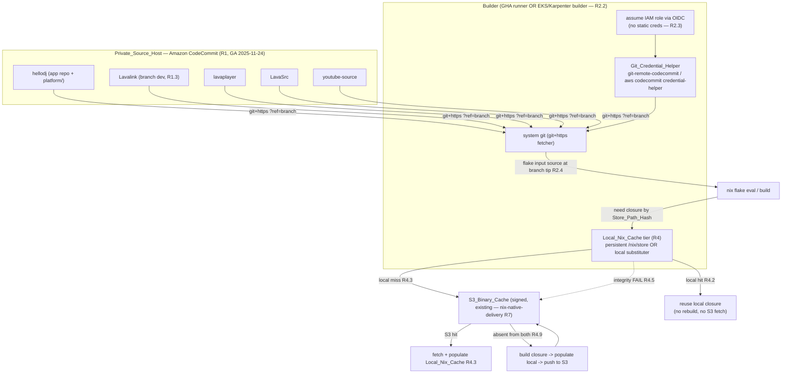
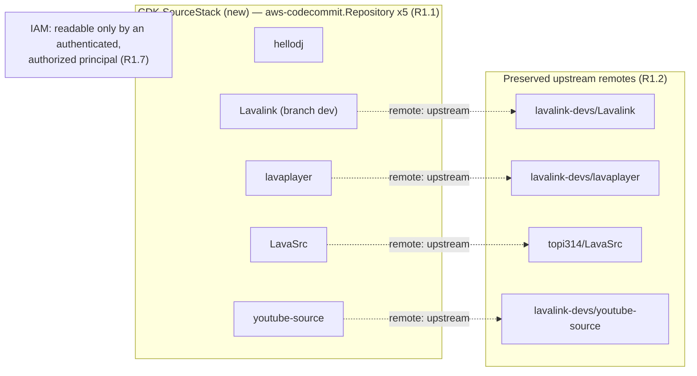
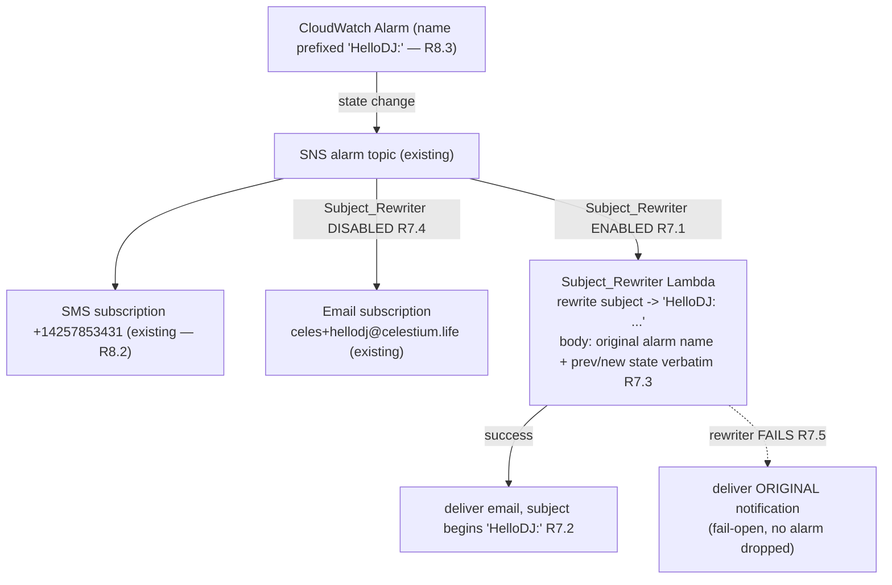

# Design Document

## Overview

This design turns the eight EARS requirements of `hellodj-private-source-and-toolchain` into a
concrete, buildable plan layered on top of two fully-implemented sibling specs under `platform/`
(`aws-saas-replatform` and `hellodj-nix-native-delivery`). It does **not** re-specify those specs; it
amends the small, precisely-scoped surface they leave open and reconciles every change with the code
that already exists.

The feature has four intertwined goals, all traced to requirements:

1. **Relocate the source of truth** off public GitHub into **Amazon CodeCommit** — five private,
   AWS-native repositories (the HelloDJ app plus the four JVM forks `Lavalink`, `lavaplayer`,
   `LavaSrc`, `youtube-source`), each with its `upstream` remote and full history preserved, migrated
   transactionally (halt-on-first-failure), and consumed as Nix `git+https://` flake inputs
   authenticated by the builders' IAM roles via OIDC with **no static credentials**
   (Requirements 1, 2).
2. **Amend the pin gate** so `pins.toml` / `gate_pins.py` / `verify_pin` accept the new CodeCommit
   input form, still reject `path:` inputs, still verify pinned revision == upstream at pin time, and
   still retain the prior pinned revision on rejection/failure — reusing the existing Property 13
   pinning logic (Requirement 3).
3. **Cache builds locally in front of S3.** Add a `Local_Nix_Cache` tier on every builder (GHA runner
   + EKS/Karpenter builder) so unchanged closures are neither rebuilt nor refetched from the existing
   S3 binary cache; local hit → S3 hit → build+push, with an integrity-fallthrough to S3. This is a
   tier **in front of** the S3 cache, not a replacement (Requirement 4).
4. **Bump the toolchain.** Migrate every Python component still on **Python 3.11 → Python 3.14**
   (Nix-built, **no deadsnakes** at any state including intermediate), verify dependency availability
   and test-suite pass under 3.14 before marking a component migrated, and provide a stale-pin
   detection/bump mechanism through the existing `pins.toml` + `nix flake update` + `gate_pins.py`
   workflow (Temurin held at 25) (Requirements 5, 6).

Two smaller, self-contained pieces round it out:

5. An **optional SNS→Lambda `Subject_Rewriter`** in the observability stack so alarm emails literally
   begin with `HelloDJ:`, fail-open (deliver the original on rewriter failure), with a toggle to
   enable/disable — reconciled with the already-shipped SNS email/SMS subscriptions and
   `HelloDJ:`-prefixed alarm names (Requirement 7).
6. **Regression-guard context** for four items completed earlier this session (daily Glue crawler,
   SNS subscriptions, alarm-name prefix, per-stage debug logging) — already implemented, guarded so
   later work does not undo them (Requirement 8).

This is a **delivery-and-build and observability** spec. It changes where source lives, how builds
cache, which language/dependency versions components target, and how alarm emails are formatted. It
does **not** change the runtime behaviour of the bot, Activity, or voice features.

### Reconciliation with the sibling specs (what changes, what is preserved)

The central reconciliation is with `hellodj-nix-native-delivery` **R11.3**, which mandated
`github:owner/repo/branch` inputs *only* and had the pin gate reject non-github inputs. This spec's
R1/R2 **supersede** that: flake inputs for the five migrated repos move to the CodeCommit
`git+https://` form. Everything else about the pin gate is preserved:

| Preserved from nix-native-delivery | How this spec keeps it |
|---|---|
| The pin gate rejects `path:` inputs (NixOS steering) | Still rejected — the `path:` guard is retained and extended to CodeCommit fields (R3.3) |
| Pinned revision == upstream at pin time; prior-revision retention | Unchanged — reuses `verify_pin` (Property 13) verbatim (R3.5–R3.7) |
| Every enumerated input still verified (4 forks, Temurin 25, nixpkgs, nixos-generators, Karpenter, EKS) | Unchanged — `REQUIRED_INPUTS` still enforced (R3.8) |
| S3 binary cache (R7), build-once/deploy-thrice by store-path hash | Unchanged — the local tier sits *in front* of it (R4.6) |
| GHA Nix workflow as the `Build_Trigger` | Unchanged — the local cache tier and CodeCommit credential helper are wired into it (R2.2, R4) |
| Temurin pinned to feature version 25 | Unchanged — the dependency-bump mechanism holds Temurin at 25 (R6.6) |
| CDK observability stack: SNS email/SMS subs, `HelloDJ:` alarm-name prefix | Preserved; the `Subject_Rewriter` is *inserted between* the topic and email delivery, optional and fail-open (R7, R8.2, R8.3) |

The steering's core rule — **never `path:` inputs; the whole point of this move is `github:` →
`git+https://`** — is honoured throughout: the migration replaces `github:` inputs with CodeCommit
`git+https://` inputs, and `path:` inputs remain forbidden and rejected.

### Requirements coverage map

| Requirement | Where addressed |
|---|---|
| 1 — Relocate source into CodeCommit (5 repos, upstream preserved, transactional migration, private) | Architecture (repo topology + migration dataflow); Components §1 (CodeCommit repos as CDK resource, `migrate_repos` procedure); Data Models (`CodeCommitRepo`, reuse `ForkMigration`) |
| 2 — Consume CodeCommit as Nix flake inputs over IAM auth | Architecture (fetch dataflow); Components §2 (`git+https` inputs, credential helper on builders, first-fetch/auth/missing errors); Data Models (`CodeCommitInput`) |
| 3 — Amend pin gate to accept CodeCommit, reject path, verify upstream | Components §3 (`pins.toml` schema extension, `gate_pins.py` + `resolve_codecommit_input` changes, reuse `verify_pin`); Correctness Properties (P1 pin, P2 input-form classification); Data Models |
| 4 — Local Nix cache tier in front of S3 | Architecture (tiered lookup); Components §4 (GHA + EKS builder cache tiers, `tiered_cache_lookup` pure fn); Correctness Properties (P3 tiered lookup, P4 integrity fallthrough); Data Models (`CacheTierResolution`) |
| 5 — Python 3.11 → 3.14, no deadsnakes | Components §5 (enumerated component list, per-component 3.14 flake, dependency+test verification, no-deadsnakes invariant, startup version report); Correctness Properties (P5 migration-readiness); Data Models (`PythonComponentMigration`) |
| 6 — Bump stale pins through the pin workflow | Components §6 (`stale_pins` report mechanism, `nix flake update` bump, transactional update, Temurin held at 25); Correctness Properties (P6 stale-pin report); reuse P1 |
| 7 — Optional `HelloDJ:` subject rewriter, fail-open, toggle | Architecture (SNS→Lambda insertion); Components §7 (`SubjectRewriterLambda`, toggle, fail-open); Correctness Properties (P7 subject-prefix + body-preservation over the pure rewrite fn); Data Models (`AlarmNotification`) |
| 8 — Regression-guard context | Components §8 (guarded assertions: daily crawler, SNS subs, alarm prefix, per-stage debug, CDK green) |

## Architecture

### Source-relocation and build-fetch dataflow (CodeCommit → Nix `git+https` over IAM → local cache tier → S3 → build)

The source of truth moves from public GitHub into private CodeCommit. Every builder authenticates to
CodeCommit through the AWS git credential helper backed by its **OIDC-assumed IAM role** — there is
no static credential anywhere. Flake inputs become
`git+https://git-codecommit.<region>.amazonaws.com/v1/repos/<repo>?ref=<branch>`, which the generic
`git+https` fetcher resolves by shelling out to the system `git`.



Key architectural invariants:

- **IAM-only auth, no static credentials (R2.2/R2.3).** The credential helper resolves CodeCommit
  auth from the builder's assumed role. No long-lived secret is read, stored, or transmitted.
- **`git+https` replaces `github:` for the five migrated repos (R2.1).** No
  `github:hellodj/<repo>/<branch>` input referencing a migrated repo survives (R1.6).
- **Local cache is a tier in front of S3, never a replacement (R4.6).** S3 remains the shared
  build-once/deploy-thrice source for Beta/Staging/Production; the local tier only shortcuts a
  builder's own repeated lookups.
- **Store-path-hash identity is still the reuse key (R4.4).** Unchanged inputs resolve to the same
  `Store_Path_Hash` and reuse the cached closure at whichever tier holds it.
- **Integrity fallthrough (R4.5).** A local closure that fails Nix store-path integrity verification
  is treated as absent and resolved from S3 (or rebuilt), never trusted.

### CodeCommit repository topology (CDK-provisioned)

The five repositories are provisioned as a CDK resource (`aws-cdk-lib/aws-codecommit`) so their
existence, names, and access policy are declarative infrastructure, consistent with the
`aws-saas-replatform` "everything in CDK, no console clicks" goal.



The `upstream` remote is a property of each cloned working copy (where `nix flake update` /
`git fetch upstream` run), not of the CodeCommit-hosted repository itself; CDK provisions the private
repositories and their access policy, and the migration procedure (Components §1) establishes the
`upstream` remote and pushes the preserved history.

### Alarm-notification path with the optional Subject_Rewriter

The `Subject_Rewriter` is an optional AWS Lambda inserted **between** the existing alarm SNS topic and
the email delivery. The already-shipped SMS subscription and `HelloDJ:` alarm-name prefix are
preserved; when the rewriter is disabled the path is exactly today's SNS→email.



When enabled, the topic no longer subscribes the email endpoint directly; instead the Lambda is the
email-side subscriber and it re-publishes/sends the rewritten message. The design keeps the SMS path
untouched and toggles only the email routing, so enabling/disabling the rewriter never affects SMS
delivery or alarm naming.

## Components and Interfaces

### 1. CodeCommit repositories + transactional migration (R1)

**CodeCommit as a CDK-provisioned resource (R1.1/R1.7).** A new `SourceStack` (under
`platform/infra/lib/`) declares five `aws-cdk-lib/aws-codecommit` `Repository` constructs — one per
Source_Repo — with a resource policy that grants access only to the platform's build IAM roles
(GHA-runner role, EKS/Karpenter builder role). A repository with no allowing principal is not
readable, satisfying "private, not readable without an authenticated, authorized IAM principal"
(R1.7). Repository names: `hellodj`, `Lavalink`, `lavaplayer`, `LavaSrc`, `youtube-source`.

| Source_Repo | Upstream (`upstream` remote, R1.2) | Build branch |
|---|---|---|
| `hellodj` | (none — the app repo) | `main` |
| `Lavalink` | `https://github.com/lavalink-devs/Lavalink` | `dev` (R1.3) |
| `lavaplayer` | `https://github.com/lavalink-devs/lavaplayer` | `main` |
| `LavaSrc` | `https://github.com/topi314/LavaSrc` | `tidal-v2-api` |
| `youtube-source` | `https://github.com/lavalink-devs/youtube-source` | `main` |

**Migration procedure — transactional, halt-on-first-failure (R1.4/R1.5).** The migration mirrors the
existing `migrate_forks` shape from `hellodj-nix-native-delivery` (`hellodj_platform_logic.migration.
migrate_forks`) and reuses it directly, extended to five repos and to the history-preservation
assertion. For each repo, in a fixed order:

1. Create the CodeCommit repo (idempotent against the CDK-provisioned repo).
2. Add a git remote `origin → codecommit` and, for the four forks, `upstream → <public upstream>`
   (R1.2); verify `git fetch upstream` succeeds.
3. `git push --mirror` the full history so the tip commit SHA of each branch, the complete set of
   ancestor SHAs reachable from each tip, and the set of branch and tag names all equal the
   pre-migration source (R1.4). Post-push verification compares tip SHAs and the branch/tag name set.
4. If any repo cannot be created, or its `upstream` remote cannot be established, or its
   history-preservation check fails, the migration **halts at that repo**, reports an error naming
   the affected Source_Repo, leaves already-migrated repos unchanged, and leaves the affected repo in
   a non-partial state (the mirror push is all-or-nothing per repo; a failed push is discarded so no
   partially-migrated ref set is left on CodeCommit) (R1.5).

This is modeled by the pure `migrate_repos` decision function (an extension of `migrate_forks`; Data
Models) so the "process in order, halt on first failure, leave prior state untouched" logic is
property-tested independently of git side effects. The side-effecting create/push/verify is injected
via a callback, exactly as `migrate_forks` injects `attempt`.

**Lazy metadata-first fetch is acceptable (per clarification).** Nix's `git+https` fetcher may perform
a lazy, metadata-first resolution (fetch the ref's tip metadata before the full tree); the design does
not require an eager full clone at evaluation time.

**Source ownership after migration (R1.6).** Once all five repos are migrated, every build input for
those repos is sourced only from CodeCommit, and no `github:hellodj/<repo>/<branch>` input referencing
a migrated repo remains (verified by a static scan in the Testing Strategy).

### 2. CodeCommit repositories as Nix flake inputs over IAM auth (R2)

**Input form (R2.1).** Each of the five repos is referenced as a `CodeCommit_Input`:

```
git+https://git-codecommit.<region>.amazonaws.com/v1/repos/<repo>?ref=<branch>
```

replacing the prior `github:hellodj/<repo>/<branch>` inputs. In the Lavalink fork flake, the three
sibling forks likewise become `git+https` CodeCommit inputs (superseding nix-native-delivery R4.1's
`github:` form for those inputs).

**Git credential helper on every builder (R2.2).** Each builder configures the AWS git credential
helper so `git` authenticates to CodeCommit using the builder's IAM role. Two equivalent mechanisms
(the design supports either, chosen per builder):

- `git-remote-codecommit` (the `codecommit::<region>://<repo>` helper), or
- `git config --global credential.helper '!aws codecommit credential-helper $@'` +
  `credential.UseHttpPath true`.

On the **GHA runner** the helper is configured after the existing OIDC
`aws-actions/configure-aws-credentials@v4` step (which already assumes `AWS_BUILD_ROLE_ARN`); the
same role is used for the CodeCommit read, ECR push, and S3 cache. On the **EKS/Karpenter builder**
the helper is configured in the node/pod image and the pod uses an IRSA/pod-identity role. In both
cases the credential is derived at fetch time from the assumed role — no static long-lived credential
is read or transmitted (R2.3).

**First-fetch resolution (R2.4).** When a builder resolves a `CodeCommit_Input` for the first time, it
fetches the source at the commit that is the tip of the input's `ref` branch on CodeCommit at
resolution time (the exact revision is then captured in `flake.lock`).

**Interfaces — errors (R2.5/R2.6):**

- **Auth failure (R2.5):** if the builder cannot authenticate to CodeCommit when fetching a
  `CodeCommit_Input`, the build fails with an error identifying the input and indicating the failure
  was an authentication failure, and does not proceed on partial/stale source for that input.
- **Missing repo/branch (R2.6):** if a `CodeCommit_Input` references a repo or `ref` branch that does
  not exist, the build fails with an error identifying the input and **distinguishing** the
  missing-repository/branch case from an authentication failure.

These two error classes are distinguished by the git/credential-helper exit signature (HTTP 403 /
credential-helper denial → auth failure; HTTP 404 / "repository does not exist" / unknown ref →
missing). This is IO-layer error handling wired in the build tooling, not pure logic, so it is covered
by integration tests (1–3 examples) rather than a property.

### 3. Amend the pin gate to accept CodeCommit inputs (R3)

The pin gate (`platform/tools/gate_pins.py` + `hellodj_platform_logic.pinning.verify_pin`) is amended
to represent and accept `CodeCommit_Input` entries while preserving every existing guarantee. The
pure `verify_pin` (Property 13) is **kept unchanged** — it already reasons over `pinned_identifier`
vs a resolved upstream identifier and is agnostic to the input form. What changes is the manifest
schema and the `gate_pins.py` loader/classifier.

**`pins.toml` schema extension (R3.1).** A pin entry may declare a CodeCommit input by adding an
input-type discriminator and CodeCommit fields:

```toml
[inputs.lavalink]
type = "codecommit"                 # NEW discriminator; absent/"github" = legacy github form
region = "us-east-1"                # NEW — required for codecommit
repo = "Lavalink"                   # reused field, now the CodeCommit repo name
branch = "dev"
pinned_identifier = "fmp4-hls"
# resolves to:
#   git+https://git-codecommit.us-east-1.amazonaws.com/v1/repos/Lavalink?ref=dev
```

The gate resolves a CodeCommit entry to
`git+https://git-codecommit.<region>.amazonaws.com/v1/repos/<repo>?ref=<branch>` via a new
`resolve_codecommit_input(region, repo, branch)` helper (pure; Data Models).

**Classification and acceptance (R3.2).** When the gate reads an entry whose `type = "codecommit"` and
whose `region`, `repo`, and `branch` are all present and non-empty, it accepts the entry as a valid
input form (it is **not** rejected as a non-github input — the old "reject non-github" behaviour from
nix-native-delivery R11.3 is removed for CodeCommit entries specifically).

**Still reject `path:` (R3.3).** The existing `path:` guard is retained and extended: if any field of
any entry declares a `path:` input or a `path:`-style reference (contains `:` in a bare field, starts
with `path`, or `type = "path"`), the gate rejects that entry, fails the run with a non-success
result, and emits a message identifying the offending entry by its `pins.toml` key.

**Missing-field validation for CodeCommit entries (R3.4).** If a `type = "codecommit"` entry is
missing its `region`, `repo`, or `branch`, the gate rejects that entry, fails the run, and emits a
message identifying the entry by its key **and the missing field**. (Legacy github entries keep their
existing owner/repo/branch validation.)

**Upstream verification unchanged (R3.5/R3.6/R3.7).** For a CodeCommit input, the gate resolves the
upstream commit revision (from `pins.upstream.toml`, exactly as today) and runs the pin through
`verify_pin`:

- accept iff pinned commit revision == resolved upstream revision at pin time (R3.5);
- on mismatch: reject the pin, fail the run, name the input by its key, leave the prior pinned
  revision unchanged (R3.6);
- on unresolved upstream: fail the pin for that input, fail the run, name the input, leave the prior
  pinned revision unchanged (R3.7).

Because `verify_pin` is form-agnostic and already property-tested (Property 13), this reuse is exact —
the correctness property for R3.5–R3.7 **is** the existing Property 13 (see Correctness Properties
P1). The only new pure logic is the *input-form classification* (github vs codecommit vs
path/invalid), which gets its own property (P2).

**All enumerated inputs still verified (R3.8).** The gate continues to verify every input the manifest
enumerates: the four JVM forks (now CodeCommit inputs), Temurin (pinned to feature version 25 —
`feature_version == 25` still asserted), nixpkgs, nixos-generators, Karpenter, and the EKS Kubernetes
version. `REQUIRED_INPUTS` is unchanged.

### 4. Local Nix build cache tier in front of the S3 binary cache (R4)

The `Local_Nix_Cache` is a per-builder tier that shortcuts repeated closure lookups **before** the
existing signed S3 cache is contacted. Its concrete form differs by builder class (R4.1), but the
lookup order is identical and modeled by one pure function.

**GHA runner tier (R4.1/R4.7/R4.8).** GitHub-hosted runners are ephemeral, so a persistent
`/nix/store` across jobs is achieved with either:

- **actions/cache** keyed by a hash of `flake.lock` + the target system, restoring `/nix/store` (and
  the Nix DB) at job start and saving it at job end — a persistent-across-jobs local store (satisfies
  R4.7: a subsequent job reuses a locally-present closure without an S3 fetch); and/or
- a **local substituter** fronting the S3 cache (`--substituters "file:///nix-local-cache
  s3://…"` ordering) so even when the store is not retained, a closure present in the local tier is
  reused without fetching from S3 (R4.8).

A self-hosted persistent-store runner is a supported alternative that gives R4.7 directly.

**EKS/Karpenter builder tier (R4.1).** The builder node/pod uses a **node-local persistent
`/nix` store** (a persistent volume or a node-local path retained across builder pods on the same
node) and/or a **local pull-through substituter** in front of S3. A node that retains its store
across jobs satisfies R4.7; a node that does not is backed by the local substituter for R4.8.

**Tiered lookup decision (R4.2/R4.3/R4.9), modeled as a pure function.** For each required closure the
builder decides, purely from (a) whether the `Store_Path_Hash` is present in the local tier, (b)
whether local integrity verification passes, and (c) whether the hash is present in S3:

| Local present? | Local integrity OK? | S3 present? | Decision |
|---|---|---|---|
| yes | yes | — | **LOCAL_HIT** — reuse local, no rebuild, no S3 fetch (R4.2) |
| yes | **no** | yes | **S3_HIT** — treat local as absent, fetch from S3, repopulate local (R4.5) |
| yes | **no** | no | **BUILD** — treat local as absent, rebuild, populate local, push S3 (R4.5 + R4.9) |
| no | — | yes | **S3_HIT** — fetch from S3, populate local (R4.3) |
| no | — | no | **BUILD** — build, populate local, push S3 (R4.9) |

This is the pure `tiered_cache_lookup(local_present, local_integrity_ok, s3_present) → CacheTier`
function (Data Models), which gives two properties: the tier-ordering property (P3) and the
integrity-fallthrough property (P4). It is the local analogue of the existing `resolve_closure`
(which decides S3-present → reuse vs S3-absent → halt); `tiered_cache_lookup` composes the local tier
in front, and on `S3_HIT`/`BUILD` the existing S3 path (and its `resolve_closure` / `record_closure`
publish contract in the GHA workflow) is unchanged.

**Tier, not replacement (R4.6).** The S3 cache remains the shared build-once source for
Beta/Staging/Production. The local tier only affects an individual builder's fetch/rebuild decision;
it never becomes the cross-stage source and never suppresses the S3 push on a BUILD (R4.9 keeps the
existing "push to S3 consistent with the binary-cache publish path").

**Reuse by store-path hash (R4.4).** Unchanged derivation inputs resolve to the same `Store_Path_Hash`
as a prior build, so the LOCAL_HIT / S3_HIT branches reuse the cached closure without rebuilding —
identical to the existing store-path-hash identity mechanism, now checked at the local tier first.

### 5. Migrate Python components to Python 3.14 without deadsnakes (R5)

**Enumerated Python 3.11 components (R5.1).** From `NIX-CONVERSION-CONTEXT.md` and the
`aws-saas-replatform` component table, the Python components currently targeting Python 3.11 are:

| Python_Component | Current runtime | Notable runtime deps to verify on 3.14 |
|---|---|---|
| `discord-bot-core` | Python 3.11 (discord.py/wavelink) | discord.py, wavelink |
| `playback-orchestrator` | Python 3.11 | (stdlib + boto3) |
| `config-renderer` | Python 3.11 (init/Job) | cryptography (legacy render path) |
| `activity-backend` | Python 3.11 (aiohttp) | aiohttp |
| `voice-pipeline` | Python 3.11 (onnxruntime + boto3) | onnxruntime, numpy, (torch where present), boto3 |
| `web-ui` | Python 3.11 (Flask/gunicorn) | flask, gunicorn |
| `migration` | Python 3.11 (boto3) | boto3 |

(The `web-ui` Dockerfile's `python:3.11-slim` reference is the Debian base being replaced by the Nix
flake in the companion `nix-image-packaging` spec; this spec targets the **Nix** Python version, which
becomes 3.14.)

**Build against Python 3.14 (R5.2).** Each named component's Nix flake builds against `Python_314`
(`pkgs.python314`) instead of `pkgs.python311`. Because the images are Nix-built, this is a change of
the Python interpreter derivation the component and `hellodj_platform_logic` are built against — a
single-line-ish change per flake plus dependency re-resolution.

**Dependency + test verification before "migrated" (R5.3/R5.4).** Before a component is marked
migrated, the platform verifies, for every runtime dependency (including cryptography, onnxruntime,
torch, discord.py, wavelink, and flask **where present**), that the dependency imports without error
under Python 3.14, and that the component's existing test suite passes under Python 3.14. If any
dependency fails to import or the test suite does not pass, the platform records the name of the
specific blocking dependency and does **not** mark the component migrated (R5.4). This
readiness/gating decision is pure over (dependency-import-results, test-suite-passed) and is modeled
by `python_migration_ready` (Data Models) → property P5.

**No deadsnakes at any state (R5.5).** Production images must never declare, install, or reference the
deadsnakes PPA as a Python runtime source — including intermediate states, not only the final one.
Because every Python component is Nix-built (the interpreter comes from nixpkgs `python314`), there is
no PPA in the build path at all; this is guarded by a static scan asserting zero `deadsnakes`
references across component flakes and any Dockerfiles at every step of the migration.

**Startup version report (R5.6).** A migrated component, when its Python runtime feature version is
queried at container startup, reports feature version 3.14 within 30 seconds of startup. Each
component's entrypoint logs `sys.version_info[:2]` at startup; the integration/smoke test asserts the
`(3, 14)` report appears within the 30 s window.

### 6. Bump outdated dependencies through the existing pin workflow (R6)

**Stale-pin detection/report mechanism (R6.1).** A new `stale_pins` mechanism (a pure decision
function + a `tools/report_stale_pins.py` wrapper) produces a report enumerating every `pins.toml`
entry whose pinned identifier does not equal the current upstream identifier resolved for that entry,
listing for each such entry its pinned identifier and its current upstream identifier. It reuses the
same upstream-resolution the pin gate uses (`pins.upstream.toml` refreshed via re-resolution), so
"stale" is defined by exactly the same `pinned != upstream` comparison `verify_pin` performs — a
stale entry is one `verify_pin` would reject. `stale_pins(pins, upstream) → list[StalePin]` is pure
(Data Models) → property P6.

**Applying a bump through `pins.toml` + `nix flake update` (R6.2/R6.3).** Applying a `Dependency_Bump`
updates the entry's pinned revision through the existing `pins.toml` + `nix flake update <input>`
workflow (R6.2). If the manifest update fails or is interrupted, the entire bump is rejected and
`pins.toml` is left unchanged so it stays consistent (R6.3) — the update is written atomically
(write-to-temp-then-rename) so a partial/interrupted write never leaves a half-updated manifest.

**Pin gate re-verification on bump (R6.4/R6.5).** When a bump is applied, the pin gate verifies the
bumped pinned identifier equals the entry's upstream identifier resolved at pin time before the bump
is adopted (R6.4) — this is `verify_pin` again. If a bump would set a pinned identifier that does not
equal upstream, the gate rejects the bump, identifies the rejected entry, and retains the prior pinned
revision unchanged (R6.5) — the R3.6/Property-13 reject path, reused.

**Temurin held at 25 (R6.6).** The Temurin pin remains at feature version 25 after any bump,
consistent with the Temurin 25 LTS target. `gate_pins.py` still asserts `feature_version == 25` for
the Temurin entry, so a bump attempting to move Temurin off 25 is rejected by the loader before
verification.

### 7. Optional alarm-email subject rewriter (R7)

**`SubjectRewriterLambda` inserted in the observability stack (R7.1).** A new optional Lambda
(`platform/infra/lib/observability-stack.ts`, gated by a `subjectRewriterEnabled` stack prop, default
configurable) is subscribed to the existing alarm SNS topic on the email side. When enabled, the
stack routes each `Alarm_Notification` through the Lambda before email delivery; the Lambda parses the
SNS message, constructs a subject that literally begins with `HelloDJ:`, and delivers the email (via
SES `SendEmail`, whose subject is fully controllable — unlike raw SNS-to-email where CloudWatch
prepends its own text).

**Subject literally begins with `HelloDJ:` (R7.2).** The delivered email subject's first characters
are exactly `HelloDJ:`. The subject-construction is a pure function `rewrite_subject(original) → str`
that guarantees the prefix (and does not double-prefix if the source already starts with it).

**Body preserves original name + both states verbatim (R7.3).** The delivered email body includes,
reproduced verbatim, the original alarm name and both the previous and new alarm state from the
original `Alarm_Notification`. This is `rewrite_body(alarm_name, prev_state, new_state, original) →
str`, a pure function asserting each field appears unaltered in the output.

**Disabled path unchanged (R7.4).** When `subjectRewriterEnabled` is false, the stack delivers
`Alarm_Notification`s through the existing SNS-to-email subscription without routing them through the
Lambda (today's behaviour, preserved). The SMS subscription and `HelloDJ:` alarm-name prefix are
unaffected in both modes.

**Fail-open (R7.5).** If the rewriter fails to process a notification, the observability stack still
delivers that notification to the configured email with the original body preserved, so no alarm is
silently dropped. Implemented by the Lambda catching all processing errors and falling back to
delivering the original notification (and, as a belt-and-suspenders, the topic may retain the direct
email subscription as a dead-letter/failure sink so a Lambda invocation failure still reaches email).
The fail-open decision — "on rewriter error, deliver the original; never drop" — is the pure
`rewriter_outcome(process_succeeded, original, rewritten) → EmailDelivery` (Data Models) → part of
property P7.

The pure rewrite/fail-open functions live in `hellodj_platform_logic` (a new `alarm_subject` module)
so the same logic the Lambda runs is property-tested; the Lambda handler is a thin IO wrapper around
them.

### 8. Regression-Guard Context (R8)

These four items were completed earlier this session and are **already implemented**; this spec adds
no new implementation for them, only guards them against regression via assertions in the CDK test
suite (all of which currently pass — 115/115, TS clean, synth clean):

- **Daily Glue crawler (R8.1).** `analytics-stack.ts` schedules the crawler with
  `scheduleExpression: 'cron(5 0 * * ? *)'` (daily at 00:05 UTC), not hourly. Guard: assert the
  crawler schedule equals that expression.
- **SNS subscriptions (R8.2).** `observability-stack.ts` retains an email subscription for
  `celes+hellodj@celestium.life` and an SMS subscription for `+14257853431`. Guard: assert both
  subscriptions exist. The Subject_Rewriter work in §7 must preserve both.
- **Alarm-name prefix (R8.3).** Every CloudWatch alarm name is prefixed `HelloDJ:`
  (`ALARM_SUBJECT_PREFIX`). Guard: assert every alarm name begins with the prefix.
- **Per-stage debug logging (R8.4/R8.5).** The workloads stack sets `LOG_LEVEL=DEBUG` +
  `HELLODJ_DEBUG=true` for Beta/Staging workloads and `LOG_LEVEL=INFO` + `HELLODJ_DEBUG=false` for
  Production. Guard: assert the env per stage.
- **CDK green (R8.6).** The CDK test suite passes with zero failing tests and the app synthesizes
  successfully. Guard: the existing jest suite + `cdk synth` in CI.

## Data Models

All pure decision logic and its value types live in `hellodj_platform_logic` (frozen dataclasses /
enums), importable by both the CDK layer and the Hypothesis property tests, performing no live AWS/git
calls. Existing types are reused where present; new ones are added for this spec's decisions.

### Reused existing types (no change)

- `FlakeInputPin`, `PinVerification`, `verify_pin` — pin verification (Property 13); reused verbatim
  for R3.5–R3.7 and R6.4/R6.5.
- `ForkMigration`, `migrate_forks` — transactional migration; extended to `migrate_repos` for the
  five-repo migration (R1.4/R1.5).
- `ClosureRef`, `ClosureResolution`, `resolve_closure`, `CacheFetchOutcome`, `cache_fetch_policy` —
  the S3-tier resolution and cache-unreachable policy; unchanged, sit behind the new local tier.

### CodeCommit input + repo (new)

```python
@dataclass(frozen=True)
class CodeCommitInput:
    """A CodeCommit flake input: git+https://…/v1/repos/<repo>?ref=<branch> (R2.1/R3.1)."""
    input_name: str
    region: str
    repo: str
    branch: str
    pinned_identifier: str   # commit revision captured in flake.lock at pin time

class InputForm(Enum):
    """Classification of a pins.toml entry's input form (R3.2/R3.3/R3.4)."""
    GITHUB = "github"          # legacy github:owner/repo/branch (still accepted)
    CODECOMMIT = "codecommit"  # git+https CodeCommit (newly accepted, R3.2)
    PATH = "path"              # path: input — always REJECTED (R3.3)
    INVALID = "invalid"        # missing required field (R3.4)

@dataclass(frozen=True)
class CodeCommitRepo:
    """One migrated Source_Repo's identity + preserved upstream (R1.1/R1.2/R1.3)."""
    name: str                        # hellodj / Lavalink / lavaplayer / LavaSrc / youtube-source
    upstream_url: str | None         # public upstream for the 4 forks; None for the app repo
    build_branch: str                # e.g. Lavalink -> "dev"
```

**Pure functions (new):**

- `classify_input(entry) → InputForm` — R3.2/R3.3/R3.4 (property P2).
- `resolve_codecommit_input(region, repo, branch) → str` — returns
  `git+https://git-codecommit.<region>.amazonaws.com/v1/repos/<repo>?ref=<branch>` (R3.1).
- `migrate_repos(repos, attempt) → list[ForkMigration]` — R1.4/R1.5 (property reuses P… the migration
  property; the existing `migrate_forks` property already covers the halt/prefix behaviour, extended
  to five repos + history check).

### Tiered cache resolution (new)

```python
class CacheTier(Enum):
    """Where a required closure is resolved from (R4.2/R4.3/R4.9)."""
    LOCAL_HIT = "local_hit"   # reuse local; no rebuild, no S3 fetch (R4.2)
    S3_HIT = "s3_hit"         # fetch from S3, populate local (R4.3/R4.5)
    BUILD = "build"           # build, populate local, push S3 (R4.9)

@dataclass(frozen=True)
class CacheTierResolution:
    """Outcome of the local-in-front-of-S3 tiered lookup (R4.2–R4.5/R4.9)."""
    tier: CacheTier
    populated_local: bool     # True on S3_HIT and BUILD (local repopulated)
    pushed_s3: bool           # True on BUILD (consistent with existing publish path, R4.9)
    reason: str = ""
```

**Pure function (new):**

- `tiered_cache_lookup(local_present: bool, local_integrity_ok: bool, s3_present: bool) →
  CacheTierResolution` — R4.2/R4.3/R4.4/R4.5/R4.9 (properties P3, P4). Sits in front of the existing
  `resolve_closure`; on `S3_HIT`/`BUILD` the S3-tier behaviour is unchanged.

### Python component migration readiness (new)

```python
@dataclass(frozen=True)
class DependencyCheck:
    """One runtime dependency's Python 3.14 verification result (R5.3/R5.4)."""
    name: str                 # cryptography / onnxruntime / torch / discord.py / wavelink / flask / …
    imports_ok: bool          # imported without error under Python 3.14

@dataclass(frozen=True)
class PythonComponentMigration:
    """A component's migration-readiness inputs + verdict (R5.2–R5.6)."""
    component: str
    dependency_checks: tuple[DependencyCheck, ...]
    test_suite_passed: bool
    migrated: bool = False              # True only when ready (derived by python_migration_ready)
    blocking_dependency: str | None = None  # first failing dep name when not ready (R5.4)
```

**Pure function (new):**

- `python_migration_ready(checks, test_suite_passed) → (ready: bool, blocking_dependency: str|None)` —
  ready iff every dependency imports under 3.14 AND the test suite passes; otherwise not ready with
  the first failing dependency named (R5.3/R5.4) → property P5.

### Stale-pin report (new)

```python
@dataclass(frozen=True)
class StalePin:
    """A pin whose pinned identifier != current upstream identifier (R6.1)."""
    input_name: str
    pinned_identifier: str
    upstream_identifier: str  # the current upstream identifier it differs from
```

**Pure function (new):**

- `stale_pins(pins: dict[str, FlakeInputPin], upstream: dict[str, str|None]) → list[StalePin]` —
  enumerates entries where a resolved upstream identifier differs from the pinned identifier (exactly
  the set `verify_pin` would reject), listing both identifiers; unresolved upstream is excluded from
  the stale list (it is a resolution failure, surfaced separately) (R6.1) → property P6.

### Alarm notification + subject rewrite (new)

```python
@dataclass(frozen=True)
class AlarmNotification:
    """The fields of a CloudWatch alarm state-change notification (R7.2/R7.3)."""
    alarm_name: str
    previous_state: str
    new_state: str
    original_subject: str
    original_body: str

@dataclass(frozen=True)
class EmailDelivery:
    """The email actually delivered by the (optional) Subject_Rewriter (R7.2/R7.3/R7.5)."""
    subject: str              # begins with "HelloDJ:" when rewritten (R7.2)
    body: str                 # contains alarm_name + prev/new state verbatim (R7.3)
    rewritten: bool           # False on fail-open delivery of the original (R7.5)
```

**Pure functions (new, `alarm_subject` module):**

- `rewrite_subject(original_subject) → str` — result begins with `HelloDJ:`; idempotent (no
  double-prefix) (R7.2).
- `rewrite_body(alarm_name, previous_state, new_state, original_body) → str` — output contains each
  input field verbatim (R7.3).
- `rewriter_outcome(process_succeeded, notification) → EmailDelivery` — on success returns the
  rewritten delivery; on failure returns a fail-open delivery of the original notification (never
  drops) (R7.5) → property P7.

### Pure decision functions summary (new in `hellodj_platform_logic`)

| Function | Signature (conceptual) | Requirement | Property |
|---|---|---|---|
| `classify_input` | `entry -> InputForm` | 3.2, 3.3, 3.4 | P2 |
| `resolve_codecommit_input` | `(region, repo, branch) -> str` | 3.1 | (covered by P2 form / unit) |
| `migrate_repos` | `(repos, attempt) -> list[ForkMigration]` | 1.4, 1.5 | (extends existing migration property) |
| `verify_pin` | *(existing, unchanged)* | 3.5, 3.6, 3.7, 6.4, 6.5 | P1 (reused pin-verification property) |
| `tiered_cache_lookup` | `(local_present, local_integrity_ok, s3_present) -> CacheTierResolution` | 4.2–4.5, 4.9 | P3, P4 |
| `python_migration_ready` | `(checks, test_suite_passed) -> (bool, str\|None)` | 5.3, 5.4 | P5 |
| `stale_pins` | `(pins, upstream) -> list[StalePin]` | 6.1 | P6 |
| `rewrite_subject` / `rewrite_body` / `rewriter_outcome` | see above | 7.2, 7.3, 7.5 | P7 |

## Correctness Properties

*A property is a characteristic or behavior that should hold true across all valid executions of a
system — essentially, a formal statement about what the system should do. Properties serve as the
bridge between human-readable specifications and machine-verifiable correctness guarantees.*

These properties target this spec's **pure decision logic** in `hellodj_platform_logic` (pin
verification, input-form classification, tiered cache lookup, Python-migration readiness, stale-pin
detection, and alarm-subject rewriting). They do **not** apply to the CodeCommit hosting topology, the
git-credential-helper wiring, the Nix builds, the CDK stack wiring, or the IO-layer error mapping —
those are covered by CDK-assertion, integration, and smoke tests in the Testing Strategy. The
properties below were derived from the prework analysis and reduced to eliminate redundancy during
the prework reflection: the many `verify_pin` criteria collapse to one reused property; the three
input-form criteria to one; the tiered-cache truth table to one plus an integrity-fallthrough; the
readiness gate to one; and the alarm-rewriter success/fail-open behaviours to one.

### Property 1: Pin verification accepts equal identifiers and otherwise retains the prior pin

*For any* flake input pin (whether a legacy github input or a CodeCommit input) and *any* upstream
identifier resolved at pin time, the pin is accepted if and only if the pinned identifier equals the
resolved upstream identifier; if they differ, the pin is rejected, the offending input is named, and
the prior pinned revision is retained; if the upstream identifier cannot be resolved, the pin fails
for that input, the input is named, and the prior pinned revision is retained.

*(This is the existing Property 13 of `hellodj_platform_logic.pinning.verify_pin`, reused unchanged;
it is form-agnostic, so it now exercises CodeCommit inputs as well as github inputs.)*

**Validates: Requirements 3.5, 3.6, 3.7, 6.4, 6.5**

### Property 2: Input-form classification accepts CodeCommit, rejects path, flags missing fields

*For any* `pins.toml` entry, the input-form classification returns CODECOMMIT exactly when the entry
declares a CodeCommit input whose region, repository name, and branch are all present and non-empty;
returns PATH whenever any field declares a `path:` input or a `path:`-style reference (rejecting it);
returns INVALID when a CodeCommit entry is missing its region, repository name, or branch (naming the
missing field); and otherwise returns GITHUB for a well-formed legacy github entry.

**Validates: Requirements 3.2, 3.3, 3.4**

### Property 3: Tiered cache lookup reuses locally, else fetches S3, else builds and populates both

*For any* combination of (local-present, local-integrity-ok, S3-present), the tiered cache lookup
returns LOCAL_HIT — reusing the local closure with no rebuild and no S3 fetch — exactly when the
closure is present locally and passes integrity verification; returns S3_HIT — fetching from S3 and
populating the local tier — when the closure is not usable locally but is present in S3; and returns
BUILD — building, populating the local tier, and pushing to S3 consistent with the existing publish
path — when the closure is usable at neither tier; and it never rebuilds a closure that is reusable
at any tier.

**Validates: Requirements 4.2, 4.3, 4.4, 4.6, 4.9**

### Property 4: A local closure that fails integrity is treated as absent

*For any* required closure present in the local tier but failing Nix store-path integrity
verification, the tiered cache lookup never returns LOCAL_HIT; it resolves the closure from the S3
tier when present there, and otherwise rebuilds it — so a corrupt local closure is never trusted or
reused.

**Validates: Requirements 4.5**

### Property 5: A Python component is migration-ready iff every dependency imports and its tests pass

*For any* set of per-dependency Python 3.14 import results and any test-suite outcome for a component,
the migration-readiness decision marks the component ready if and only if every runtime dependency
imports without error under Python 3.14 and the component's test suite passes under Python 3.14; when
it is not ready, the decision names a specific blocking dependency (or the failed test suite) and the
component is not marked migrated.

**Validates: Requirements 5.3, 5.4**

### Property 6: The stale-pin report lists exactly the pins whose pinned identifier differs from upstream

*For any* set of pins and their resolved upstream identifiers, the stale-pin report contains an entry
for a pin if and only if that pin's upstream identifier is resolved and differs from its pinned
identifier, and each reported entry lists both the pinned identifier and the current upstream
identifier it differs from.

**Validates: Requirements 6.1**

### Property 7: An enabled subject rewriter prefixes the subject, preserves the body, and never drops on failure

*For any* alarm notification, when the rewriter processes it successfully the delivered email subject
literally begins with `HelloDJ:` (and is not double-prefixed when the original already began with it)
and the delivered body reproduces the original alarm name and both the previous and new alarm state
verbatim; and when the rewriter fails to process the notification, the delivered email preserves the
original notification body so that no alarm is silently dropped.

**Validates: Requirements 7.2, 7.3, 7.5**

## Error Handling

Error handling follows the requirements' fail-fast, halt-and-record, preserve-prior-state, and
fail-open patterns. Each row names the trigger, behaviour, and the requirement it satisfies.

| Error condition | Handling | Requirement |
|---|---|---|
| A Source_Repo cannot be created, or its `upstream` remote cannot be established, or its history-preservation check fails during migration | Migration halts at that repo, reports an error naming the affected Source_Repo, leaves already-migrated repos unchanged, and leaves no partially-migrated ref set on CodeCommit (mirror push is all-or-nothing per repo) | 1.4, 1.5 |
| Builder cannot authenticate to CodeCommit when fetching a `CodeCommit_Input` | Build fails with an error identifying the input and indicating an authentication failure; does not proceed on partial/stale source | 2.5 |
| `CodeCommit_Input` references a repository or `ref` branch that does not exist | Build fails with an error identifying the input and distinguishing the missing repository/branch from an authentication failure (HTTP 404 / unknown-ref signature vs 403/credential denial) | 2.6 |
| `pins.toml` entry declares a `path:` input or `path:`-style reference in any field | Pin gate rejects the entry, fails the run with a non-success result, emits a message naming the offending entry by its key | 3.3 |
| CodeCommit `pins.toml` entry missing region, repository name, or branch | Pin gate rejects the entry, fails the run, emits a message naming the entry by its key and the missing field | 3.4 |
| Pinned commit revision of a CodeCommit input ≠ upstream revision at pin time | Reject the pin, fail the run, name the input by its key, retain the prior pinned revision unchanged | 3.6 |
| Upstream source of a CodeCommit input cannot be resolved at pin time | Fail the pin for that input, fail the run, name the unresolved input, retain the prior pinned revision unchanged | 3.7 |
| A local closure fails Nix store-path integrity verification | Treat the local closure as absent; resolve from the S3 tier or rebuild; never reuse the corrupt local closure | 4.5 |
| A closure is absent from both the local tier and S3 | Build the closure, populate the local tier, and push to S3 consistent with the existing binary-cache publish path | 4.9 |
| A runtime dependency fails to import under Python 3.14, or a component's test suite does not pass under Python 3.14 | Record the name of the specific blocking dependency; do not mark the component migrated | 5.4 |
| A `Dependency_Bump` manifest update fails or is interrupted | Reject the entire bump; leave `pins.toml` unchanged (atomic temp-then-rename write) so it stays consistent | 6.3 |
| A `Dependency_Bump` would set a pinned identifier ≠ its upstream identifier at pin time | Pin gate rejects the bump, identifies the rejected entry, retains the prior pinned revision unchanged | 6.5 |
| A `Dependency_Bump` attempts to move Temurin off feature version 25 | Loader rejects the entry (`feature_version == 25` assertion) before verification; Temurin stays at 25 | 6.6 |
| The `Subject_Rewriter` fails to process an `Alarm_Notification` | Fail-open: still deliver the notification to the configured email with the original body preserved; no alarm silently dropped (Lambda catches all errors; topic retains a direct-email failure sink) | 7.5 |

## Testing Strategy

A dual approach: **property tests** verify the universal invariants above across many generated
inputs; **unit / example / integration / smoke tests** verify specific behaviours, build outputs, IO
error mapping, CDK wiring, and the reproducible command path. PBT is applied only where a meaningful
"for all inputs" statement exists (the seven pure decision functions); the CodeCommit hosting, git
credential-helper wiring, Nix builds, and CDK stack config are covered by CDK-assertion, integration,
and smoke tests, not PBT.

### Property-based tests

- **Library:** the existing platform PBT stack — **Hypothesis** for the Python pure-logic properties
  (the repo already uses Hypothesis; `.hypothesis/` is present). Do not implement property testing
  from scratch.
- **Iterations:** each property test runs a **minimum of 100 iterations**.
- **Tagging:** each property test is tagged with a comment referencing its design property, in the
  format **`Feature: hellodj-private-source-and-toolchain, Property {number}: {property_text}`**.
- **One property, one test:** each of the 7 Correctness Properties is implemented by a single
  property-based test.
- **Mapping:**
  - Property 1 → `verify_pin` accept/reject/unresolved — the **existing Property 13 test**, extended
    to generate CodeCommit inputs (`CodeCommitInput`) alongside github inputs so both forms are
    exercised (3.5, 3.6, 3.7, 6.4, 6.5).
  - Property 2 → `classify_input` (Hypothesis over generated entries: well-formed codecommit →
    CODECOMMIT; a `path:` in any field → PATH; a codecommit entry with a dropped field → INVALID
    naming the field; a well-formed github entry → GITHUB) (3.2, 3.3, 3.4).
  - Property 3 → `tiered_cache_lookup` (Hypothesis over the (local_present, local_integrity_ok,
    s3_present) truth table: asserts LOCAL_HIT ⇒ no rebuild/no S3 fetch; S3_HIT ⇒ populated_local;
    BUILD ⇒ populated_local + pushed_s3; and never rebuilds a reusable closure) (4.2, 4.3, 4.4, 4.6,
    4.9).
  - Property 4 → `tiered_cache_lookup` integrity-fallthrough branch (Hypothesis: local_present +
    integrity FAIL never yields LOCAL_HIT; yields S3_HIT when s3 present else BUILD) (4.5).
  - Property 5 → `python_migration_ready` (Hypothesis over generated dependency-check maps + test
    outcome: ready iff all import and tests pass; else names a blocking dependency) (5.3, 5.4).
  - Property 6 → `stale_pins` (Hypothesis over pins + upstream maps: reported iff resolved upstream ≠
    pinned; lists both identifiers; unresolved excluded) (6.1).
  - Property 7 → `rewrite_subject` / `rewrite_body` / `rewriter_outcome` (Hypothesis over arbitrary
    subjects/alarm names/states + success/failure: subject begins `HelloDJ:` and is idempotent, body
    preserves name + both states verbatim on success, original preserved and never dropped on
    failure) (7.2, 7.3, 7.5).

### Unit / example tests

- **Input-form + resolution:** `resolve_codecommit_input(region, repo, branch)` returns
  `git+https://git-codecommit.<region>.amazonaws.com/v1/repos/<repo>?ref=<branch>` (2.1, 3.1).
- **Enumerated pin coverage:** `REQUIRED_INPUTS` still enforced and all present; Temurin
  `feature_version == 25` asserted; a bump moving Temurin off 25 rejected by the loader (3.8, 6.6).
- **Source ownership scan:** zero `github:hellodj/<repo>/<branch>` inputs referencing a migrated repo;
  all five inputs reference the CodeCommit `git+https` form (1.6, 2.1).
- **No-deadsnakes scan:** zero `deadsnakes` references across component flakes and any Dockerfiles,
  asserted for each migration step including intermediate states (5.5).
- **Python-3.11 component list:** the enumerated list equals the 7 components (5.1).
- **Dependency-bump workflow:** applying a bump rewrites the entry via `pins.toml` + `nix flake
  update` (6.2); an interrupted write (atomic temp+rename) leaves `pins.toml` unchanged (6.3).

### CDK-assertion tests (fine-grained template assertions; not PBT)

- **SourceStack:** exactly five `AWS::CodeCommit::Repository` resources with the expected names; the
  resource policy grants only the build IAM roles, with no public/anonymous access (1.1, 1.7); the
  Lavalink repo designates `dev` as its build branch (1.3).
- **Subject_Rewriter wiring:** when enabled, the Lambda is the email-side subscriber and the direct
  email subscription is replaced/gated; when disabled, the existing email subscription delivers
  directly with no Lambda in the path (7.1, 7.4).
- **Regression guards (R8):** Glue crawler `scheduleExpression == 'cron(5 0 * * ? *)'` (8.1); email
  subscription `celes+hellodj@celestium.life` and SMS `+14257853431` present (8.2); every alarm name
  begins with `HelloDJ:` (8.3); Beta/Staging workloads have `LOG_LEVEL=DEBUG` + `HELLODJ_DEBUG=true`
  and Production has `LOG_LEVEL=INFO` + `HELLODJ_DEBUG=false` (8.4, 8.5).

### Integration tests (1–3 examples each, not PBT)

- **Upstream remote (per fork):** `upstream` remote fetch URL equals the public upstream and `git
  fetch upstream` succeeds (1.2).
- **History preservation:** after the mirror push, each migrated branch's tip SHA, its ancestor SHA
  set, and the branch/tag name set equal the pre-migration source (1.4).
- **First-fetch resolution:** a first-time `CodeCommit_Input` fetch resolves to the branch tip on
  CodeCommit at resolution time (2.4).
- **Auth-failure error class:** induce a credential denial; the build fails naming the input as an
  authentication failure and does not proceed on partial source (2.5).
- **Missing repo/branch error class:** reference a nonexistent repo and a nonexistent branch; the
  error names the input and is distinguished from an auth failure (2.6).
- **Python 3.14 build + startup:** each migrated component flake builds against `python314` (5.2), and
  the started image reports Python feature version `(3, 14)` within 30 s of startup (5.6).
- **Tiered-cache end-to-end:** on a builder with a populated local store, an unchanged closure is
  reused without an S3 fetch; clearing the local store then fetches from S3 and repopulates locally;
  the BUILD path still pushes to S3 (4.2, 4.3, 4.6, 4.7, 4.9).
- **Fail-open delivery:** with the rewriter enabled but forced to error, the alarm email is still
  delivered with the original body (7.5).

### Smoke tests (single execution)

- Five repositories exist on CodeCommit, private and unreadable without an authorized IAM principal;
  the four forks each carry a resolving `upstream` remote and the Lavalink repo has a `dev` branch
  (1.1, 1.2, 1.3, 1.7).
- The Git_Credential_Helper is configured on both builder classes (GHA runner after the OIDC role
  assume; EKS/Karpenter builder image/pod) with no static credential on the fetch path (2.2, 2.3).
- Each builder provides a `Local_Nix_Cache` — a persistent `/nix/store` across jobs and/or a local
  substituter fronting S3 (GHA: `actions/cache` or self-hosted persistent store; EKS: node-local
  store or pull-through substituter) (4.1, 4.8).
- `python3 tools/gate_pins.py` passes over the amended manifest (github + CodeCommit inputs), and
  `python3 tools/report_stale_pins.py` produces a stale-pin report (3.1–3.8, 6.1).
- The CDK jest suite passes with zero failing tests and `cdk synth` completes cleanly (8.6).
