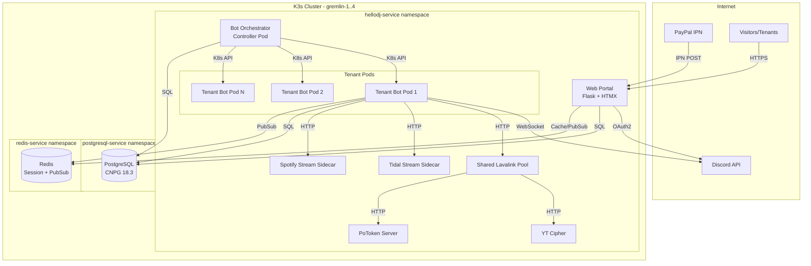
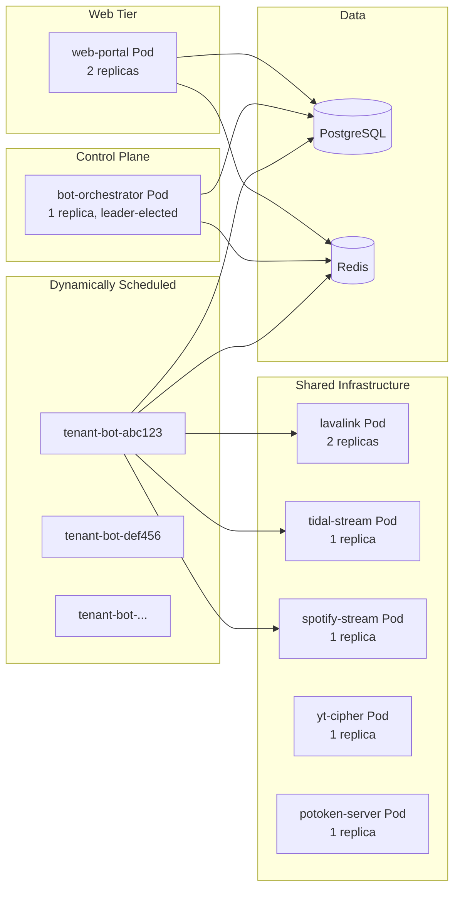
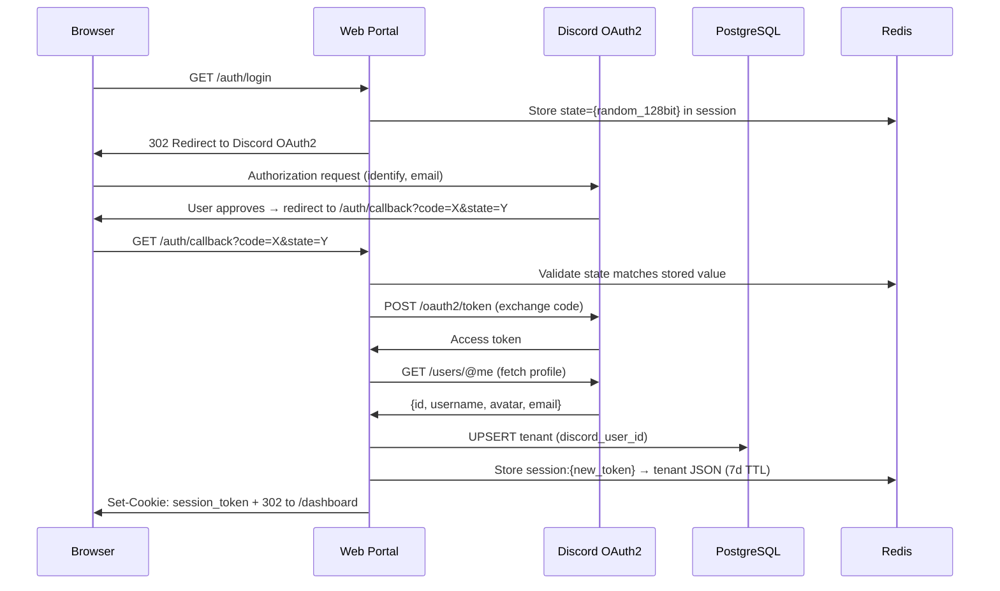
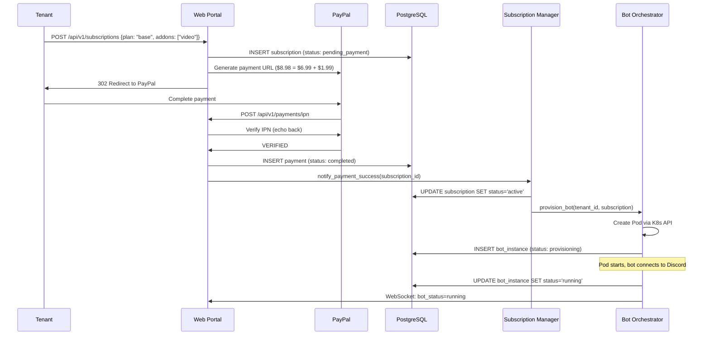
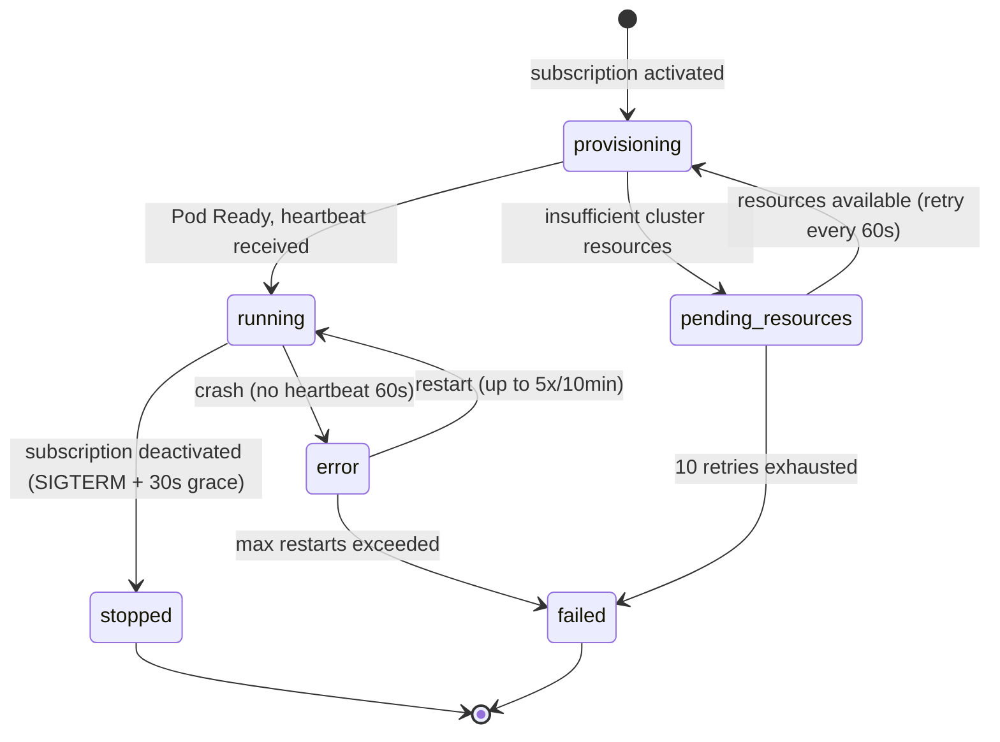

# Design Document: HelloDJ SaaS Platform

## Overview

This design transforms HelloDJ from a single-instance personal Discord music bot into a multi-tenant SaaS platform. The transformation preserves all existing architecture patterns (Fernet encryption, init container rendering, shared Lavalink, direct stream sidecars) while adding tenant isolation, subscription management, payment processing, and a public-facing web portal.

The platform serves three user classes:
1. **Visitors** — browse the landing page, view pricing, initiate OAuth login
2. **Tenants** — authenticated users managing subscriptions, bot instances, and playback
3. **Operator** — the platform owner (`celes@frameshift.net`) with admin panel access

### Key Design Decisions

| Decision | Rationale |
|----------|-----------|
| PostgreSQL (existing CNPG) over new DB | Cluster already running on gremlin-3, proven HA, avoids operational overhead |
| Fernet encryption preserved | Zero re-encryption migration; same `HELLODJ_DB_KEY` derivation |
| One Pod per tenant bot instance | True isolation; Kubernetes handles scheduling, health, resource limits |
| Shared Lavalink pool | Lavalink is stateless per-session; sharing reduces resource waste |
| Flask + HTMX + Alpine.js | Existing Flask stack, zero SPA complexity, sub-50KB JS total |
| PayPal IPN (not Checkout API) | Operator requirement; manual approval flow fits early-stage operation |
| Redis for session cache + pub/sub | Needed for cross-pod state sync, rate limiting, WebSocket fan-out |

### Scope Boundaries

**In scope**: Database migration, multi-tenant schema, auth, subscriptions, payment, bot orchestration, web portal expansion, web player, feature gating, GPU scheduling, admin panel.

**Out of scope**: Voice pipeline changes, Activity frontend redesign, Lavalink fork modifications, wake word model updates, visualizer engine changes.

## Architecture

### System Context Diagram



### Component Deployment Diagram



### Key Architecture Changes from Current

| Current | SaaS Platform |
|---------|--------------|
| Single bot Pod (4 containers) | One Pod per tenant + shared infrastructure |
| SQLite credential store | PostgreSQL credential store (same Fernet encryption) |
| JSON file sessions/playlists | PostgreSQL with tenant_id partition |
| Admin-only web UI | Public portal + tenant dashboards + admin panel |
| No auth (operator-only) | Discord OAuth2 + session tokens |
| No payments | PayPal IPN + subscription lifecycle |
| Single Lavalink sidecar | Shared Lavalink pool (separate Pods) |
| Init container reads SQLite | Init container reads PostgreSQL |

## Components and Interfaces

### 1. Credential Store (PostgreSQL-backed)

Replaces `bot/credentials.py` SQLite backend with PostgreSQL while preserving the identical public API.

```python
class CredentialStore:
    """Thread-safe encrypted key-value store backed by PostgreSQL (CNPG)."""

    def __init__(self, pg_uri: str, db_key: str, read_only: bool = False):
        self._pool: asyncpg.Pool  # Connection pool (min=2, max=10)
        self._fernet: Fernet      # Same SHA-256 → base64 derivation

    # Public API — UNCHANGED signatures
    def get(self, key: str, default: str | None = None) -> str | None: ...
    def set(self, key: str, value: str) -> None: ...
    def delete(self, key: str) -> None: ...
    def get_prefix(self, prefix: str) -> dict[str, str]: ...
    def get_bool(self, key: str, default: bool = False) -> bool: ...
    def get_int(self, key: str, default: int = 0) -> int: ...
    def get_float(self, key: str, default: float = 0.0) -> float: ...
    def exists(self, key: str) -> bool: ...
    def keys(self, prefix: str = "") -> list[str]: ...
```

**Connection resilience**: Exponential backoff (1s, 2s, 4s, 8s, max 30s) for up to 5 attempts. Uses `asyncpg` connection pool with health checks.

**Concurrency**: Row-level locking via `SELECT ... FOR UPDATE` on writes; reads use snapshot isolation (PostgreSQL default).

### 2. Auth Service

Handles Discord OAuth2 flow and session management.

```
┌─────────────┐     ┌──────────────┐     ┌─────────────┐
│   Browser   │────▶│  Web Portal  │────▶│  Discord    │
│             │◀────│  /auth/*     │◀────│  OAuth2     │
└─────────────┘     └──────────────┘     └─────────────┘
                           │
                    ┌──────┴──────┐
                    │             │
               ┌────▼────┐  ┌────▼────┐
               │   PG    │  │  Redis  │
               │ tenants │  │ sessions│
               └─────────┘  └─────────┘
```

**Endpoints**:
- `GET /auth/login` — Redirect to Discord OAuth2 with CSRF `state`
- `GET /auth/callback` — Exchange code, create/match tenant, issue session
- `POST /auth/logout` — Invalidate session
- `GET /auth/me` — Return current tenant profile (JSON, for HTMX partials)

**Session storage**: Redis with 7-day TTL. Token: 128-bit cryptographically random, stored as `session:{token}` → tenant JSON.

### 3. Subscription Manager

Manages plan lifecycle, add-on activation, and feature-flag exposure.

```python
class SubscriptionManager:
    PLANS = {
        "base": {"price_cents": 699, "bot_instances": 1, "features": ["audio"]},
        "trial": {"price_cents": 0, "bot_instances": 1, "features": ["audio"], "duration_days": 30},
    }
    ADDONS = {
        "video": {"price_cents": 199, "features": ["video", "activity", "hls", "visualizer"]},
        "premium": {"price_cents": 199, "features": ["tidal_hifi", "lossless", "priority_queue"]},
        "additional_bot": {"price_cents": 199, "per_instance": True, "max": 9},
    }

    async def create_subscription(self, tenant_id: UUID, plan: str, addons: list[str]) -> Subscription: ...
    async def activate(self, subscription_id: UUID) -> None: ...
    async def expire(self, subscription_id: UUID) -> None: ...
    async def get_features(self, tenant_id: UUID) -> FeatureFlags: ...
```

**Feature Flag API**: `GET /api/v1/features/{tenant_id}` returns:
```json
{
  "audio": true,
  "video": false,
  "tidal_hifi": false,
  "lossless": false,
  "priority_queue": false,
  "max_bot_instances": 1,
  "max_guilds_per_bot": 5
}
```

Bot instances query this at startup and cache. Redis pub/sub channel `feature_change:{tenant_id}` notifies bots of subscription changes within 60 seconds.

### 4. Payment Gateway

Handles PayPal payment URL generation and IPN verification.

```
Tenant → Web Portal → PayPal redirect
                                ↓
PayPal IPN POST → /api/v1/payments/ipn → verify with PayPal → activate subscription
```

**IPN Verification Flow**:
1. Receive IPN POST from PayPal
2. Echo back payload to `https://ipnpb.paypal.com/cgi-bin/webscr?cmd=_notify-validate`
3. If `VERIFIED`: create payment record, notify Subscription Manager
4. If `INVALID` or timeout (30s): discard, log failure
5. If 3 consecutive failures for same txn: flag for manual review

### 5. Bot Orchestrator

A controller Pod that manages tenant bot instance lifecycle via the Kubernetes API.

```python
class BotOrchestrator:
    """Manages tenant bot Pod lifecycle via kubernetes-client."""

    async def provision(self, tenant_id: UUID, subscription: Subscription) -> BotInstance: ...
    async def deprovision(self, bot_instance_id: UUID, grace_seconds: int = 30) -> None: ...
    async def health_check(self) -> list[BotInstanceHealth]: ...
    async def restart(self, bot_instance_id: UUID) -> None: ...
```

**Pod Template for Tenant Bots**:
```yaml
apiVersion: v1
kind: Pod
metadata:
  name: tenant-bot-{instance_id_short}
  namespace: hellodj-service
  labels:
    app.kubernetes.io/name: hellodj-tenant-bot
    app.kubernetes.io/component: bot
    hellodj.celestium.life/tenant-id: "{tenant_id}"
    hellodj.celestium.life/instance-id: "{instance_id}"
spec:
  initContainers:
    - name: render-lavalink-config
      image: registry.celestium.life/hellodj/bot:{tag}
      env:
        - name: HELLODJ_DB_KEY
          valueFrom: {secretKeyRef: hellodj-db-key}
        - name: HELLODJ_PG_URI
          valueFrom: {secretKeyRef: hellodj-pg-uri}
      command: ["python", "/app/render_lavalink_config.py", "/out/application.yml"]
  containers:
    - name: bot
      image: registry.celestium.life/hellodj/bot:{tag}
      env:
        - name: TENANT_ID
          value: "{tenant_id}"
        - name: HELLODJ_PG_URI
          valueFrom: {secretKeyRef: hellodj-pg-uri}
        - name: HELLODJ_DB_KEY
          valueFrom: {secretKeyRef: hellodj-db-key}
        - name: LAVALINK_HOST
          value: "lavalink-pool.hellodj-service.svc.cluster.local"
        - name: LAVALINK_PORT
          value: "2333"
      resources:
        requests: {cpu: "250m", memory: "512Mi"}
        limits: {cpu: "250m", memory: "512Mi"}
  restartPolicy: OnFailure
```

**Resource Limits by Tier**:

| Tier | CPU Request | CPU Limit | Memory | GPU VFs |
|------|-------------|-----------|--------|---------|
| Base | 250m | 250m | 512Mi | 0 |
| Video Addon | 500m | 500m | 1Gi | 1 (`intel.com/sriov-gpudevice`) |

**Health Monitoring**: Bot instances emit heartbeats to Redis (`heartbeat:{instance_id}` with 30s TTL). Orchestrator checks every 30s. No heartbeat for 60s → restart. 5 restarts in 10 minutes → mark `failed`.

### 6. Web Portal

Expanded Flask application with public-facing routes, tenant dashboards, and admin panel.

**Route Groups**:

| Group | Prefix | Auth Required | Description |
|-------|--------|---------------|-------------|
| Public | `/` | No | Landing page, pricing, features |
| Auth | `/auth/` | No | OAuth2 login/callback/logout |
| Dashboard | `/dashboard/` | Tenant | Subscription overview, bot status |
| Player | `/player/` | Tenant | Web-based playback control |
| Admin | `/admin/` | Operator | Trial approvals, system metrics |
| API | `/api/v1/` | Varies | REST + WebSocket endpoints |

**Tech Stack**:
- Flask 3.x with Blueprints (one per route group)
- HTMX 2.x for partial page updates (no full reloads)
- Alpine.js 3.x for client-side reactivity (tabs, modals, toasts)
- Tailwind CSS v4 with OKLCH dark glassmorphism theme
- WebSocket via `flask-sock` for real-time player state
- Jinja2 macros for reusable components (glass panels, cards, tables)

### 7. Shared Lavalink Pool

Lavalink moves from a sidecar to a standalone StatefulSet (2 replicas) with a headless Service. Tenant bots connect via the service DNS name.

```yaml
apiVersion: v1
kind: Service
metadata:
  name: lavalink-pool
  namespace: hellodj-service
spec:
  clusterIP: None  # headless for direct pod addressing
  ports:
    - port: 2333
      name: lavalink
  selector:
    app.kubernetes.io/name: hellodj-lavalink
```

Queue isolation is enforced at the bot level (each bot manages its own wavelink Player per guild). Lavalink itself is session-scoped and stateless between sessions.

### 8. Redis (Fixed/Replaced)

The existing Redis in CrashLoopBackOff needs fixing. Deploy a fresh Redis 7.x via Helm chart or raw manifests in a `redis-service` namespace.

**Usage**:
- **Session store**: `session:{token}` → tenant JSON (7-day TTL)
- **Rate limiting**: `ratelimit:{tenant_id}:{endpoint}` → counter (sliding window)
- **Pub/Sub**: `feature_change:{tenant_id}`, `player_state:{instance_id}`
- **Heartbeats**: `heartbeat:{instance_id}` → timestamp (30s TTL)
- **WebSocket fan-out**: player state changes broadcast to all connected tabs

## Data Models

### PostgreSQL Schema

```sql
-- Existing credentials table (migrated from SQLite)
CREATE TABLE credentials (
    key         TEXT PRIMARY KEY,
    value       BYTEA NOT NULL,
    updated_at  TIMESTAMPTZ DEFAULT now()
);

-- Tenants
CREATE TABLE tenants (
    id                UUID PRIMARY KEY DEFAULT gen_random_uuid(),
    discord_user_id   BIGINT UNIQUE NOT NULL,
    discord_username  TEXT,
    email             TEXT,
    created_at        TIMESTAMPTZ NOT NULL DEFAULT now(),
    updated_at        TIMESTAMPTZ NOT NULL DEFAULT now()
);

-- Subscriptions
CREATE TABLE subscriptions (
    id          UUID PRIMARY KEY DEFAULT gen_random_uuid(),
    tenant_id   UUID NOT NULL REFERENCES tenants(id) ON DELETE RESTRICT,
    plan        TEXT NOT NULL CHECK (plan IN ('base', 'trial')),
    addons      TEXT[] DEFAULT '{}',
    status      TEXT NOT NULL CHECK (status IN ('active', 'past_due', 'cancelled', 'expired', 'pending_payment')),
    started_at  TIMESTAMPTZ NOT NULL,
    expires_at  TIMESTAMPTZ,
    created_at  TIMESTAMPTZ NOT NULL DEFAULT now()
);

-- Bot Instances
CREATE TABLE bot_instances (
    id                          UUID PRIMARY KEY DEFAULT gen_random_uuid(),
    tenant_id                   UUID NOT NULL REFERENCES tenants(id) ON DELETE RESTRICT,
    discord_bot_token_encrypted BYTEA,
    guild_ids                   BIGINT[],
    status                      TEXT NOT NULL CHECK (status IN ('provisioning', 'running', 'stopped', 'error', 'pending_resources', 'failed')),
    node_name                   TEXT,
    pod_name                    TEXT,
    created_at                  TIMESTAMPTZ NOT NULL DEFAULT now()
);

-- Payments
CREATE TABLE payments (
    id              UUID PRIMARY KEY DEFAULT gen_random_uuid(),
    tenant_id       UUID NOT NULL REFERENCES tenants(id) ON DELETE RESTRICT,
    paypal_txn_id   TEXT UNIQUE,
    amount_cents    INTEGER NOT NULL CHECK (amount_cents > 0),
    currency        TEXT NOT NULL DEFAULT 'USD',
    status          TEXT NOT NULL CHECK (status IN ('pending', 'completed', 'refunded', 'failed')),
    created_at      TIMESTAMPTZ NOT NULL DEFAULT now()
);

-- Trial Applications
CREATE TABLE trial_applications (
    id          UUID PRIMARY KEY DEFAULT gen_random_uuid(),
    tenant_id   UUID NOT NULL REFERENCES tenants(id) ON DELETE RESTRICT,
    status      TEXT NOT NULL CHECK (status IN ('pending', 'approved', 'rejected')),
    applied_at  TIMESTAMPTZ NOT NULL DEFAULT now(),
    decided_at  TIMESTAMPTZ,
    decided_by  TEXT  -- operator discord username
);

-- Sessions (multi-tenant)
CREATE TABLE sessions (
    tenant_id       UUID NOT NULL,
    guild_id        BIGINT NOT NULL,
    channel_id      BIGINT NOT NULL,
    session_data    JSONB NOT NULL,
    updated_at      TIMESTAMPTZ NOT NULL DEFAULT now(),
    PRIMARY KEY (tenant_id, guild_id, channel_id),
    CONSTRAINT session_data_size CHECK (octet_length(session_data::text) <= 1048576)
);

-- Playlists (multi-tenant)
CREATE TABLE playlists (
    tenant_id   UUID NOT NULL,
    playlist_id UUID PRIMARY KEY DEFAULT gen_random_uuid(),
    guild_id    BIGINT NOT NULL,
    name        TEXT NOT NULL CHECK (char_length(name) <= 100),
    tracks      JSONB NOT NULL,
    created_at  TIMESTAMPTZ NOT NULL DEFAULT now(),
    updated_at  TIMESTAMPTZ NOT NULL DEFAULT now(),
    CONSTRAINT playlist_tracks_size CHECK (octet_length(tracks::text) <= 5242880),
    CONSTRAINT playlists_unique_name UNIQUE (tenant_id, guild_id, lower(name))
);

-- Indexes
CREATE INDEX idx_subscriptions_tenant ON subscriptions(tenant_id);
CREATE INDEX idx_subscriptions_status ON subscriptions(status);
CREATE INDEX idx_bot_instances_tenant ON bot_instances(tenant_id);
CREATE INDEX idx_bot_instances_status ON bot_instances(status);
CREATE INDEX idx_payments_tenant ON payments(tenant_id);
CREATE INDEX idx_payments_created ON payments(created_at DESC);
CREATE INDEX idx_trial_applications_status ON trial_applications(status);
CREATE INDEX idx_sessions_tenant ON sessions(tenant_id);
CREATE INDEX idx_playlists_tenant_guild ON playlists(tenant_id, guild_id);
```

### Entity Relationships

```mermaid
erDiagram
    tenants ||--o{ subscriptions : has
    tenants ||--o{ bot_instances : owns
    tenants ||--o{ payments : makes
    tenants ||--o{ trial_applications : submits
    tenants ||--o{ sessions : owns
    tenants ||--o{ playlists : owns

    tenants {
        uuid id PK
        bigint discord_user_id UK
        text discord_username
        text email
        timestamptz created_at
    }

    subscriptions {
        uuid id PK
        uuid tenant_id FK
        text plan
        text_arr addons
        text status
        timestamptz started_at
        timestamptz expires_at
    }

    bot_instances {
        uuid id PK
        uuid tenant_id FK
        bytea discord_bot_token_encrypted
        bigint_arr guild_ids
        text status
        text node_name
        text pod_name
    }

    payments {
        uuid id PK
        uuid tenant_id FK
        text paypal_txn_id UK
        integer amount_cents
        text currency
        text status
    }

    sessions {
        uuid tenant_id PK
        bigint guild_id PK
        bigint channel_id PK
        jsonb session_data
        timestamptz updated_at
    }

    playlists {
        uuid tenant_id
        uuid playlist_id PK
        bigint guild_id
        text name
        jsonb tracks
    }
}
```

### Redis Key Schema

| Pattern | Type | TTL | Purpose |
|---------|------|-----|---------|
| `session:{token}` | String (JSON) | 7 days | Auth session data |
| `heartbeat:{instance_id}` | String (timestamp) | 30s | Bot instance health |
| `ratelimit:{tenant_id}:{endpoint}` | Sorted Set | 60s | Rate limiting (sliding window) |
| `features:{tenant_id}` | String (JSON) | 5 min | Feature flag cache |
| `player_state:{instance_id}` | String (JSON) | 60s | Current playback state |
| Channel: `feature_change:{tenant_id}` | Pub/Sub | — | Subscription change notifications |
| Channel: `player_update:{instance_id}` | Pub/Sub | — | Real-time player state broadcast |


### API Design

#### REST Endpoints

**Authentication** (`/auth/`):
| Method | Path | Auth | Description |
|--------|------|------|-------------|
| GET | `/auth/login` | No | Redirect to Discord OAuth2 |
| GET | `/auth/callback` | No | OAuth2 callback handler |
| POST | `/auth/logout` | Session | Invalidate session |
| GET | `/auth/me` | Session | Current tenant profile |

**Subscription Management** (`/api/v1/subscriptions/`):
| Method | Path | Auth | Description |
|--------|------|------|-------------|
| GET | `/api/v1/subscriptions` | Tenant | List tenant's subscriptions |
| POST | `/api/v1/subscriptions` | Tenant | Create subscription (returns PayPal URL) |
| DELETE | `/api/v1/subscriptions/{id}` | Tenant | Cancel subscription |
| GET | `/api/v1/features` | Tenant | Get current feature flags |

**Payment** (`/api/v1/payments/`):
| Method | Path | Auth | Description |
|--------|------|------|-------------|
| POST | `/api/v1/payments/ipn` | None (PayPal) | IPN receiver |
| GET | `/api/v1/payments` | Tenant | Billing history (paginated) |
| GET | `/api/v1/payments/cancel` | None | PayPal cancel redirect |
| GET | `/api/v1/payments/success` | None | PayPal success redirect |

**Player Control** (`/api/v1/player/`):
| Method | Path | Auth | Description |
|--------|------|------|-------------|
| GET | `/api/v1/player/{instance_id}/state` | Tenant (owner) | Current playback state |
| POST | `/api/v1/player/{instance_id}/play` | Tenant (owner) | Search + queue track |
| POST | `/api/v1/player/{instance_id}/pause` | Tenant (owner) | Pause playback |
| POST | `/api/v1/player/{instance_id}/resume` | Tenant (owner) | Resume playback |
| POST | `/api/v1/player/{instance_id}/skip` | Tenant (owner) | Skip current track |
| POST | `/api/v1/player/{instance_id}/previous` | Tenant (owner) | Previous track |
| POST | `/api/v1/player/{instance_id}/shuffle` | Tenant (owner) | Shuffle queue |
| POST | `/api/v1/player/{instance_id}/repeat` | Tenant (owner) | Toggle repeat mode |
| POST | `/api/v1/player/{instance_id}/volume` | Tenant (owner) | Set volume (0-100) |
| POST | `/api/v1/player/{instance_id}/queue/add` | Tenant (owner) | Add track to queue |
| POST | `/api/v1/player/{instance_id}/queue/remove` | Tenant (owner) | Remove track from queue |
| POST | `/api/v1/player/{instance_id}/queue/move` | Tenant (owner) | Reorder queue item |
| DELETE | `/api/v1/player/{instance_id}/queue` | Tenant (owner) | Clear queue |

**Admin** (`/api/v1/admin/`):
| Method | Path | Auth | Description |
|--------|------|------|-------------|
| GET | `/api/v1/admin/trials` | Operator | Pending trial applications |
| POST | `/api/v1/admin/trials/{id}/approve` | Operator | Approve trial |
| POST | `/api/v1/admin/trials/{id}/deny` | Operator | Deny trial |
| GET | `/api/v1/admin/subscriptions` | Operator | All subscriptions |
| POST | `/api/v1/admin/subscriptions/{id}/suspend` | Operator | Suspend subscription |
| POST | `/api/v1/admin/subscriptions/{id}/terminate` | Operator | Terminate subscription |
| GET | `/api/v1/admin/metrics` | Operator | System-wide metrics |
| GET | `/api/v1/admin/instances` | Operator | All bot instances + health |

**Trial** (`/api/v1/trials/`):
| Method | Path | Auth | Description |
|--------|------|------|-------------|
| POST | `/api/v1/trials/apply` | Tenant | Submit trial application |
| GET | `/api/v1/trials/status` | Tenant | Check trial application status |

#### WebSocket Endpoints

**Player State Stream**: `ws://hellodj.celestium.life/ws/player/{instance_id}`

Authentication via query param: `?token={session_token}`

Messages (server → client):
```json
{"type": "track_change", "current": {...}, "queue": [...]}
{"type": "progress", "position_ms": 45000, "duration_ms": 210000}
{"type": "queue_update", "queue": [...]}
{"type": "volume_change", "volume": 75}
{"type": "state_change", "playing": true, "repeat": "off", "shuffle": false}
{"type": "bot_status", "status": "running"}
```

Messages (client → server):
```json
{"type": "command", "action": "pause"}
{"type": "command", "action": "skip"}
{"type": "command", "action": "volume", "value": 80}
{"type": "ping"}
```

Rate limit: 60 messages/minute per connection. Progress ticks sent every 5 seconds during playback.

### Authentication Flow



### Payment Flow



### Bot Orchestrator Pod Lifecycle



### Feature Gating Mechanism

Bot instances enforce feature restrictions at the command handler level:

```python
# In each bot cog command
@feature_required("video")
async def music_video(self, ctx, query: str):
    ...

# Decorator implementation
def feature_required(feature: str):
    async def predicate(ctx):
        flags = await get_feature_flags(ctx.bot.tenant_id)
        if not flags.get(feature, False):
            addon_name = FEATURE_TO_ADDON[feature]
            await ctx.respond(
                f"🔒 This feature requires the **{addon_name}**. "
                f"Upgrade at https://hellodj.celestium.life/dashboard/subscription",
                ephemeral=True
            )
            return False
        return True
    return commands.check(predicate)
```

Feature flags are:
1. Queried from Subscription Manager API at bot startup
2. Cached in-memory for 5 minutes
3. Invalidated immediately on Redis pub/sub `feature_change:{tenant_id}` event
4. Default to Base_Plan restrictions if cache is empty and API is unreachable

### Web Player Architecture

```
┌──────────────────────────────────────────────┐
│  Browser (/player)                            │
│  ┌────────────────────────────────────────┐  │
│  │  HTMX partials (queue, now-playing)    │  │
│  │  Alpine.js (volume slider, drag-drop)  │  │
│  │  WebSocket (real-time state sync)      │  │
│  └────────────────────────────────────────┘  │
└───────────────────┬──────────────────────────┘
                    │ WebSocket + HTMX GET/POST
                    ▼
┌──────────────────────────────────────────────┐
│  Web Portal (Flask)                           │
│  ┌─────────────┐  ┌──────────────────────┐  │
│  │ REST routes  │  │ WebSocket handler    │  │
│  │ (HTMX)      │  │ (flask-sock)         │  │
│  └──────┬──────┘  └──────────┬───────────┘  │
│         │                     │              │
│  ┌──────┴─────────────────────┴───────────┐  │
│  │  Redis Pub/Sub (player_update:{id})    │  │
│  └────────────────────────────────────────┘  │
└───────────────────┬──────────────────────────┘
                    │ Redis pub/sub
                    ▼
┌──────────────────────────────────────────────┐
│  Tenant Bot Instance                          │
│  - Publishes state changes to Redis           │
│  - Subscribes to command channel              │
│  - Executes wavelink/activity commands        │
└──────────────────────────────────────────────┘
```

The web player uses a hybrid approach:
- **HTMX**: Loads queue list, search results, playlist browser as server-rendered partials
- **WebSocket**: Real-time now-playing state (position, track changes, volume)
- **Alpine.js**: Volume slider, drag-to-reorder queue, keyboard shortcuts

### Migration Strategy (SQLite → PostgreSQL)

**Phase 1: Schema Creation** (zero downtime)
- Run migration script against CNPG cluster to create `hellodj` database, tables, indexes
- No impact on running bot (still using SQLite)

**Phase 2: Data Migration** (zero downtime)
- Migration script reads `hellodj.db` credentials → inserts into PG (preserving encrypted blobs byte-for-byte)
- Migration script reads `sessions.json` → inserts into PG sessions table (tenant_id = "system")
- Migration script reads `playlists.json` → inserts into PG playlists table (tenant_id = "system")
- Skip-on-conflict semantics (existing keys not overwritten)
- Summary output: migrated/skipped counts per source

**Phase 3: Dual-Write Deployment** (brief maintenance window)
- Deploy new bot image with PostgreSQL credential store
- Init container switches to `HELLODJ_PG_URI` environment variable
- Verify Lavalink starts with correct rendered config
- Verify bot reads/writes credentials from PG

**Phase 4: Cutover** (< 5 minute window)
- Scale down old deployment
- Scale up new deployment
- Verify all containers healthy

**Rollback**: Script re-exports PG data to SQLite + JSON format. Available for 24 hours post-migration.

### Multi-Node GPU Scheduling

GPU allocation uses Kubernetes native resource requests — no custom scheduler needed.

**Base Plan pods**: No GPU resources requested → scheduled anywhere with available CPU/RAM.

**Video Addon pods**: Include `intel.com/sriov-gpudevice: 1` in resource requests → Kubernetes scheduler distributes across nodes with available VFs (7 per node × 4 nodes = 28 total cluster capacity).

**CUDA workloads** (future): `nvidia.com/gpu: 1` + nodeAffinity targeting gremlin-1.

```yaml
# Video addon pod spec additions
resources:
  requests:
    cpu: "500m"
    memory: "1Gi"
    intel.com/sriov-gpudevice: "1"
  limits:
    cpu: "500m"
    memory: "1Gi"
    intel.com/sriov-gpudevice: "1"
securityContext:
  supplementalGroups: [26]  # video group
  privileged: true          # /dev/dri access
volumeMounts:
  - mountPath: /dev/dri
    name: dev-dri
volumes:
  - name: dev-dri
    hostPath:
      path: /dev/dri
      type: Directory
```

No node affinity constraints are applied for Intel VFs — the device plugin handles accounting, and Kubernetes distributes naturally.


## Correctness Properties

*A property is a characteristic or behavior that should hold true across all valid executions of a system — essentially, a formal statement about what the system should do. Properties serve as the bridge between human-readable specifications and machine-verifiable correctness guarantees.*

### Property 1: Credential Encryption Round-Trip

*For any* arbitrary string value and any valid key string, storing the value via `CredentialStore.set(key, value)` and then reading it via `CredentialStore.get(key)` SHALL return the original value unchanged, AND the raw bytes stored in the PostgreSQL `credentials.value` column SHALL NOT contain the plaintext value as a substring.

**Validates: Requirements 1.3, 1.5**

### Property 2: Credential Store API Behavioral Equivalence

*For any* sequence of operations (set, get, delete, get_prefix, get_bool, get_int, get_float, exists, keys) with arbitrary valid inputs, the PostgreSQL-backed CredentialStore SHALL produce identical return values to the SQLite-backed CredentialStore when initialized with the same `HELLODJ_DB_KEY` and given the same operation sequence.

**Validates: Requirements 1.6**

### Property 3: Tenant Data Isolation

*For any* two distinct tenant IDs and any session/playlist data, writing data scoped to tenant A and then reading as tenant B SHALL return an empty result set, regardless of whether the guild_id or channel_id values overlap between tenants.

**Validates: Requirements 2.3, 2.4, 10.2, 10.7**

### Property 4: Trial Lifecycle State Machine

*For any* tenant, approving a trial application SHALL result in an active trial with an expiry date exactly 30 days from approval, AND if the tenant already has an active trial or subscription, applying for a new trial SHALL be rejected without modifying the existing subscription state.

**Validates: Requirements 6.3, 6.4, 6.5**

### Property 5: Subscription Timeout Lifecycle

*For any* subscription in `pending_payment` status, if payment is not verified within 24 hours of creation, the subscription SHALL transition to `cancelled`. *For any* active subscription past its `expires_at` date, the subscription SHALL transition to `expired` only after a 3-day grace period has elapsed (i.e., `now() > expires_at + 3 days`).

**Validates: Requirements 7.7, 7.8**

### Property 6: Addon Prerequisite Enforcement

*For any* tenant without an active Base_Plan subscription, attempting to add any addon (Video, Premium, Additional Bot) SHALL be rejected with an error, AND the subscription state SHALL remain unchanged.

**Validates: Requirements 7.9, 7.10**

### Property 7: Authorization Enforcement

*For any* authenticated user whose Discord user ID is not the configured operator ID, all admin panel endpoints SHALL return a rejection response. *For any* tenant attempting to control a bot instance they do not own, all player API endpoints SHALL return HTTP 403.

**Validates: Requirements 9.1, 17.3**

### Property 8: Pod Spec Correctness Per Subscription Tier

*For any* subscription with a specific plan and set of addons, the generated Pod spec SHALL contain resource requests/limits matching the tier definition (Base: 250m CPU, 512Mi RAM, 0 GPU; Video: 500m CPU, 1Gi RAM, 1 `intel.com/sriov-gpudevice`), AND subscriptions without Video_Addon SHALL NOT include GPU resource requests.

**Validates: Requirements 10.5, 11.1**

### Property 9: Feature Flag Computation Correctness

*For any* valid combination of plan and addons, the feature flag computation SHALL enable exactly the features defined for that combination: Base_Plan enables `audio` only; Video_Addon enables `video`, `activity`, `hls`, `visualizer`; Premium_Addon enables `tidal_hifi`, `lossless`, `priority_queue`. No feature SHALL be enabled without the corresponding addon being active.

**Validates: Requirements 13.1, 13.2, 13.3, 13.4, 13.5**

### Property 10: Migration Data Preservation

*For any* set of credential records in the SQLite database, running the migration script SHALL produce identical `key` and `value` (byte-for-byte) entries in PostgreSQL, AND if a key already exists in the target, the migration SHALL NOT modify the existing row.

**Validates: Requirements 14.1, 14.4**

### Property 11: Config Rendering Equivalence

*For any* set of credential key-value pairs, rendering `application.yml` from the PostgreSQL credential store SHALL produce output identical (byte-for-byte) to rendering from the SQLite credential store when both contain the same data.

**Validates: Requirements 15.3**

### Property 12: Rate Limiting Correctness

*For any* sequence of API requests from a single tenant to a single bot instance endpoint, requests within the 60-per-minute limit SHALL be accepted, AND the 61st request within any sliding 60-second window SHALL be rejected with HTTP 429.

**Validates: Requirements 17.5**

## Error Handling

### Credential Store Errors

| Error Condition | Behavior |
|----------------|----------|
| `HELLODJ_DB_KEY` missing/empty | `RuntimeError` at startup, application does not start |
| PostgreSQL connection lost | Exponential backoff retry (1s, 2s, 4s, 8s, max 30s), max 5 attempts, then raise to caller |
| Fernet decryption failure (wrong key) | Return empty string, log error (matches current SQLite behavior) |
| Connection pool exhausted | Queue request, timeout after 10s with `asyncio.TimeoutError` |

### Authentication Errors

| Error Condition | Behavior |
|----------------|----------|
| OAuth2 state mismatch | Redirect to login with `?error=state_mismatch` |
| Discord code exchange fails | Redirect to login with `?error=service_unavailable` |
| User denies authorization | Redirect to login with `?error=denied` |
| Session token expired/invalid | Redirect to login, discard expired session from Redis |
| Discord API timeout (>10s) | Redirect to login with `?error=service_unavailable` |

### Payment Errors

| Error Condition | Behavior |
|----------------|----------|
| IPN verification fails | Discard IPN, log failure, no subscription change |
| PayPal endpoint unreachable (30s timeout) | Discard IPN, log failure |
| 3 consecutive IPN failures (same txn) | Flag for manual review, do not activate |
| Tenant cancels on PayPal | Redirect to plan selection, no payment record created |
| Payment not verified within 24h | Subscription auto-cancelled |

### Bot Orchestrator Errors

| Error Condition | Behavior |
|----------------|----------|
| Insufficient cluster resources | Set status `pending_resources`, retry every 60s, max 10 attempts |
| Pod crashes (no heartbeat 60s) | Restart Pod, max 5 restarts per 10 minutes |
| Max restarts exceeded | Set status `failed`, notify tenant |
| Kubernetes API unavailable | Retry with backoff, log error, no state change |

### Feature Gating Fallback

| Error Condition | Behavior |
|----------------|----------|
| Feature API unreachable at startup | Use last-cached flags from Redis |
| No cached flags and API unreachable | Default to Base_Plan restrictions (audio only) |
| Subscription change event missed | Cache refresh within 5 minutes (TTL-based) |

### Web Player Errors

| Error Condition | Behavior |
|----------------|----------|
| WebSocket disconnection | Auto-reconnect with exponential backoff (1s, 2s, 4s, max 30s) |
| Bot instance offline | Display disabled player with "Bot not active" message |
| Command forwarding timeout (>1s) | Return error to client, display toast notification |
| Rate limit exceeded (429) | Display toast with retry countdown |

## Testing Strategy

### Test Framework and Tools

- **Unit tests**: `pytest` with `pytest-asyncio` for async code
- **Property-based tests**: `hypothesis` (already in use in this project, as evidenced by `.hypothesis/` directory)
- **Integration tests**: `pytest` with `testcontainers` (PostgreSQL, Redis containers)
- **API tests**: `httpx` test client for Flask routes
- **WebSocket tests**: `websockets` library for WS endpoint testing

### Property-Based Testing Configuration

- Library: **Hypothesis** (Python)
- Minimum iterations: 100 per property (`@settings(max_examples=100)`)
- Each property test references its design document property via tag comment
- Tag format: `# Feature: hellodj-saas-platform, Property {number}: {property_text}`

### Test Organization

```
tests/
├── unit/
│   ├── test_credential_store.py      # Properties 1, 2
│   ├── test_feature_flags.py         # Property 9
│   ├── test_subscription_logic.py    # Properties 4, 5, 6
│   ├── test_authorization.py         # Property 7
│   ├── test_pod_spec_builder.py      # Property 8
│   ├── test_rate_limiter.py          # Property 12
│   └── test_config_renderer.py       # Property 11
├── integration/
│   ├── test_tenant_isolation.py      # Property 3
│   ├── test_migration.py             # Property 10
│   ├── test_payment_flow.py          # PayPal IPN mock tests
│   ├── test_oauth_flow.py            # Discord OAuth2 mock tests
│   ├── test_bot_orchestrator.py      # K8s API mock tests
│   └── test_web_player.py            # WebSocket integration
├── conftest.py                        # Fixtures: PG container, Redis, mock K8s
└── strategies.py                      # Hypothesis strategies: tenants, subscriptions, credentials
```

### Hypothesis Strategies (Custom Generators)

```python
# strategies.py — shared across property tests
from hypothesis import strategies as st

# Credential key-value pairs
credential_keys = st.text(
    alphabet=st.characters(whitelist_categories=("L", "N", "P")),
    min_size=1, max_size=100
).filter(lambda s: s.strip())

credential_values = st.text(min_size=0, max_size=10000)

# Tenant data
tenant_ids = st.uuids()
discord_user_ids = st.integers(min_value=100000000000000000, max_value=999999999999999999)

# Subscription states
plans = st.sampled_from(["base", "trial"])
addon_sets = st.lists(st.sampled_from(["video", "premium", "additional_bot"]), unique=True)
subscription_statuses = st.sampled_from(["active", "past_due", "cancelled", "expired", "pending_payment"])

# Feature flag combinations
feature_subscriptions = st.fixed_dictionaries({
    "plan": plans,
    "addons": addon_sets,
    "status": st.just("active"),
})
```

### Unit Test Coverage (Example-Based)

| Area | Key Tests |
|------|-----------|
| OAuth2 flow | State generation, callback validation, error redirects |
| Session management | Token creation, expiry, invalidation |
| Trial applications | Create, approve, deny, duplicate rejection |
| Payment processing | IPN parsing, verification mock, timeout handling |
| Admin authorization | Operator check, non-operator rejection |
| Web player routes | Auth required, disabled state, search |
| Discord remote | Embed generation, button interactions, persist view |
| Landing page | Pricing display, feature matrix content |

### Integration Test Strategy

- **PostgreSQL**: Use `testcontainers` to spin up a real PG instance per test session
- **Redis**: Use `testcontainers` or `fakeredis` for session/cache tests
- **Kubernetes**: Mock `kubernetes-client` with fixture responses
- **Discord API**: Mock with `responses` library or `httpx` mock transport
- **PayPal**: Mock IPN endpoints with recorded responses

### CI Pipeline

1. `pytest tests/unit/` — fast, no containers needed
2. `pytest tests/integration/` — requires Docker for testcontainers
3. Property tests run as part of unit suite (100 examples each, ~30s total)
4. Coverage target: >80% on core business logic (credential store, subscription manager, feature flags, authorization)

