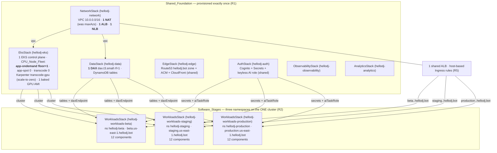
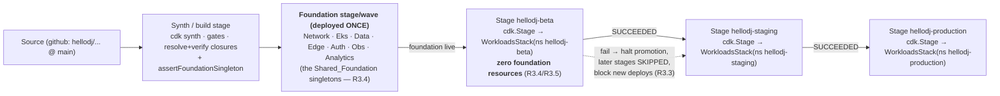

# Design Document

## Overview

This design realizes one governing principle from the approved requirements:

> **One stage's worth of HARDWARE, three stages' worth of SOFTWARE.**

It is a **CDK topology refactor** of the already-implemented `aws-saas-replatform` platform
(`platform/infra/`). It does not change what the twelve `Software_Component`s do, nor how images are
built, nor the runtime protocols between components. It changes **how many times the foundation is
instantiated** and **what each pipeline stage deploys**, so that Beta, Staging, and Production share a
single VPC, a single EKS control plane, a single CPU node fleet, a single DAX cluster, a single ALB,
and a single NLB — isolated from one another only by **endpoint** (a `hellodj-<stage>` namespace plus
a `<stage>.<region>.hellodj.bot` hostname), never by duplicated infrastructure.

This is the same "single host, three stages isolated by endpoint" model that
`hellodj-nix-native-delivery` Requirement 8 already established for the **GPU** (one shared GPU AMI,
one time-sliced `transcode-gpu` Karpenter NodePool, `hellodj-<stage>` namespaces,
`<stage>.<region>.hellodj.bot` hostnames, no per-stage GPU instance). The GPU was already shared. This
spec extends that model **downward to the whole foundation**: the VPC, EKS control plane, CPU node
groups, DAX, and load balancers become shared singletons in exactly the same way the GPU already is.

### What is already true (verified from the code — not re-specified here)

The following are the current, verified state of `platform/infra/` and form the baseline this design
changes. They are cited, not re-derived:

- **The software layer already deploys per-namespace.** `WorkloadsStack` (`lib/workloads-stack.ts`) +
  `component-workloads.ts` already render the 12 components into namespace `hellodj-<stage>`, expose
  `stageEndpoint(stage, region)` → `{namespace, port: 443, hostname: <stage>.<region>.hellodj.bot}`,
  wire per-stage `LOG_LEVEL`/`HELLODJ_DEBUG`, IRSA/Pod-Identity data+secret env, and add **one ALB
  Ingress with a host-based rule** bound to `this.stageEndpoint.hostname`. This is the finished
  "software" layer and is preserved **unchanged in principle** by this spec.
- **The GPU is already a shared singleton.** `eks-stack.ts` names the Karpenter GPU NodePool
  `transcode-gpu` (stage-independent, `KARPENTER_GPU_NODEPOOL_NAME`), scales it to zero via
  `consolidationPolicy: WhenEmpty` + `consolidateAfter`, and one baked GPU AMI serves all stages. The
  `endpoint-isolation.test.ts` suite already asserts "no per-stage GPU instance."
- **The foundation is currently instantiated once, but keyed to a single stage.** `bin/hellodj.ts`
  instantiates `NetworkStack`, `EdgeStack`, `DataStack`, `AuthStack`, `EksStack`, `ObservabilityStack`,
  `AnalyticsStack`, and `WorkloadsStack` each **once**, each with an id suffixed by `config.stage`
  (`hellodj-network-${config.stage}`, etc.), and one region-agnostic `PipelineStack`. A plain
  `cdk deploy` therefore stands up **one** stage's foundation + one stage's software.
- **The pipeline deploys placeholders.** `pipeline-stack.ts` adds three `HelloDjStage` stages in the
  fixed order `beta → staging → production` (`PROMOTION_ORDER`), but each stage wraps only a
  `HelloDjPlaceholderStack` (a lone `WaitConditionHandle`). Each `HelloDjStage` is a `cdk.Stage`.

### The failure mode this design prevents

The naïve way to get three stages is to run the whole `bin/hellodj.ts` composition three times (once
per stage) or to put the foundation stacks inside each `HelloDjStage`'s `cdk.Stage`. Either **triples
the hardware**: three VPCs, three EKS control planes, three CPU fleets, three DAX clusters, three
ALBs, three NLBs — roughly **$1000+/mo idle**. The requirements forbid this: the foundation must be a
**singleton** so three software stages cost ≈ **1×** the hardware, not 3×.

### Locked decisions from the requirements (baked into this design)

| Decision | Change | Requirement |
|---|---|---|
| Foundation is a singleton | The shared stacks are instantiated **once** with **stage-independent ids** (drop the `-${stage}` suffix); a second instantiation fails synth | R1 |
| Three software stages | Three `WorkloadsStack` deployments (one per namespace) onto the one cluster | R2 |
| Pipeline deploys software only | Each `HelloDjStage` deploys a namespaced `WorkloadsStack`, never foundation hardware; foundation deploys once, before the three stages | R3 |
| Minimal node floor | `appOnDemandNodegroup` `minSize`/`desiredSize` 2 → **1** small Graviton node | R4.1, R4.4 |
| Single NAT | `network-stack.ts` `natGateways: maxAzs` → **`natGateways: 1`** | R4.3 |
| One DAX node | `dax.t3.small`, `replicationFactor: 1` — unchanged | R4.8 |
| GPU/Spot/transcode scale-to-zero | Preserved unchanged | R4.5–R4.7 |
| Target idle bill | ≈ **$180–220/mo** for all three stages combined | R6.4 |

### Primarily CDK/TypeScript — PBT is minimal

Almost all verification here is **CDK template assertion** (jest + `aws-cdk-lib/assertions`): "the
synthesized app contains exactly one VPC / one EKS cluster / one DAX / one ALB / one NLB", "each
software stage's template contains **zero** foundation resources", "the on-demand node group floor is
1", "there is 1 NAT gateway". These are structural facts about synthesized templates, not universal
"for all inputs" properties, so they are **not** property-based tests. The one genuinely pure,
input-varying decision — endpoint isolation — is **already covered** by the existing
`route_endpoint` / **Property 9** and its `stage-model-properties.test.ts` fast-check test; this spec
**reuses** it and does not reinvent it. The `Foundation_Singleton_Invariant` (R1.7/R1.8) is asserted
by counting resources in a synthesized template — a CDK-assertion concern, **not** a PBT one — so no
new property is introduced for it (see [Correctness Properties](#correctness-properties)).

### Requirements coverage map

| Requirement | Where addressed |
|---|---|
| **R1** — Foundation provisioned exactly once, shared; synth ≤1 of each; second instance fails synth | [Architecture](#architecture) (single-foundation topology); [Components](#1-binhellodjts--single-foundation-composition--three-software-stages-r1-r3) (`bin/hellodj.ts` rewrite + `assertFoundationSingleton`); [Testing](#testing-strategy) (singleton assertions) |
| **R2** — Three namespaced `WorkloadsStack`s on one cluster; 12 components each; partial-deploy tolerance; shared CPU+GPU | [Components](#2-workloadsstack--three-namespaced-software-stages-r2-r5) (reuse `stageEndpoint`); [Architecture](#architecture) (3-namespace topology) |
| **R3** — Pipeline promotes beta→staging→production, halts on failure, blocks new deploys; each stage template has zero foundation | [Components](#3-pipeline-stackts--software-only-stages-r3) (`HelloDjStage` deploys `WorkloadsStack`); [Testing](#testing-strategy) (per-stage-template-zero-foundation) |
| **R4** — 1-node floor carrying 3 namespaces' idle pods; 1 NAT; spot/transcode/GPU scale-to-zero; 1 DAX | [Components](#4-eks-stackts--node-floor-of-one-r4) + [Node floor capacity analysis](#node-floor-capacity-analysis-r44); [Components](#5-network-stackts--single-nat-r43); DAX unchanged |
| **R5** — Host-based Ingress per hostname to right namespace only; no-match rejected; preserve `route_endpoint`/Property 9 | [Components](#6-endpoint-isolation--reuse-route_endpoint--property-9-r5); [Correctness Properties](#correctness-properties) |
| **R6** — Itemized idle cost model, GPU $0, ≤1.5× single-stage, target $180–220/mo, region+date | [Idle cost model](#idle-cost-model-r6); [ARCHITECTURE.md sync](#architecture-doc-sync-r6) |
| **R7** — Preserve isolation, nix-native R8 GPU model, stage naming, run the CDK suite to zero failures, preserve 12 components | [Reconciliation](#reconciliation-and-regression-preservation-r7); [Testing](#testing-strategy) |

## Architecture

### The one-foundation, three-software-stage topology

The refactor collapses the per-stage foundation into a single **`Shared_Foundation`** composition and
attaches three **`Software_Stage`** deployments to it. The foundation stacks lose their `-${stage}`
id suffix and become stage-independent singletons; the three `WorkloadsStack` instances keep their
per-stage namespace and hostname.



Key architectural invariants:

- **`Foundation_Singleton_Invariant` (R1).** Every foundation stack is instantiated exactly once with
  a stage-independent id. The whole synthesized app contains **at most one** VPC, EKS control plane,
  CPU_Node_Fleet, DAX cluster, ALB, and NLB. A programmatic guard (`assertFoundationSingleton`, below)
  makes a duplicate fail synth with an error naming the duplicated resource type.
- **Stages share, never copy.** The three `WorkloadsStack`s receive the **same** `eks.cluster`,
  `data.*`, `auth.*` references and differ **only** by `stage`/`region` (hence namespace + hostname).
  No `WorkloadsStack` creates a VPC, cluster, node group, DAX, ALB, or NLB — it only adds Kubernetes
  manifests (namespace, Deployments, Services, HPAs, Ingress) to the shared cluster.
- **Endpoint isolation is the only isolation.** Cross-stage separation is the existing
  namespace + hostname model (`route_endpoint` / Property 9), identical to the GPU model in
  `nix-native-delivery` R8.

### Pipeline wiring: foundation once, then three software stages

The subtle constraint (R3) is CDK-Pipelines-specific. `HelloDjStage` wraps its stacks in a
`cdk.Stage`; CDK Pipelines deploys every stack inside a `cdk.Stage` **once per stage**. If the
foundation stacks were placed inside `HelloDjStage`, the pipeline would deploy them **three times** —
tripling the hardware, exactly what R3.4 forbids. The design therefore keeps the foundation **out of
the per-stage `cdk.Stage`** and deploys it **once, before** the three software stages, as a single
shared **foundation wave/stage** that precedes the promotion stages.



- **Foundation deploys once** as a wave/stage inserted before the first promotion stage, so the
  pipeline never triples hardware (R3.4).
- **Each promotion stage deploys only its namespaced `WorkloadsStack`** — a set of Kubernetes
  manifests referencing the pre-provisioned shared cluster/data/auth (R3.1, R3.5). Its synthesized
  CloudFormation template contains **no** `AWS::EC2::VPC`, EKS control-plane, node-group, DAX, or
  ELBv2 load-balancer resources (R3.4).
- **Order + halt-on-failure** is CDK Pipelines' native sequential-stage behavior, unchanged
  (`PROMOTION_ORDER = ['beta','staging','production']`). A stage failure halts promotion, leaves
  succeeded stages running (they are independent Kubernetes namespaces on a still-healthy cluster —
  R2.2/R3.3), and — because the pipeline execution is halted/failed — blocks a new promotion from
  starting until the failure is resolved (R3.3).

### How this maps onto the existing code (delta, not rewrite)

| File | Today | After |
|---|---|---|
| `bin/hellodj.ts` | 8 stacks each id-suffixed `-${config.stage}`; one region-agnostic pipeline | Foundation stacks id **without** stage suffix (singletons); **three** `WorkloadsStack`s (`-beta`/`-staging`/`-production`) on the one `eks.cluster`; `assertFoundationSingleton(app)` before `app.synth()` |
| `network-stack.ts` | `natGateways: maxAzs` (3) | `natGateways: 1` |
| `eks-stack.ts` | `appOnDemandNodegroup` `minSize:2, desiredSize:2` | `minSize:1, desiredSize:1` (optionally a single slightly larger instance type — see capacity analysis) |
| `data-stack.ts` | `dax.t3.small`, `replicationFactor:1` | unchanged (already one node) |
| `workloads-stack.ts` | already per-namespace, `stageEndpoint()`, host-based Ingress | unchanged in principle; instantiated three times |
| `pipeline-stack.ts` | 3 `HelloDjStage`s each wrapping `HelloDjPlaceholderStack` | 3 `HelloDjStage`s each deploying a namespaced `WorkloadsStack`; foundation added once as a preceding wave |

## Components and Interfaces

This section gives the exact file-level changes. Each is a bounded delta on the verified current code.

### 1. `bin/hellodj.ts` — single-foundation composition + three software stages (R1, R3)

**Change 1a — drop the per-stage suffix on the shared foundation stacks (R1).** The foundation stacks
become stage-independent singletons. Their ids no longer carry `config.stage`:

```ts
// BEFORE: keyed to a single stage
const network = new NetworkStack(app, `hellodj-network-${config.stage}`, { env, stage: config.stage });
const eks     = new EksStack(app, `hellodj-eks-${config.stage}`, { env, stage: config.stage, vpc: network.vpc });
const data    = new DataStack(app, `hellodj-data-${config.stage}`, { env, vpc: network.vpc });
// ...edge, auth, observability, analytics likewise -${config.stage}

// AFTER: stage-independent singletons (the Shared_Foundation)
const network = new NetworkStack(app, 'hellodj-network', { env });                 // 1 VPC, 1 NAT, 1 ALB, 1 NLB
const eks     = new EksStack(app, 'hellodj-eks', { env, vpc: network.vpc });         // 1 control plane + CPU_Node_Fleet
const data    = new DataStack(app, 'hellodj-data', { env, vpc: network.vpc });       // 1 DAX
const edge    = new EdgeStack(app, 'hellodj-edge', { env, region: config.region });  // shared zone/cert/CDN
const auth    = new AuthStack(app, 'hellodj-auth', { env });                         // shared Cognito/Secrets/AI role
const observability = new ObservabilityStack(app, 'hellodj-observability', { env });
const analytics     = new AnalyticsStack(app, 'hellodj-analytics', { env });
```

The `stage` prop is dropped from the foundation stacks that only used it for resource *names*
(`EksStack` uses `stage` for `clusterName`/nodegroup names, `NetworkStack`/`AuthStack`/etc. for stage
tags). Because there is now one shared cluster, `EksStack`'s `clusterName` becomes stage-independent
(`hellodj` instead of `hellodj-${stage}`) and its node-group names lose the `-${stage}` token
(`hellodj-app-ondemand`, `hellodj-app-spot`, `hellodj-transcode`). This is a **naming** change; the
GPU NodePool name `transcode-gpu` is already stage-independent and stays.

**Change 1b — instantiate three `WorkloadsStack`s on the one cluster (R2).** Replace the single
`WorkloadsStack` with one per stage, all sharing the same foundation references:

```ts
import { DeploymentStage } from '../lib/config';

const STAGES = [DeploymentStage.Beta, DeploymentStage.Staging, DeploymentStage.Production];

const workloads = STAGES.map((stage) => {
  const w = new WorkloadsStack(app, `hellodj-workloads-${stage}`, {
    env,
    stage,                       // → namespace hellodj-<stage> + hostname <stage>.<region>.hellodj.bot
    region: config.region,
    cluster: eks.cluster,        // the ONE shared cluster
    data: {
      coreTable: data.coreTable,
      searchCacheTable: data.searchCacheTable,
      sessionTable: data.sessionTable,
      daxEndpoint: data.daxEndpoint,
    },
    secrets: {
      discordBotToken: auth.discordBotTokenSecret,
      tidalRefresh: auth.tidalRefreshSecret,
      spotify: auth.spotifySecret,
      ytCipher: auth.ytCipherSecret,
    },
    aiTaskRole: auth.aiTaskRole,
  });
  w.addStackDependency(eks);
  w.addStackDependency(data);
  w.addStackDependency(auth);
  return w;
});
```

Each `WorkloadsStack` adds its manifests to the **same** `eks.cluster`, into a **distinct**
`hellodj-<stage>` namespace, with a **distinct** `<stage>.<region>.hellodj.bot` Ingress host — the
existing behavior, now invoked three times. Nothing in `WorkloadsStack` provisions foundation
hardware, so three instances add three namespaces' worth of software onto one foundation.

**Change 1c — `assertFoundationSingleton(app)` before `app.synth()` (R1.7, R1.8).** A new pure helper
(in `lib/foundation.ts`) walks the synthesized app and enforces the `Foundation_Singleton_Invariant`.
It counts, across **all** stacks in the app, the CloudFormation resource types that constitute the
foundation, and throws — failing synth and producing no deployable app — if any exceeds one, naming
the offending type:

```ts
// lib/foundation.ts
export const FOUNDATION_SINGLETON_TYPES = {
  vpc:  'AWS::EC2::VPC',
  eks:  'Custom::AWSCDK-EKS-Cluster',        // the CDK EKS control-plane resource
  dax:  'AWS::DAX::Cluster',
  nat:  'AWS::EC2::NatGateway',              // R4.3 also asserts exactly 1
  // ALB and NLB are both AWS::ElasticLoadBalancingV2::LoadBalancer, disambiguated by the `Type` prop
} as const;

/**
 * Enforce the Foundation_Singleton_Invariant (R1.7/R1.8): the whole app synthesizes
 * NO MORE THAN ONE of each foundation resource. Zero is permitted (R1.7). A second
 * instance throws, naming the duplicated resource type, and no app is produced (R1.8).
 */
export function assertFoundationSingleton(app: cdk.App): void { /* count per synthesized template, throw on >1 */ }
```

`assertFoundationSingleton` is also invoked as a **synth-time gate** in the pipeline build step so a
duplicate can never reach a deploy.

**Interface contract for `bin/hellodj.ts`:**
- Inputs: resolved `PlatformConfig` (region + account); `HELLODJ_STAGE` no longer selects *the* stage
  to deploy (all three software stages are always modeled) — it may still default the local
  single-stage `cdk deploy` convenience path if retained.
- Output: one synthesized app with 7 foundation stacks (singletons) + 3 `WorkloadsStack`s + 1
  `PipelineStack`, passing `assertFoundationSingleton`.

### 2. `WorkloadsStack` — three namespaced software stages (R2, R5)

**No code change to `workloads-stack.ts` is required for the topology** — it is already the
per-namespace software layer and is invoked three times by `bin/hellodj.ts` (Change 1b). The relevant
existing behavior it guarantees:

- **Exactly 12 components per namespace (R2.1).** `WorkloadsStack` iterates `COMPONENT_WORKLOADS`
  (the 12-entry catalog in `component-workloads.ts`) once per instance, so each `hellodj-<stage>`
  namespace gets exactly the 12 components. A test asserts `COMPONENT_WORKLOADS.length === 12` and
  that each stage's rendered Deployments number 12.
- **Reuse of `stageEndpoint()` (R2.4).** The stack derives `this.stageEndpoint = stageEndpoint(stage,
  region)` — the single workload-rendering mechanism, used identically for all three stages. No
  per-stage rendering fork is introduced.
- **Shared CPU + GPU scheduling (R2.5, R2.6).** App components carry `nodeSelector: {workload: 'app'}`
  and land on the shared on-demand/spot fleet; `hls-transcode` carries the transcode
  `nodeSelector`/toleration and lands on the shared transcode group / the shared time-sliced
  `transcode-gpu` NodePool — the same pools for all three stages, consistent with the
  `Nix_Native_R8_Model`.
- **Partial-deploy tolerance (R2.2).** Because each stage is a separate namespace on a still-healthy
  shared cluster and a separate CloudFormation stack (`hellodj-workloads-<stage>`) / pipeline stage, a
  failed stage's rollback affects only its own namespace's manifests; the other namespaces' workloads
  are untouched. This is inherent to the namespace + separate-stack topology and is asserted by the
  per-stage-independence test (the three `WorkloadsStack`s share no mutable resource).

The only place `WorkloadsStack` needs care is that it must **not** create cluster-scoped Kubernetes
objects that would collide across the three instances. It currently creates only namespaced objects
(Namespace, Deployments, Services, HPAs, Ingress, ServiceAccounts) all scoped to `this.namespace`, and
`ServiceAccount`/IRSA roles are per-stack — so three instances coexist without collision. This is
verified by synthesizing all three and asserting distinct namespaces and no duplicate cluster-scoped
resource.

### 3. `pipeline-stack.ts` — software-only stages (R3)

**Change 3a — `HelloDjStage` deploys a namespaced `WorkloadsStack`, not a placeholder (R3.1, R3.5).**
`HelloDjPlaceholderStack` is removed; each `HelloDjStage` deploys the per-stage software. Because
`WorkloadsStack` needs the shared cluster/data/auth references, the stage receives them via props
(threaded from the foundation, which is created once outside the per-stage `cdk.Stage`):

```ts
export interface HelloDjStageProps extends cdk.StageProps {
  readonly promotionStage: PromotionStageName;
  readonly foundation: FoundationRefs; // cluster + data + secrets + aiTaskRole, from the shared foundation
  readonly region: string;
}

export class HelloDjStage extends cdk.Stage {
  constructor(scope: Construct, id: string, props: HelloDjStageProps) {
    super(scope, id, props);
    // SOFTWARE ONLY: a namespaced WorkloadsStack referencing the pre-provisioned
    // Shared_Foundation. No VPC/EKS/DAX/ALB/NLB is created here (R3.4).
    new WorkloadsStack(this, `hellodj-workloads-${props.promotionStage}`, {
      env: props.env,
      stage: props.promotionStage,
      region: props.region,
      cluster: props.foundation.cluster,
      data: props.foundation.data,
      secrets: props.foundation.secrets,
      aiTaskRole: props.foundation.aiTaskRole,
    });
  }
}
```

**Change 3b — deploy the foundation once, before the three stages (R3.4).** The foundation is placed
**outside** the per-stage `cdk.Stage`. Two equivalent realizations; the design selects the first for
minimal blast radius:

- **Selected: deploy the `Shared_Foundation` outside the pipeline** (a single `cdk deploy` of the
  foundation stacks, or a one-time bootstrap stage), and let the pipeline manage **only** the three
  software stages. The pipeline references the already-provisioned cluster/data/auth by their
  stable, stage-independent names/ARNs (looked up, not re-created). This guarantees the pipeline can
  never instantiate foundation hardware — there is no foundation construct inside any pipeline stage.
- **Alternative (documented, not selected): a single shared foundation wave** added to the pipeline
  *before* the first promotion stage (`pipeline.addWave('foundation')` containing one
  `FoundationStage`), so the foundation deploys exactly once ahead of beta. Rejected as the default
  only because it couples foundation lifecycle to the software pipeline; kept as an option if
  single-command bootstrap is preferred.

Either way, **no foundation stack is ever inside a `HelloDjStage`**, so CDK Pipelines' per-stage
deploy cannot triple the hardware (R3.4).

**Change 3c — order, halt, and block (R3.2, R3.3).** Unchanged from today: the three `HelloDjStage`s
are added in `PROMOTION_ORDER` (`beta → staging → production`); CDK Pipelines runs them sequentially
and halts on the first failure. A failed stage leaves earlier stages deployed (independent
namespaces, R3.3) and the halted/failed pipeline execution blocks a subsequent promotion from starting
until resolved (R3.3). The pure `promote` controller (already property-tested by Property 10 in
`nix-native-delivery`) is the shared source of truth for this ordering and is unchanged.

**Interface contract for the pipeline:** each stage's synthesized template MUST contain zero
foundation resources. This is asserted directly (Change in [Testing](#testing-strategy)): synthesize a
`HelloDjStage`, and assert its template has `0` of `AWS::EC2::VPC`, the EKS control-plane resource,
`AWS::EC2::NatGateway`, `AWS::DAX::Cluster`, and `AWS::ElasticLoadBalancingV2::LoadBalancer`, plus `0`
`AWS::EKS::Nodegroup`.

### 4. `eks-stack.ts` — Node_Floor of one (R4)

**Change 4a — on-demand app node group floor 2 → 1 (R4.1, R4.4).** The `appOnDemandNodegroup` is the
always-on `Node_Floor` carrying all three namespaces' idle pods:

```ts
// BEFORE
this.appOnDemandNodegroup = this.cluster.addNodegroupCapacity('AppOnDemand', {
  // ...
  minSize: 2, desiredSize: 2, maxSize: 10,
});

// AFTER — single-node Node_Floor (R4.1); never below 1 even when empty (R4.4)
this.appOnDemandNodegroup = this.cluster.addNodegroupCapacity('AppOnDemand', {
  // ...
  minSize: 1, desiredSize: 1, maxSize: 10,
});
```

`minSize: 1` is what guarantees R4.4 ("SHALL NOT scale below one node" even when idle): the managed
node group's minimum is the floor the Cluster Autoscaler is forbidden to cross. `maxSize: 10` is kept
so real load still scales the shared floor up.

**Change 4b — unchanged scale-to-zero groups (R4.5, R4.6, R4.7).** `appSpotNodegroup`
(`minSize:0/desiredSize:0`), `transcodeNodegroup` (`minSize:0/desiredSize:0`), and the Karpenter
`transcode-gpu` NodePool (`consolidationPolicy: WhenEmpty` + `consolidateAfter`) are **unchanged** —
they already scale to exactly zero when idle. The GPU model is preserved verbatim (R7.2).

#### Node floor capacity analysis (R4.4)

The requirement is that **one** small Graviton node carries the **idle** pods of all three namespaces
(`hellodj-beta`, `hellodj-staging`, `hellodj-production`). "Idle" means each component sits at its HPA
`minReplicas` with no traffic. There are 12 components per namespace × 3 namespaces = up to 36
idle Deployments, but several caveats reduce the actual footprint:

- Most components declare `minReplicas: 1`, and idle Python/JVM sidecars request small CPU/memory
  (the `component-workloads.ts` specs use fractional-CPU requests and modest memory). `config-renderer`
  runs as a Job/init (not an always-on replica). `hls-transcode` idles on the transcode group / GPU
  pool (scale-to-zero), **not** on the on-demand floor, so it does not consume floor capacity at idle.
- The dominant idle consumer is `lavalink` (JVM heap) × 3 namespaces. Three idle JVMs plus ~30 small
  Python idle pods is the sizing driver.

An `m7g.large` (2 vCPU / 8 GiB) is the current instance in `DEFAULT_APP_INSTANCE_TYPES`
(`['m7g.large','c7g.large']`). The sizing question is **memory (JVM heaps), not CPU**, because the one
CPU-heavy workload — transcode/visualizer — is deliberately kept **off** the floor (see the transcode
sizing note below): it idles on the scale-to-zero transcode/GPU pools, so the floor never carries it.
The floor therefore holds only three idle `lavalink` JVMs plus ~30 small idle Python pods and the
kubelet/system + Karpenter/ALB-controller daemonsets.

**Decision:** keep it **one node** at **`m7g.large` (2 vCPU / 8 GiB)** — the smaller default — and rely
on the shared Spot burst group (`app-spot`, 0→20) to absorb any real request load above the idle
floor. Three idle JVMs on 8 GiB is workable when each `lavalink` heap is bounded (`-Xmx` ~512–768 MiB)
via the component resource limits, leaving room for the Python pods and daemonsets. This keeps the
always-on floor at the cheapest single-node option and lands the idle cost inside the $180–220/mo
target (R6.4). If measured idle memory pressure exceeds the `m7g.large`, the single node is bumped to
`m7g.xlarge` (still **one** node) — recorded as the fallback, not the default. The earlier concern
that the floor needed `m7g.xlarge` headroom was driven by assuming transcode load might land on it; the
GPU-default transcode decision (below) removes that, so the small floor is correct.

```ts
// AFTER — one small node; transcode/visualizer is OFF the floor (on scale-to-zero GPU) (R4.2/R4.4)
this.appOnDemandNodegroup = this.cluster.addNodegroupCapacity('AppOnDemand', {
  amiType: eks.NodegroupAmiType.AL2023_ARM_64_STANDARD,
  capacityType: eks.CapacityType.ON_DEMAND,
  instanceTypes: [new ec2.InstanceType('m7g.large')], // single small node, still ONE node
  minSize: 1, desiredSize: 1, maxSize: 10,
  // labels/tags unchanged
});
```

#### Transcode/visualizer sizing — GPU-default, CPU-fallback (R4, informs R6)

Measured on-prem, one active software-render (libx264 / CPU visualizer) session consumes **~50–75% of
an Intel Core Ultra 185H** — roughly **8–12 threads of a fast, wide x86 part** for a **single**
concurrent session. That is far more compute than the scale-to-zero `c7g.xlarge` (4 Graviton vCPU)
transcode node could sustain, and per-core ARM libx264 throughput trails a high-clocked Meteor Lake
P-core, so doing sustained software rendering on Graviton would be both slow and costly.

**Decision:** in AWS, transcode/visualizer **defaults to the GPU** — NVENC/CUDA on the scale-to-zero,
time-sliced `transcode-gpu` Karpenter NodePool (one `g5g.xlarge` T4G easily absorbs a single
render session, and time-slicing shares it across concurrent sessions). This is consistent with the
`Nix_Native_R8_Model` GPU single-host model. **CPU software-render (libx264 on the `c7g` transcode
group) is demoted to the spin-up/fallback path only** — it bridges the sub-second window while the GPU
scales up from zero (the ≤5 s interactive budget), and covers a Spot GPU reclaim, rather than carrying
sustained render load. Consequently the `c7g.xlarge` transcode node does **not** need to match a
185H's throughput (it only carries brief bridging), and the heavy render never touches the always-on
floor — which is why the floor stays `m7g.large`. Both the GPU pool and the CPU transcode group remain
**scale-to-zero**, so neither adds idle cost (R6.2).

Idle pods from all three namespaces schedule here because they all carry `nodeSelector: {workload:
'app'}` and the single floor node carries `workload=app`. Spot burst capacity (`app-spot`, 0→20)
absorbs real load above the floor.

### 5. `network-stack.ts` — single NAT (R4.3)

One change: the VPC provisions exactly one NAT gateway for all private-subnet egress, accepting the
reduced egress-HA posture the requirement records:

```ts
// BEFORE: one NAT per AZ (maxAzs = 3) — HA egress, ~$99/mo
this.vpc = new ec2.Vpc(this, 'Vpc', { /* ... */ maxAzs, natGateways: maxAzs, /* ... */ });

// AFTER: a single NAT gateway for all private subnets (R4.3) — ~$33/mo
this.vpc = new ec2.Vpc(this, 'Vpc', { /* ... */ maxAzs, natGateways: 1, /* ... */ });
```

`maxAzs` stays 3 (the ALB/NLB and subnets remain multi-AZ for the shared foundation); only the NAT
count drops to one. The ALB and NLB remain single, shared, internet-facing load balancers — there is
already exactly one of each in `NetworkStack`, so R1.5/R1.6 hold with no change beyond keeping them
singletons under the stage-independent stack id.

### 6. Endpoint isolation — reuse `route_endpoint` / Property 9 (R5)

Endpoint isolation is **already implemented and property-tested**; this spec reuses it wholesale.

- **CDK/Ingress wiring (R5.1, R5.2).** `WorkloadsStack.addIngress()` binds the single ALB Ingress rule
  to `host: this.stageEndpoint.hostname` and lists only backends that are Services in
  `this.namespace`. Three `WorkloadsStack` instances therefore produce three host-scoped Ingress
  rules on the **one shared ALB** (via the AWS Load Balancer Controller), each routing its hostname to
  its own namespace's Services only. A request to `staging.<region>.hellodj.bot` matches only the
  staging Ingress rule and reaches only `hellodj-staging` Services — never beta's or production's.
- **No-match rejection (R5.3).** The ALB's host-based rules match only the three provisioned
  hostnames; a request with a hostname matching no rule hits the ALB's default action, which is a
  fixed-response **404 (no matching host)** — it is routed to no namespace. The design configures the
  ALB default action as a fixed 404 (an `alb.ingress.kubernetes.io/actions.*` default or the
  controller's default rule) so an unmatched host is explicitly rejected rather than silently
  defaulting to any backend.
- **Pure logic reuse (R5.4, R5.5).** The hostname→namespace decision is the existing pure
  `route_endpoint(hostname, endpoints)` (in `hellodj_platform_logic.endpoint_routing`), which returns
  exactly the matching `StageEndpoint` or `None`. Hostnames are derived by the existing
  `stageEndpoint()`/`dns_naming` single source of truth (`<stage>.<region>.hellodj.bot`). This is
  **Property 9** of `nix-native-delivery`, already tested by
  `test_endpoint_routing_property.py` (Hypothesis) and mirrored in
  `stage-model-properties.test.ts` (fast-check). This spec **reuses** both; it adds no new routing
  logic and no new routing property.

## Data Models

No new persistent data models are introduced. The design reuses the existing types.

### Reused: `StageEndpoint` (unchanged)

The per-stage endpoint identity is the existing `StageEndpoint` — TypeScript in `workloads-stack.ts`
and Python in `hellodj_platform_logic.types` — `{stage, namespace: hellodj-<stage>, port: 443,
hostname: <stage>.<region>.hellodj.bot}`. The three software stages are the three `StageEndpoint`s;
they differ only by `namespace` + `hostname`.

### Reused: `route_endpoint` (unchanged)

`route_endpoint(hostname, endpoints) -> StageEndpoint | None` (Property 9) is the single source of
truth for hostname→stage routing and is reused unchanged.

### New (CDK-only): `FoundationRefs` and the singleton guard

Two small **CDK-layer** types (not persistent data) capture the shared-foundation composition:

```ts
// lib/foundation.ts — references to the once-provisioned Shared_Foundation that
// every Software_Stage's WorkloadsStack consumes (the shared handles, not copies).
export interface FoundationRefs {
  readonly cluster: eks.ICluster;             // the ONE shared EKS cluster
  readonly data: WorkloadsDataRefs;           // shared DynamoDB tables + one DAX endpoint
  readonly secrets: WorkloadsSecretRefs;      // shared Secrets Manager entries
  readonly aiTaskRole: iam.IRole;             // shared keyless AI role
}

// The set of CloudFormation resource types that MUST be singletons across the app (R1.7).
export const FOUNDATION_SINGLETON_TYPES = { /* VPC, EKS control plane, DAX, NAT, ALB, NLB, node groups */ };

// assertFoundationSingleton(app): counts each type across all synthesized templates and throws
// (failing synth, producing no app) if any exceeds one, naming the duplicated type (R1.8).
```

These are pure composition helpers with no runtime persistence.

## Idle cost model (R6)

The `Idle_Cost_Model` itemizes the `Shared_Foundation`'s monthly cost when **no stage is under load**
(every component at HPA `minReplicas`, spot/transcode/GPU at zero). It proves three software stages
cost ≈ **1×** a single stage's hardware, not 3×.

- **Region:** `us-east-1`.
- **Pricing reference date:** `2026-08-24` (the same on-demand basis the `aws-saas-replatform` design
  records, extended with the single-NAT and single-node-floor changes this spec makes).

| Foundation resource | Idle configuration | Est. monthly idle cost (USD) |
|---|---|---|
| EKS control plane | 1 cluster @ $0.10/hr | **$73** |
| Node_Floor | 1× `m7g.large` on-demand, always-on (idle pods only; transcode is off-floor) | **$49** |
| NAT gateway | **1** NAT (was 3) @ ~$0.045/hr + minimal idle data processing | **$33** |
| DAX cluster | 1× `dax.t3.small`, `replicationFactor:1` | **$29** |
| Application Load Balancer | 1 shared ALB (LCU-minimal at idle) | **$18** |
| Network Load Balancer | 1 shared NLB (LCU-minimal at idle) | **$18** |
| Shared `transcode-gpu` NodePool | scaled to **zero** nodes at idle | **$0** (R6.2) |
| **Total** | all three Software_Stages on the Shared_Foundation | **≈ $220/mo** at the `m7g.large` floor (default); **≈ $269/mo** if bumped to `m7g.xlarge` (fallback) |

Notes and how each acceptance criterion is met:

- **R6.1 — six itemized lines.** The table gives a separate USD line for the EKS control plane, the
  Node_Floor, the single NAT, DAX, the ALB, and the NLB.
- **R6.2 — GPU $0 idle.** The shared time-sliced `transcode-gpu` NodePool contributes exactly `$0`
  while scaled to zero.
- **R6.3 — ≤ 1.5× single-stage hardware.** The requirements record a single stage's foundation at
  ≈ **$340–400/mo** (EKS $73 + two on-demand app nodes ~$110 + three NAT ~$99 + DAX $29 + ALB+NLB
  ~$36 + GPU $0). This shared foundation is ≈ **$220/mo** — **below** a single stage's recorded cost,
  and far below 1.5× it. Three software stages cost roughly **0.55–0.65×** one old single-stage
  foundation, decisively not 3×.
- **R6.4 — target $180–220/mo.** The **`m7g.large` floor** (the default, per the
  [node-floor capacity analysis](#node-floor-capacity-analysis-r44)) lands at ≈ **$220/mo**, at the top
  of the inclusive $180–220 target. This is achievable because the CPU-heavy transcode/visualizer
  workload is **off the floor** (GPU-default, scale-to-zero), so the always-on node only carries idle
  pods and can be the small `m7g.large`. **Decision:** `m7g.large` is the default floor; if measured
  idle memory pressure exceeds it, the single node bumps to `m7g.xlarge` (≈ **$269/mo**, still one
  node, still ≤1.5× a single stage) as a recorded fallback. Both satisfy R6.3.
- **R6.5 — region + date.** `us-east-1`, priced `2026-08-24` (stated above).

### ARCHITECTURE doc sync (R6)

Per the *Keep-Architecture-Docs-in-Sync* steering, `platform/infra/ARCHITECTURE.md` is updated in the
same change to reflect: the stage-independent foundation stack ids (drop `-STAGE` on the shared
stacks), the single-NAT VPC, the on-demand node group floor of 1 (`m7g.large`; `m7g.xlarge` fallback),
the GPU-default transcode/visualizer path (CPU software-render as spin-up/fallback only), the three
`hellodj-workloads-<stage>` software stacks on one cluster, the pipeline deploying software-only
stages after a once-deployed foundation, and this idle cost model. The `synth` validation line
(stack count, jest test count) is refreshed to the post-refactor numbers.

## Correctness Properties

*A property is a characteristic or behavior that should hold true across all valid executions of a
system — essentially, a formal statement about what the system should do. Properties serve as the
bridge between human-readable specifications and machine-verifiable correctness guarantees.*

This feature is **primarily CDK/TypeScript topology**. Its acceptance criteria are overwhelmingly
**structural facts about synthesized templates** (how many VPCs/clusters/DAX/ALB/NLB/NAT exist; that a
stage template has zero foundation resources; that the node floor is 1) — these are verified by
**CDK template assertions**, not property-based tests, because they do not vary meaningfully with a
generated input space. The `Foundation_Singleton_Invariant` in particular is a **CDK-assertion
concern, not a PBT one**: "no more than one VPC in the app" is a single structural check on a
synthesized template, not a "for all inputs" universal.

The **one** genuinely pure, input-varying decision this feature relies on — endpoint isolation
(hostname → stage, no-match → nowhere) — is **already** the existing **Property 9**
(`route_endpoint`) from `hellodj-nix-native-delivery`, with an existing Hypothesis test
(`test_endpoint_routing_property.py`) and an existing fast-check mirror
(`stage-model-properties.test.ts`). This spec **reuses that property unchanged** and introduces **no
new property**, because no new pure for-all decision exists that is not already covered: the
foundation-singleton and per-stage-placement checks are structural template assertions, and the
promotion order/halt is already Property 10 (`promote`).

### Property 1: Endpoint isolation — a request routes only to the stage whose endpoint it targets (reused, not reimplemented)

*For any* set of distinct `Stage_Endpoint`s and *any* request hostname equal to one endpoint's
hostname, `route_endpoint` returns exactly that endpoint's stage and never a different stage's; a
hostname matching no endpoint returns no route.

**Validates: Requirements 5.1, 5.2, 5.3, 5.5**

> This is the **existing** `hellodj-nix-native-delivery` **Property 9** (`route_endpoint`). It is
> **reused unchanged** — no new code and no new property test. The existing Hypothesis test
> (`test_endpoint_routing_property.py`) and fast-check mirror (`stage-model-properties.test.ts`)
> already cover it; this spec's R5 endpoint-isolation criteria are satisfied by that same pure
> decision plus the Ingress `host`-rule wiring that realizes it. No other property is added, because
> every remaining criterion (R1–R4, R6, R7) is a structural CDK-template assertion rather than a pure
> for-all decision (the `Foundation_Singleton_Invariant` is a resource-count assertion, and promotion
> order/halt is already Property 10 `promote`).

All remaining acceptance criteria (R1–R4, R6, R7) are verified by CDK template assertions,
unit/example tests, and the cost-model document as described in [Testing Strategy](#testing-strategy).

## Error Handling

Error handling follows the requirements' fail-fast, halt-and-record, and preserve-prior-state
patterns. This is a topology refactor, so most "errors" are synth-time guard failures that must
produce **no deployable app**.

| Error condition | Handling | Requirement |
|---|---|---|
| A second VPC / EKS control plane / CPU_Node_Fleet / DAX / ALB / NLB is instantiated for an additional stage | `assertFoundationSingleton(app)` throws at synth time, naming the duplicated resource type; **no deployable app is produced** | 1.7, 1.8 |
| A `WorkloadsStack` (software stage) template would contain a foundation resource | The per-stage-template assertion fails the build; the stage is not allowed to carry hardware | 3.4 |
| The on-demand node group is configured `minSize < 1` | Synth-time guard (in `eks-stack.ts`) rejects a floor below one, preserving the always-on `Node_Floor` (R4.4) | 4.1, 4.4 |
| More than one NAT gateway is synthesized | `assertFoundationSingleton` counts `AWS::EC2::NatGateway`; >1 fails synth naming NAT | 4.3 |
| A software stage fails to deploy | CDK Pipelines halts promotion to the next stage; already-succeeded stages (independent namespaces on the healthy shared cluster) keep running; the halted execution blocks a new promotion until resolved | 2.2, 3.3 |
| A request targets a hostname matching no provisioned `Stage_Hostname` | The shared ALB default action returns a fixed **404 (no matching host)**; the request reaches no namespace (`route_endpoint` returns `None`) | 5.3 |
| The idle cost model total exceeds 1.5× a single stage's recorded hardware, or falls outside $180–220/mo | The cost-model check (in the docs/test) flags it; the design's itemization is the source of truth kept in sync with the stack changes | 6.3, 6.4 |
| The CDK test suite has any failing test after the refactor | The refactor is not complete; R7.4 mandates the suite passes with zero failures before the change is accepted | 7.4 |

## Testing Strategy

A dual approach, **weighted heavily toward CDK template assertions** because this is a topology
refactor. Property-based testing is minimal: the only pure for-all decision (endpoint isolation) is
**already** Property 9 and is reused unchanged. No new property tests are written.

### PBT applicability assessment

PBT is **not** appropriate for the bulk of this feature: it is IaC composition and CDK template
structure (singleton counts, per-stage-template contents, node-group sizes, NAT count, cost
itemization). Per the design guidance, IaC is verified with **snapshot/assertion tests**, not PBT. The
sole pure, input-varying decision (hostname→stage routing) is covered by the **existing** Property 9
(`route_endpoint`) and its Hypothesis + fast-check tests, which this spec reuses. Therefore **no new
`Correctness Properties` section entries and no new property tests are introduced**.

### Property tests (reused only)

- **Endpoint isolation (Property 9, reused).** The existing `test_endpoint_routing_property.py`
  (Hypothesis, ≥100 iterations) and `stage-model-properties.test.ts` (fast-check) already validate
  `route_endpoint`. This spec's R5 relies on them unchanged; they are run as part of R7.4's "CDK suite
  passes with zero failures". No new property test is added.

### CDK assertion tests (the core of this refactor)

New/updated jest tests using `aws-cdk-lib/assertions` `Template`:

1. **Foundation singletons (R1).** Synthesize the whole app (`bin/hellodj.ts`) and assert, across all
   templates, **exactly one** `AWS::EC2::VPC`, one EKS control-plane resource, one CPU_Node_Fleet
   (assert the app-ondemand + app-spot + transcode node groups each appear once, not per-stage), one
   `AWS::DAX::Cluster`, and one each ALB/NLB (`AWS::ElasticLoadBalancingV2::LoadBalancer` with
   `Type: application` / `Type: network`). Assert `assertFoundationSingleton(app)` passes.
2. **Duplicate fails synth (R1.8).** Construct an app that instantiates a second `NetworkStack`
   (or `EksStack`/`DataStack`) and assert `assertFoundationSingleton` **throws** with a message naming
   the duplicated resource type, and that synth produces no app.
3. **Zero-foundation per software stage (R3.4).** Synthesize a `HelloDjStage` (and each
   `hellodj-workloads-<stage>` stack) and assert its template has **0** of: `AWS::EC2::VPC`, the EKS
   control-plane resource, `AWS::EC2::NatGateway`, `AWS::DAX::Cluster`,
   `AWS::ElasticLoadBalancingV2::LoadBalancer`, and `AWS::EKS::Nodegroup`. Assert it **does** contain
   the namespaced Kubernetes manifests (Namespace `hellodj-<stage>`, 12 Deployments, the host-scoped
   Ingress).
4. **Node floor of one (R4.1, R4.4).** Assert the `AppOnDemand` node group's `ScalingConfig` has
   `MinSize: 1` and `DesiredSize: 1` (and a synth-time guard rejects `< 1`). Assert `app-spot` and
   `transcode` node groups have `MinSize: 0`.
5. **Single NAT (R4.3).** Assert the synthesized app contains exactly **1** `AWS::EC2::NatGateway`.
6. **One DAX node (R4.8).** Assert exactly one `AWS::DAX::Cluster` with `NodeType: dax.t3.small` and
   `ReplicationFactor: 1`.
7. **Three namespaced stages, 12 components each (R2.1, R2.4).** Synthesize all three
   `WorkloadsStack`s; assert three distinct namespaces (`hellodj-beta/-staging/-production`), each with
   12 component Deployments, all referencing the same shared cluster; assert `COMPONENT_WORKLOADS.length
   === 12`.
8. **Shared scheduling (R2.5, R2.6).** Assert every stage's `hls-transcode` Deployment carries the
   transcode toleration/`nodeSelector` and that the GPU NodePool name is the shared, stage-independent
   `transcode-gpu` (reuse existing `endpoint-isolation.test.ts` assertions).
9. **Per-stage independence / partial-deploy tolerance (R2.2).** Assert the three `WorkloadsStack`s
   share no mutable resource and produce disjoint namespaced resource sets (a failure in one cannot
   roll back another).
10. **Pipeline shape (R3.1, R3.2).** Assert the pipeline adds three stages in order
    `beta → staging → production`, each deploying a `WorkloadsStack` (not `HelloDjPlaceholderStack`,
    which is removed), and that the foundation is added **once** (outside any `HelloDjStage`).
11. **Endpoint isolation wiring (R5.1–R5.3).** Reuse/extend `endpoint-isolation.test.ts`: each stage's
    Ingress rule `host` equals `stageEndpoint(stage,region).hostname` and its backends are only
    that namespace's Services; assert the ALB default action is a fixed 404 for an unmatched host.

### Unit / example tests

- `assertFoundationSingleton` counting logic (example inputs with 0, 1, and 2 of a type).
- `FOUNDATION_SINGLETON_TYPES` maps to the correct CloudFormation type strings.
- Node floor capacity sizing recorded (single `m7g.large` node, transcode off-floor; `m7g.xlarge`
  fallback) — an example assertion on the configured `instanceTypes` + `MinSize/DesiredSize`.
- Cost-model check (R6): a small test/doc-lint asserting the itemized total is within $180–220/mo and
  ≤ 1.5× the recorded single-stage hardware baseline, and that the GPU line is `$0` idle.

### Regression: run the existing suite to zero failures (R7.4)

The full existing jest CDK suite (14 suites; the ARCHITECTURE.md records 110 tests, and the
requirements target the ~115-test suite after this spec's additions) MUST be **actively executed** and
pass with **zero failures**. Run from `platform/infra`:

```bash
npx jest --ci
```

Suites that will need updating for the renamed stack ids / node-floor change (`network-stack.test.ts`,
`eks-stack.test.ts`, `pipeline-stack.test.ts`, `data-stack.test.ts`, and the ARCHITECTURE validation)
are updated as part of the refactor, and the new singleton/zero-foundation/node-floor/NAT assertions
are added. The Python Hypothesis suite (including Property 9 `route_endpoint` and Property 10
`promote`) is unaffected and continues to pass. R7 preserves: the per-namespace isolation
(`WorkloadsStack`/`stageEndpoint`), the `Nix_Native_R8_Model` GPU single-host model, the stage naming
`beta/staging/production`, and all 12 components' capabilities (the `COMPONENT_WORKLOADS` catalog is
untouched).
