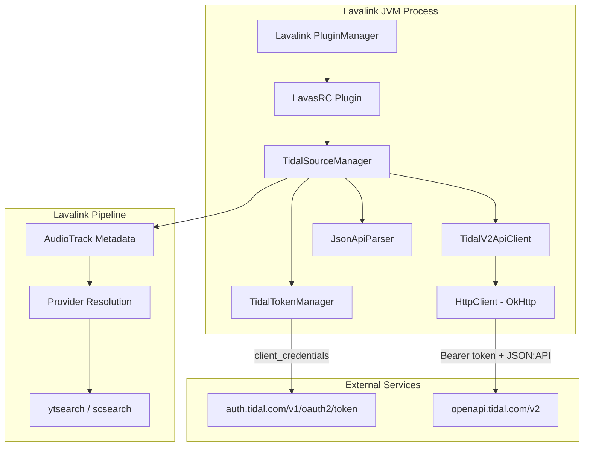

# Design Document: LavasRC Tidal v2 API Migration

## Overview

This design covers the rewrite of `TidalSourceManager` in LavasRC 4.8.3 to replace the legacy Tidal v1 API (`api.tidal.com/v1`) with the modern v2 API (`openapi.tidal.com/v2`). The v1 API requires the deprecated `r_usr` scope no longer obtainable via modern OAuth flows. The v2 API uses JSON:API format (`application/vnd.api+json`), supports `client_credentials` OAuth, and uses cursor-based pagination.

The rewrite is scoped to the `celesrenata/LavaSrc` fork. The modified plugin JAR is baked into the custom Lavalink image at `kube/lavalink/plugins/lavasrc-plugin-4.8.3.jar` and deployed as part of the HelloDJ pod.

### Goals

- Restore Tidal search and track resolution via the v2 API
- Maintain backward compatibility with existing `application.yml` configuration keys
- Support both static token and client_credentials OAuth flows
- Handle JSON:API response format including relationship resolution and cursor pagination
- Provide robust error handling with retry logic for transient failures

### Non-Goals

- Playback stream resolution (handled by the `tidal-stream` sidecar, not LavasRC)
- User-scoped operations (favorites, user playlists requiring user authorization)
- Migration to a newer LavasRC version (staying on 4.8.3 fork)

## Architecture



### Key Architectural Decisions

1. **Separate TidalTokenManager class** — Decouples token lifecycle (acquisition, caching, refresh) from the source manager. Allows the source manager to simply call `getToken()` and get a valid Bearer token.

2. **Dedicated JsonApiParser utility** — The JSON:API format is complex (compound documents, included resources, relationships). A dedicated parser avoids spreading JSON:API logic across every endpoint handler.

3. **OkHttp for HTTP** — LavasRC already uses OkHttp (via Lavaplayer's dependency). No new HTTP client needed.

4. **Minimal interface changes** — `TidalSourceManager` still implements `AudioSourceManager` and extends the LavasRC `ExtendedAudioSourceManager`. The public API surface remains identical; only internal HTTP calls and response parsing change.

## Components and Interfaces

### TidalSourceManager (modified)

The main entry point registered with Lavalink's source manager system.

```java
public class TidalSourceManager extends ExtendedAudioSourceManager {
    // Configuration (backward-compatible)
    private final String clientId;
    private final String clientSecret;
    private final String staticToken;
    private final String countryCode;
    private final int searchLimit;

    // Internal components
    private final TidalTokenManager tokenManager;
    private final TidalV2ApiClient apiClient;
    private final JsonApiParser jsonApiParser;

    // LavasRC interface methods (unchanged signatures)
    public AudioItem loadItem(AudioReference reference);
    public AudioItem search(String query, int limit);
    public AudioTrack loadTrack(String trackId);
    public List<AudioTrack> loadAlbum(String albumId);
    public List<AudioTrack> loadPlaylist(String playlistUuid);
}
```

### TidalTokenManager (new)

Manages OAuth token lifecycle.

```java
public class TidalTokenManager {
    private final String clientId;
    private final String clientSecret;
    private final String staticToken;  // null if using client_credentials
    private final OkHttpClient httpClient;

    private String cachedToken;
    private Instant tokenExpiry;

    // Returns a valid Bearer token, refreshing if needed
    public synchronized String getToken() throws TidalAuthException;

    // Force token invalidation (called on 401 responses)
    public synchronized void invalidateToken();
}
```

**Token Strategy:**
- If `staticToken` is configured (and no clientId/clientSecret), use it directly without refresh
- If `clientId` and `clientSecret` are configured, use `client_credentials` flow
- If both are configured, prefer `client_credentials` (per Requirement 9.3)
- Proactive refresh: refresh when token is within 60 seconds of expiry

### TidalV2ApiClient (new)

Encapsulates all HTTP communication with the Tidal v2 API.

```java
public class TidalV2ApiClient {
    private static final String BASE_URL = "https://openapi.tidal.com/v2";
    private static final String JSONAPI_MEDIA_TYPE = "application/vnd.api+json";

    private final OkHttpClient httpClient;
    private final TidalTokenManager tokenManager;
    private final String countryCode;

    // Search
    public JsonNode searchTracks(String query, int limit) throws TidalApiException;

    // Single resource
    public JsonNode getTrack(String trackId) throws TidalApiException;
    public JsonNode getAlbum(String albumId) throws TidalApiException;
    public JsonNode getPlaylist(String playlistUuid) throws TidalApiException;

    // Paginated collections
    public List<JsonNode> getAlbumTracks(String albumId, int maxTracks) throws TidalApiException;
    public List<JsonNode> getPlaylistTracks(String playlistUuid, int maxTracks) throws TidalApiException;

    // Internal: handles headers, auth, retries, error mapping
    private JsonNode executeRequest(Request request) throws TidalApiException;
    private void handleErrorResponse(int statusCode, Response response) throws TidalApiException;
}
```

**Request Construction:**
- All requests include `Authorization: Bearer {token}` and `Accept: application/vnd.api+json`
- Search: `GET /v2/searchresults/{query}?include=tracks&page[limit]={limit}&filter[countryCode]={cc}`
- Track: `GET /v2/tracks/{id}?include=artists,albums`
- Album tracks: `GET /v2/albums/{id}?include=items` (then follow pagination)
- Playlist tracks: `GET /v2/playlists/{uuid}?include=items` (then follow pagination)

### JsonApiParser (new)

Utility class for parsing JSON:API compound documents into LavasRC's internal model.

```java
public class JsonApiParser {
    // Parse a single track resource into AudioTrack metadata
    public TidalTrackInfo parseTrack(JsonNode resource, JsonNode included);

    // Parse a collection of track resources
    public List<TidalTrackInfo> parseTracks(JsonNode dataArray, JsonNode included);

    // Resolve a relationship by type+id against the included array
    public Optional<JsonNode> resolveRelationship(String type, String id, JsonNode included);

    // Extract pagination cursor from links.next
    public Optional<String> getNextPageUrl(JsonNode document);
}
```

### TidalTrackInfo (internal model)

```java
public class TidalTrackInfo {
    private final String id;
    private final String title;
    private final String artistName;
    private final String albumName;
    private final String albumArtUrl;
    private final String isrc;
    private final long durationMs;
    private final int trackNumber;
    private final String uri;  // "https://tidal.com/track/{id}"

    // Convert to Lavaplayer AudioTrackInfo
    public AudioTrackInfo toAudioTrackInfo();
}
```

### Error Handling Strategy (in TidalV2ApiClient)

```java
// Retry logic per requirement 8
private JsonNode executeWithRetry(Request request) throws TidalApiException {
    // Attempt 1
    // On 401: invalidate token, re-auth, retry once
    // On 429: read Retry-After header, sleep, retry once
    // On 5xx: sleep 2s, retry once
    // On final failure: throw TidalApiException (logged at WARN)
}
```

## Data Models

### Tidal v2 API Response Structures

**Search Response** (`GET /v2/searchresults/{query}?include=tracks`):
```json
{
  "data": {
    "type": "searchresults",
    "id": "{query}",
    "relationships": {
      "tracks": {
        "data": [
          { "type": "tracks", "id": "12345678" }
        ]
      }
    }
  },
  "included": [
    {
      "type": "tracks",
      "id": "12345678",
      "attributes": {
        "title": "Track Title",
        "duration": "PT3M45S",
        "isrc": "USRC12345678",
        "trackNumber": 1,
        "explicit": false,
        "popularity": 85
      },
      "relationships": {
        "artists": {
          "data": [{ "type": "artists", "id": "9876" }]
        },
        "albums": {
          "data": [{ "type": "albums", "id": "5555" }]
        }
      }
    },
    {
      "type": "artists",
      "id": "9876",
      "attributes": {
        "name": "Artist Name"
      }
    },
    {
      "type": "albums",
      "id": "5555",
      "attributes": {
        "title": "Album Name",
        "imageCover": [
          { "url": "https://resources.tidal.com/images/...", "width": 640, "height": 640 }
        ]
      }
    }
  ],
  "links": {
    "self": "https://openapi.tidal.com/v2/searchresults/...",
    "next": "https://openapi.tidal.com/v2/searchresults/...?page[cursor]=abc123"
  }
}
```

**Track Response** (`GET /v2/tracks/{id}?include=artists,albums`):
```json
{
  "data": {
    "type": "tracks",
    "id": "12345678",
    "attributes": {
      "title": "Track Title",
      "duration": "PT3M45S",
      "isrc": "USRC12345678",
      "trackNumber": 1
    },
    "relationships": {
      "artists": {
        "data": [{ "type": "artists", "id": "9876" }]
      },
      "albums": {
        "data": [{ "type": "albums", "id": "5555" }]
      }
    }
  },
  "included": [...]
}
```

### Duration Parsing

The v2 API returns duration in ISO 8601 duration format (e.g., `PT3M45S` = 225000ms). The parser must convert this to milliseconds for Lavaplayer's `AudioTrackInfo.length`.

```java
// java.time.Duration handles ISO 8601 parsing natively
long durationMs = Duration.parse(durationStr).toMillis();
```

### Internal Mapping: TidalTrackInfo → AudioTrackInfo

| TidalTrackInfo field | AudioTrackInfo field | Source |
|---|---|---|
| title | title | `data.attributes.title` |
| artistName | author | resolved from `relationships.artists` → `included[type=artists].attributes.name` |
| durationMs | length | parsed from `data.attributes.duration` (ISO 8601) |
| id | identifier | `data.id` |
| uri | uri | constructed: `https://tidal.com/track/{id}` |
| albumArtUrl | artworkUrl | resolved from `relationships.albums` → `included[type=albums].attributes.imageCover[0].url` |
| isrc | isrc (custom field) | `data.attributes.isrc` |

### Configuration Data Model (unchanged)

```yaml
plugins:
  lavasrc:
    tidal:
      clientId: ""        # OAuth client ID (optional)
      clientSecret: ""    # OAuth client secret (optional)
      token: ""           # Static Bearer token (optional, fallback)
      countryCode: "US"   # Default: US
      searchLimit: 6      # Default: 6
```

### URL Pattern Matching

| Pattern | Type | Example |
|---|---|---|
| `tidal.com/track/{id}` | Track | `https://tidal.com/track/12345678` |
| `tidal.com/browse/track/{id}` | Track | `https://tidal.com/browse/track/12345678` |
| `tidal.com/album/{id}` | Album | `https://tidal.com/album/98765` |
| `tidal.com/browse/album/{id}` | Album | `https://tidal.com/browse/album/98765` |
| `tidal.com/playlist/{uuid}` | Playlist | `https://tidal.com/playlist/a1b2c3d4-...` |
| `tidal.com/browse/playlist/{uuid}` | Playlist | `https://tidal.com/browse/playlist/a1b2c3d4-...` |
| `tdsearch:{query}` | Search | `tdsearch:artist name song` |
| `tdsearch:isrc:{code}` | ISRC search | `tdsearch:isrc:USRC12345678` |


## Correctness Properties

*A property is a characteristic or behavior that should hold true across all valid executions of a system — essentially, a formal statement about what the system should do. Properties serve as the bridge between human-readable specifications and machine-verifiable correctness guarantees.*

### Property 1: Token Lifecycle Correctness

*For any* valid OAuth token response with an arbitrary `access_token` string and `expires_in` value (> 60 seconds), the TidalTokenManager SHALL cache the token and return it on subsequent `getToken()` calls until the remaining lifetime drops to 60 seconds or below, at which point it SHALL trigger a refresh before returning.

**Validates: Requirements 1.2, 1.3**

### Property 2: URL Pattern Extraction Round-Trip

*For any* valid Tidal resource ID (numeric track/album ID or UUID playlist ID) embedded in any supported URL pattern (`tidal.com/track/{id}`, `tidal.com/browse/track/{id}`, `tidal.com/album/{id}`, `tidal.com/browse/album/{id}`, `tidal.com/playlist/{uuid}`, `tidal.com/browse/playlist/{uuid}`), the URL parser SHALL extract the correct resource type and ID such that reconstructing the canonical URL from the extracted values produces an equivalent reference.

**Validates: Requirements 3.1, 4.1, 5.1**

### Property 3: JSON:API Relationship Resolution

*For any* JSON:API compound document with an `included` array containing resources of various types and IDs, and *for any* relationship reference `{type, id}` that exists in the included array, the JsonApiParser SHALL resolve to the correct included resource. For references NOT present in included, it SHALL return empty without error.

**Validates: Requirements 6.2, 6.3**

### Property 4: Track Metadata Mapping Completeness

*For any* valid JSON:API track resource with attributes (title, duration as ISO 8601, isrc, trackNumber) and resolved artist/album relationships, the mapping to AudioTrackInfo SHALL preserve all fields: title maps to title, parsed duration maps to length in milliseconds, isrc is retained, first artist name maps to author, and the track URI is constructed as `https://tidal.com/track/{id}`.

**Validates: Requirements 2.3, 3.2, 10.1**

### Property 5: Pagination Completeness Up To Limit

*For any* paginated collection (album tracks or playlist tracks) with N total items spread across pages of arbitrary size, and a configured load limit L, the pagination logic SHALL accumulate min(N, L) tracks by following all `links.next` cursors until either no next link exists or the limit is reached.

**Validates: Requirements 4.3, 5.3**

### Property 6: Track Parsing Round-Trip

*For any* valid JSON:API track resource, parsing it into a TidalTrackInfo and then extracting the stored fields SHALL produce values equivalent to the original JSON attributes — specifically, `title == attributes.title`, `durationMs == Duration.parse(attributes.duration).toMillis()`, `isrc == attributes.isrc`, and `id == data.id`.

**Validates: Requirements 6.5**

### Property 7: Search Request Formation

*For any* non-empty search query string (including unicode, special characters, and ISRC-prefixed queries), the TidalV2ApiClient SHALL form a request URL where the query is properly URL-encoded, the `include=tracks` parameter is present, `page[limit]` matches the configured searchLimit, and `filter[countryCode]` matches the configured country code.

**Validates: Requirements 2.1, 2.5, 7.4, 10.2**

## Error Handling

### Token Acquisition Failures

| Condition | Behavior |
|---|---|
| Auth endpoint returns 4xx | Log error, retry once after 1s. On second failure, throw `TidalAuthException` |
| Auth endpoint returns 5xx | Log error, retry once after 1s. On second failure, throw `TidalAuthException` |
| Network timeout | Same as above |
| Invalid JSON response | Log error, throw `TidalAuthException` immediately (no retry) |
| Missing credentials at startup | Log WARN once, set `enabled=false`, return early from all load/search calls |

### API Request Failures

| HTTP Status | Behavior |
|---|---|
| 401 Unauthorized | Invalidate cached token → re-authenticate → retry request once |
| 429 Rate Limited | Read `Retry-After` header (seconds) → sleep → retry once |
| 404 Not Found | Return `AudioReference.NO_TRACK` (no-matches) — no retry |
| 5xx Server Error | Sleep 2s → retry once |
| Final failure (all retries exhausted) | Log at WARN level → return `FriendlyException` with severity `COMMON` |

### Graceful Degradation

- If Tidal source is enabled but token acquisition fails, the source returns "no matches" for all requests rather than propagating exceptions to Lavalink's core
- Other LavasRC sources (Spotify, YouTube) continue functioning regardless of Tidal failures
- Token refresh failures are retried on the next API call — a single refresh failure doesn't permanently disable the source

### Logging Strategy

| Level | When |
|---|---|
| INFO | Successful token acquisition/refresh, source initialization |
| WARN | All retries exhausted, invalid credentials at startup, unexpected response format |
| DEBUG | Individual request/response details, pagination progress, token refresh triggers |

## Testing Strategy

### Property-Based Testing

**Library:** [jqwik](https://jqwik.net/) (JUnit 5 platform, well-supported in Gradle/Java projects)

**Configuration:** Minimum 100 iterations per property test, configurable via `@Property(tries = 100)`.

Each property test is tagged with a comment referencing the design property:
```java
// Feature: lavasrc-tidal-v2, Property 1: Token lifecycle correctness
@Property(tries = 100)
void tokenCacheReturnsValidTokenUntilNearExpiry(...) { ... }
```

**Properties to implement:**
1. Token lifecycle (Property 1) — Generate random token strings + expiry durations, mock clock
2. URL pattern extraction (Property 2) — Generate random IDs, embed in URL variants
3. Relationship resolution (Property 3) — Generate random included arrays + references
4. Track metadata mapping (Property 4) — Generate random track attribute objects
5. Pagination completeness (Property 5) — Generate random page sequences with cursors
6. Parsing round-trip (Property 6) — Generate random valid track JSON documents
7. Search request formation (Property 7) — Generate random query strings with special chars

### Unit Tests (Example-Based)

| Area | Test Cases |
|---|---|
| Token precedence | Static token only; client_credentials only; both configured (prefers creds) |
| Error retry | 401 triggers re-auth + retry; 429 respects Retry-After; 5xx retries after 2s |
| Empty results | Search with 0 results; album/playlist with 0 tracks |
| 404 handling | Track/album/playlist not found → no-matches |
| Default config | countryCode defaults to "US"; searchLimit defaults to 6 |
| Headers | All requests have Authorization + Accept headers |
| Startup validation | Missing credentials → WARN log + disabled source |

### Integration Tests

| Test | Scope |
|---|---|
| Real token acquisition | Test against Tidal auth endpoint (requires real credentials, CI-only) |
| End-to-end search | Search → parse → AudioTrack creation with real API (CI-only) |
| Plugin loading | Verify the rebuilt JAR loads correctly in Lavalink |
| Config backward-compat | Load existing application.yml, verify no startup errors |

### Test Organization

```
main/test/java/com/github/topi314/lavasrc/tidal/
├── TidalTokenManagerTest.java          # Unit tests for token lifecycle
├── TidalTokenManagerPropertyTest.java  # Property tests (Property 1)
├── TidalV2ApiClientTest.java           # Unit tests with mocked HTTP
├── JsonApiParserTest.java              # Unit tests for parser
├── JsonApiParserPropertyTest.java      # Property tests (Properties 3, 4, 5, 6)
├── TidalUrlParserPropertyTest.java     # Property tests (Property 2)
├── TidalSearchPropertyTest.java        # Property tests (Property 7)
└── TidalSourceManagerTest.java         # Integration-style tests
```

### Build & Deployment Verification

1. `./gradlew :main:test` — runs all unit + property tests
2. `./gradlew :plugin:shadowJar` — builds the plugin JAR
3. Copy JAR to `kube/lavalink/plugins/lavasrc-plugin-4.8.3.jar`
4. Rebuild Lavalink image: `docker build -t registry.celestium.life/hellodj/lavalink:tidal-v2 -f kube/lavalink/Dockerfile kube/lavalink/`
5. Deploy and verify Tidal search works via bot commands
