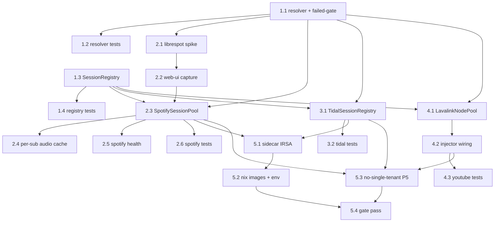

# Implementation Plan

Feature: Multi-Tenant Source Streaming

## Overview

All code changes are in the `hellodj` repo (bot + `platform/components/*`),
except the sidecar IAM which is CDK in `hellodj-cdk` (`workloads-stack.ts`).
Sidecars deploy via the pipeline; IAM via `cdk deploy hellodj-eks`. Every task
is test-first where practical and keeps components under the 500-line ceiling.
The shared resolver + session registry (section 1) are the foundation every
provider builds on; providers (sections 2–4) are independent of each other and
can proceed in parallel once section 1 lands.

## Tasks

## 1. Shared resolver + session registry (foundations)

- [x] 1.1 Add a typed `CredentialUnavailable` result and `refresh_status=failed` gate to the shared credential resolver
  - Promote/extend the existing `DynamoCredentialResolver` (`bot/playback/guild_credentials.py`) into a shared `UserCredentialResolver` usable by all sidecars + the bot (mirror-verbatim shared copy per the repo convention, or move into `hellodj_platform_logic` and re-export)
  - Return a typed `CredentialUnavailable(reason)` (`no_owner` / `no_credential` / `refresh_failed` / `decrypt_failed`) instead of bare `None`, preserving the existing `None`-fallback callers
  - Add the `refresh_status == "failed"` gate: an item marked failed resolves to `CredentialUnavailable(refresh_failed)`, never a token
  - Keep the read-only expiry re-read (one uncached re-read) and guild-keyed cache exactly as today
  - _Requirements: 1.1, 1.2, 1.5, 2.1, 2.2, 2.3_

- [x] 1.2 Write property tests for the resolver (read-only, freshness, failed-gate, no cross-user)
  - Property (P2): consumer never writes the item; expired token → exactly one uncached re-read; `refresh_status=failed` → `CredentialUnavailable`
  - Property (P1 partial): a resolution for guild A (owner A) never returns owner B's token under randomized concurrent access; cache key includes guild id
  - Use in-memory fakes for the store / owner lookup / decrypt (no boto3)
  - _Requirements: 1.2, 1.5, 2.1, 2.2, 2.3, 6.1_

- [x] 1.3 Implement the generic `SessionRegistry[sub, S]` (bounded LRU + idle eviction + per-sub state)
  - `get_or_create(sub, factory)`, LRU cap (`max_sessions`), idle sweeper (`idle_timeout`), `close_all()`
  - Per-`sub` `SessionState` = `building | ready | failed(reason) | closed`; a factory raise sets `failed(reason)` for that sub only and never crashes others
  - Live in the shared package so all three sidecars use one implementation
  - _Requirements: 6.2, 6.3, 7.2, 7.4, 8.1, 8.2, 8.4_

- [x] 1.4 Write property tests for `SessionRegistry` (bounds, eviction, isolation, honest failure)
  - Property (P3): never exceeds `max_sessions`; LRU/idle eviction closes evicted sessions; `close_all` closes all
  - Property (P4): a factory failure sets a SPECIFIC per-`sub` `failed(reason)` state, isolated from other subs, never green
  - Property (P1): registry keyed by `sub` — a `get(A)` never returns B's session under randomized concurrent `get_or_create`
  - _Requirements: 6.2, 6.3, 7.2, 7.4, 8.1, 8.2, 8.4_

## 2. Spotify — per-user librespot session pool

- [x] 2.1 Validate the librespot non-interactive credential model (Risk R-1 spike)
  - Confirm `librespot.core.Session` can be built per-user from a stored (non-interactive) credential blob; document the exact credential material the web-ui must capture at connect time
  - Record the finding in the design's Risks section; if interactive-only, define the web-ui one-time-capture contract before proceeding
  - _Requirements: 3.3_

- [x] 2.2 Update the web-ui Spotify connect flow to capture + store a librespot-usable per-user credential
  - Store the reusable credential inside the SAME envelope-encrypted `TokenState` blob (an `extra`/typed field), never a new plaintext field
  - Writer (web-ui), watchdog, and reader move together (no migration to preserve)
  - _Requirements: 3.3, 6.4, 10.3_

- [x] 2.3 Replace the global `_session` in `spotify-stream/app.py` with a `SpotifySessionPool`
  - `SpotifySessionPool = SessionRegistry[str, librespot.Session]`; session factory builds from the resolved per-user credential (task 1.1) with NO interactive OAuth at stream time
  - Route shape: `GET /stream/<guild_id>/<track_id>` + `/preload/<guild_id>/<track_id>`; resolve `guild→owner_sub` server-side, select the pool session
  - Delete the single ambient/default session (no shared-account fallback)
  - Non-Premium / invalid credential → per-`sub` `failed(not_premium|session_create_failed)`, scoped to that user
  - _Requirements: 3.1, 3.2, 3.3, 3.5, 3.6, 3.7, 10.5_

- [x] 2.4 Key the Spotify track audio cache by `(sub, track_id)`
  - _Requirements: 6.2, 8.3_

- [x] 2.5 Report multi-session Spotify health honestly
  - `/health` + `/auth/status` report live session count and per-`sub` states (including specific `failed` states); no single global status; no token material logged
  - _Requirements: 7.1, 7.3, 7.5_

- [x] 2.6 Write Spotify factory + isolation tests
  - Session builds from a stored credential; non-Premium rejected; per-`(sub,track)` cache never crosses users (P1); health reports per-sub states (P4)
  - _Requirements: 3.3, 3.5, 3.7, 6.1, 6.2, 7.3_

## 3. Tidal — per-request user token selection

- [x] 3.1 Replace the single startup-bound `refresh_secret_id` with a `TidalSessionRegistry`
  - `TidalSessionRegistry = SessionRegistry[str, TidalClient]`; each client uses the resolved per-user Tidal `TokenState` (task 1.1)
  - Route shape carries the guild id (path-embedded, mirroring Spotify); resolve `guild→owner_sub` server-side
  - Keep `app_id`/`callback_url` (single-app-id) as global config; only the per-user token varies; refresh stays owned by the watchdog (sidecar read-only)
  - No-credential guild → observable failure, no cross-user fallback
  - _Requirements: 5.1, 5.2, 5.3, 5.4, 10.5_

- [x] 3.2 Write Tidal per-user + isolation tests
  - Concurrent requests from different guilds use different users' tokens with no shared mutable token state (P1); refresh behavior unchanged; no-credential fails observably
  - _Requirements: 5.1, 5.2, 5.3, 5.4, 6.1_

## 4. YouTube / YouTube Music — Lavalink node pool

- [x] 4.1 Implement `LavalinkNodePool` mapping `owner_sub → node` behind the existing `swap_lock(node_key)` seam
  - Sticky `sub`→node assignment with LRU reassignment; least-loaded free-node pick; config-driven pool size (`HELLODJ_LAVALINK_NODE_POOL`), default size 1 (== today's behavior)
  - Preserve the single `POST /youtube` all-fields-together payload per node under the per-node lock
  - _Requirements: 4.1, 4.2, 4.3_

- [x] 4.2 Wire the node pool into `YouTubeCredentialInjector` resolution
  - A YouTube resolution: resolve `owner_sub` + credential (task 1.1, expiry re-read), pick the node for `owner_sub`, acquire its `swap_lock`, push, resolve under the lock
  - Guilds with NO connected YouTube credential trigger NO swap — untouched global push preserved
  - _Requirements: 4.1, 4.4, 4.5_

- [x] 4.3 Write YouTube node-pool tests
  - Up to pool size N distinct users resolve concurrently on distinct nodes (P1 isolation); within a node, per-resolution correctness under the lock; size 1 == serialized-correct; no-credential guild takes the global path
  - _Requirements: 4.1, 4.2, 4.4, 6.1_

## 5. IAM, packaging, and cross-cutting property tests

- [x] 5.1 Scope sidecar IRSA: core-table read (`SourceCredential` + `GUILD#*/OWNER`) + KMS Decrypt-only
  - In `hellodj-cdk` `workloads-stack.ts`: verify/extend spotify-stream + tidal-stream reader grants to cover the `GUILD#*/OWNER` items and confirm KMS Decrypt-only (no write/encrypt on token material); watchdog IAM unchanged
  - Add/adjust CDK jest assertions for the read scope + Decrypt-only
  - _Requirements: 9.2, 9.4_

- [x] 5.2 Confirm Nix images + env wiring for the new resolver
  - spotify-stream (Python librespot) + tidal-stream stay Nix-built (no Debian); add `HELLODJ_CORE_TABLE`, `HELLODJ_SOURCE_CREDS_KMS_KEY_ID`, `AWS_REGION`, session-pool tunables; per-user credential cache (if used) under `DATA_DIR/<sub>/`
  - _Requirements: 9.1, 9.3_

- [x] 5.3 Write the no-single-tenant-path property test (P5) across all providers
  - Assert no code path selects/uses a credential without a resolved owning `sub`; no ambient/default account exists for any provider
  - _Requirements: 10.4, 10.5_

- [x] 5.4 Full gate pass on touched trees
  - ruff + 500-line ceiling on spotify-stream, tidal-stream, bot playback, shared package; CDK tsc + jest for the IAM change
  - _Requirements: 7.5, 9.1, 9.2_

## Task Dependency Graph



```json
{
  "waves": [
    {
      "wave": 1,
      "tasks": ["1.1", "1.3"],
      "description": "Shared foundations: resolver + failed-gate and the generic SessionRegistry (no dependencies)."
    },
    {
      "wave": 2,
      "tasks": ["1.2", "1.4", "2.1", "3.1", "4.1"],
      "description": "Foundation tests + librespot spike + Tidal registry + YouTube node pool (each depends only on wave 1)."
    },
    {
      "wave": 3,
      "tasks": ["2.2", "3.2", "4.2"],
      "description": "Web-ui librespot capture, Tidal tests, YouTube injector wiring."
    },
    {
      "wave": 4,
      "tasks": ["2.3", "4.3"],
      "description": "SpotifySessionPool (needs 1.1, 1.3, 2.2); YouTube tests."
    },
    {
      "wave": 5,
      "tasks": ["2.4", "2.5", "2.6", "5.1"],
      "description": "Spotify audio cache + health + tests; sidecar IRSA."
    },
    {
      "wave": 6,
      "tasks": ["5.2", "5.3"],
      "description": "Nix images + env wiring; no-single-tenant-path property test."
    },
    {
      "wave": 7,
      "tasks": ["5.4"],
      "description": "Full gate pass on all touched trees."
    }
  ]
}
```

## Notes

- Section 1 (shared resolver + `SessionRegistry`) is the critical path; it must
  land before any provider. Sections 2 (Spotify), 3 (Tidal), and 4 (YouTube)
  are mutually independent and can be built in parallel by different sessions.
- Task 2.1 is a spike (Risk R-1): it gates the Spotify session-factory design.
  If librespot proves interactive-only, 2.2 changes to a one-time-capture at
  connect and the rest of section 2 is unaffected.
- No live migration exists (zero customers): the web-ui write path, watchdog,
  and readers may change together (task 2.2) without back-compat shims. No
  single-global-account path is retained for any provider (task 5.3 / P5).
- Property-based tests (P1–P5 in the design) are first-class: run them with the
  `pytest`/Hypothesis suites already used by the touched trees; flag any
  property-test run to the user per the repo's testing convention.
- Deploy order after implementation: push component sources → pipeline rebuilds
  images + pins the hellodj-repo image tag; run `cdk deploy hellodj-eks` for the
  IAM change (task 5.1) since foundation stacks do not ride the pipeline.

