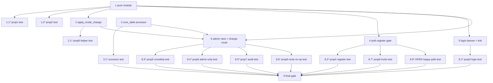

# Implementation Plan

## Overview

This plan builds the admin-controlled global registration mode bottom-up: first
the pure, side-effect-free `registration_mode.py` helper (the single source of
truth both enforcement and display import) together with its property tests,
then the narrow `ConfigStore.core_table` accessor the audit write needs. Once the
pure module exists, the three consumers — the `auth.register` enforcement gate,
the login banner + conditional Register link, and the admin view + change route —
can proceed in parallel because they touch different files. Route tests with the
Flask test client cover the remaining properties, and a final gate task runs
ruff, pytest, and the line-count ceiling. This is web-ui only; no bot or infra
tasks.

## Tasks

- [ ] 1. Create the pure registration-mode helper module
  - Add `platform/components/web-ui/registration_mode.py` with constants `OPEN`, `CLOSED`, `VALID_MODES`, `CONFIG_KEY` (`"registration_mode"`), `BANNER_OPEN`, `BANNER_CLOSED`
  - Implement `normalize_mode(raw)` (trim + upper-case a string; anything not exactly `OPEN`/`CLOSED` → `CLOSED`), `current_mode(config)` (reads `CONFIG_KEY` off a global-config payload or `None`), `is_open(config)`, and `banner_text(mode)`
  - Keep it dependency-free (no `boto3`, no Flask) so it is trivially unit- and property-testable and shared by both enforcement and display
  - _Requirements: 1.1, 1.2, 1.3, 3.1, 3.2_

  - [ ]* 1.1 Write property test for the secure default
    - **Feature: registration-mode-control, Property 1: Secure default for absent or invalid values**
    - Hypothesis: generate arbitrary raw values (missing key, `None`, ints, random strings excluding valid modes) → assert `current_mode`/`normalize_mode` returns `CLOSED` (≥100 iterations)
    - **Validates: Requirements 1.1, 1.3**

  - [ ]* 1.2 Write property test for valid-value passthrough
    - **Feature: registration-mode-control, Property 2: Valid stored value passes through**
    - Hypothesis: generate `OPEN`/`CLOSED` with random casing and surrounding whitespace → assert canonical upper-case passthrough (≥100 iterations)
    - **Validates: Requirements 1.2**

- [ ] 2. Add the audit-then-persist apply helper to the pure module
  - Add `apply_mode_change(config_store, core_table, *, requested, admin_sub)` to `registration_mode.py`: compute `current` via `current_mode(config_store.get_global())`, normalize `requested`; if `new == current` return `current` and write nothing (no-op)
  - Otherwise write the audit row first via `core_table.put_new(GLOBAL_CONFIG_PK, f"REGMODEAUDIT#{at}#{secrets.token_hex(4)}", "RegistrationModeAudit", {admin_sub, old, new, at})`, then persist via `config_store.set_global({CONFIG_KEY: new})` (write-before-apply so a failed audit aborts the change)
  - Take `ConfigStore` + `CoreTable` as arguments (no Flask globals); add an ISO-8601 `_now_iso()` timestamp helper
  - _Requirements: 4.2, 5.1, 5.2_

  - [ ]* 2.1 Write property test for the idempotent no-op at the helper level
    - **Feature: registration-mode-control, Property 8: Unchanged submission is idempotent**
    - Use a fake in-memory `ConfigStore` + spy `CoreTable`: for each current mode, call `apply_mode_change` with `requested == current` → assert return equals current, `set_global` not called with a change, and `put_new` never invoked
    - **Validates: Requirements 5.2**

- [ ] 3. Expose a read-only `core_table` accessor on `ConfigStore`
  - In `platform/components/web-ui/config_store.py`, add a `core_table` property returning the underlying `CoreTable` (`self._core`) so the audit write uses the same table as the config without reaching into a private attribute
  - _Requirements: 5.1_

  - [ ]* 3.1 Write unit test for the accessor
    - Assert `ConfigStore(core).core_table is core`
    - _Requirements: 5.1_

- [ ] 4. Enforce the mode at the `auth.register` route
  - In `platform/components/web-ui/auth.py`, add a module-local `_global_config()` reading `current_app.extensions["config_store"].get_global()` (or `{}` in no-datastore mode ⇒ secure `CLOSED`)
  - Gate `register()` on both GET and POST: after `route_auth(...)`, if not `registration_mode.is_open(_global_config())` redirect to `url_for("pages.login", registration="closed")` before rendering the form or calling `handle_register`; when OPEN call `handle_register()` unchanged
  - Leave the `/invite/<token>` route in `invite_public_routes.py` untouched
  - _Requirements: 2.1, 2.2, 2.3, 2.4, 2.5_

- [ ] 5. Add the login-page banner and conditional Register link
  - In `platform/components/web-ui/pages.py`, have `pages.login` read the current mode and pass `registration_mode`, `registration_open`, `registration_banner` (via `registration_mode.banner_text`), and `registration_closed_notice` (`request.args.get("registration") == "closed"`) into the template
  - Edit `templates/pages/login.html`: reuse the existing `aria-live` region to show the closed notice and the fixed per-mode banner text; render the `auth.register` link only when `registration_open`; preserve the dark-glass styling
  - _Requirements: 3.1, 3.2, 3.3, 3.4_

- [ ] 6. Add the admin view and change route
  - In `platform/components/web-ui/pages.py`, have `pages.admin` pass `registration_mode` and `registration_open` into `admin.html` (admin gate already redirects non-admins before render, so the control is never emitted to a non-admin)
  - Add `POST /admin/registration-mode` (`admin_set_registration_mode`) with the two-layer guard from `entitlement_routes.py`: `_require_login` → redirect login; `_is_admin` → redirect dashboard; hardened in-body `_is_admin` fallback → `session.clear()` + `403`; then resolve `config_store`/`core_table` off `current_app.extensions`, call `registration_mode.apply_mode_change(...)` with `admin_sub` from `session["user"]["sub"]`, and redirect back with a `regmode` notice (`unavailable` when no store)
  - Edit `templates/pages/admin.html`: add a glass-panel self-registration section showing the current mode and OPEN/CLOSED buttons that POST to the new route
  - _Requirements: 4.1, 4.2, 4.3, 4.4, 5.1, 5.2_

- [ ] 7. Checkpoint - Ensure all tests pass
  - Ensure all tests pass, ask the user if questions arise.

- [ ] 8. Write Flask test-client route tests
  - Add `tests/test_registration_mode_routes.py` using in-memory `CoreTable`/`ConfigStore` fakes, a spy `CognitoAuth`, and a session-injecting test client (in-process, no AWS/Cognito)

  - [ ]* 8.1 Test login page reflects the current mode
    - **Feature: registration-mode-control, Property 3: Login page reflects the current mode**
    - Render `/login` with each mode; assert exact `BANNER_OPEN`/`BANNER_CLOSED` strings and Register-link presence iff `OPEN`
    - **Validates: Requirements 3.1, 3.2, 3.3, 3.4**

  - [ ]* 8.2 Test CLOSED rejects registration on GET and POST
    - **Feature: registration-mode-control, Property 4: CLOSED rejects registration on GET and POST**
    - Over both methods with mode `CLOSED` and a spy `CognitoAuth`: assert 302 to login with `registration=closed`, form not in body, and `sign_up` never called
    - **Validates: Requirements 2.1, 2.2**

  - [ ]* 8.3 Test admin mode change round-trips
    - **Feature: registration-mode-control, Property 5: Admin mode change round-trips**
    - As an admin session, POST each target mode to `/admin/registration-mode`; assert `get_global()`/`current_mode` reflects the submitted target (both directions)
    - **Validates: Requirements 2.3, 4.2**

  - [ ]* 8.4 Test only admins can change the mode
    - **Feature: registration-mode-control, Property 6: Only admins can change the mode**
    - For anonymous and Discord non-admin sessions and each target value, POST the change route; assert redirect/403 and `get_global()` unchanged; GET `/admin` redirects (control never rendered)
    - **Validates: Requirements 4.3, 4.4**

  - [ ]* 8.5 Test every actual change is audited
    - **Feature: registration-mode-control, Property 7: Every actual change is audited**
    - Perform each change direction as admin; assert exactly one `REGMODEAUDIT#` item on `CONFIG#GLOBAL` with `admin_sub`, correct `old`/`new`, and an `at` timestamp
    - **Validates: Requirements 5.1**

  - [ ]* 8.6 Test unchanged submission is idempotent at the route level
    - **Feature: registration-mode-control, Property 8: Unchanged submission is idempotent**
    - POST the current mode as admin; assert mode unchanged and no new `REGMODEAUDIT#` item
    - **Validates: Requirements 5.2**

  - [ ]* 8.7 Test invites are independent of the mode
    - **Feature: registration-mode-control, Property 9: Invites are independent of the mode**
    - For each mode, GET `/invite/<token>` with a fake invite service; assert the request reaches invite handling and is never redirected by the mode gate
    - **Validates: Requirements 2.5**

  - [ ]* 8.8 Test the OPEN happy path
    - GET `/auth/register` with mode `OPEN` renders the form; POST reaches `handle_register` → `sign_up`; existing register tests remain green
    - _Requirements: 2.3, 2.4_

- [ ] 9. Final gate - lint, tests, and line-count ceiling
  - Run `ruff check --target-version py314 .` in `platform/components/web-ui` and fix any findings
  - Run `python3 -m pytest tests/ -q` in `platform/components/web-ui` and fix any failures
  - Run `python3 platform/tools/check_line_count.py platform/components/web-ui` and ensure every touched file stays under the 500-line ceiling
  - _Requirements: 1.1, 1.2, 1.3, 2.1, 2.2, 2.3, 2.4, 2.5, 3.1, 3.2, 3.3, 3.4, 4.1, 4.2, 4.3, 4.4, 5.1, 5.2_

## Notes

- Tasks marked with `*` are optional test sub-tasks and can be skipped for a faster MVP; core implementation tasks are never optional.
- Each task references specific requirements clauses for traceability.
- Property tests validate the universal correctness properties from the design; each references its property number and the requirements clause it checks.
- The pure module (task 1) and its apply helper (task 2) are the shared contract that enforcement, the login banner, and the admin route all depend on, so they come first.
- Tasks 4, 5, and 6 touch different files (`auth.py`, `login.html`/`pages.login`, `pages.py`/`admin.html`) and can run in parallel once the pure module and the `ConfigStore` accessor exist.

## Task Dependency Graph



```json
{
  "waves": [
    { "id": 0, "tasks": ["1", "3"] },
    { "id": 1, "tasks": ["1.1", "1.2", "2", "3.1"] },
    { "id": 2, "tasks": ["2.1", "4", "5"] },
    { "id": 3, "tasks": ["6"] },
    { "id": 4, "tasks": ["8.1", "8.2", "8.3", "8.4", "8.5", "8.6", "8.7", "8.8"] },
    { "id": 5, "tasks": ["9"] }
  ]
}
```
