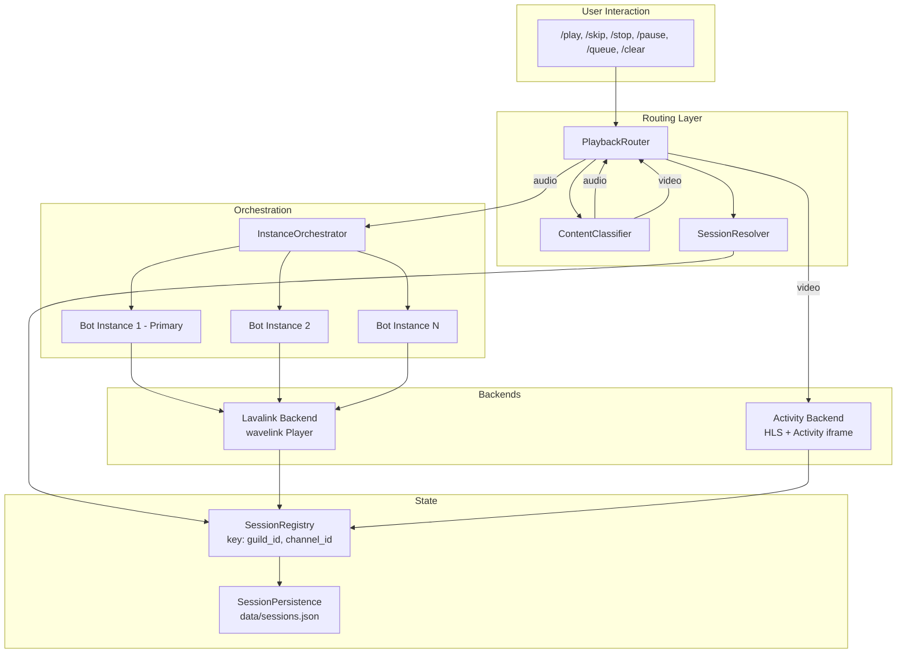

# Design Document: Unified Playback

## Overview

The Unified Playback system consolidates HelloDJ's two independent playback engines — Lavalink audio and Discord Activity video — behind a single routing layer. Users interact with one command namespace (`/play`, `/skip`, `/stop`, `/pause`, `/queue`, `/clear`) that automatically detects content type and dispatches to the correct backend. The system also introduces multi-channel video sessions (composite key registry), multi-instance music orchestration (multiple bot tokens sharing one Lavalink sidecar), and a deprecation pathway for legacy `/video` commands.

### Design Goals

1. **Single command surface** — Users never need to choose between `/play` and `/video play`; the router decides.
2. **Channel-scoped sessions** — Every playback session is identified by `(guild_id, channel_id)`, enabling simultaneous video Activities in different channels.
3. **Multi-instance music** — Additional bot applications (separate tokens) can be orchestrated to serve music in multiple channels within a single guild, working around Discord's one-voice-connection-per-bot constraint.
4. **Backward compatibility** — Legacy `/video` commands continue to work during a configurable transition period with deprecation notices.
5. **Zero-downtime migration** — Session persistence migrates from `guild_id` keys to composite keys transparently on first load.

### Non-Goals

- Mixing audio and video into a single stream (they remain separate backends).
- Auto-switching between audio and video mid-queue (each queue is backend-homogeneous).
- Running secondary bot instances in separate pods (all instances share the single pod with Lavalink sidecar).

---

## Architecture



### Key Architectural Decisions

| Decision | Rationale |
|----------|-----------|
| PlaybackRouter is a standalone module, not a cog | Keeps routing logic testable in isolation; cogs delegate to it |
| ContentClassifier is pure/synchronous | No I/O needed for URL pattern matching; fast and easily property-testable |
| SessionRegistry uses `(guild_id, channel_id)` tuple | Enables multiple simultaneous video sessions per guild |
| InstanceOrchestrator lives in the primary bot process | Only the primary bot registers slash commands; secondaries connect voice only |
| Secondary instances are `discord.Client` (not `commands.Bot`) | They don't need command trees, just voice connection capability |
| Shared Lavalink sidecar with multiple wavelink sessions | Lavalink natively supports multiple client sessions; no extra infrastructure needed |

---

## Components and Interfaces

### 1. PlaybackRouter (`bot/playback/router.py`)

The central dispatch layer. Receives all playback commands, resolves the active session, and delegates to the correct backend.

```python
class PlaybackRouter:
    """Routes playback commands to the appropriate backend."""

    def __init__(
        self,
        classifier: ContentClassifier,
        registry: SessionRegistry,
        orchestrator: InstanceOrchestrator,
        activity_backend: ActivityBackend,
    ) -> None: ...

    async def play(
        self,
        interaction: discord.Interaction,
        query: str,
        *,
        mode: Literal["auto", "audio", "video"] = "auto",
        attachment: discord.Attachment | None = None,
    ) -> None:
        """Classify content → resolve or create session → enqueue/play."""

    async def skip(self, interaction: discord.Interaction) -> None:
        """Skip current track in the user's channel session."""

    async def stop(self, interaction: discord.Interaction) -> None:
        """Stop playback and tear down the session."""

    async def pause(self, interaction: discord.Interaction) -> None:
        """Toggle pause on the active session."""

    async def queue(self, interaction: discord.Interaction) -> None:
        """Display queue for the active session."""

    async def clear(self, interaction: discord.Interaction) -> None:
        """Clear the queue for the active session."""

    def _resolve_session(
        self, guild_id: int, channel_id: int
    ) -> ChannelSession | None:
        """Look up active session by composite key."""

    def _resolve_user_channel(
        self, interaction: discord.Interaction
    ) -> int | None:
        """Extract channel_id from interaction's voice state."""
```

### 2. ContentClassifier (`bot/playback/classifier.py`)

Pure, synchronous classification of user input into `audio` or `video` content type.

```python
class ContentType(Enum):
    AUDIO = "audio"
    VIDEO = "video"

@dataclass(frozen=True)
class ClassificationResult:
    content_type: ContentType
    source_hint: str  # e.g. "youtube", "spotify", "tidal_video", "direct_url"
    confidence: Literal["definite", "default"]  # "default" = ambiguous, fell through

def classify(
    query: str,
    *,
    mode: Literal["auto", "audio", "video"] = "auto",
    attachment_content_type: str | None = None,
) -> ClassificationResult:
    """Classify input into audio or video.

    Rules (in priority order):
    1. Explicit mode override → use that type directly.
    2. Attachment with video/ MIME → video.
    3. YouTube Music URL → audio (definite).
    4. Spotify URL or spsearch: → audio (definite).
    5. Tidal URL with /video/ path → video (definite).
    6. Tidal URL without /video/ or tdsearch: → audio (definite).
    7. SoundCloud URL → audio (definite).
    8. URL ending in video extension (.mp4, .webm, .mkv, .avi, .mov, .m4v) → video (definite).
    9. YouTube video URL (youtube.com/watch, youtu.be) → audio (default).
    10. Unrecognized URL (no known domain, no video extension) → video (default).
    11. Plain text query → audio (default).
    """
```

### 3. SessionRegistry (`bot/playback/session_registry.py`)

Refactored from the current `bot/video/session_registry.py`. Now stores both audio and video sessions under composite keys.

```python
@dataclass
class ChannelSession:
    guild_id: int
    channel_id: int
    session_type: Literal["audio", "video"]
    started_at: float  # time.time()
    # Audio-specific
    bot_instance_id: str | None = None  # which bot instance owns this
    player: wavelink.Player | None = None
    # Video-specific
    streamer: ActivityStreamer | None = None

CompositeKey = tuple[int, int]  # (guild_id, channel_id)

class SessionRegistry:
    """Central registry of all active playback sessions."""

    def __init__(self) -> None:
        self._sessions: dict[CompositeKey, ChannelSession] = {}
        self._grace_tasks: dict[CompositeKey, asyncio.Task] = {}

    def register(self, session: ChannelSession) -> None: ...
    def unregister(self, guild_id: int, channel_id: int) -> None: ...
    def get(self, guild_id: int, channel_id: int) -> ChannelSession | None: ...
    def get_by_guild(self, guild_id: int) -> list[ChannelSession]: ...
    def get_audio_sessions(self, guild_id: int) -> list[ChannelSession]: ...
    def get_video_sessions(self, guild_id: int) -> list[ChannelSession]: ...
    def active_keys(self) -> list[CompositeKey]: ...
```

### 4. InstanceOrchestrator (`bot/playback/orchestrator.py`)

Manages multiple bot application connections for music playback across channels.

```python
@dataclass
class BotInstance:
    index: int
    client: discord.Client
    token: str
    application_id: int
    status: Literal["available", "connected", "unhealthy"]
    channel_id: int | None = None  # currently connected channel
    guild_id: int | None = None
    last_health_check: float = 0.0

class InstanceOrchestrator:
    """Manages multiple bot instances for multi-channel music."""

    def __init__(self, primary_bot: commands.Bot, registry: SessionRegistry) -> None:
        self._primary = primary_bot
        self._registry = registry
        self._instances: list[BotInstance] = []
        self._lavalink_node: wavelink.Node | None = None  # shared

    async def initialize(self) -> None:
        """Load instance credentials from credential store, connect clients."""

    async def assign_instance(
        self, guild_id: int, channel_id: int
    ) -> BotInstance | None:
        """Find and assign an available instance to a channel. Returns None if all busy."""

    async def release_instance(self, guild_id: int, channel_id: int) -> None:
        """Release a bot instance when playback ends."""

    def get_instance_for_channel(
        self, guild_id: int, channel_id: int
    ) -> BotInstance | None:
        """Get the instance currently serving a channel."""

    async def health_check(self) -> None:
        """Periodic health check of all instances (called from background task)."""

    def _get_available_instance(self) -> BotInstance | None:
        """Return the first instance with status 'available'."""
```

### 5. Unified Command Surface (`bot/cogs/playback.py`)

A new `PlaybackCog` that registers the unified commands and delegates to `PlaybackRouter`.

```python
class PlaybackCog(commands.Cog, name="Playback"):
    """Unified playback commands — audio and video through one interface."""

    def __init__(self, bot: commands.Bot, router: PlaybackRouter) -> None:
        self.bot = bot
        self.router = router

    @app_commands.command(name="play")
    @app_commands.describe(
        query="Song name, URL, or video link",
        mode="Force audio or video playback (default: auto-detect)",
    )
    async def play(
        self,
        interaction: discord.Interaction,
        query: str,
        mode: Literal["auto", "audio", "video"] = "auto",
        attachment: discord.Attachment | None = None,
    ) -> None: ...

    @app_commands.command(name="skip")
    async def skip(self, interaction: discord.Interaction) -> None: ...

    @app_commands.command(name="stop")
    async def stop(self, interaction: discord.Interaction) -> None: ...

    @app_commands.command(name="pause")
    async def pause(self, interaction: discord.Interaction) -> None: ...

    @app_commands.command(name="queue")
    async def queue(self, interaction: discord.Interaction) -> None: ...

    @app_commands.command(name="clear")
    async def clear(self, interaction: discord.Interaction) -> None: ...
```

### 6. Legacy Deprecation Layer (modified `bot/cogs/video.py`)

The existing `VideoCog` is preserved but modified to:
1. Check if the legacy transition period is active (`cfg("playback.legacy_video_enabled")`).
2. If active: execute the action via `PlaybackRouter` and append a deprecation notice.
3. If guild has immediate migration: reject with ephemeral message showing the new command.
4. If transition period is disabled globally: reject all `/video` commands.

### 7. Session Persistence (`bot/playback/persistence.py`)

Extends `bot/session.py` to support composite keys and session type metadata.

```python
async def save_session(
    guild_id: int,
    channel_id: int,
    *,
    session_type: Literal["audio", "video"],
    voice_channel_id: int | None,
    text_channel_id: int | None,
    current: dict | None,
    queue: list[dict],
    auto_resume: bool = True,
    # ... existing fields (source_provider, repeat_mode, filters, etc.)
) -> None: ...

async def load_all() -> dict[tuple[int, int], dict]:
    """Load and migrate all sessions. Migrates legacy guild_id keys to composite."""

async def migrate_legacy(data: dict[str, dict]) -> dict[str, dict]:
    """Convert guild_id-keyed entries to (guild_id, channel_id) keyed entries."""
```

---

## Data Models

### ChannelSession

```python
@dataclass
class ChannelSession:
    """Represents an active playback session scoped to a specific voice channel."""
    guild_id: int
    channel_id: int
    session_type: Literal["audio", "video"]
    started_at: float                          # time.time() when session began
    bot_instance_id: str | None = None         # For audio: which bot instance
    player: wavelink.Player | None = None      # For audio: wavelink player ref
    streamer: ActivityStreamer | None = None    # For video: streamer ref
    text_channel_id: int | None = None         # Where to send embeds
    queue: list[dict] = field(default_factory=list)
    current: dict | None = None
    auto_resume: bool = True
```

### BotInstance

```python
@dataclass
class BotInstance:
    """A secondary bot application used for multi-channel music."""
    index: int                                  # 0-based instance index
    client: discord.Client                      # The Discord client
    token: str                                  # Bot token (from credential store)
    application_id: int                         # Discord application ID
    status: Literal["available", "connected", "unhealthy"]
    channel_id: int | None = None               # Currently connected channel
    guild_id: int | None = None                 # Currently connected guild
    last_health_check: float = 0.0              # Last successful health check time
    display_name: str = ""                      # Human-readable name for error messages
```

### ClassificationResult

```python
@dataclass(frozen=True)
class ClassificationResult:
    """Output of ContentClassifier.classify()."""
    content_type: ContentType                   # AUDIO or VIDEO
    source_hint: str                            # Provider hint for resolution
    confidence: Literal["definite", "default"]  # Whether classification was certain
```

### Persisted Session (JSON schema — `data/sessions.json`)

```json
{
  "guild_id:channel_id": {
    "session_type": "audio",
    "voice_channel_id": 123456789,
    "text_channel_id": 987654321,
    "current": {"webpage_url": "...", "title": "...", "author": "...", "duration": 240000},
    "queue": [...],
    "auto_resume": true,
    "source_provider": "youtube",
    "repeat_mode": "off",
    "filters": {},
    "crossfade_seconds": 0.0,
    "tune_enabled": false,
    "updated_at": "2026-01-01T00:00:00+00:00",
    "bot_instance_index": 0
  }
}
```

### Credential Store Keys (Instance Orchestrator)

| Key | Value |
|-----|-------|
| `instance.0.token` | Bot token for instance 0 |
| `instance.0.app_id` | Application ID for instance 0 |
| `instance.0.name` | Display name (e.g., "HelloDJ #2") |
| `instance.1.token` | Bot token for instance 1 |
| `instance.1.app_id` | Application ID for instance 1 |
| `instance.1.name` | Display name (e.g., "HelloDJ #3") |
| `playback.instance_count` | Number of secondary instances configured (2–10) |
| `playback.legacy_video_enabled` | "true"/"false" — transition period toggle |

## Correctness Properties

*A property is a characteristic or behavior that should hold true across all valid executions of a system — essentially, a formal statement about what the system should do. Properties serve as the bridge between human-readable specifications and machine-verifiable correctness guarantees.*

### Property 1: Command dispatch follows session type

*For any* playback control command (skip, stop, pause, queue, clear) and any active session in the user's channel, the PlaybackRouter SHALL delegate the command to the backend matching the session's `session_type` — Lavalink for "audio", Activity for "video".

**Validates: Requirements 2.1, 2.2, 2.3, 2.4, 2.5, 2.6, 2.7, 2.8, 7.2, 7.3**

### Property 2: Explicit mode overrides classification

*For any* input query (URL, search text, or attachment) and any explicit `mode` parameter ("audio" or "video"), the PlaybackRouter SHALL route to the backend matching the explicit mode, regardless of what the ContentClassifier would determine.

**Validates: Requirements 1.5, 1.6**

### Property 3: Audio domain classification

*For any* URL whose hostname belongs to a recognized audio platform (music.youtube.com, open.spotify.com, soundcloud.com, tidal.com without /video/ path) or query with a recognized audio prefix (spsearch:, tdsearch:), the ContentClassifier SHALL return `content_type=AUDIO` with `confidence="definite"`.

**Validates: Requirements 3.1, 3.2, 3.3, 3.4**

### Property 4: Video indicator classification

*For any* input that is either (a) an attachment with a MIME type starting with "video/" or (b) a URL ending in a video extension (.mp4, .webm, .mkv, .avi, .mov, .m4v) or (c) a Tidal URL whose path matches `/video/<id>` or `/browse/video/<id>`, the ContentClassifier SHALL return `content_type=VIDEO` with `confidence="definite"`.

**Validates: Requirements 3.5, 3.6, 3.9**

### Property 5: Default audio classification for ambiguous and text inputs

*For any* YouTube video URL (youtube.com/watch, youtu.be) or plain text search query without URL or recognized prefix, the ContentClassifier SHALL return `content_type=AUDIO` with `confidence="default"`.

**Validates: Requirements 3.7, 3.8**

### Property 6: Unknown URL defaults to video

*For any* URL that does not match a recognized audio domain (YouTube, Spotify, SoundCloud, Tidal) and does not end in a recognized video extension, the ContentClassifier SHALL return `content_type=VIDEO` with `confidence="default"`.

**Validates: Requirements 3.10**

### Property 7: Composite key session independence

*For any* set of sessions registered under the same guild_id but different channel_ids, registering, retrieving, or unregistering a session at one composite key SHALL NOT affect sessions at other composite keys within the same guild.

**Validates: Requirements 4.1, 4.2, 4.3, 4.4**

### Property 8: Single-instance audio channel exclusivity

*For any* guild where a specific Bot_Instance has an active audio session in channel A, if a user in a different channel B of the same guild requests audio playback via that same instance, the PlaybackRouter SHALL reject the request. After the session in channel A ends (unregistered), the same request from channel B SHALL be accepted.

**Validates: Requirements 5.1, 5.5**

### Property 9: Audio does not block video

*For any* guild with an active Lavalink audio session in channel A, a video Activity request from any channel (including channel B ≠ A) SHALL succeed without blocking or interfering with the audio session.

**Validates: Requirements 5.2**

### Property 10: Same-channel audio enqueues

*For any* active audio session in a channel, if a user in that same channel invokes `/play` with audio content, the track SHALL be appended to the existing session's queue (queue length grows by one) rather than creating a new session.

**Validates: Requirements 5.3**

### Property 11: Instance assignment picks first available

*For any* set of Bot_Instances where at least one has status "available", when a new channel needs an instance, the InstanceOrchestrator SHALL assign one of the available instances (never an instance with status "connected" or "unhealthy").

**Validates: Requirements 6.2, 6.8**

### Property 12: Existing instance routing

*For any* channel that already has a Bot_Instance connected to it, the InstanceOrchestrator SHALL route new audio requests for that channel to the existing instance without reassignment.

**Validates: Requirements 6.3**

### Property 13: Dual-session tie-breaking by timestamp

*For any* channel with both an active audio and video session, the PlaybackRouter SHALL route commands to the session with the more recent `started_at` timestamp.

**Validates: Requirements 7.4**

### Property 14: Queue display formatting

*For any* queue item with a title of arbitrary length and a duration value, the queue display SHALL (a) prefix with 🎵 for audio or 🎬 for video, (b) truncate the title to 100 characters if longer, and (c) format duration as M:SS for durations < 1 hour, H:MM:SS for ≥ 1 hour, or "Live" when duration is 0 or unknown.

**Validates: Requirements 8.2, 8.3**

### Property 15: Queue pagination

*For any* queue of length N, the display SHALL show `ceil(N / 10)` pages, with previous button disabled on page 1 and next button disabled on the last page.

**Validates: Requirements 8.4**

### Property 16: Legacy command transition behavior

*For any* `/video` subcommand invoked while the legacy transition period is enabled and the guild has NOT configured immediate migration, the system SHALL execute the action AND include a deprecation notice string containing the equivalent unified command name in the same response message.

**Validates: Requirements 9.1, 9.2, 9.3**

### Property 17: Legacy command rejection when disabled

*For any* `/video` subcommand invoked when either (a) the guild has configured immediate migration or (b) the global legacy transition is disabled, the system SHALL reject the command and the response SHALL contain the name of the equivalent unified replacement command.

**Validates: Requirements 9.4, 9.5**

### Property 18: Session persistence round-trip

*For any* valid ChannelSession (audio or video), saving it to persistence and loading it back SHALL produce an equivalent record with the same composite key `(guild_id, channel_id)`, `session_type`, queue contents, and current track data.

**Validates: Requirements 10.1, 10.3**

### Property 19: Video sessions not auto-resumed

*For any* persisted session with `session_type="video"`, the restore process SHALL NOT attempt voice reconnection or Activity relaunch for that session, regardless of the `auto_resume` flag value.

**Validates: Requirements 10.4**

### Property 20: Legacy key migration

*For any* persisted session record keyed by guild_id alone (legacy format) that contains a valid `voice_channel_id` field, the migration process SHALL produce a record keyed by `(guild_id, voice_channel_id)` with all other fields preserved unchanged.

**Validates: Requirements 10.5**

## Error Handling

### PlaybackRouter Errors

| Condition | Response | Ephemeral |
|-----------|----------|-----------|
| User not in any voice channel | "Join a voice channel first." | Yes |
| No active session in user's channel | "No active session in your channel." | Yes |
| Audio requested but instance busy in another channel | "Music is playing in **{channel_name}** — join that channel or wait for it to finish." | Yes |
| All bot instances occupied | "All music slots are in use:\n• {channel_name} — {instance_name}\n..." | Yes |
| Content classification failed (e.g., URL unreachable) | "Could not determine content type. Try specifying `mode:audio` or `mode:video`." | Yes |

### InstanceOrchestrator Errors

| Condition | Behavior |
|-----------|----------|
| Instance fails health check (10s timeout) | Mark "unhealthy", skip in assignment, log warning |
| Instance disconnects unexpectedly | Set status "available", clear channel assignment, log info |
| Credential store missing instance keys | Log error at startup, reduce available instance count |
| Secondary client login fails | Mark "unhealthy", retry on next health check cycle |

### Session Persistence Errors

| Condition | Behavior |
|-----------|----------|
| Legacy record missing voice_channel_id | Skip that record, log warning, continue migration |
| Restored channel no longer exists | Mark session "suspended", keep data on disk, log reason |
| Bot lacks permission to join restored channel | Mark session "suspended", log reason |
| Track resolution fails on restore | Mark session "suspended" with partial queue, log which tracks failed |
| sessions.json is corrupt/unreadable | Start with empty state, log error (same as current behavior) |

### ContentClassifier Edge Cases

| Input | Classification |
|-------|---------------|
| Empty string | AUDIO (default) — will fail at resolution layer |
| Whitespace-only | AUDIO (default) — will fail at resolution layer |
| Extremely long URL (>2000 chars) | Truncate to 2000 chars before parsing, classify normally |
| URL with unusual scheme (ftp://, rtsp://) | VIDEO (default) — forwarded to URL download pipeline |

## Testing Strategy

### Testing Approach

This feature uses a **dual testing approach**:

1. **Property-based tests** (minimum 100 iterations each) — Verify universal correctness properties across randomized inputs using the `hypothesis` library (Python).
2. **Unit tests** — Verify specific examples, integration points, edge cases, and error conditions.
3. **Integration tests** — Verify end-to-end wiring between components with mocked Discord interactions.

### Property-Based Testing Configuration

- **Library**: `hypothesis` (Python)
- **Minimum iterations**: 100 per property
- **Tag format**: `# Feature: unified-playback, Property {N}: {title}`

### Test Organization

```
tests/
├── test_classifier.py          # Properties 3–6: ContentClassifier pure logic
├── test_router_dispatch.py     # Properties 1, 2: PlaybackRouter dispatch decisions
├── test_session_registry.py    # Property 7: Composite key independence
├── test_orchestrator.py        # Properties 11, 12: Instance assignment logic
├── test_channel_exclusivity.py # Properties 8, 9, 10: Audio channel constraints
├── test_queue_display.py       # Properties 14, 15: Queue formatting and pagination
├── test_legacy_deprecation.py  # Properties 16, 17: Legacy command behavior
├── test_persistence.py         # Properties 18, 19, 20: Session save/load/migration
├── test_tie_breaking.py        # Property 13: Dual-session timestamp resolution
└── integration/
    ├── test_play_end_to_end.py # Full /play flow with mocked Discord
    └── test_restart_restore.py # Session restore after simulated restart
```

### Key Testing Decisions

- **ContentClassifier** is pure/synchronous — ideal for property testing with no mocks needed.
- **SessionRegistry** operations are synchronous dict operations — property testable directly.
- **PlaybackRouter** dispatch logic is tested with mocked backends (verify delegation, not execution).
- **InstanceOrchestrator** assignment is tested with in-memory instance pools (no real Discord clients).
- **Persistence round-trip** is tested with temporary JSON files (no production data).
- **Discord interactions** are mocked for router tests using `unittest.mock.AsyncMock`.

### What Is NOT Property Tested

- Actual Discord voice connection (integration test with real bot, manual verification).
- HLS streaming pipeline (covered by existing video-streaming spec tests).
- Lavalink track resolution (depends on external service availability).
- Instance health check timing (integration test with `asyncio.sleep` simulation).
- Bot restart and session resume (integration test with process lifecycle).

