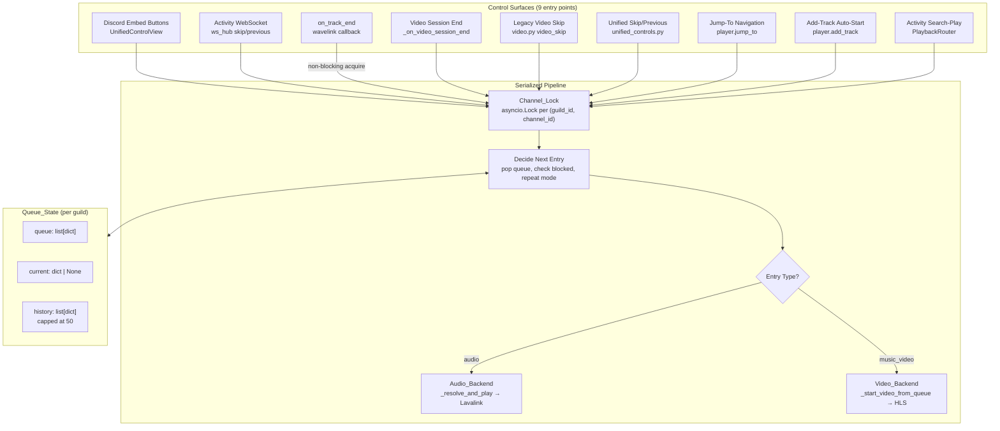

# Unified Queue Pipeline — Technical Design

## Overview

This design introduces a per-channel `asyncio.Lock` that serializes all queue advancement operations for a given voice channel session. The lock eliminates race conditions caused by 9+ unserialized control surfaces (Discord buttons, Activity WebSocket, `on_track_end`, video session-end, legacy skip, unified controls, jump-to, add-track auto-start, Activity search-play) all mutating the same `queue`, `current`, and `history` state across `await` suspension points.

The core insight: on a single-threaded asyncio event loop, races only occur when an operation `await`s (e.g., network call to Lavalink, HLS teardown, WebSocket broadcast). An `asyncio.Lock` held across these suspension points serializes concurrent operations so exactly one Queue_Operation executes at a time per channel.

**Design principles:**
- The lock is additive — no caller API changes, no module restructuring
- Lock scope is narrow: covers "decide what's next → mutate state → dispatch to backend", NOT the entire audio resolve (which can take seconds)
- `on_track_end` uses non-blocking lock check — if locked, another caller is handling advancement
- The existing `_video_transition` flag is retained ONLY for its semantic purpose (blocking audio during video setup)
- All other suppression patterns (`_skip_transition`, `_jump_transition`, time guards) are removed in favor of the lock

## Architecture



### Lock Acquisition Pattern

```python
# Standard acquisition (all callers except on_track_end):
lock = _get_queue_lock(guild_id)
async with lock:
    # mutate state, dispatch to backend
    await _play_next_from_queue(guild_id)

# Non-blocking acquisition (on_track_end only):
lock = _get_queue_lock(guild_id)
if lock.locked():
    # Another caller (skip, jump, etc.) intentionally stopped the player
    # and is managing the advance — do NOT also advance.
    return
async with lock:
    await _play_next_from_queue(guild_id)
```

### Key Design Decision: Lock Keying

The lock is keyed by `guild_id` alone (matching the existing `_queue_locks` dict). Rationale:

- The entire codebase uses `get_state(guild_id)` — there is exactly one queue per guild
- `guild_state[guild_id]` stores `voice_channel`, from which `channel_id` can be resolved when needed for the Session_Registry
- Re-keying to `(guild_id, channel_id)` would require touching every caller and handling the "channel not yet known" case
- A guild can only be in one voice channel at a time (Discord limitation for bots), so per-guild locking already provides per-channel semantics

The lock dict already exists: `_queue_locks: dict[int, asyncio.Lock]` in `player.py`.

## Components and Interfaces

### Modified Components

| File | Change | Purpose |
|------|--------|---------|
| `bot/player.py` | Wrap `_play_next_from_queue` callers with lock; modify `on_track_end` to use non-blocking check; remove legacy suppression flags | Core serialization |
| `bot/playback/unified_controls.py` | Already acquires lock — verify coverage for all paths | Unified skip/previous entry point |
| `bot/views/unified_remote.py` | `_audio_skip` already acquires lock — no change needed | Discord button routing |
| `bot/video/ws_hub.py` | Already routes through `unified_controls` — no change needed | Activity WebSocket routing |
| `bot/cogs/video.py` | Route `video_skip` through `unified_controls.unified_skip` | Legacy video skip |

### Interface: `_get_queue_lock(guild_id: int) -> asyncio.Lock`

Already exists. Returns or creates the per-guild lock. No changes needed.

### Interface: `_play_next_from_queue(guild_id, *, skip_history_push=False)`

**Critical rule:** This function MUST only be called while the queue lock is held. It performs state mutations (pop from queue, push to history, set current) and dispatches to a backend. All callers are responsible for acquiring the lock before calling.

Current callers that need lock wrapping:

| Caller | Location | Currently Locks? |
|--------|----------|-----------------|
| `on_track_end` | `player.py` | ✅ Yes (non-blocking) |
| `unified_skip` | `unified_controls.py` | ✅ Yes |
| `unified_previous` | `unified_controls.py` | ✅ Yes |
| `jump_to` | `player.py` | ✅ Yes |
| `_on_video_session_end` | `player.py` | ✅ Yes |
| `add_track` (auto-start) | `player.py` | ❌ Needs lock |
| `enqueue_and_start` | `player.py` | ❌ Needs lock |
| `_video_skip` in unified_remote | `unified_remote.py` | ❌ Needs lock (calls `_play_next_from_queue` directly) |
| `video_skip` in cogs/video | `cogs/video.py` | ❌ Should route through unified_controls |

### Suppression Flag Removal

| Flag | Current Purpose | Replacement |
|------|----------------|-------------|
| `_video_transition` | Block audio during video setup | **KEEP** — semantic signal that video setup is in progress |
| Lock check in `on_track_end` | Prevent double-advance when skip already holds lock | **KEEP** — this IS the serialization mechanism |
| Time-based guards (5s debounce) | Prevent rapid-fire advances | **REMOVE** — lock makes this unnecessary |

## Data Models

### Queue_State (unchanged)

```python
guild_state[guild_id] = {
    "queue": list[dict],       # Ordered entries, each with optional "type": "music_video"
    "current": dict | None,    # Currently playing entry
    "history": list[dict],     # Most-recent-first, capped at 50
    "player": wavelink.Player | None,
    "voice_channel": discord.VoiceChannel | None,
    "text_channel": discord.TextChannel | None,
    "repeat_mode": str,        # "off" | "single" | "queue"
    "source_provider": str,
    "filters": dict,
    "_video_transition": bool, # True during video setup (blocks audio)
    # ... other fields unchanged
}
```

### Queue Entry (unchanged)

```python
# Audio entry
{"title": str, "url": str, "duration": int, "thumbnail": str, ...}

# Video entry
{"title": str, "url": str, "type": "music_video", "duration": int, ...}
```

### Lock Registry (unchanged)

```python
_queue_locks: dict[int, asyncio.Lock] = {}  # guild_id → Lock
```

## Correctness Properties

*A property is a characteristic or behavior that should hold true across all valid executions of a system — essentially, a formal statement about what the system should do. Properties serve as the bridge between human-readable specifications and machine-verifiable correctness guarantees.*

### Property 1: Mutual Exclusion of Queue Operations

*For any* guild and any two concurrent Queue_Operations targeting the same guild, the pipeline SHALL execute them sequentially (one completes before the other begins mutating Queue_State), never interleaved.

**Validates: Requirements 1.2, 1.3, 1.4**

### Property 2: Advance-Exactly-One Invariant

*For any* guild with a non-empty queue, a single advance-to-next operation SHALL remove exactly one non-blocked entry from the queue and set it as current, regardless of which control surface triggered it.

**Validates: Requirements 3.1, 3.2**

### Property 3: History Push Idempotence

*For any* completed Advancement, the outgoing `current` entry SHALL appear in `history` exactly once, and the history list SHALL never exceed 50 entries.

**Validates: Requirements 7.1, 7.2**

### Property 4: Previous Navigation Correctness

*For any* previous operation when history is non-empty, the resulting `current` SHALL be the most recent history entry, and the outgoing `current` SHALL be placed at queue position 0 (so a subsequent "next" returns to it).

**Validates: Requirements 4.1, 4.2**

### Property 5: on_track_end Suppression Under Lock

*For any* `on_track_end` event that arrives while the queue lock is held by another caller, the event handler SHALL NOT advance the queue (it returns immediately without mutating state).

**Validates: Requirements 3.3, 1.4**

### Property 6: Cross-Media Dispatch Correctness

*For any* queue containing a mix of audio and `music_video` entries, each advancement SHALL dispatch to the correct backend (Audio_Backend for non-video, Video_Backend for `music_video`), and a video-to-audio transition SHALL terminate the video session before starting audio.

**Validates: Requirements 5.1, 5.2, 5.3, 5.4**

### Property 7: Behavioral Equivalence (Single-Caller)

*For any* single Queue_Operation with no concurrent operation in flight, the pipeline SHALL produce the same resulting Queue_State (queue contents, current, history) as the pre-refactor code.

**Validates: Requirements 8.1, 8.2, 8.3**

### Property 8: Lock Release on Exception

*For any* Queue_Operation that raises an exception while holding the Channel_Lock, the lock SHALL be released before the exception propagates (guaranteed by `async with` context manager semantics).

**Validates: Requirements 1.6**

## Error Handling

### Lock Acquisition Failure

Since `asyncio.Lock` cannot fail (it's in-process, no network), the only "failure" is the non-blocking path in `on_track_end`:

```python
if lock.locked():
    log.debug("on_track_end suppressed — lock held by another caller")
    return
```

This is intentional, not an error.

### Exception During Queue Operation

All lock-holding code uses `async with lock:` which guarantees release even if the body raises. The exception propagates to the caller (which logs it). Queue_State may be partially mutated if the exception occurs after `queue.pop(0)` but before dispatch — this is acceptable because:

1. `current` is set immediately after pop, so the entry isn't lost
2. If dispatch fails, the entry remains as `current` and can be retried or skipped

### Video Termination Failure

If `_terminate_active_video_session` raises during a video-to-audio transition:

1. The exception is caught and logged
2. The advancement continues anyway (best-effort: audio starts even if video cleanup is incomplete)
3. `_is_video_active()` may return True briefly until the registry times out

### No Voice Channel Available

If `guild_state[guild_id]["voice_channel"]` is None when a Queue_Operation tries to resolve the channel:

1. The operation logs a diagnostic message
2. The queue is not mutated
3. The lock is released normally

## Testing Strategy

### Dual Testing Approach

**Unit tests** verify specific examples and edge cases:
- Single skip advances queue by one
- Previous with empty history restarts current track
- Blocked tracks are skipped
- Video-to-audio transition terminates video session

**Property-based tests** (Hypothesis, minimum 100 iterations) verify universal properties:
- The lock prevents interleaved mutations
- Advance always removes exactly one entry
- History push happens exactly once per advance
- Previous always restores the correct entry

### PBT Library

**Hypothesis** (already present in the project — `.hypothesis/` directory exists with constants and examples).

### Property Test Configuration

- Minimum **100 iterations** per property
- Each test tagged with: `Feature: unified-queue-pipeline, Property {N}: {title}`
- Tests operate on mock state (no real Lavalink/Discord connections)
- Generators produce random queue states: varying lengths, mixed audio/video entries, random history depths, random repeat modes

### Test Structure

```
tests/
  test_queue_pipeline_props.py     # Property-based tests (Hypothesis)
  test_queue_pipeline_unit.py      # Example-based unit tests
```

### What to Mock

- `wavelink.Player` — mock `stop()`, `playing`, `paused`, `connected`
- `_resolve_and_play` — mock to avoid network calls
- `_start_video_from_queue` — mock to avoid HLS pipeline
- `_terminate_active_video_session` — mock to verify it's called at correct times
- `Video cog / registry` — mock `_is_video_active()` return values

### Integration Tests

- Full skip sequence: enqueue 5 tracks, skip through all, verify each becomes `current` in order
- Concurrent skip simulation: schedule 3 `unified_skip` calls on the same event loop tick, verify only one advance happens per call
- Video-to-audio: enqueue `[music_video, audio]`, advance, verify video session terminated before audio starts
- on_track_end suppression: hold lock manually, fire `on_track_end`, verify no mutation
