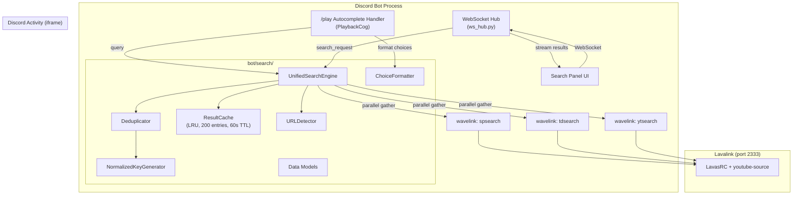
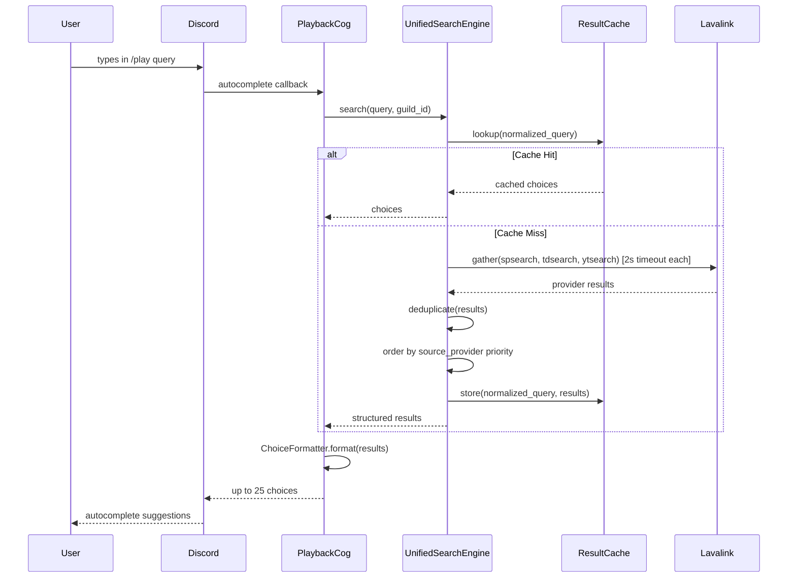
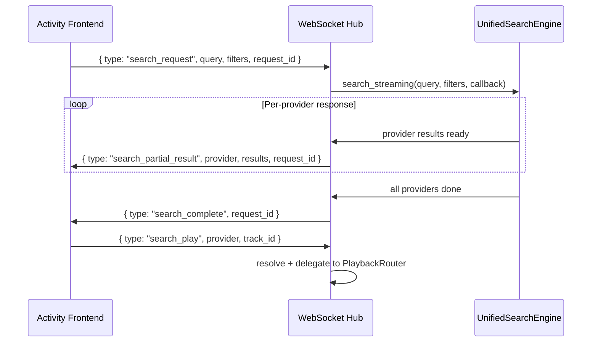

# Design Document: Unified Search Autocomplete

## Overview

The Unified Search Autocomplete system replaces the current single-provider search in the `/play` command with a parallel multi-provider search engine. It fans out queries to Spotify (`spsearch`), Tidal (`tdsearch`), and YouTube (`ytsearch`) simultaneously via wavelink, deduplicates results using ISRC and normalized metadata keys, and presents up to 25 formatted choices within Discord's 3-second autocomplete timeout.

A companion rich search UI panel inside the existing Discord Activity iframe (port 8090) delivers the full search experience beyond Discord's 100-character autocomplete constraints: expandable provider groups, album art, full metadata, provider badges, filters, and WebSocket-driven progressive results. Both interfaces share the same `UnifiedSearchEngine` backend.

### Design Rationale

- **Single search backend**: Avoids logic duplication between autocomplete and Activity panel. The engine returns structured `SearchResult` objects; consumers format them for their respective UIs.
- **wavelink-only**: No new HTTP clients. All searches go through `wavelink.Playable.search()` which routes through the existing Lavalink instance with LavasRC + youtube-source plugins already configured.
- **Aggressive timing**: 2s per-provider timeout + 300ms dedup/format budget = well within Discord's 3s autocomplete deadline.
- **LRU cache**: Rapid typing generates many overlapping queries. A 200-entry TTL cache eliminates redundant Lavalink calls.

## Architecture



### Component Interaction Sequence (Autocomplete)



### Component Interaction Sequence (Activity WebSocket)



## Components and Interfaces

### New Modules (bot/search/)

| Module | Class/Function | Responsibility |
|--------|---------------|----------------|
| `models.py` | `SearchResult`, `ProviderResult`, `TrackGroup`, `CacheEntry` | Data classes for search pipeline |
| `engine.py` | `UnifiedSearchEngine` | Orchestrates parallel search, dedup, caching |
| `deduplicator.py` | `Deduplicator`, `normalize_key()`, `detect_variant()` | ISRC + normalized key dedup, variant detection |
| `formatter.py` | `ChoiceFormatter`, `encode_value()`, `decode_value()` | Discord autocomplete choice rendering |
| `cache.py` | `ResultCache` | LRU + TTL in-memory cache |
| `url_detector.py` | `URLDetector` | Recognizes platform URLs, bypasses search |
| `__init__.py` | — | Package init, exports `UnifiedSearchEngine` |

### Modified Modules

| Module | Change |
|--------|--------|
| `bot/cogs/playback.py` | Add `@play.autocomplete("query")` handler that calls `UnifiedSearchEngine` |
| `bot/video/ws_hub.py` | Add `search_request`, `search_play`, `search_enqueue` message handlers |
| `bot/video/activity_frontend/` | New `search_panel.js`, `search_panel.css`; modified `index.html`, `app.js` |

### UnifiedSearchEngine Interface

```python
class UnifiedSearchEngine:
    def __init__(self, *, cache_capacity: int = 200, cache_ttl: float = 60.0):
        ...

    async def search(
        self,
        query: str,
        *,
        guild_id: int | None = None,
        provider_filter: str | None = None,  # "spotify", "tidal", "youtube", "soundcloud"
        content_type: str = "tracks",         # "tracks", "albums", "playlists", "videos"
        sort_order: str = "relevance",        # "relevance", "duration", "year"
    ) -> list[SearchResult]:
        """Unified search: parallel providers, dedup, cache.
        
        Returns structured SearchResult list for both autocomplete and Activity.
        """
        ...

    async def search_streaming(
        self,
        query: str,
        *,
        guild_id: int | None = None,
        provider_filter: str | None = None,
        content_type: str = "tracks",
        sort_order: str = "relevance",
        on_provider_result: Callable[[str, list[SearchResult]], Awaitable[None]] | None = None,
    ) -> list[SearchResult]:
        """Streaming variant: calls on_provider_result as each provider responds.
        
        Used by Activity WebSocket for progressive rendering.
        """
        ...
```

### ChoiceFormatter Interface

```python
class ChoiceFormatter:
    @staticmethod
    def format_choices(
        results: list[SearchResult],
        *,
        max_choices: int = 25,
    ) -> list[app_commands.Choice[str]]:
        """Convert SearchResults to Discord autocomplete choices."""
        ...

    @staticmethod
    def encode_value(provider: str, track_id: str) -> str:
        """Encode as '{prefix}:{track_id}', truncating if > 100 chars."""
        ...

    @staticmethod
    def decode_value(value: str) -> tuple[str | None, str]:
        """Decode '{prefix}:{track_id}' → (lavalink_prefix, track_id).
        Returns (None, raw_value) if format unrecognized."""
        ...
```

### URLDetector Interface

```python
class URLDetector:
    @staticmethod
    def detect(query: str) -> tuple[str, str] | None:
        """Returns (platform_name, url) if recognized, else None.
        
        Recognized patterns:
        - spotify.com/track/...
        - tidal.com/track/... or tidal.com/browse/track/...
        - youtube.com/watch?... or youtu.be/...
        - soundcloud.com/...
        """
        ...
```

### Deduplicator Interface

```python
class Deduplicator:
    @staticmethod
    def deduplicate(
        results: list[SearchResult],
        *,
        guild_source_provider: str = "youtube",
    ) -> list[SearchResult]:
        """Remove duplicates, preserving variants. Orders by guild preference then priority."""
        ...

def normalize_key(artist: str, title: str) -> str:
    """Generate deterministic dedup key from artist + title."""
    ...

def detect_variant(title: str) -> str | None:
    """Returns variant type ('live', 'remix', 'acoustic', 'music_video') or None."""
    ...
```

## Data Models

```python
from dataclasses import dataclass, field
from typing import Optional
import time


@dataclass
class SearchResult:
    """A single track result from any provider."""
    title: str
    artist: str
    album: str | None = None
    release_year: int | None = None
    duration_ms: int | None = None
    artwork_url: str | None = None
    isrc: str | None = None
    provider: str = ""           # "spotify", "tidal", "youtube", "soundcloud"
    track_id: str = ""           # Provider-specific ID
    variant_type: str | None = None  # "live", "remix", "acoustic", "music_video", or None
    normalized_key: str = ""     # Computed dedup key
    has_music_video: bool = False


@dataclass
class ProviderResult:
    """Raw results from a single provider before dedup."""
    provider: str
    results: list[SearchResult] = field(default_factory=list)
    error: str | None = None
    elapsed_ms: float = 0.0


@dataclass
class TrackGroup:
    """A canonical track across multiple providers (for Activity UI)."""
    primary: SearchResult                          # Highest-priority provider's version
    variants: list[SearchResult] = field(default_factory=list)  # Same track from other providers
    available_providers: list[str] = field(default_factory=list)  # All providers that have it


@dataclass
class CacheEntry:
    """Time-stamped cache entry for the ResultCache."""
    results: list[SearchResult]
    created_at: float = field(default_factory=time.time)
    
    def is_expired(self, ttl: float) -> bool:
        return (time.time() - self.created_at) > ttl
```

### Value Encoding Format

| Provider | Prefix | Example Value |
|----------|--------|---------------|
| Spotify | `sp` | `sp:4uLU6hMCjMI75M1A2tKUQC` |
| Tidal | `td` | `td:123456789` |
| YouTube | `yt` | `yt:dQw4w9WgXcQ` |
| SoundCloud | `sc` | `sc:artist/track-slug` |

### Provider Priority Order

1. Spotify (🟢)
2. Tidal (🔵)
3. YouTube (🔴)
4. SoundCloud (🟠)

Guild `source_provider` setting overrides default priority — the guild's preferred provider ranks first.

### WebSocket Message Protocol (Activity Search)

**Client → Server:**

```json
{
    "type": "search_request",
    "query": "bohemian rhapsody",
    "request_id": "uuid-v4",
    "filters": {
        "provider": "all",
        "content_type": "tracks",
        "sort_order": "relevance"
    }
}
```

```json
{
    "type": "search_play",
    "provider": "spotify",
    "track_id": "4uLU6hMCjMI75M1A2tKUQC",
    "request_id": "uuid-v4"
}
```

```json
{
    "type": "search_enqueue",
    "provider": "tidal",
    "track_id": "123456789",
    "request_id": "uuid-v4"
}
```

```json
{
    "type": "search_cancel",
    "request_id": "uuid-v4"
}
```

**Server → Client:**

```json
{
    "type": "search_partial_result",
    "request_id": "uuid-v4",
    "provider": "spotify",
    "results": [
        {
            "title": "Bohemian Rhapsody",
            "artist": "Queen",
            "album": "A Night at the Opera",
            "release_year": 1975,
            "duration_ms": 354000,
            "artwork_url": "https://i.scdn.co/image/...",
            "isrc": "GBUM71029604",
            "provider": "spotify",
            "track_id": "4uLU6hMCjMI75M1A2tKUQC",
            "variant_type": null,
            "has_music_video": false
        }
    ]
}
```

```json
{
    "type": "search_complete",
    "request_id": "uuid-v4",
    "total_results": 18
}
```

```json
{
    "type": "search_error",
    "request_id": "uuid-v4",
    "message": "All providers failed"
}
```

```json
{
    "type": "search_play_ack",
    "request_id": "uuid-v4",
    "success": true,
    "track_title": "Bohemian Rhapsody"
}
```

```json
{
    "type": "search_enqueue_ack",
    "request_id": "uuid-v4",
    "success": true,
    "position": 3,
    "track_title": "Bohemian Rhapsody"
}
```

### Key Algorithms

#### Parallel Search with Timeout Budget

```python
async def _execute_search(self, query: str, providers: list[str]) -> list[ProviderResult]:
    """Fan out to all providers with 2s per-provider timeout."""
    provider_configs = {
        "spotify": ("spsearch", 10),
        "tidal": ("tdsearch", 8),
        "youtube": ("ytsearch", 7),
    }
    
    async def _search_provider(name: str, prefix: str, limit: int) -> ProviderResult:
        start = time.monotonic()
        try:
            tracks = await asyncio.wait_for(
                wavelink.Playable.search(f"{prefix}:{query}"),
                timeout=2.0,
            )
            results = [self._to_search_result(t, name) for t in tracks[:limit]]
            return ProviderResult(provider=name, results=results, 
                                  elapsed_ms=(time.monotonic() - start) * 1000)
        except (asyncio.TimeoutError, Exception) as e:
            log.warning("Provider %s failed: %s: %s", name, type(e).__name__, e)
            return ProviderResult(provider=name, error=str(e),
                                  elapsed_ms=(time.monotonic() - start) * 1000)

    tasks = [
        _search_provider(name, cfg[0], cfg[1])
        for name, cfg in provider_configs.items()
        if name in providers
    ]
    return await asyncio.gather(*tasks)
```

#### Deduplication Algorithm

1. For each result, compute dedup key:
   - If `isrc` is non-null and `variant_type` is None: key = `isrc`
   - If `isrc` is non-null and `variant_type` is not None: key = `isrc:{variant_type}`
   - If `isrc` is null: key = `normalize_key(artist, title)` (+ `:variant_type` if variant)
2. Group results by dedup key
3. For each group, retain the highest-priority provider's version (respecting guild preference)
4. Suppress lower-priority duplicates but record their provider in `available_providers` for Activity UI

#### Normalized Key Generation

```python
import re

_REMASTER_RE = re.compile(
    r"\s*[-–—]\s*remaster(?:ed)?\s*\d{4}?"
    r"|\s*\(remaster(?:ed)?\s*\d{4}?\)"
    r"|\s*\[remaster(?:ed)?\s*\d{4}?\]",
    re.IGNORECASE,
)
_FEAT_RE = re.compile(r"\s*\((?:feat|ft)\.?\s+[^)]*\)", re.IGNORECASE)
_YEAR_SUFFIX_RE = re.compile(r"\s*[\(\[]\d{4}[\)\]]$")
_WHITESPACE_RE = re.compile(r"\s+")

_VARIANT_RE = re.compile(r"\b(live|remix|acoustic|music\s+video)\b", re.IGNORECASE)

def normalize_key(artist: str, title: str) -> str:
    title = _REMASTER_RE.sub("", title)
    title = _FEAT_RE.sub("", title)
    title = _YEAR_SUFFIX_RE.sub("", title)
    artist = _WHITESPACE_RE.sub(" ", artist.lower()).strip()
    title = _WHITESPACE_RE.sub(" ", title.lower()).strip()
    return f"{artist}:{title}"

def detect_variant(title: str) -> str | None:
    match = _VARIANT_RE.search(title)
    if match:
        return match.group(1).lower().replace(" ", "_")
    return None
```

#### Slot Redistribution on Provider Failure

When a provider returns zero results (no error), its slots are redistributed:

```python
def _redistribute_slots(
    provider_results: list[ProviderResult],
    base_slots: dict[str, int],  # {"spotify": 10, "tidal": 8, "youtube": 7}
) -> dict[str, int]:
    """Proportionally redistribute unused slots, max 25 total."""
    successful = {pr.provider: pr for pr in provider_results if pr.results}
    empty = {pr.provider for pr in provider_results if not pr.results and pr.error is None}
    
    freed = sum(base_slots[p] for p in empty if p in base_slots)
    if freed == 0 or not successful:
        return base_slots
    
    priority_order = ["spotify", "tidal", "youtube"]
    active = [p for p in priority_order if p in successful]
    total_active_slots = sum(base_slots[p] for p in active)
    
    new_slots = dict(base_slots)
    remaining = freed
    for p in active:
        share = int(freed * base_slots[p] / total_active_slots)
        new_slots[p] += share
        remaining -= share
    # Remainder to highest priority
    if remaining > 0 and active:
        new_slots[active[0]] += remaining
    
    # Cap at 25 total
    total = sum(new_slots[p] for p in active)
    if total > 25:
        new_slots[active[-1]] -= (total - 25)
    
    return new_slots
```

#### Progressive WebSocket Streaming

For the Activity panel, the engine uses `search_streaming()` which fires `on_provider_result` as each `asyncio.Task` completes (via `asyncio.as_completed` pattern):

```python
async def search_streaming(self, query, *, on_provider_result=None, **kwargs):
    tasks = {
        asyncio.create_task(self._search_single(name, query, limit)): name
        for name, (prefix, limit) in providers.items()
    }
    all_results = []
    for coro in asyncio.as_completed(tasks.keys(), timeout=2.0):
        try:
            result = await coro
            all_results.extend(result.results)
            if on_provider_result and result.results:
                await on_provider_result(result.provider, result.results)
        except asyncio.TimeoutError:
            break
    return self._deduplicate(all_results, **kwargs)
```

## Correctness Properties

*A property is a characteristic or behavior that should hold true across all valid executions of a system — essentially, a formal statement about what the system should do. Properties serve as the bridge between human-readable specifications and machine-verifiable correctness guarantees.*

### Property 1: Query Threshold Gate

*For any* input string, the search engine SHALL dispatch provider searches if and only if the string contains 2 or more non-whitespace characters. Strings with fewer than 2 non-whitespace characters SHALL always produce an empty result list without triggering any provider call.

**Validates: Requirements 1.1, 1.4**

### Property 2: Graceful Degradation Preserves Successful Results

*For any* combination of provider success/failure outcomes, the final result set SHALL contain all results from every provider that responded successfully (subject to dedup), and SHALL never include results attributed to a provider that failed or timed out.

**Validates: Requirements 2.1, 2.2**

### Property 3: Slot Redistribution Invariants

*For any* set of provider results where at least one provider returns zero results without error, the redistributed slot allocation SHALL: (a) sum to at most 25, (b) only increase slots for providers that returned results, (c) assign remainder to the highest-priority provider with results, and (d) never assign slots to providers that returned zero results.

**Validates: Requirements 2.4, 2.5**

### Property 4: Deduplication Retains Highest Priority Per Key

*For any* set of search results, after deduplication, for each unique dedup key (ISRC or normalized key), exactly one result SHALL remain, and that result SHALL be from the highest-priority provider (respecting guild preference) among all results sharing that key. Results with null ISRC SHALL be deduplicated by normalized key equivalence.

**Validates: Requirements 3.1, 3.2, 3.4**

### Property 5: Variant Tracks Preserved as Distinct Entries

*For any* set of search results where two tracks share the same ISRC but one is a variant (live, remix, acoustic, music video), the deduplicator SHALL preserve both as separate entries with distinct dedup keys.

**Validates: Requirements 3.3**

### Property 6: Normalized Key Determinism and Canonicalization

*For any* artist and title strings, `normalize_key(artist, title)` SHALL produce a result that is: (a) entirely lowercase, (b) contains no leading or trailing whitespace, (c) contains no consecutive whitespace characters, (d) does not contain remaster annotations, featuring credits, or trailing year patterns, and (e) is in the format `{artist}:{title}`.

**Validates: Requirements 4.1, 4.2, 4.3**

### Property 7: Variant Detection at Word Boundaries Only

*For any* title string, `detect_variant(title)` SHALL return a variant type if and only if the title contains "Live", "Remix", "Acoustic", or "Music Video" as a complete word (not as a substring of a larger word like "Oliver" or "Premixed").

**Validates: Requirements 4.5, 4.6**

### Property 8: Formatted Choice Length Invariant

*For any* search result (including URL detections), the formatted Discord autocomplete choice name SHALL not exceed 100 characters, and the encoded choice value SHALL not exceed 100 characters.

**Validates: Requirements 5.3, 6.2, 8.4**

### Property 9: Duration Formatting Correctness

*For any* duration in milliseconds, the formatter SHALL produce `H:MM:SS` format when duration >= 3,600,000ms, and `M:SS` format when duration < 3,600,000ms. The formatted string SHALL represent the same total seconds as the input (allowing for millisecond truncation).

**Validates: Requirements 5.4, 5.5**

### Property 10: Value Encoding Round-Trip

*For any* valid provider identifier and track_id where the total encoded length (`len(prefix) + 1 + len(track_id)`) does not exceed 100 characters, encoding and then decoding SHALL produce the original provider and track_id unchanged.

**Validates: Requirements 6.1, 6.3, 6.5**

### Property 11: URL Detection Correctness

*For any* string starting with `http://` or `https://` that contains a recognized platform domain and path pattern, `URLDetector.detect()` SHALL return a non-None tuple of (platform_name, url). For any string that does not start with a URL scheme or does not match a recognized pattern, it SHALL return None.

**Validates: Requirements 8.1, 8.2, 8.3**

### Property 12: Guild Source Provider Ordering

*For any* set of deduplicated search results and any guild source_provider value, the results SHALL be ordered such that all results from the guild's preferred provider appear before results from other providers, with remaining results ordered by default priority (Spotify > Tidal > YouTube > SoundCloud).

**Validates: Requirements 10.5**

### Property 13: Cache Key Isolation

*For any* two queries that differ only in case, leading/trailing whitespace, or internal whitespace quantity, the cache SHALL produce the same cache key. For any two queries that differ in filter parameters (provider, content_type, sort_order), the cache SHALL produce different cache keys even if the query text is identical.

**Validates: Requirements 7.1, 18.6**

### Property 14: Filter Application Correctness

*For any* set of search results and a provider filter value other than "all", applying the filter SHALL return only results whose provider matches the filter value. No results from non-matching providers SHALL appear in the output.

**Validates: Requirements 18.5**

## Error Handling

### Provider-Level Failures

| Failure Mode | Handling |
|-------------|----------|
| Provider timeout (>2s) | `asyncio.TimeoutError` caught, provider excluded, others proceed |
| Provider raises exception | Caught in gather wrapper, logged at WARNING, provider excluded |
| Provider returns 0 results (no error) | Slots redistributed to successful providers |
| All providers fail | Return empty choice list, no error surfaced to user |
| All providers timeout | Same as all fail — empty list |

### Autocomplete Pipeline Failures

| Failure Mode | Handling |
|-------------|----------|
| Total pipeline exceeds 2700ms | Emergency return of whatever results are ready |
| Dedup/format raises exception | Log ERROR, return raw unformatted results (skip dedup) |
| Cache corruption | Evict entry, proceed as cache miss |
| wavelink pool disconnected | Caught as provider exception, graceful degradation |

### Activity WebSocket Failures

| Failure Mode | Handling |
|-------------|----------|
| Client sends search while disconnecting | Ignore, no crash |
| search_play for invalid track_id | Send `search_play_ack` with `success: false` and error message |
| Provider partial result after client disconnected | Discard silently (WS send will fail gracefully) |
| New search_request supersedes in-flight search | Cancel old tasks, discard stale partial results (keyed by request_id) |

### Value Decoding Failures

| Failure Mode | Handling |
|-------------|----------|
| Unrecognized prefix in encoded value | Fall through to raw text search via PlaybackRouter |
| Encoded value has no colon separator | Same — treat as raw query |
| Decoded track_id fails to resolve | Fall through to PlaybackRouter search with original query text |

## Testing Strategy

### Property-Based Testing (Hypothesis)

The core pure functions (normalization, deduplication, formatting, encoding) are ideal candidates for property-based testing. Each property from the Correctness Properties section maps to a Hypothesis test.

**Library**: [Hypothesis](https://hypothesis.readthedocs.io/) (already in use — `.hypothesis/` directory exists in repo)

**Configuration**: Minimum 100 examples per property test (`@settings(max_examples=100)`)

**Tag format**: Each test tagged with `# Feature: unified-search-autocomplete, Property {N}: {title}`

**Test file**: `tests/test_search_properties.py`

### Unit Tests (pytest)

Example-based tests for specific scenarios:

- URL detection for each recognized pattern (spotify, tidal, youtube, soundcloud)
- Choice formatting with and without duration
- Cache eviction at capacity 201
- Provider failure logging verification
- WebSocket message serialization format

**Test file**: `tests/test_search_unit.py`

### Integration Tests (pytest + mocks)

- End-to-end autocomplete flow with mocked wavelink
- WebSocket search_request → partial_result → complete flow
- Play handler decode → resolve → playback chain
- Cache hit prevents provider dispatch
- Timing budget compliance with artificial delays

**Test file**: `tests/test_search_integration.py`

### Frontend Tests (manual + optional Playwright)

- Search panel renders in Activity iframe
- Debounce fires after 300ms idle
- Progressive results merge without clearing
- Track group expand/collapse
- Provider badge click initiates playback
- Queue drag-to-reorder
- Filter persistence within session

