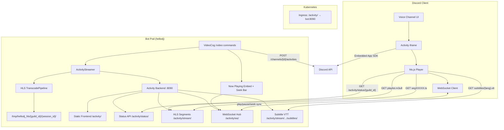

# Design Document: Video Activity

## Overview

This design replaces the failed Go Live/screenshare video streaming approach with a Discord Activity (embedded iframe app). The bot transcodes video to HLS using the existing Intel QSV pipeline, serves segments via an aiohttp HTTP server running within the bot process, and launches a Discord Activity that plays the stream using hls.js inside the Discord voice channel UI.

The architecture reuses the existing `video/` subsystem (source resolution, transcode pipeline, GPU probe) while replacing the RTP sender and Go Live protocol with HLS output and Activity-based delivery. Audio is delivered through the HLS stream (AAC) rather than the bot's voice connection.

### Key Design Decisions

1. **Activity backend runs in-process** — The bot already has an asyncio event loop and aiohttp is a dependency. Running the Activity HTTP server on port 8090 within the bot process avoids a separate container, simplifies state sharing (session registry, HLS file paths), and avoids inter-container coordination.

2. **HLS over RTP** — Discord blocks opcode 18 for bots. HLS is a proven, browser-native adaptive protocol. hls.js handles buffering, seeking, and error recovery client-side.

3. **VOD-style HLS with elapsed offset** — Since videos are downloaded fully before transcode begins (or progressive transcode starts early), the playlist is a complete VOD playlist. Late joiners get the elapsed offset from the backend API and seek to it. This avoids complexity of live-edge management.

4. **Static frontend served by bot** — The Activity frontend is a single HTML+JS page (no build step needed). The bot serves it at `/activity/` alongside the HLS endpoints.

## Architecture



### Request Flow

1. User runs `/video play <url>` → VideoCog resolves source via YouTubeResolver/URLDownloader
2. ActivityStreamer creates session, starts HLS TranscodePipeline
3. Bot launches Discord Activity via API (`POST /channels/{channel_id}/activities` or equivalent)
4. Discord opens iframe → frontend loads → Embedded App SDK initializes → gets guild_id
5. Frontend calls `/activity/status/{guild_id}` → gets playlist URL + elapsed offset
6. hls.js loads playlist, seeks to elapsed offset, begins playback

## Components and Interfaces

### 1. ActivityStreamer (`bot/video/activity_streamer.py`)

Replaces `VideoStreamer`. Orchestrates per-guild Activity sessions.

```python
class ActivityStreamer:
    """Per-guild Activity session manager."""

    guild_id: int
    channel_id: int
    state: StreamState  # IDLE → RESOLVING → BUFFERING → STREAMING → STOPPING
    session_id: str  # UUID per session
    source: VideoSource | None
    pipeline: HLSTranscodePipeline | None
    queue: list[VideoSource]
    history: list[VideoSource]  # Previously played videos (LIFO, max 20)
    start_time: float  # monotonic time when playback began
    max_queue_size: int = 50
    max_history_size: int = 20

    async def play(self, source: VideoSource) -> None: ...
    async def stop(self) -> None: ...
    async def skip(self) -> None: ...
    async def previous(self) -> bool: ...  # Go back to last played video; returns False if no history
    def enqueue(self, source: VideoSource) -> int: ...
    def get_elapsed_seconds(self) -> float: ...
    async def cleanup(self) -> None: ...
```

### 2. HLSTranscodePipeline (`bot/video/hls_transcode.py`)

Modified from `TranscodePipeline`. Instead of piping H.264 to stdout, outputs HLS segments to disk.

```python
class HLSTranscodePipeline:
    """ffmpeg QSV transcode → HLS segment output."""

    output_dir: Path  # /tmp/hellodj_hls/{guild_id}/{session_id}/
    playlist_path: Path  # output_dir / "playlist.m3u8"
    ready: asyncio.Event  # Set when first segment is written

    def build_ffmpeg_args(self, input_path: str, resolution: Resolution) -> list[str]: ...
    async def start(self, input_path: str, resolution: Resolution) -> None: ...
    async def wait_ready(self, timeout: float = 30.0) -> bool: ...
    async def wait_complete(self) -> None: ...
    async def stop(self) -> None: ...
```

### 3. ActivityBackend (`bot/video/activity_backend.py`)

aiohttp web server running on port 8090.

```python
class ActivityBackend:
    """HTTP server for Activity frontend and HLS delivery."""

    app: aiohttp.web.Application
    runner: aiohttp.web.AppRunner
    sessions: dict[int, ActivityStreamer]  # guild_id → streamer

    async def start(self, port: int = 8090) -> None: ...
    async def stop(self) -> None: ...

    # Route handlers
    async def handle_index(self, request) -> Response: ...         # GET /activity/
    async def handle_status(self, request) -> Response: ...        # GET /activity/status/{guild_id}
    async def handle_playlist(self, request) -> Response: ...      # GET /activity/stream/{guild_id}/playlist.m3u8
    async def handle_segment(self, request) -> Response: ...       # GET /activity/stream/{guild_id}/{segment}.ts
    async def handle_static(self, request) -> Response: ...        # GET /activity/static/{filename}
```

### 4. Activity Frontend (`bot/video/activity_frontend/`)

Static files served by ActivityBackend:
- `index.html` — Main page with hls.js player
- `app.js` — Embedded App SDK initialization, WebSocket sync, hls.js setup, controls
- `style.css` — Minimal styling for Discord iframe dimensions

Frontend player controls include:
- Play/pause button (synced via WebSocket to all viewers)
- Seek bar with drag-to-seek (synced via WebSocket)
- Back 10s / Forward 10s buttons (synced via WebSocket)
- Volume slider with mute toggle (per-user only, stored in localStorage)
- Subtitle track selector with "for everyone" checkbox (hidden if no subtitles)
- Audio language selector with "for everyone" checkbox (hidden if single track)
- All sync controls broadcast via WebSocket; volume is always local-only

### 5. ActivityLauncher (`bot/video/activity_launcher.py`)

Handles Discord API calls to launch/close Activities.

```python
class ActivityLauncher:
    """Launch and manage Discord Activities via API."""

    async def launch(self, channel_id: int, application_id: int) -> dict: ...
    async def close(self, channel_id: int) -> None: ...
```

### 6. SessionRegistry (`bot/video/session_registry.py`)

Central registry shared between ActivityBackend and ActivityStreamer instances.

```python
class SessionRegistry:
    """Thread-safe registry of active Activity sessions."""

    _sessions: dict[int, ActivityStreamer]  # guild_id → streamer
    _grace_period_tasks: dict[int, asyncio.Task]

    def register(self, guild_id: int, streamer: ActivityStreamer) -> None: ...
    def unregister(self, guild_id: int) -> None: ...
    def get(self, guild_id: int) -> ActivityStreamer | None: ...
    def active_sessions(self) -> list[int]: ...
    async def start_grace_period(self, guild_id: int, timeout: float = 30.0) -> None: ...
    def cancel_grace_period(self, guild_id: int) -> None: ...
```

### 7. WebSocketHub (`bot/video/ws_hub.py`)

Manages WebSocket connections per guild for synchronized playback control.

```python
class WebSocketHub:
    """Per-guild WebSocket connection manager for playback synchronization.

    All connected clients for a guild share playback state. When any client
    sends a control message (play, pause, seek), it is broadcast to all other
    clients in the same guild. Late joiners receive the current state on connect.
    """

    _connections: dict[int, set[web.WebSocketResponse]]  # guild_id → websocket set
    _playback_state: dict[int, PlaybackState]  # guild_id → current state

    async def handle_ws(self, request: web.Request) -> web.WebSocketResponse: ...
    async def broadcast(self, guild_id: int, message: dict, *, exclude: web.WebSocketResponse | None = None) -> None: ...
    async def broadcast_from_bot(self, guild_id: int, message: dict) -> None: ...
    def get_state(self, guild_id: int) -> PlaybackState | None: ...
    def set_state(self, guild_id: int, state: PlaybackState) -> None: ...
    def disconnect_all(self, guild_id: int) -> None: ...


@dataclass
class PlaybackState:
    """Server-authoritative playback state for a guild."""
    playing: bool = True
    position: float = 0.0  # seconds
    last_update: float = 0.0  # monotonic time of last state change
    subtitle_lang: str | None = None  # "for everyone" subtitle
    audio_lang: str | None = None  # "for everyone" audio track
```

### WebSocket Protocol

Messages are JSON with the following structure:

```json
// Client → Server (user action)
{"type": "play", "position": 42.5}
{"type": "pause", "position": 42.5}
{"type": "seek", "position": 120.0}
{"type": "subtitle_change", "lang": "en", "for_everyone": true}
{"type": "audio_change", "lang": "ja", "for_everyone": true}

// Server → Client (broadcast to all)
{"type": "play", "position": 42.5, "timestamp": 1724180400.0}
{"type": "pause", "position": 42.5, "timestamp": 1724180400.0}
{"type": "seek", "position": 120.0, "timestamp": 1724180400.0}
{"type": "state", "playing": true, "position": 42.5, "timestamp": 1724180400.0, "subtitle_lang": null, "audio_lang": null}
{"type": "subtitle_change", "lang": "en", "timestamp": 1724180400.0}
{"type": "audio_change", "lang": "ja", "timestamp": 1724180400.0}
```

The `state` message is sent to newly connected clients for late-joiner sync.

### 8. Updated VideoCog (`bot/cogs/video.py`)

Modified to use ActivityStreamer instead of VideoStreamer. Commands:
- `/video play <query>` — Resolve source, launch Activity or enqueue
- `/video stop` — Stop session, close Activity
- `/video skip` (alias: `/video next`) — Skip current, play next in queue
- `/video previous` (alias: `/video last`) — Go back to previous video from history
- `/video queue` — Show queue embed

The Now Playing embed includes:
- Text-based seek bar: `▬🔘▬▬▬▬▬▬▬ 0:30 / 4:24`
- Control buttons: ⏮ (previous), ⏪ (seek -10s), ⏯ (play/pause), ⏩ (seek +10s), ⏭ (next/skip), 🚫 (stop)
- Buttons interact with the WebSocket hub to broadcast play/pause/seek to all Activity clients
- Background task updates the embed every 30s to keep the seek bar current

## Data Models

### Extended StreamState

```python
class StreamState(Enum):
    IDLE = "idle"
    RESOLVING = "resolving"
    BUFFERING = "buffering"     # Transcoding, waiting for first segment
    STREAMING = "streaming"     # Activity live, HLS being served
    STOPPING = "stopping"
    ERROR = "error"
```

### Session Metadata (API response)

```python
@dataclass
class SessionStatus:
    """Returned by GET /activity/status/{guild_id}."""
    state: str                  # StreamState value
    video_title: str | None
    video_duration: float       # Total duration in seconds (0 = unknown)
    elapsed_seconds: float      # How far into playback we are
    playlist_url: str | None    # Relative URL to playlist.m3u8
    queue_length: int
    session_id: str
    subtitles: list[dict]       # [{"lang": "en", "label": "English"}, ...]
    audio_tracks: list[dict]    # [{"lang": "ja", "label": "Japanese"}, ...]
    playing: bool               # Whether playback is active (not paused)
```

### HLS Output Structure

```
/tmp/hellodj_hls/{guild_id}/{session_id}/
├── playlist.m3u8              # Master playlist (references audio variants)
├── video.m3u8                 # Video-only segments playlist
├── audio_default.m3u8         # Default audio segments playlist
├── audio_{lang}.m3u8          # Per-language audio segments (if multiple tracks)
├── seg00000.ts
├── seg00001.ts
├── seg00002.ts
├── subtitles/
│   ├── en.vtt                 # English subtitles (WebVTT)
│   ├── es.vtt                 # Spanish subtitles (WebVTT)
│   └── ...
└── ...
```

When multiple audio tracks exist, the master playlist uses `#EXT-X-MEDIA` tags for audio group selection. When only one audio track exists, audio is muxed into the `.ts` segments directly (current behavior).

### Activity Authentication Token

```python
@dataclass
class ActivityToken:
    """Validated Activity session token."""
    instance_id: str
    guild_id: int
    channel_id: int
    user_id: int
    expires_at: float
```

## Correctness Properties

*A property is a characteristic or behavior that should hold true across all valid executions of a system — essentially, a formal statement about what the system should do. Properties serve as the bridge between human-readable specifications and machine-verifiable correctness guarantees.*

### Property 1: Enqueue when session is active

*For any* guild with an active session (state not IDLE/ERROR) and *for any* valid VideoSource, calling `play()` SHALL append the source to the queue rather than launching a new Activity session, and the queue length SHALL increase by exactly one.

**Validates: Requirements 1.2, 7.4**

### Property 2: URL source classification

*For any* URL string, if the URL has a recognized video extension (mp4, mkv, webm, avi, mov, m4v) and is NOT a YouTube domain (youtube.com, youtu.be), it SHALL be classified as a direct download source. If the URL IS a YouTube domain, it SHALL be classified as a YouTube source regardless of extension.

**Validates: Requirements 2.3**

### Property 3: Resolution capping at 720p

*For any* requested output resolution, the HLS transcode pipeline SHALL produce output with height ≤ 720 pixels. For any set of available source formats, the selected download quality SHALL be the highest available quality with height ≤ 720p.

**Validates: Requirements 2.4, 3.2**

### Property 4: HLS pipeline command correctness

*For any* valid source codec and resolution, the generated ffmpeg arguments SHALL: (a) include `-f hls` output format with `-hls_time 4`, (b) include `-c:v h264_qsv` encoder, (c) include `-c:a aac -b:a 128k` audio codec, (d) write output to a path matching `/tmp/hellodj_hls/{guild_id}/{session_id}/`, and (e) use QSV hardware decode when the source codec is in the QSV-decodable set, otherwise use software decode with `hwupload` while retaining QSV encode.

**Validates: Requirements 3.1, 3.5, 3.7**

### Property 5: Authentication enforcement

*For any* HTTP request to stream endpoints (`/activity/stream/` or `/activity/status/`): (a) requests without a session token SHALL receive HTTP 401, (b) requests with an invalid token SHALL receive HTTP 401, (c) requests with a valid token scoped to guild A accessing guild B's stream (where A ≠ B) SHALL receive HTTP 403.

**Validates: Requirements 5.4, 15.3, 15.4**

### Property 6: Status API response completeness

*For any* active session with a registered VideoSource, the `GET /activity/status/{guild_id}` response SHALL contain all required fields: `state` (valid StreamState value), `video_title` (non-null string), `video_duration` (non-negative float), `elapsed_seconds` (non-negative float ≤ duration), `playlist_url` (non-null string when streaming), `queue_length` (non-negative integer), and `session_id` (non-empty string).

**Validates: Requirements 5.1**

### Property 7: Elapsed time tracking

*For any* session that transitions to STREAMING state, a `start_time` SHALL be recorded. *For any* subsequent status query at time T, the `elapsed_seconds` SHALL equal `T - start_time`, clamped to the range `[0, video_duration]`.

**Validates: Requirements 6.1, 6.2**

### Property 8: Skip advances or stops

*For any* active session, calling `skip()` SHALL: (a) if the queue is non-empty, push the current source onto history and begin playback of the next item (queue length decreases by one, history length increases by one, state transitions to RESOLVING/BUFFERING), (b) if the queue is empty, stop the session (state transitions to STOPPING then IDLE).

**Validates: Requirements 7.2, 8.6**

### Property 9: Queue ordering and capacity

*For any* sequence of enqueue operations on a guild's Video_Queue: (a) the queue SHALL maintain FIFO insertion order, (b) enqueue SHALL succeed when queue length < 50, (c) enqueue SHALL be rejected when queue length ≥ 50, leaving the queue unchanged.

**Validates: Requirements 8.1, 8.4, 8.5**

### Property 10: Embed rendering completeness

*For any* VideoSource, the generated "Now Playing" embed SHALL contain the video title. *For any* non-empty Video_Queue, the queue embed SHALL list all queued video titles in order.

**Validates: Requirements 7.3, 7.5**

### Property 11: HLS file cleanup

*For any* session directory containing HLS segment files and playlists, calling session cleanup SHALL remove all files and the directory itself. On bot startup, *for any* set of directories under `/tmp/hellodj_hls/` that do not correspond to active sessions, all such orphaned directories SHALL be removed.

**Validates: Requirements 9.1, 9.2**

### Property 12: WebSocket sync broadcast

*For any* guild with N connected WebSocket clients (N ≥ 2), when any one client sends a `play`, `pause`, or `seek` message, all other N-1 clients SHALL receive the broadcast within 100ms. The sender SHALL NOT receive their own message back.

**Validates: Requirements 10.3, 10.4, 10.5**

### Property 13: WebSocket late-joiner state

*For any* guild with an active session and known playback state, when a new client connects via WebSocket, it SHALL immediately receive a `state` message containing the current `playing` boolean, `position` float, and server `timestamp`.

**Validates: Requirements 10.6**

### Property 14: Volume is always per-user

*For any* volume change action by any viewer, the change SHALL affect ONLY that viewer's local player state. No WebSocket message SHALL be sent for volume changes.

**Validates: Requirements 13.2, 13.5**

### Property 15: Subtitle/audio "for everyone" broadcasting

*For any* subtitle or audio language change where `for_everyone=true`, ALL connected clients SHALL receive a broadcast message. *For any* change where `for_everyone=false` (or unset), NO broadcast SHALL occur — the change is local only.

**Validates: Requirements 11.5, 11.6, 12.4, 12.5**

### Property 16: Now Playing seek bar accuracy

*For any* session with known duration D seconds and elapsed E seconds, the seek bar SHALL render with the indicator at position `floor(E / D * 10)` out of 10 segments, and the time display SHALL show `fmt(E) / fmt(D)`.

**Validates: Requirements 14.1, 14.5**

### Property 17: Previous restores from history

*For any* active session with a non-empty history stack, calling `previous()` SHALL: (a) push the current source to the front of the queue, (b) pop the most recent entry from history, (c) begin playback of that entry. *For any* session with an empty history stack, calling `previous()` SHALL return False and leave the session unchanged.

**Validates: Requirements 7.6, 8.7, 8.8**

## Error Handling

### Transcode Failures

| Error | Detection | Response |
|-------|-----------|----------|
| GPU unavailable | GPUProbe returns `gpu_available=False` | Raise `GPUUnavailableError`, send user-facing error embed, do not launch Activity |
| ffmpeg fails to start | `OSError` or `FileNotFoundError` from subprocess spawn | Set state → ERROR, clean partial output, report to text channel |
| QSV decode failure | stderr pattern matching (existing `_QSV_ERROR_PATTERNS`) | Auto-fallback to software decode + QSV encode (retained from current pipeline) |
| ffmpeg crash mid-transcode | Process exits with non-zero code | Clean up partial HLS output, report error, attempt next in queue |
| Watchdog timeout (no segments for 60s) | Background monitor task | Kill ffmpeg, clean up, report error |

### Discord API Failures

| Error | Detection | Response |
|-------|-----------|----------|
| Activity launch rejected | HTTP 4xx/5xx from Discord API | Send user-facing error with status code context, do not start transcode |
| Activity close fails | HTTP error or timeout | Log warning, continue cleanup (best-effort) |
| Rate limited | HTTP 429 | Respect `Retry-After` header, retry once, then fail with user message |

### HTTP Server Errors

| Error | Detection | Response |
|-------|-----------|----------|
| Segment file not found | `FileNotFoundError` when serving | Return HTTP 404 with JSON error body |
| Invalid guild_id in path | Path parse failure or no session | Return HTTP 404 with JSON error body |
| Authentication failure | Missing/invalid/expired token | Return HTTP 401 with JSON error body |
| Cross-guild access attempt | Token guild ≠ requested guild | Return HTTP 403 with JSON error body |

### Session Lifecycle Errors

| Error | Detection | Response |
|-------|-----------|----------|
| Max duration exceeded (8h) | Background timer | Auto-stop session, clean up, notify text channel |
| Queue full (50 items) | Length check on enqueue | Return error message to user, do not modify queue |
| Source resolution failure | yt-dlp or HTTP download error | Send error embed, skip to next in queue or close session if queue empty |

### Track-Change Race Conditions (skip/previous/auto-advance)

Three operations can change the currently playing track: `skip()`, `previous()`, and `_auto_advance()`. Without coordination they race, leading to double-play, orphaned pipelines, or denied transitions.

| Error | Detection | Response |
|-------|-----------|----------|
| Concurrent track-change attempts | Multiple callers try to change source simultaneously | `_transition_lock` (asyncio.Lock) serializes all source-change operations; second caller waits |
| skip/previous during RESOLVING/BUFFERING | State check at start of operation | Raise `TransitionDeniedError`; cog responds "Can't do that right now — video is loading" |
| Auto-advance fires after skip already replaced track | Lock + stale-pipeline check (compare pipeline ref) | Auto-advance detects mismatch, exits without action |
| `_play_source` fails after skip/previous | State transitions to ERROR | Caller catches error, attempts next queue item; if queue empty, stops session and reports to user |
| `previous()` on cleaned-up source (temp file deleted) | History entry has `cleanup_on_finish=True` and file missing | Skip that history entry or report "Previous video no longer available" |
| `previous()` with empty history | History stack is empty | Return False; cog reports "No previous video" |
| `_cancel_background_tasks` not awaiting | `.cancel()` without await leaves task running | Changed to await cancellation with short timeout before starting new source |

**Solution: `_transition_lock`**

```python
class ActivityStreamer:
    def __init__(self, ...):
        ...
        self._transition_lock = asyncio.Lock()

    async def skip(self) -> None:
        async with self._transition_lock:
            if self.state not in (StreamState.STREAMING, StreamState.BUFFERING):
                raise TransitionDeniedError("Cannot skip in current state")
            # push to history, cancel tasks, stop pipeline, play next...

    async def previous(self) -> bool:
        async with self._transition_lock:
            if self.state not in (StreamState.STREAMING, StreamState.BUFFERING):
                raise TransitionDeniedError("Cannot go back in current state")
            if not self.history:
                return False
            # push current to queue front, pop history, play...

    async def _auto_advance(self) -> None:
        await self.pipeline.wait_complete()
        async with self._transition_lock:
            # Re-check: if pipeline was replaced (skip happened), bail
            if self.pipeline is not completed_pipeline:
                return
            # proceed with advance...
```

### Graceful Degradation

- If the Activity backend fails to start (port conflict, etc.), the bot starts normally but video commands return "Video Activity unavailable" errors.
- If HLS segments are served but hls.js encounters errors, the frontend displays an error overlay without crashing the Activity.
- If a session's transcode crashes, the session attempts the next queue item before giving up entirely.

## Testing Strategy

### Unit Tests (pytest)

Focus on pure logic and isolated components:

- **URL classification** — YouTube vs direct URL detection with various patterns
- **Resolution capping** — Quality selection logic respects 720p maximum
- **ffmpeg arg builder** — Verify generated arguments for HLS output, QSV codec selection, fallback paths
- **Queue operations** — Enqueue, dequeue, capacity enforcement, ordering
- **Elapsed time calculation** — Correct offset computation from start_time
- **Session state machine** — Valid transitions, rejection of invalid transitions
- **Embed builders** — Now Playing and queue embeds contain required fields
- **Cleanup logic** — File deletion for session directories

### Property-Based Tests (Hypothesis)

Each correctness property is implemented as a Hypothesis test with minimum 100 iterations:

- **Property 1**: Generate random session states + VideoSource → verify enqueue-not-launch
- **Property 2**: Generate random URL strings → verify classification
- **Property 3**: Generate random resolutions and format lists → verify cap
- **Property 4**: Generate random codecs (from QSV set and outside) + resolutions → verify args
- **Property 5**: Generate random auth scenarios (valid/invalid/cross-guild) → verify HTTP codes
- **Property 6**: Generate random SessionStatus data → verify response schema
- **Property 7**: Generate random start_time + query_time pairs → verify elapsed
- **Property 8**: Generate random queue states → verify skip behavior
- **Property 9**: Generate random enqueue sequences (up to 60 items) → verify ordering + cap
- **Property 10**: Generate random VideoSource and queue states → verify embed content
- **Property 11**: Generate random directory structures → verify cleanup completeness

Configuration:
- Library: `hypothesis` (already available in Python ecosystem)
- Min iterations: 100 per property (`@settings(max_examples=100)`)
- Tag format: `# Feature: video-activity, Property {N}: {title}`

### Integration Tests

- Activity backend serving (start server, make HTTP requests, verify responses)
- Full transcode pipeline (short test video → HLS segments written to disk)
- Discord API mocking (Activity launch/close with mocked HTTP)

### Manual / E2E Tests

- Activity loads in Discord voice channel iframe
- hls.js playback works end-to-end
- Late joiner synchronization (seek to elapsed offset)
- Grace period behavior (all viewers leave, rejoin within 30s)

