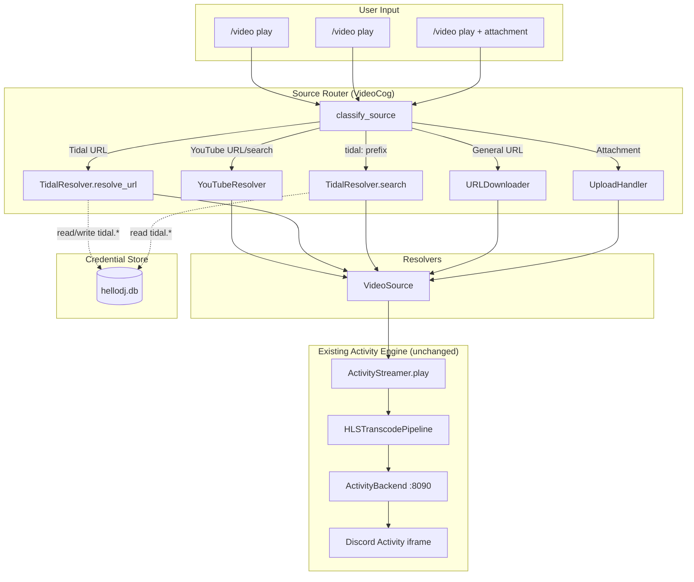
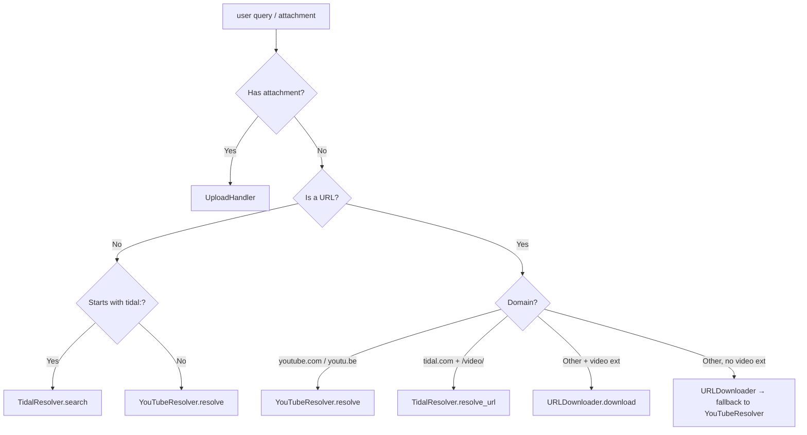

# Design Document: Video Sources

## Overview

This design extends the existing video Activity streaming subsystem with three new source types: **Tidal music videos**, **general video URLs** (already partially implemented in `URLDownloader`), and **direct Discord file uploads**. A unified source routing layer in the VideoCog classifies user input and dispatches to the correct resolver. All sources produce a standard `VideoSource` object that feeds into the existing `ActivityStreamer → HLSTranscodePipeline → Activity iframe` pipeline unchanged.

### Key Design Decisions

1. **TidalResolver is a new module alongside existing resolvers** — The `sources.py` file already contains `YouTubeResolver` and `URLDownloader`. Adding `TidalResolver` as a sibling class in a new `bot/video/tidal_resolver.py` keeps source-specific logic isolated while sharing utilities from `sources.py`.

2. **Reuse existing credential store for Tidal OAuth** — The encrypted SQLite credential store (`credentials.py`) already holds Tidal tokens under the `tidal.*` namespace. The TidalResolver reads/writes tokens through the same `creds` singleton, sharing state with the `tidal-stream` sidecar without conflict.

3. **Source routing lives in the VideoCog, not in the resolvers** — The classification logic (YouTube vs Tidal vs URL vs upload) belongs in the command handler layer. Each resolver stays single-purpose and testable in isolation.

4. **Upload validation uses ffprobe** — Discord provides MIME type and file size metadata before download. After download, ffprobe confirms the file contains a playable video stream, catching corrupt or misidentified files before they reach the transcode pipeline.

5. **`source_type` extended to include "tidal"** — The `VideoSource.source_type` literal union gains `"tidal"` as a fourth value. This enables source-specific display formatting (artist attribution) in the Now Playing embed without conditional logic in the transcode pipeline.

## Architecture



### Source Classification Flow



## Components and Interfaces

### 1. TidalResolver (`bot/video/tidal_resolver.py`)

New module responsible for resolving Tidal music video URLs and search queries to downloadable video files.

```python
class TidalResolverError(Exception):
    """Raised when Tidal resolution fails."""
    def __init__(self, message: str, recoverable: bool = False) -> None:
        super().__init__(message)
        self.recoverable = recoverable


class TidalResolver:
    """Resolve Tidal music video URLs and search queries to VideoSource."""

    # Tidal API base URLs
    _API_BASE = "https://api.tidal.com/v1"
    _AUTH_URL = "https://auth.tidal.com/v1/oauth2/token"
    _TOKEN_EXPIRY_BUFFER = 300  # 5 minutes safety buffer

    def __init__(self, download_dir: Path | None = None) -> None:
        self.download_dir = download_dir or _DOWNLOAD_DIR
        self.download_dir.mkdir(parents=True, exist_ok=True)

    async def resolve_url(self, url: str) -> VideoSource:
        """Resolve a Tidal music video URL to a downloadable VideoSource.

        Extracts the video ID from the URL, fetches metadata and stream URL
        from the Tidal API, downloads the video file, and returns a VideoSource.

        Args:
            url: A Tidal URL matching tidal.com/*/video/* or tidal.com/video/*

        Returns:
            VideoSource with source_type="tidal"

        Raises:
            TidalResolverError: On auth failure, not found, no video stream, etc.
        """
        ...

    async def search(self, query: str) -> VideoSource:
        """Search Tidal for music videos and resolve the top result.

        Args:
            query: Search text (after stripping the 'tidal:' prefix).
                   Must be 1-200 characters, non-whitespace-only.

        Returns:
            VideoSource with source_type="tidal"

        Raises:
            TidalResolverError: On no results, auth failure, unavailable, etc.
        """
        ...

    def extract_video_id(self, url: str) -> int | None:
        """Extract numeric video ID from a Tidal URL path.

        Matches patterns:
            - tidal.com/browse/video/12345
            - tidal.com/video/12345
            - listen.tidal.com/video/12345

        Returns None if the URL doesn't match a Tidal video pattern.
        """
        ...

    async def _ensure_token(self) -> str:
        """Ensure a valid Tidal access token is available.

        Checks expiry (with 5-minute buffer). Refreshes if needed.
        Returns the access token string.

        Raises:
            TidalResolverError: If no credentials stored or refresh fails.
        """
        ...

    async def _refresh_token(self) -> str:
        """Refresh the Tidal OAuth access token using the stored refresh token.

        Updates the credential store with the new access token, expiry,
        and refresh token (if a new one is provided in the response).

        Returns the new access token.

        Raises:
            TidalResolverError: If the refresh token is invalid/expired.
        """
        ...

    async def _fetch_video_metadata(self, video_id: int, access_token: str) -> dict:
        """Fetch video metadata from Tidal API.

        GET /videos/{video_id}

        Returns dict with: title, duration, artist(s), imageId
        Raises TidalResolverError on 404, auth errors, or network issues.
        """
        ...

    async def _fetch_stream_url(self, video_id: int, access_token: str) -> str:
        """Fetch the highest-quality video stream URL from Tidal.

        GET /videos/{video_id}/streamurl with quality=HIGH

        Returns the direct stream URL for download.
        Raises TidalResolverError if no video stream is available.
        """
        ...

    async def _download_video(self, stream_url: str, title: str) -> str:
        """Download the video from the stream URL to a temporary file.

        Args:
            stream_url: Direct download URL from Tidal
            title: Video title (used for filename sanitization)

        Returns:
            Path to the downloaded file.

        Raises:
            TidalResolverError: On download timeout (10 min) or network error.
        """
        ...
```

### 2. UploadHandler (`bot/video/upload_handler.py`)

New module for processing Discord file attachments into VideoSource objects.

```python
class UploadHandlerError(Exception):
    """Raised when upload processing fails."""


class UploadHandler:
    """Process Discord file attachments into playable VideoSource objects."""

    _MAX_UPLOAD_BYTES: int = 500 * 1024 * 1024  # 500 MB
    _FFPROBE_TIMEOUT: float = 10.0
    _SUPPORTED_EXTENSIONS: frozenset[str] = frozenset({"mp4", "mkv", "webm", "avi", "mov", "m4v"})
    _VIDEO_MIME_PREFIXES: tuple[str, ...] = ("video/",)

    def __init__(self, download_dir: Path | None = None) -> None:
        self.download_dir = download_dir or _DOWNLOAD_DIR
        self.download_dir.mkdir(parents=True, exist_ok=True)

    async def process(self, attachment: discord.Attachment, uploader_name: str) -> VideoSource:
        """Download, validate, and produce a VideoSource from a Discord attachment.

        Validation pipeline:
            1. Check file size from attachment metadata (≤ 500 MB)
            2. Check content type / extension against supported formats
            3. Download the file
            4. Run ffprobe to confirm at least one video stream exists
            5. Extract duration from ffprobe output

        Args:
            attachment: The Discord message attachment object.
            uploader_name: The uploader's Discord display name.

        Returns:
            VideoSource with source_type="upload", cleanup_on_finish=True

        Raises:
            UploadHandlerError: On validation failure, download error, or ffprobe rejection.
        """
        ...

    def validate_type(self, attachment: discord.Attachment) -> str | None:
        """Validate attachment type via content_type and filename extension.

        Returns None if valid, or an error message string if rejected.
        Checks both MIME type (video/*) and extension fallback.
        """
        ...

    def validate_size(self, attachment: discord.Attachment) -> str | None:
        """Validate attachment file size from metadata.

        Returns None if valid, or an error message if too large or unknown size.
        """
        ...

    async def ffprobe_validate(self, file_path: Path) -> tuple[bool, float]:
        """Run ffprobe on the downloaded file to validate it contains a video stream.

        Args:
            file_path: Path to the downloaded file.

        Returns:
            Tuple of (is_valid, duration_seconds). duration_seconds is 0 if unknown.

        The ffprobe command:
            ffprobe -v quiet -print_format json -show_streams -show_format <file>
        Timeout: 10 seconds.
        """
        ...
```

### 3. Source Router (`bot/video/source_router.py`)

Utility module that classifies input and dispatches to the correct resolver. Keeps the VideoCog handler clean.

```python
import re
from urllib.parse import urlparse

# URL patterns
_YOUTUBE_DOMAINS: frozenset[str] = frozenset({"youtube.com", "www.youtube.com", "youtu.be", "m.youtube.com", "music.youtube.com"})
_TIDAL_DOMAINS: frozenset[str] = frozenset({"tidal.com", "www.tidal.com", "listen.tidal.com"})
_TIDAL_VIDEO_PATH_RE = re.compile(r"/(?:browse/)?video/\d+")
_TIDAL_SEARCH_PREFIX = "tidal:"

SourceType = Literal["youtube_url", "youtube_search", "tidal_url", "tidal_search", "general_url", "upload"]


def classify_input(query: str, has_attachment: bool = False) -> SourceType:
    """Classify user input into a source type for routing.

    Priority order:
        1. Attachment present → "upload"
        2. YouTube URL → "youtube_url"
        3. Tidal URL with /video/ path → "tidal_url"
        4. tidal: prefix → "tidal_search"
        5. URL with video extension → "general_url"
        6. URL without video extension → "general_url" (with fallback)
        7. Non-URL text → "youtube_search"
    """
    ...


def is_url(text: str) -> bool:
    """Return True if text looks like a URL (has scheme and netloc)."""
    ...


def extract_tidal_video_id(url: str) -> int | None:
    """Extract numeric video ID from a Tidal URL.

    Matches: tidal.com/browse/video/12345, tidal.com/video/12345
    """
    ...
```

### 4. Updated VideoCog Integration

The `/video play` command handler is refactored to use the source router:

```python
@video_group.command(name="play", description="Play a video in the voice channel Activity")
@app_commands.describe(
    query="YouTube URL/search, Tidal URL, tidal:search, or direct video URL",
    attachment="Upload a video file directly",
)
async def video_play(
    self,
    interaction: discord.Interaction,
    query: str | None = None,
    attachment: discord.Attachment | None = None,
) -> None:
    # ... pre-checks ...

    has_attachment = attachment is not None
    # If both attachment and query: use attachment, ignore query (Req 10.4)
    if has_attachment:
        source_type = "upload"
    else:
        if query is None:
            await interaction.followup.send("Provide a URL, search query, or file attachment.", ephemeral=True)
            return
        source_type = classify_input(query)

    try:
        match source_type:
            case "upload":
                handler = UploadHandler()
                source = await handler.process(attachment, interaction.user.display_name)
            case "youtube_url" | "youtube_search":
                resolver = YouTubeResolver()
                source = await resolver.resolve(query)
            case "tidal_url":
                resolver = TidalResolver()
                source = await resolver.resolve_url(query)
            case "tidal_search":
                resolver = TidalResolver()
                search_query = query[len("tidal:"):].strip()
                source = await resolver.search(search_query)
            case "general_url":
                try:
                    downloader = URLDownloader()
                    source = await asyncio.wait_for(downloader.download(query), timeout=10.0)
                except (URLDownloaderError, asyncio.TimeoutError):
                    # Fallback to YouTube search (Req 8.6)
                    resolver = YouTubeResolver()
                    source = await resolver.resolve(query)
    except (TidalResolverError, UploadHandlerError, YouTubeResolverError, URLDownloaderError) as exc:
        await interaction.followup.send(f"❌ {exc}", ephemeral=True)
        return

    # ... continue with enqueue/launch logic (unchanged) ...
```

### 5. Now Playing Embed Updates

The embed builder gains source-type-aware formatting:

```python
def _build_now_playing_embed(source: VideoSource, queue_length: int, **kwargs) -> discord.Embed:
    # Title formatting by source type
    match source.source_type:
        case "tidal":
            artist = source.metadata.get("artist", "")
            title_text = f"{artist} — {source.title}" if artist else source.title
        case "upload":
            title_text = source.title
        case _:
            title_text = source.title

    # ... build embed ...

    # Upload attribution
    if source.source_type == "upload":
        uploader = source.metadata.get("uploader", "Unknown")
        embed.set_footer(text=f"Uploaded by {uploader}")
```

## Data Models

### Extended VideoSource Type

The `source_type` literal union is extended:

```python
@dataclass
class VideoSource:
    source_type: Literal["youtube", "upload", "url", "tidal"]
    file_path: str
    title: str
    duration_seconds: float
    metadata: dict = field(default_factory=dict)
    audio_url: str | None = None
    cleanup_on_finish: bool = False
```

### Tidal VideoSource Metadata

```python
# metadata dict for source_type="tidal"
{
    "artist": "Daft Punk",
    "track_title": "Around the World",
    "video_id": 12345678,
    "album": "Homework",
    "image_url": "https://resources.tidal.com/images/...",
    "tidal_url": "https://tidal.com/browse/video/12345678",
}
```

### Upload VideoSource Metadata

```python
# metadata dict for source_type="upload"
{
    "uploader": "CelesRenata",  # Discord display name
    "original_filename": "concert_clip.mp4",
    "size_bytes": 52428800,
}
```

### Extended SessionStatus

```python
@dataclass
class SessionStatus:
    state: str
    video_title: str | None
    video_duration: float
    elapsed_seconds: float
    playlist_url: str | None
    queue_length: int
    session_id: str
    audio_tracks: list[dict] = field(default_factory=list)
    subtitles: list[dict] = field(default_factory=list)
    playing: bool = True
    uploader: str | None = None  # NEW: non-null when source_type="upload"
```

### Tidal OAuth Credential Keys

| Key | Description |
|-----|-------------|
| `tidal.access_token` | Current OAuth access token |
| `tidal.refresh_token` | Long-lived refresh token |
| `tidal.expiry` | Token expiry timestamp (Unix epoch float) |
| `tidal.issuing_client_id` | Client ID that issued the refresh token |


## Correctness Properties

*A property is a characteristic or behavior that should hold true across all valid executions of a system — essentially, a formal statement about what the system should do. Properties serve as the bridge between human-readable specifications and machine-verifiable correctness guarantees.*

### Property 1: Tidal URL Video ID Extraction

*For any* URL string with a Tidal domain (`tidal.com`, `listen.tidal.com`, `www.tidal.com`) containing a path segment matching `/video/{digits}` or `/browse/video/{digits}`, `extract_video_id()` SHALL return the numeric digits as an integer. *For any* URL that does not match these patterns (wrong domain, no `/video/` segment, or non-numeric path), it SHALL return None.

**Validates: Requirements 1.1**

### Property 2: Tidal Video Quality Selection

*For any* non-empty list of available video stream qualities (represented as resolution heights), the TidalResolver SHALL select the highest quality with height ≥ 720. If no quality is ≥ 720, it SHALL select the highest available quality overall.

**Validates: Requirements 1.2**

### Property 3: Source Input Classification

*For any* input string and attachment presence flag, `classify_input()` SHALL return exactly one classification following this priority order: (1) if attachment is present → "upload", (2) if URL with YouTube domain → "youtube_url", (3) if URL with Tidal domain + `/video/` path → "tidal_url", (4) if prefixed with `tidal:` → "tidal_search", (5) if URL with video extension → "general_url", (6) if URL without video extension → "general_url", (7) if non-URL text → "youtube_search". The classification SHALL be deterministic (same input always produces same output).

**Validates: Requirements 8.1, 8.2, 8.3, 8.4, 8.5, 10.1, 10.4**

### Property 4: Tidal Search Query Validation

*For any* string composed entirely of whitespace characters (spaces, tabs, newlines), the TidalResolver search SHALL reject the query with an error. *For any* non-whitespace string of length 1–200, it SHALL accept the query for search.

**Validates: Requirements 2.1, 2.5**

### Property 5: URL Title Extraction

*For any* URL string, `extract_url_metadata()` SHALL return: (a) if the URL path contains a filename component (non-empty last path segment), that filename as the title, (b) if the URL path is empty or root-only, the hostname as the fallback title.

**Validates: Requirements 4.3**

### Property 6: Upload Type Validation

*For any* filename with an extension in the set {mp4, mkv, webm, avi, mov, m4v} or content type starting with "video/", `validate_type()` SHALL accept the file. *For any* filename with an extension NOT in that set and content type NOT starting with "video/" (including audio/*, image/*, application/*), it SHALL reject the file.

**Validates: Requirements 5.2, 7.1, 10.5**

### Property 7: Upload Attribution

*For any* Discord display name string and video title, when a VideoSource with source_type="upload" is produced: (a) the metadata dict SHALL contain an "uploader" key with the exact display name, (b) the Now Playing embed SHALL contain the text "Uploaded by {display_name}", (c) the queue listing SHALL contain "{title} (uploaded by {display_name})".

**Validates: Requirements 5.7, 6.1, 6.2, 10.3**

### Property 8: Status API Uploader Field

*For any* VideoSource with source_type="upload", the SessionStatus response SHALL have `uploader` set to the uploader's display name (non-null). *For any* VideoSource with source_type in {"youtube", "url", "tidal"}, the SessionStatus response SHALL have `uploader` set to null.

**Validates: Requirements 6.3, 6.4**

### Property 9: Resolver Cleanup Invariant

*For any* VideoSource produced by TidalResolver (source_type="tidal") or UploadHandler (source_type="upload"), the `cleanup_on_finish` field SHALL be True.

**Validates: Requirements 3.4, 5.8**

### Property 10: Token Refresh Decision

*For any* stored token expiry timestamp E and current time T, the TidalResolver SHALL attempt a token refresh if T ≥ (E − 300). If T < (E − 300), it SHALL use the existing access token without refreshing.

**Validates: Requirements 9.2**

### Property 11: Client ID Fallback Selection

*For any* credential store state: if `tidal.issuing_client_id` is present and non-empty, the refresh request SHALL use that client ID. If `tidal.issuing_client_id` is absent or empty, the refresh request SHALL use the tidalapi internal fallback client ID.

**Validates: Requirements 9.5**

### Property 12: Tidal Now Playing Formatting

*For any* VideoSource with source_type="tidal" containing metadata fields "artist" (non-empty string) and title, the Now Playing embed title SHALL display the format "{artist} — {title}". If the artist field is empty or missing, it SHALL display only the title.

**Validates: Requirements 3.2**

## Error Handling

### TidalResolver Errors

| Error | Detection | Response |
|-------|-----------|----------|
| No Tidal credentials stored | `creds.get("tidal.refresh_token")` returns None | `TidalResolverError("Tidal is not connected — use the web UI to authenticate")` |
| Access token expired | Stored expiry < now - 300s, or API returns 401 | Attempt refresh once, then retry original request |
| Refresh token invalid/expired | OAuth endpoint returns 400 or 401 | `TidalResolverError("Tidal authentication expired — re-login required")`, log at WARNING |
| Video not found (404) | Tidal API returns 404 for video ID | `TidalResolverError("Tidal video not found")` |
| Track has no video stream | API response has no playable video URL | `TidalResolverError("This track has no music video available")` |
| Search returns no results | Empty result set from search API | `TidalResolverError("No Tidal music videos matched your search")` |
| Video unavailable (geo/rights) | Stream fetch returns 403 or playback error | `TidalResolverError("This video is unavailable in the current region")` |
| Network error / timeout | `aiohttp.ClientError` or `asyncio.TimeoutError` | `TidalResolverError("Tidal API request failed — try again later")` |
| Download timeout (10 min) | `asyncio.wait_for` exceeds deadline | Delete partial file, raise `TidalResolverError("Video download timed out")` |

### UploadHandler Errors

| Error | Detection | Response |
|-------|-----------|----------|
| No file size in metadata | `attachment.size` is None | `UploadHandlerError("Cannot validate file — size unknown")` |
| File too large (>500 MB) | `attachment.size > 500 * 1024 * 1024` | `UploadHandlerError("File too large (max 500 MB)")` — no download attempted |
| Unsupported format | Extension not in set AND content_type not video/* | `UploadHandlerError("Unsupported format — accepted: mp4, mkv, webm, avi, mov, m4v")` |
| Non-video MIME (audio/image) | content_type starts with audio/ or image/ | `UploadHandlerError("Only video files are accepted")` |
| Download failure | Network error during attachment download | `UploadHandlerError("Failed to download attachment")` |
| ffprobe timeout | ffprobe exceeds 10s | Delete file, `UploadHandlerError("File validation timed out")` |
| ffprobe finds no video stream | JSON output has no video stream entries | Delete file, `UploadHandlerError("File is not a playable video")` |
| ffprobe process error | Non-zero exit code or OSError | Delete file, `UploadHandlerError("File validation failed")` |

### Source Router Errors

| Error | Detection | Response |
|-------|-----------|----------|
| Resolver raises error | Any `*Error` exception from resolver | Ephemeral error message: `"❌ {source_type} error: {message}"` |
| URLDownloader fallback triggered | URLDownloader error within 10s on non-extension URL | Silently try YouTubeResolver; if that also fails, show YouTube error |
| Unexpected exception | Unhandled `Exception` | Log at ERROR with traceback, ephemeral "unexpected error" message |

### Graceful Degradation

- If Tidal credentials are missing, only Tidal commands fail — YouTube, URL, and upload continue working normally.
- If token refresh fails, the error is surfaced to the user for that request only; other sources remain unaffected.
- If ffprobe is not installed on the system, upload validation fails gracefully with a clear error message.
- Partial downloads (Tidal or upload) are cleaned up on any error path.

## Testing Strategy

### Unit Tests (pytest)

Focus on pure logic and isolated components:

- **Source classification** — `classify_input()` with various URL patterns, prefixes, and edge cases
- **Tidal URL ID extraction** — Various Tidal URL formats, edge cases (trailing slashes, query params, fragments)
- **Tidal quality selection** — Lists of resolutions, threshold logic
- **Upload type validation** — MIME types, file extensions, size boundaries
- **URL metadata extraction** — Hostname/filename extraction from URLs (already partially tested)
- **Token refresh decision** — Expiry timestamp comparison with buffer
- **Client ID selection** — Present/absent/empty credential scenarios
- **Embed formatting** — Tidal "Artist — Title", upload "Uploaded by", queue format
- **Status API uploader field** — Non-null for uploads, null for others

### Property-Based Tests (Hypothesis)

Each correctness property is implemented as a Hypothesis test with minimum 100 iterations:

- **Property 1**: Generate random URL strings with Tidal domains and various path patterns → verify ID extraction
- **Property 2**: Generate random resolution lists → verify quality selection logic
- **Property 3**: Generate random inputs (URLs, prefixes, plain text) + attachment flags → verify classification determinism and priority
- **Property 4**: Generate whitespace-only strings and valid query strings → verify accept/reject
- **Property 5**: Generate random URLs with/without filenames → verify title extraction
- **Property 6**: Generate random filenames with various extensions + MIME types → verify accept/reject
- **Property 7**: Generate random display names and titles → verify metadata, embed, and queue formatting
- **Property 8**: Generate VideoSources of each type → verify uploader field presence/absence
- **Property 9**: Generate Tidal and upload VideoSources → verify cleanup_on_finish=True
- **Property 10**: Generate random expiry timestamps and current times → verify refresh decision
- **Property 11**: Generate credential store states with/without client ID → verify selection
- **Property 12**: Generate random artist/title strings → verify embed format

Configuration:
- Library: `hypothesis`
- Min iterations: 100 per property (`@settings(max_examples=100)`)
- Tag format: `# Feature: video-sources, Property {N}: {title}`

### Integration Tests

- **TidalResolver with mocked HTTP** — Full resolve flow with mocked Tidal API responses
- **UploadHandler with test files** — Real ffprobe validation on small test video files
- **Source router fallback** — URLDownloader failure triggering YouTube fallback
- **Token refresh flow** — Mock OAuth endpoint, verify credential store updates
- **End-to-end play command** — Mock all resolvers, verify correct routing and ActivityStreamer.play() invocation

### Manual / E2E Tests

- Play a real Tidal music video URL in Discord
- Search with `tidal:daft punk` and verify playback
- Upload a .mp4 file via command attachment
- Verify "Uploaded by" attribution in embed
- Verify Tidal "Artist — Title" formatting in embed
- Test fallback: paste a non-video URL without extension, verify YouTube search attempt
