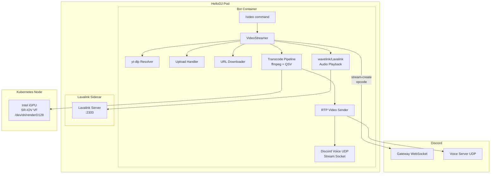

# Design Document: Video Streaming

## Overview

This design adds video streaming capabilities to the HelloDJ Discord bot, enabling it to broadcast video content into voice channels via Discord's Go Live (screenshare) mechanism. The system integrates Intel QSV hardware-accelerated transcoding via SR-IOV GPU passthrough in Kubernetes, and supports YouTube video streaming, direct file uploads, and arbitrary URL playback.

### Key Design Decisions

1. **Custom Discord Go Live Protocol Implementation** — Discord's official bot API does not support screenshare/Go Live. We implement the undocumented Go Live signaling (gateway stream-create/stream-delete events) and video RTP packet transmission based on the reverse-engineered protocol documented by the [Discord-RE/Discord-video-stream](https://github.com/Discord-RE/Discord-video-stream) project. This is a TypeScript/Node.js library; we port the protocol logic to Python as a native module within the bot.

2. **Dual-Stream Architecture (Video + Audio Separation)** — Video frames are sent directly from the bot via raw RTP over Discord's voice UDP connection. Audio continues through the existing Lavalink/wavelink pipeline. Synchronization is handled by timestamp alignment in the RTP packets.

3. **ffmpeg as the Transcoding Engine** — All video processing (decode, scale, encode) runs through a single ffmpeg subprocess per stream, using QSV hardware acceleration. The bot reads H.264 NAL units from ffmpeg's output pipe and packetizes them into RTP.

4. **Graceful GPU Degradation** — The bot remains fully functional for audio when no GPU is available. Video commands check a `gpu_available` flag at invocation time and fail fast with a user-facing error.

5. **Node.js Sidecar for Protocol Handling (Alternative Considered, Rejected)** — Running the TypeScript discord-video-stream lib as a sidecar was considered but rejected: it would require a second Discord gateway connection for the same bot token (not supported), and adds deployment complexity. A native Python implementation keeps everything in one process with one gateway connection.

### Research Summary

- **Discord Go Live Protocol**: The bot must send a gateway opcode 18 (Voice State Update with `self_stream: true`) or use the `STREAM_CREATE` dispatch to initiate a Go Live session. A second voice UDP socket is opened for the stream. Video frames (H.264 NAL units) are sent as RTP packets with SSRC assigned by the voice server. The protocol supports H.264, VP8, and VP9; we use H.264 for QSV compatibility. Source: [DiscordVideoProtocol](https://github.com/giorgi-o/DiscordVideoProtocol), [Discord-RE/Discord-video-stream](https://github.com/Discord-RE/Discord-video-stream).

- **Intel QSV in Docker**: Requires `intel-media-va-driver-non-free`, `libmfx-gen1.2` (or `libvpl2`), and access to `/dev/dri/renderD*`. The SR-IOV device plugin exposes virtual functions as `intel.com/sriov-gpudevice` resources. ffmpeg must be compiled with `--enable-libvpl` (or `--enable-libmfx` for legacy). The Debian `ffmpeg` package in bookworm does NOT include QSV; a custom build or the `jellyfin-ffmpeg` package (which includes QSV) is needed. Source: [Intel oneVPL in FFmpeg](https://www.intel.com/content/www/us/en/developer/articles/technical/onevpl-in-ffmpeg-for-great-streaming-on-intel-gpus.html).

- **RTP Video Packetization**: H.264 NAL units larger than the MTU (~1200 bytes for Discord) must be fragmented using FU-A (Fragmentation Unit type A) per RFC 6184. Each RTP packet carries a sequence number and timestamp; the timestamp increments by `90000 / fps` per frame (90 kHz clock).

## Architecture



### Component Interaction Flow

1. User issues `/video play <url>` command
2. `VideoStreamer` resolves the source (yt-dlp, file upload, or URL download)
3. `VideoStreamer` signals Discord gateway to create a Go Live stream session
4. Discord returns a stream voice server endpoint + SSRC for video
5. `TranscodePipeline` spawns ffmpeg with QSV, piping raw H.264 NAL units to stdout
6. `RTPVideoSender` reads NAL units, packetizes them (FU-A fragmentation), and sends over the stream UDP socket
7. Simultaneously, audio is routed through Lavalink/wavelink on the existing voice connection
8. On stop/completion, `VideoStreamer` sends stream-delete and tears down the pipeline

## Components and Interfaces

### 1. VideoStreamer (`bot/video/streamer.py`)

The orchestrator component managing the lifecycle of a video streaming session per guild.

```python
class VideoStreamer:
    """Per-guild video streaming session manager."""
    
    guild_id: int
    state: StreamState  # idle | resolving | buffering | streaming | stopping
    source: VideoSource | None
    pipeline: TranscodePipeline | None
    rtp_sender: RTPVideoSender | None
    
    async def play(self, source: VideoSource, resolution: Resolution | None = None) -> None:
        """Start streaming a video source to the Go Live session."""
        ...
    
    async def stop(self) -> None:
        """Stop current stream and tear down Go Live session."""
        ...
    
    async def change_resolution(self, resolution: Resolution) -> None:
        """Change output resolution mid-stream without restarting from beginning."""
        ...
    
    @property
    def gpu_available(self) -> bool:
        """Whether QSV hardware acceleration is available."""
        ...
```

### 2. TranscodePipeline (`bot/video/transcode.py`)

Manages the ffmpeg subprocess for hardware-accelerated video transcoding.

```python
class TranscodePipeline:
    """ffmpeg QSV transcode subprocess manager."""
    
    process: asyncio.subprocess.Process | None
    output_resolution: Resolution
    source_fps: float
    _timeout_task: asyncio.Task | None
    
    async def start(self, input_path: str, resolution: Resolution) -> None:
        """Launch ffmpeg with QSV decode + encode pipeline."""
        ...
    
    async def restart_at(self, timestamp_seconds: float, resolution: Resolution) -> None:
        """Restart pipeline at a given timestamp with new resolution."""
        ...
    
    async def read_nal_unit(self) -> bytes | None:
        """Read next H.264 NAL unit from ffmpeg output. None = EOF."""
        ...
    
    async def stop(self) -> None:
        """Terminate ffmpeg subprocess."""
        ...
    
    def build_ffmpeg_args(self, input_path: str, resolution: Resolution, 
                          seek_seconds: float = 0.0) -> list[str]:
        """Construct ffmpeg command line with QSV accel."""
        ...
```

**ffmpeg Pipeline Design:**
```
Input → QSV Decode (-hwaccel qsv) → VPP Scale (target resolution) → 
  H.264 QSV Encode (Baseline/Main, constrained VBR, max 8Mbps@1080p) → 
  Raw H.264 Annex-B output (pipe:1)
```

Fallback on decode failure:
```
Input → Software Decode (-c:v copy or libavcodec) → upload to QSV surface → 
  VPP Scale → H.264 QSV Encode → Raw H.264 output
```

### 3. RTPVideoSender (`bot/video/rtp_sender.py`)

Handles Discord Go Live session establishment and RTP video packet transmission.

```python
class RTPVideoSender:
    """Discord Go Live RTP video packet sender."""
    
    ssrc: int
    sequence_number: int
    timestamp: int
    socket: asyncio.DatagramProtocol
    session_active: bool
    _reconnect_attempts: int
    
    async def establish_session(self, guild_id: int, channel_id: int) -> None:
        """Send stream-create to gateway and connect to video voice server."""
        ...
    
    async def send_frame(self, nal_units: list[bytes], frame_duration_ms: float) -> None:
        """Packetize and send H.264 NAL units as RTP packets."""
        ...
    
    async def terminate_session(self) -> None:
        """Send stream-delete and close the UDP socket."""
        ...
    
    async def reconnect(self) -> bool:
        """Attempt to re-establish a dropped session (up to 3 retries)."""
        ...
    
    def _fragment_nal(self, nal: bytes, max_size: int = 1200) -> list[bytes]:
        """Fragment a NAL unit into FU-A packets if it exceeds MTU."""
        ...
```

**RTP Packet Structure (per Discord protocol):**
```
[RTP Header (12 bytes)]
  - Version: 2
  - Padding: 0
  - Extension: 1 (Discord uses a 1-byte extension for video)
  - CSRC Count: 0
  - Marker: 1 for last packet of a frame, 0 otherwise
  - Payload Type: 101 (H.264) or 103 (VP8) — we use 101
  - Sequence Number: monotonically increasing uint16
  - Timestamp: 90kHz clock, increments by 90000/fps per frame
  - SSRC: assigned by voice server in READY response

[Discord Extension Header (variable)]
  - Video orientation, frame type indicators

[H.264 Payload]
  - Single NAL unit (if ≤ MTU)
  - FU-A fragmented NAL (if > MTU)
```

### 4. VideoSource (`bot/video/sources.py`)

Abstraction for different video input sources.

```python
@dataclass
class VideoSource:
    """Resolved video source ready for transcoding."""
    source_type: Literal["youtube", "upload", "url"]
    file_path: str              # Local path to the video file
    title: str                  # Display title
    duration_seconds: float     # Total duration (0 = unknown/live)
    metadata: dict              # Source-specific metadata
    audio_url: str | None       # Separate audio URL for Lavalink (YouTube)
    cleanup_on_finish: bool     # Whether to delete file_path after streaming


class YouTubeResolver:
    """Resolve YouTube URLs/queries to downloadable video sources."""
    
    async def resolve(self, query: str, quality: SourceQuality | None = None) -> VideoSource:
        """Download video via yt-dlp and return a VideoSource."""
        ...
    
    async def query_formats(self, url: str) -> list[FormatInfo]:
        """List available quality options for a YouTube video."""
        ...


class URLDownloader:
    """Download video from arbitrary URLs."""
    
    async def download(self, url: str) -> VideoSource:
        """Validate, download, and return a VideoSource."""
        ...
```

### 5. GPUProbe (`bot/video/gpu_probe.py`)

Startup GPU capability detection.

```python
class GPUProbe:
    """Detect Intel QSV GPU availability at startup."""
    
    gpu_available: bool
    render_device: str | None  # e.g., /dev/dri/renderD128
    vaapi_capabilities: dict   # Output of vainfo parsing
    
    async def probe(self) -> None:
        """Check for render device and run vainfo + ffmpeg test transcode."""
        ...
    
    def require_gpu(self) -> None:
        """Raise if GPU is not available (used as a command check)."""
        ...
```

### 6. VideoCog (`bot/cogs/video.py`)

Discord slash command interface for video streaming.

```python
class Video(commands.Cog):
    """Video streaming commands."""
    
    @app_commands.command(name="video")
    async def video(self, interaction, action: str, query: str = None, 
                    resolution: str = None, quality: str = None):
        ...
    
    # Subcommands: play, stop, resolution, quality, formats
```

## Data Models

### StreamState Enum

```python
class StreamState(Enum):
    IDLE = "idle"
    RESOLVING = "resolving"       # Source is being resolved/downloaded
    BUFFERING = "buffering"       # ffmpeg pipeline starting up
    STREAMING = "streaming"       # Actively sending RTP packets
    STOPPING = "stopping"         # Teardown in progress
    ERROR = "error"               # Unrecoverable error state
```

### Resolution

```python
class Resolution(Enum):
    RES_480P = (854, 480)
    RES_720P = (1280, 720)
    RES_1080P = (1920, 1080)
    RES_1440P = (2560, 1440)
    RES_2160P = (3840, 2160)
    
    @property
    def height(self) -> int:
        return self.value[1]
    
    @property
    def width(self) -> int:
        return self.value[0]
    
    @classmethod
    def from_height(cls, height: int) -> "Resolution":
        """Match a height to the closest supported resolution."""
        ...
```

### SourceQuality (YouTube download quality)

```python
class SourceQuality(Enum):
    Q_360P = 360
    Q_480P = 480
    Q_720P = 720
    Q_1080P = 1080
    Q_1440P = 1440
    Q_2160P = 2160
```

### FormatInfo (YouTube format query result)

```python
@dataclass
class FormatInfo:
    height: int
    codec: str
    fps: float
    filesize_approx: int  # bytes
    format_id: str
```

### Per-Guild Video State (extension to `guild_state`)

```python
# Added to player.py guild_state dict:
{
    "video_streamer": VideoStreamer | None,   # Active video session
    "video_queue": list[VideoSource],         # Pending video sources
}
```

### Kubernetes Resource Additions

```yaml
# Bot container resource additions:
resources:
  limits:
    intel.com/sriov-gpudevice: 1
  # existing cpu/memory limits unchanged

# Volume device mount (handled by device plugin — no explicit volumeMount needed)
# The SR-IOV device plugin automatically exposes /dev/dri/renderD* in the container
```


## Correctness Properties

*A property is a characteristic or behavior that should hold true across all valid executions of a system — essentially, a formal statement about what the system should do. Properties serve as the bridge between human-readable specifications and machine-verifiable correctness guarantees.*

### Property 1: ffmpeg Command Generation Correctness

*For any* valid video input metadata (codec, container, resolution) and any target output resolution, the `build_ffmpeg_args` function SHALL produce a command that:
- Includes `-hwaccel qsv -hwaccel_output_format qsv` when the source codec is QSV-decodable
- Includes software decode flags when the source codec is NOT QSV-decodable (e.g., AV1 on unsupported hardware), while still using `-c:v h264_qsv` for encoding
- Always includes `-c:v h264_qsv` for encoding
- Includes a maximum bitrate proportional to the output resolution (≤ 8 Mbps at 1080p)

**Validates: Requirements 2.2, 2.3, 2.5**

### Property 2: Now-Playing Metadata Formatting

*For any* video source metadata (title of any length, channel/username of any length, duration in seconds, filename of any length, source type), the now-playing embed builder SHALL produce output where:
- YouTube sources: title is truncated to ≤ 256 characters, channel name ≤ 256 characters, duration formatted as HH:MM:SS
- Upload sources: filename is truncated to ≤ 128 characters, uploader username is present
- URL sources: hostname is present, filename (from path, excluding query params) is present
- Truncation preserves the prefix of the original string

**Validates: Requirements 3.3, 4.2, 5.2**

### Property 3: yt-dlp Error Classification

*For any* yt-dlp error output string, the error classifier SHALL map it to exactly one of the user-facing reason categories (video unavailable, age-restricted, geo-restricted, network error, or unknown), and the resulting user message SHALL contain the classified reason text.

**Validates: Requirements 3.4**

### Property 4: Video File Extension Routing

*For any* filename or URL path string, the video extension detector SHALL return `true` if and only if the file extension (case-insensitive, after the last dot) is one of {mp4, mkv, webm, avi, mov, m4v}. All other extensions SHALL return `false`.

**Validates: Requirements 4.1, 5.1**

### Property 5: File Size Validation

*For any* file size in bytes and a configured maximum size threshold, the size validator SHALL reject the file if and only if the size exceeds the threshold. The rejection message SHALL contain both the actual file size and the maximum allowed size.

**Validates: Requirements 4.4, 5.5**

### Property 6: URL Metadata Extraction

*For any* URL string containing a path with a video file extension, the metadata extractor SHALL correctly produce:
- A hostname matching the URL's domain (without scheme or port)
- A filename matching the last path segment before any query parameters

**Validates: Requirements 5.2**

### Property 7: Resolution Scaling with Aspect Ratio Preservation

*For any* source video dimensions (width, height) and any target resolution from the supported set (480p, 720p, 1080p, 1440p, 2160p) or the default (capped at 1080p), the resolution scaler SHALL produce output dimensions where:
- Output height equals the target height (or source height if source ≤ 1080 and no explicit target)
- Output width preserves the source aspect ratio (width = round_to_even(source_width × target_height / source_height))
- If the computed width does not match the target frame width, letterbox padding is applied such that the final frame dimensions match the target resolution exactly
- Both output width and height are even numbers (required by H.264)

**Validates: Requirements 6.1, 6.3, 6.5**

### Property 8: YouTube Quality Selection with Fallback

*For any* set of available video format heights and any requested source quality, the quality selector SHALL:
- Select the maximum available height that is ≤ the requested height
- If no height ≤ requested exists, select the minimum available height
- When no quality is specified, behave as if 1080p was requested
- The selected height is always a member of the available heights set

**Validates: Requirements 7.1, 7.2, 7.3, 7.4**

### Property 9: Format List Embed Rendering

*For any* non-empty list of FormatInfo entries (height, codec, filesize), the embed renderer SHALL produce a Discord embed containing one entry per format that includes the height in pixels, codec name, and approximate file size.

**Validates: Requirements 7.5**

### Property 10: RTP Frame Rate Capping and Packetization

*For any* source frame rate and any H.264 NAL unit:
- The effective output frame rate SHALL be min(source_fps, 60)
- NAL units ≤ 1200 bytes SHALL be sent as single RTP packets
- NAL units > 1200 bytes SHALL be fragmented into FU-A packets where each fragment ≤ 1200 bytes
- RTP sequence numbers SHALL be monotonically increasing
- RTP timestamps SHALL increment by exactly floor(90000 / effective_fps) per frame

**Validates: Requirements 8.2**

### Property 11: Reconnection Exponential Backoff

*For any* sequence of consecutive Go Live session drops (1 to N), the reconnection logic SHALL:
- Attempt reconnection if attempts_so_far < 3
- Wait 2^(attempt_number - 1) seconds before each retry (1s, 2s, 4s), capped at 8s
- Report failure to the user if all 3 attempts are exhausted

**Validates: Requirements 8.5**

## Error Handling

### Error Categories and Recovery

| Error | Detection | Recovery | User Feedback |
|-------|-----------|----------|---------------|
| GPU not available | Startup probe fails | Set `gpu_available=false`, disable video commands | Ephemeral embed: "Video streaming unavailable: Intel GPU device not detected" |
| ffmpeg QSV decode failure | Non-zero exit + stderr contains QSV error | Retry with software decode if applicable | "Hardware transcoding failed" + error detail |
| ffmpeg timeout (no output 60s) | Watchdog timer | Kill subprocess, release resources | "Video transcoding timed out" |
| yt-dlp resolution failure | yt-dlp exit code / exception | Map to category, report | Category-specific message (unavailable/age/geo/network) |
| yt-dlp download timeout (30s) | asyncio.timeout | Cancel download task, cleanup partial file | "Download timed out — try a lower quality or different video" |
| URL unreachable (10s) | aiohttp.ClientTimeout | No retry | "URL unreachable: connection timed out" |
| URL non-video Content-Type | Response header check | No retry | "URL does not contain video content" |
| URL 401/403 | HTTP status code | No retry | "URL is not publicly accessible" |
| File too large (upload/URL) | Size check pre/post download | Reject, cleanup | "File size ({size}MB) exceeds maximum ({limit}MB)" |
| Corrupt video file | ffmpeg decode failure (zero frames) | Cleanup temp file | "File is not a playable video" |
| Go Live session drop | UDP socket error / no ACK | Exponential backoff retry (3x) | "Stream connection lost — reconnecting..." / "Stream failed after 3 reconnection attempts" |
| User not in voice channel | Interaction check | Reject command | "You must join a voice channel first" |
| Unsupported resolution | Input validation | Reject command | "Unsupported resolution. Supported: 480p, 720p, 1080p, 1440p, 2160p" |

### Resource Cleanup Strategy

- **ffmpeg subprocess**: Always terminated via `process.kill()` + `process.wait()` in a `finally` block, even on exceptions
- **Temporary video files**: Deleted within 60 seconds of stream completion via a cleanup task; stale files (>24h) cleaned on bot startup (extends existing `file_handler.cleanup_old_files`)
- **UDP sockets**: Closed in the `terminate_session` path; also closed in `__del__` as a safety net
- **Go Live session**: Always terminated with stream-delete on any exit path (normal completion, error, disconnect)

### Graceful Degradation

- If GPU probe fails at startup → all audio features continue working normally
- If ffmpeg crashes mid-stream → stream stops, user notified, audio continues via Lavalink
- If Go Live session cannot be established → error reported, no partial state left

## Testing Strategy

### Property-Based Tests (using Hypothesis)

Property-based testing is appropriate for this feature because several components have pure-function logic with large input spaces (resolution calculations, format string construction, URL parsing, RTP packetization).

**Configuration:**
- Library: [Hypothesis](https://hypothesis.readthedocs.io/) (Python PBT library)
- Minimum iterations: 100 per property
- Tag format: `# Feature: video-streaming, Property N: <property_text>`

**Properties to implement:**
1. `test_ffmpeg_args_generation` — Property 1
2. `test_now_playing_formatting` — Property 2
3. `test_ytdlp_error_classification` — Property 3
4. `test_video_extension_routing` — Property 4
5. `test_file_size_validation` — Property 5
6. `test_url_metadata_extraction` — Property 6
7. `test_resolution_scaling` — Property 7
8. `test_quality_selection` — Property 8
9. `test_format_list_rendering` — Property 9
10. `test_rtp_packetization` — Property 10
11. `test_reconnection_backoff` — Property 11

### Unit Tests (example-based)

- GPU probe: test both GPU-present and GPU-absent paths
- Timeout behavior: ffmpeg 60s timeout, yt-dlp 30s timeout
- Guard checks: user not in voice, unsupported resolution
- Session teardown timing
- Error embed content for each failure category

### Integration Tests

- End-to-end stream: yt-dlp → ffmpeg → RTP (with mocked Discord UDP)
- A/V sync measurement (audio timestamps vs video timestamps within 50ms)
- Mid-stream resolution change (verify <5s transition)
- Go Live session establishment with mocked gateway

### Smoke Tests

- Container image: `ffmpeg -hwaccels` lists `qsv`
- Container image: test transcode completes without error
- Deployment YAML: `intel.com/sriov-gpudevice` resource limit present
- Package presence: `vainfo`, Intel media driver libraries

### Test Infrastructure Notes

- QSV tests that require actual hardware should be tagged `@pytest.mark.gpu` and skipped in CI without GPU
- RTP packetization tests are pure logic and run in any environment
- Gateway protocol tests use a mock WebSocket server
- ffmpeg argument generation tests are pure functions (no subprocess needed)
