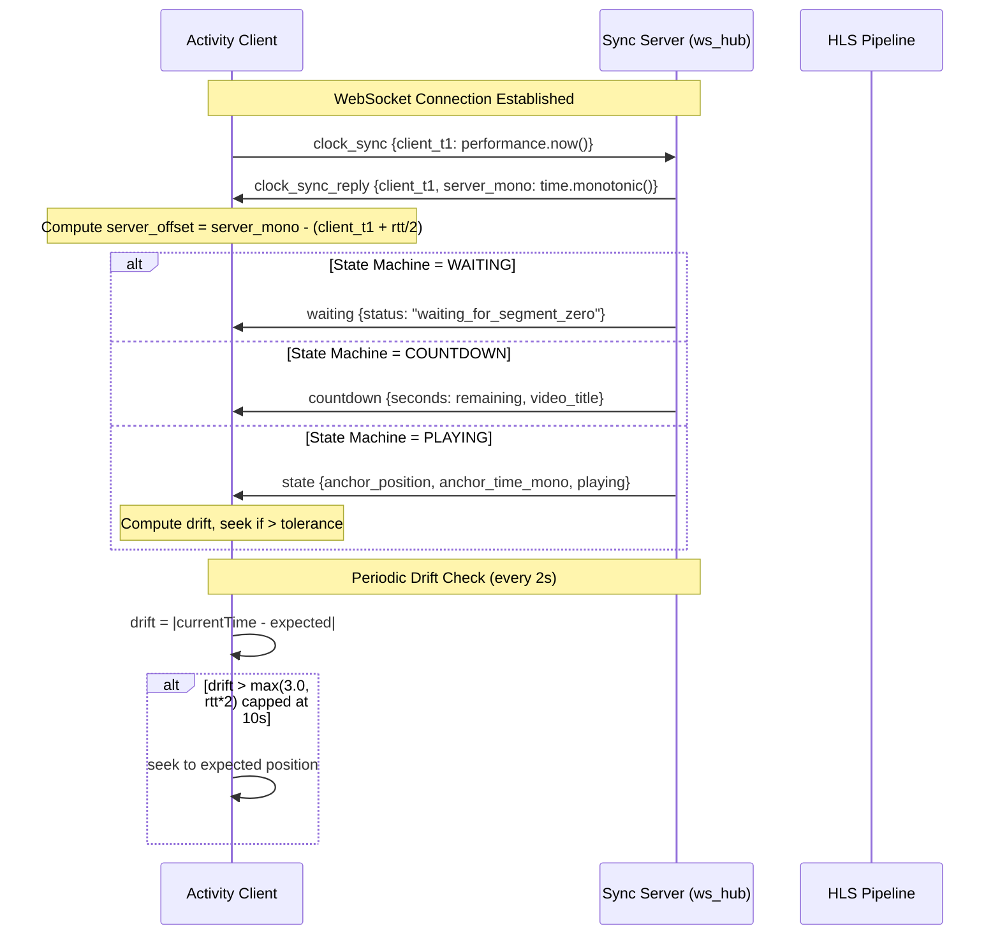
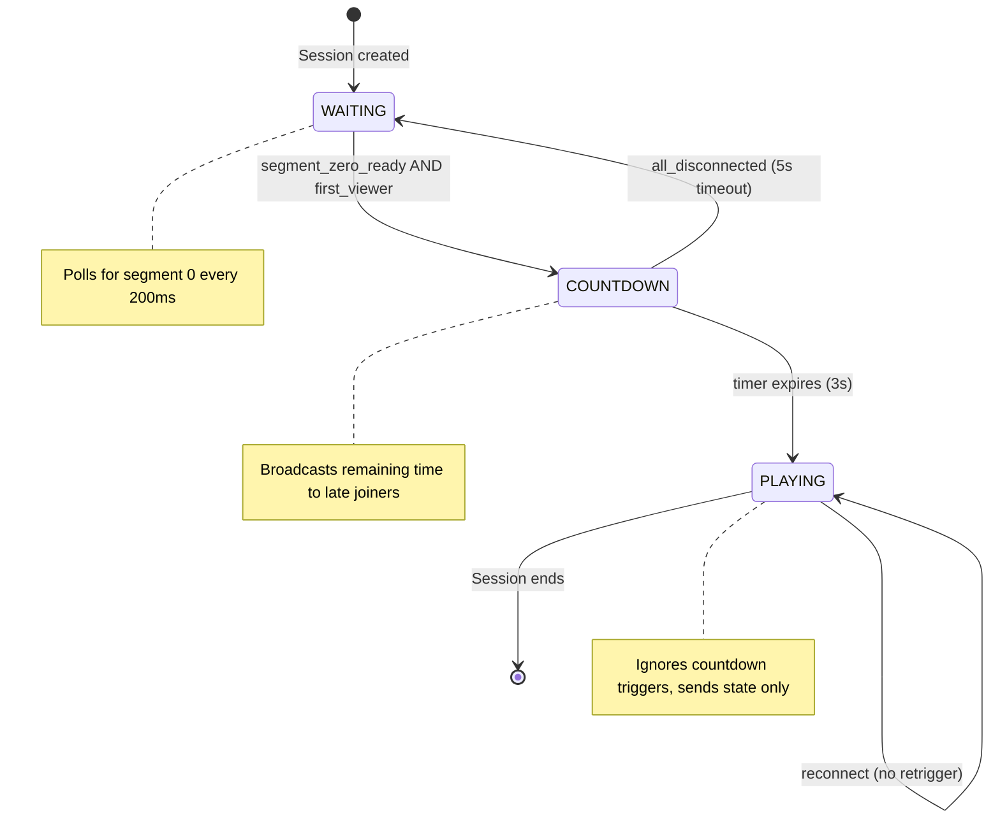

# Design Document: Video Sync Clock

## Overview

This feature replaces the wall-clock-based (`time.time()` / `Date.now()`) video synchronization protocol with a monotonic-clock protocol (`time.monotonic()` / `performance.now()`). The core problems solved:

1. **Clock skew** — NTP corrections and system clock adjustments cause position jumps
2. **Countdown retrigger** — WebSocket reconnections (every ~30s) re-enter the countdown flow
3. **Missed segment zero** — Playback starts at whatever HLS segment is ready, not necessarily 0:00
4. **Fixed drift tolerance** — High-latency clients stutter from constant corrective seeks
5. **Reconnection disruption** — Each reconnect causes visible seek/pause artifacts

The design preserves backward compatibility by including both `anchor_time` (wall-clock) and `anchor_time_mono` (monotonic) in state messages. Clients that understand the new protocol prefer `anchor_time_mono`; legacy clients fall back transparently.

## Architecture



### Countdown State Machine



## Components and Interfaces

### Server-Side Components

#### 1. `ClockSyncHandler` (new method on `WebSocketHub`)

Handles `clock_sync` messages from clients and responds immediately with `clock_sync_reply`. Stateless — no per-client clock data stored server-side.

```python
async def _handle_clock_sync(self, guild_id: int, sender: web.WebSocketResponse, data: dict) -> None:
    """Respond to clock_sync with server monotonic time."""
    reply = {
        "type": "clock_sync_reply",
        "client_t1": data.get("client_t1"),
        "server_mono": time.monotonic(),
    }
    await sender.send_json(reply)
```

#### 2. Modified `PlaybackState` dataclass

Internally stores `anchor_time` as `time.monotonic()`. A new property `anchor_time_wall` provides backward-compatible wall-clock values for legacy messages.

```python
@dataclasses.dataclass
class PlaybackState:
    playing: bool = True
    anchor_position: float = 0.0
    anchor_time: float = dataclasses.field(default_factory=time.monotonic)  # CHANGED: monotonic
    _epoch_offset: float = dataclasses.field(default_factory=lambda: time.time() - time.monotonic())
    subtitle_lang: str | None = None
    audio_lang: str | None = None

    @property
    def anchor_time_wall(self) -> float:
        """Wall-clock equivalent of anchor_time (for backward compat)."""
        return self.anchor_time + self._epoch_offset
```

#### 3. `CountdownStateMachine` (refactored from `ActivityStreamer` booleans)

Replaces the current `waiting_for_viewer`, `countdown_active`, `playback_started` booleans with an explicit enum-based state machine with guarded transitions.

```python
class CountdownPhase(enum.Enum):
    WAITING = "waiting"
    COUNTDOWN = "countdown"
    PLAYING = "playing"

class CountdownStateMachine:
    def __init__(self, countdown_seconds: int = 3):
        self.phase: CountdownPhase = CountdownPhase.WAITING
        self.countdown_seconds: int = countdown_seconds
        self.countdown_start_mono: float = 0.0
        self._disconnect_timer: asyncio.Task | None = None

    def can_start_countdown(self) -> bool:
        return self.phase == CountdownPhase.WAITING

    def start_countdown(self) -> bool:
        if self.phase != CountdownPhase.WAITING:
            return False
        self.phase = CountdownPhase.COUNTDOWN
        self.countdown_start_mono = time.monotonic()
        return True

    def complete_countdown(self) -> bool:
        if self.phase != CountdownPhase.COUNTDOWN:
            return False
        self.phase = CountdownPhase.PLAYING
        return True

    def reset(self) -> None:
        """Reset for new video session."""
        self.phase = CountdownPhase.WAITING
        self.countdown_start_mono = 0.0

    @property
    def remaining_seconds(self) -> float:
        if self.phase != CountdownPhase.COUNTDOWN:
            return 0.0
        elapsed = time.monotonic() - self.countdown_start_mono
        return max(0.0, self.countdown_seconds - elapsed)
```

#### 4. Segment-Zero Readiness Check

A polling coroutine in `ActivityStreamer` that waits for segment 0 before allowing the countdown to begin.

```python
async def _await_segment_zero(self, hls_dir: Path, timeout: float = 10.0) -> float:
    """Poll for segment 0. Returns anchor_position (0.0 or fallback)."""
    deadline = time.monotonic() + timeout
    while time.monotonic() < deadline:
        playlist = hls_dir / "stream.m3u8"
        if playlist.exists():
            # Parse playlist for segment 0
            seg0 = hls_dir / "stream0.ts"
            if seg0.exists() and seg0.stat().st_size > 0:
                return 0.0
        await asyncio.sleep(0.2)
    # Fallback: find lowest segment, compute offset
    return self._find_lowest_segment_offset(hls_dir)
```

### Client-Side Components

#### 5. `ClockSync` class (new in `app.js`)

Manages the handshake lifecycle, RTT tracking, and offset computation.

```javascript
class ClockSync {
    constructor(wsSend) {
        this._wsSend = wsSend;
        this.serverOffset = 0;    // Add to local performance.now() to get server mono
        this.rtt = 0;
        this.synced = false;
        this._pendingT1 = null;
        this._retryCount = 0;
        this._maxRetries = 3;
        this._timeout = null;
    }

    initiate() {
        this._pendingT1 = performance.now();
        this._wsSend({ type: 'clock_sync', client_t1: this._pendingT1 });
        this._timeout = setTimeout(() => this._onTimeout(), 2000);
    }

    handleReply(data) {
        if (data.client_t1 !== this._pendingT1) return false; // Stale reply
        clearTimeout(this._timeout);
        const now = performance.now();
        this.rtt = now - this._pendingT1;
        this.serverOffset = data.server_mono - (this._pendingT1 + this.rtt / 2);
        this.synced = true;
        this._retryCount = 0;
        return true;
    }

    serverNow() {
        return performance.now() + this.serverOffset;
    }

    get driftTolerance() {
        const rttSeconds = this.rtt / 1000;
        return Math.min(10.0, Math.max(3.0, rttSeconds * 2));
    }
}
```

#### 6. `DriftChecker` (integrated into playback loop)

Runs every 2 seconds during PLAYING state. Computes expected position from monotonic anchor, compares to `videoEl.currentTime`, seeks if drift exceeds adaptive tolerance.

```javascript
function computeExpectedPosition(state, clockSync) {
    if (!state.playing) return state.anchor_position;
    const serverNow = clockSync.serverNow();
    return state.anchor_position + (serverNow - state.anchor_time_mono);
}
```

#### 7. Reconnection Manager (enhanced `connectWebSocket`)

On reconnect: performs clock sync first, queues incoming state messages until sync completes or times out (5s), then processes queued messages with new offset.

## Data Models

### Modified Server Messages

#### `clock_sync` (client → server)
```json
{
    "type": "clock_sync",
    "client_t1": 12345.678
}
```

#### `clock_sync_reply` (server → client)
```json
{
    "type": "clock_sync_reply",
    "client_t1": 12345.678,
    "server_mono": 98765.432
}
```

#### `state` message (server → client, modified)
```json
{
    "type": "state",
    "media_type": "video",
    "playing": true,
    "anchor_position": 42.5,
    "anchor_time_mono": 98800.0,
    "anchor_time": 1724356789.123,
    "position": 45.2,
    "timestamp": 1724356792.0,
    "subtitle_lang": null,
    "audio_lang": null,
    "strokes": []
}
```

#### `start` message (server → client, modified)
```json
{
    "type": "start",
    "position": 0.0,
    "anchor_time_mono": 98765.432,
    "timestamp": 1724356789.123
}
```

#### `play` / `pause` broadcast (server → clients, modified)
```json
{
    "type": "play",
    "anchor_time": 1724356789.123,
    "anchor_time_mono": 98800.0,
    "anchor_position": 42.5,
    "timestamp": 1724356789.123
}
```

#### `countdown` message (server → client, extended)
```json
{
    "type": "countdown",
    "seconds": 2.7,
    "video_title": "Never Gonna Give You Up",
    "phase": "countdown"
}
```

#### `waiting` message (new, server → client)
```json
{
    "type": "waiting",
    "status": "waiting_for_segment_zero"
}
```

### Modified `PlaybackState` Fields

| Field | Old Type | New Type | Notes |
|-------|----------|----------|-------|
| `anchor_time` | `time.time()` | `time.monotonic()` | Internal only |
| `_epoch_offset` | N/A | `float` | `time.time() - time.monotonic()` at creation |
| `anchor_time_wall` | N/A | property | Computed from `anchor_time + _epoch_offset` |

### `CountdownStateMachine` Transition Table

| Current State | Event | Guard | Next State |
|---------------|-------|-------|------------|
| WAITING | first_viewer + segment_zero_ready | HLS in STREAMING | COUNTDOWN |
| WAITING | client_connect | HLS not STREAMING | WAITING (send waiting msg) |
| COUNTDOWN | timer_expires | — | PLAYING |
| COUNTDOWN | all_disconnect + 5s timeout | — | WAITING |
| PLAYING | reconnect | — | PLAYING (send state) |
| PLAYING | any countdown trigger | — | PLAYING (ignored) |
| PLAYING | new_track | — | WAITING (reset) |


## Correctness Properties

*A property is a characteristic or behavior that should hold true across all valid executions of a system — essentially, a formal statement about what the system should do. Properties serve as the bridge between human-readable specifications and machine-verifiable correctness guarantees.*

### Property 1: Clock sync reply echoes client timestamp in any state

*For any* `clock_sync` message with an arbitrary `client_t1` float value, and *for any* current `CountdownPhase` (WAITING, COUNTDOWN, or PLAYING) and `PlaybackState`, the server SHALL respond with a `clock_sync_reply` containing the identical `client_t1` value and a `server_mono` value that is a positive float from `time.monotonic()`.

**Validates: Requirements 1.2, 1.6**

### Property 2: Server offset computation

*For any* `client_t1 >= 0`, `server_mono >= 0`, and `client_now > client_t1`, the computed `server_offset` SHALL equal `server_mono - (client_t1 + (client_now - client_t1) / 2)` and the computed `rtt` SHALL equal `client_now - client_t1`.

**Validates: Requirements 1.3**

### Property 3: Stale clock sync reply rejection

*For any* `ClockSync` instance with a pending `client_t1` value, receiving a `clock_sync_reply` whose `client_t1` field does not match the pending value SHALL leave `serverOffset`, `rtt`, and `synced` unchanged.

**Validates: Requirements 1.8**

### Property 4: Expected position computation

*For any* `anchor_position >= 0`, `anchor_time_mono > 0`, `server_offset`, and `local_mono_now`, when `playing` is true the expected position SHALL equal `anchor_position + (local_mono_now + server_offset - anchor_time_mono)`, and when `playing` is false the expected position SHALL equal `anchor_position` regardless of time values.

**Validates: Requirements 2.3, 2.4**

### Property 5: PlaybackState anchor invariants under seek/pause/resume

*For any* `PlaybackState` with `anchor_position=p` and `anchor_time=t`:
- After `seek_to(target)`: `anchor_position == target` and `anchor_time` is fresh (>= previous `anchor_time`)
- After `set_playing(False)` when playing: `anchor_position == p + (now - t)` (position frozen at computed value)
- After `set_playing(True)` when paused: `anchor_position` is unchanged from before the call and `anchor_time` is updated

**Validates: Requirements 2.5, 2.6, 2.7**

### Property 6: Countdown state machine valid forward transitions

*For any* `CountdownStateMachine` in WAITING phase, calling `start_countdown()` SHALL transition to COUNTDOWN and return True. *For any* machine in COUNTDOWN phase, calling `complete_countdown()` SHALL transition to PLAYING and return True.

**Validates: Requirements 3.2, 3.3**

### Property 7: PLAYING state is a terminal guard against retrigger

*For any* `CountdownStateMachine` in PLAYING phase, calling `start_countdown()` SHALL return False and the phase SHALL remain PLAYING. No sequence of `start_countdown()` or `complete_countdown()` calls SHALL change the phase away from PLAYING.

**Validates: Requirements 3.4**

### Property 8: Countdown remaining time computation

*For any* `CountdownStateMachine` in COUNTDOWN phase with `countdown_seconds=N` and `elapsed` monotonic seconds since countdown start, `remaining_seconds` SHALL equal `max(0.0, N - elapsed)`.

**Validates: Requirements 3.6**

### Property 9: State machine reset from any phase

*For any* `CountdownStateMachine` regardless of current phase (WAITING, COUNTDOWN, or PLAYING), calling `reset()` SHALL set the phase to WAITING.

**Validates: Requirements 3.8**

### Property 10: All broadcast messages include monotonic anchor time

*For any* broadcast message of type `state`, `start`, `play`, or `pause` generated by the server, the message dictionary SHALL contain an `anchor_time_mono` field with a value > 0, AND a `anchor_time` field (wall-clock, for backward compatibility).

**Validates: Requirements 6.1, 6.2, 6.3**

### Property 11: Client anchor field selection

*For any* received message, if `anchor_time_mono` is present and > 0, the client SHALL use `anchor_time_mono` for position computation. If `anchor_time_mono` is absent or == 0, the client SHALL use the `anchor_time` field instead. In either case, the selected value is used identically in the position formula.

**Validates: Requirements 6.4**

### Property 12: RTT-adaptive drift tolerance formula

*For any* `rtt >= 0` (in seconds), the drift tolerance SHALL equal `min(10.0, max(3.0, rtt * 2))`. A corrective seek SHALL occur if and only if `abs(actual_position - expected_position) > tolerance`.

**Validates: Requirements 5.1**

### Property 13: Segment-zero fallback offset computation

*For any* set of available HLS segment indices (not containing 0) and a known `segment_duration > 0`, the fallback `anchor_position` SHALL equal `min(available_indices) * segment_duration`.

**Validates: Requirements 4.4**

## Error Handling

### Server-Side Errors

| Scenario | Handling |
|----------|----------|
| `clock_sync` missing `client_t1` | Log debug, ignore message (no reply sent) |
| Segment 0 timeout (10s) | Log error, compute fallback offset from lowest available segment, proceed with countdown |
| HLS directory missing/empty after timeout | Log error, set anchor_position = 0.0, proceed (client will buffer) |
| WebSocket send failure during clock_sync_reply | Discard connection (existing stale-connection cleanup logic) |
| State machine receives invalid transition | Return False, log debug, no state change |
| Monotonic clock wrap (theoretically impossible on Linux) | Not handled — `time.monotonic()` guarantees forward progress |

### Client-Side Errors

| Scenario | Handling |
|----------|----------|
| Clock sync timeout (2000ms) | Retry up to 3 times with 500ms delay |
| All retries exhausted | Close WS, trigger reconnection flow |
| Stale `clock_sync_reply` (mismatched `client_t1`) | Discard, retry handshake |
| `anchor_time_mono` missing from message | Fall back to `anchor_time` (wall-clock) |
| Negative expected position computed | Clamp to 0.0 |
| Drift check during buffering (no currentTime) | Skip drift check until `canplay` event |
| WS disconnect during clock sync phase | On reconnect, start fresh clock sync (queued messages discarded) |
| RTT measured as 0 (local loopback) | Tolerance defaults to max(3.0, 0) = 3.0s |

### Graceful Degradation

The protocol degrades gracefully when components fail:

1. **Clock sync fails entirely** → Client uses stored offset from previous connection (or 0 + 3s fixed tolerance if first connection)
2. **Server doesn't send `anchor_time_mono`** → Client falls back to wall-clock `anchor_time` (existing behavior, no regression)
3. **Countdown state machine in unexpected state** → `start_countdown()` returns False, server sends current state message instead
4. **Segment zero never appears** → After 10s timeout, playback starts from lowest available segment with correct anchor offset

## Testing Strategy

### Property-Based Tests (Hypothesis)

The feature's core logic — clock math, state machine transitions, drift tolerance, and message serialization — is well-suited to property-based testing. All properties will be tested using [Hypothesis](https://hypothesis.readthedocs.io/) (already in use in this project, as evidenced by `.hypothesis/` directory).

**Configuration:**
- Minimum 100 examples per property (Hypothesis default: 100, extended to 200 for state machine properties)
- Each test tagged with: `# Feature: video-sync-clock, Property N: <title>`
- Test file: `tests/test_video_sync_clock_properties.py`

**Property tests cover:**
- Offset computation correctness (Property 2)
- Stale reply rejection (Property 3)
- Expected position formula (Property 4)
- PlaybackState anchor invariants (Property 5)
- State machine transitions (Properties 6, 7, 8, 9)
- Drift tolerance formula (Property 12)
- Segment fallback offset (Property 13)

### Unit Tests (pytest)

Example-based tests for specific scenarios:

- Clock sync reply message format validation
- Broadcast message includes both `anchor_time` and `anchor_time_mono`
- Client field selection logic (anchor_time_mono present vs absent)
- Countdown state machine: WAITING stays WAITING when HLS not streaming
- HLS.js startPosition configuration
- Default 3.0s tolerance when unsynced

### Integration Tests

- WebSocket clock sync handshake round-trip (actual aiohttp test client)
- Reconnection flow: sync → queue → process
- Countdown non-retrigger on reconnect (full WS lifecycle)
- Segment-zero polling with mock filesystem
- 5s disconnect timeout in COUNTDOWN state

### What's NOT Property-Tested

- Timing constraints (100ms send, 50ms reply, 200ms poll interval) — use integration tests with time mocks
- WebSocket lifecycle management — integration tests
- HLS.js configuration — example-based client tests
- Video element preservation across reconnects — manual/E2E test
