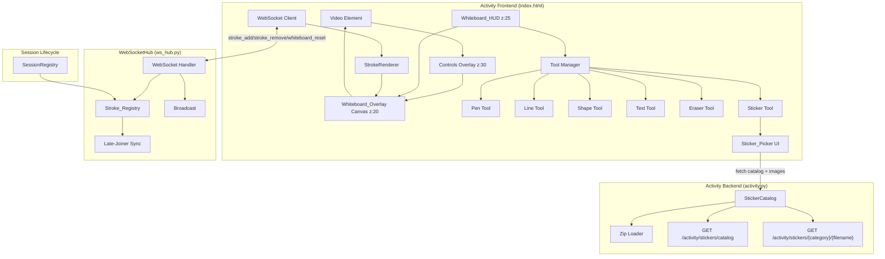

# Design Document: Video Whiteboard

## Overview

This design adds a collaborative real-time whiteboard overlay to the existing Video Activity player. The whiteboard enables all connected viewers to draw annotations (freehand, lines, shapes, text) on a transparent canvas above the video, with strokes synchronized via the existing WebSocket infrastructure and scoped to the session lifecycle.

The architecture extends three existing components without replacing them:
- **Activity Frontend** gains a `<canvas>` overlay, drawing tool HUD, sticker picker, and stroke rendering/sync logic
- **Activity Backend** gains a `StickerCatalog` that loads zip files from `stickers/`, extracts images, and serves them via HTTP endpoints
- **WebSocketHub** gains a `Stroke_Registry` per guild and handlers for `stroke_add`, `stroke_remove`, `whiteboard_reset` messages
- **SessionRegistry** gains lifecycle hooks to initialize and clear whiteboard state

### Key Design Decisions

1. **Canvas overlay, not SVG** — Canvas provides better performance for real-time freehand drawing with many points. SVG would create too many DOM nodes for freehand paths. Canvas redraws on resize using stored normalized coordinates.

2. **Normalized coordinates (0.0–1.0)** — All stroke data is stored in viewport-relative coordinates so drawings appear at correct positions regardless of viewer screen size. Normalization uses 4 decimal places (0.01% precision).

3. **Server-authoritative Stroke_Registry** — Strokes are stored server-side in the WebSocketHub so late joiners receive the full state. The registry is in-memory only (no persistence beyond session lifetime). Max 500 strokes prevents unbounded growth.

4. **Stroke-level granularity for eraser/undo** — Rather than pixel-based erasing, the eraser removes entire strokes. This simplifies sync (one `stroke_remove` message vs. complex mask data) and keeps the protocol lightweight.

5. **Drawing input gated by mode toggle** — The canvas always renders strokes (read-only), but pointer capture for drawing requires explicit activation via the whiteboard toggle. This prevents accidental drawing while using video controls.

6. **Strokes persist across video changes within a session** — When a user skips or auto-advances, the whiteboard state carries over. Only session end or explicit reset clears strokes.

7. **Sticker assets loaded from zip at startup** — The backend extracts all zip files in `stickers/` at startup, caches images in memory, and serves them via HTTP. This avoids repeated zip I/O during the session. Corrupt or empty zips are skipped gracefully.

8. **Sticker bounding box capped at 50% overlay** — Stickers cannot exceed 50% of overlay width or height. This prevents a single sticker from dominating the whiteboard and ensures multiple participants can place stickers without excessive overlap.

## Architecture



### DOM Layer Ordering (z-index)

```
z: 40  — Error overlay (existing)
z: 30  — Controls overlay (existing, pointer-events: auto on hover)
z: 25  — Whiteboard HUD toolbar (visible when mode active)
z: 20  — Whiteboard_Overlay canvas (pointer-events: auto when mode active, none when inactive)
z: 10  — Video element (existing)
```

### Request Flow (Drawing a Stroke)

1. Viewer activates whiteboard mode → HUD appears, canvas accepts pointer events
2. Viewer draws with pen tool → pointer events captured, coordinates normalized to 0.0–1.0
3. On pointer-up → stroke finalized, rendered locally, `stroke_add` sent via WebSocket
4. WebSocketHub receives `stroke_add` → validates, stores in `Stroke_Registry`, broadcasts to other viewers
5. Other viewers receive `stroke_add` → render stroke on their canvas

### Request Flow (Late Joiner)

1. New viewer connects via WebSocket
2. WebSocketHub sends `state` message including `strokes` array from `Stroke_Registry`
3. Frontend renders all existing strokes before enabling drawing input

## Components and Interfaces

### 1. Whiteboard_Overlay (Frontend — `whiteboard.js`)

The core canvas module managing the drawing surface and stroke state.

```javascript
class WhiteboardOverlay {
    canvas: HTMLCanvasElement       // Transparent canvas element
    ctx: CanvasRenderingContext2D
    strokes: Map<string, Stroke>   // stroke_id → Stroke (ordered by insertion)
    mode: 'active' | 'inactive'
    currentTool: DrawingTool
    currentColor: string           // hex color e.g. '#FF0000'
    localAuthorId: string          // viewer's unique ID (from Discord SDK user_id)
    undoStack: string[]            // stroke IDs authored by this viewer (most recent last)

    activate(): void               // Enable drawing mode
    deactivate(): void             // Disable drawing mode (keep rendering)
    addStroke(stroke: Stroke): void
    removeStroke(strokeId: string): void
    clearAll(): void
    redraw(): void                 // Full re-render from stroke map
    resize(): void                 // Recalculate canvas dimensions, redraw
    hitTest(x: number, y: number, tolerance: number): Stroke | null
}
```

### 2. Stroke Data Model (Shared — `stroke.js`)

```javascript
/** Normalized stroke data — all coordinates in 0.0–1.0 range */
interface Stroke {
    id: string              // UUID v4
    type: 'freehand' | 'line' | 'rect' | 'ellipse' | 'arrow' | 'text' | 'sticker'
    author: string          // Discord user_id of creator
    color: string           // hex color '#RRGGBB'
    width: number           // normalized width (e.g. 3px / viewport_width)
    points: [number, number][]  // [[x, y], ...] normalized coordinates
    // For text strokes:
    text?: string           // text content (max 200 chars)
    textBg?: boolean        // whether background is enabled
    // For sticker strokes:
    sticker_category?: string   // category slug (derived from zip filename)
    sticker_filename?: string   // image filename within the category
}
```

Point arrays by stroke type:
- `freehand`: N points forming the path (N ≥ 2)
- `line`: exactly 2 points [start, end]
- `rect`: exactly 2 points [topLeft, bottomRight]
- `ellipse`: exactly 2 points [topLeft, bottomRight] of bounding box
- `arrow`: exactly 2 points [start, end]
- `text`: exactly 1 point [position]
- `sticker`: exactly 2 points [topLeft, bottomRight] of bounding box (same as rect)

### 3. Tool Manager (Frontend — `tools.js`)

```javascript
interface DrawingTool {
    name: string
    cursor: string                           // CSS cursor value
    onPointerDown(e: PointerEvent): void
    onPointerMove(e: PointerEvent): void
    onPointerUp(e: PointerEvent): Stroke | null  // Returns finalized stroke or null
    onCancel(): void                         // Cleanup on mode switch / escape
    renderPreview(ctx: CanvasRenderingContext2D): void
}

class ToolManager {
    tools: Map<string, DrawingTool>
    activeTool: DrawingTool

    selectTool(name: string): void
    getActiveTool(): DrawingTool
}
```

Individual tool implementations:

```javascript
class PenTool implements DrawingTool {
    // Captures points on pointermove, finalizes on pointerup
    // Renders with quadratic Bézier interpolation
    points: [number, number][]
}

class LineTool implements DrawingTool {
    // Records start on pointerdown, renders preview line on move
    // Finalizes 2-point stroke on pointerup (discards if zero-length)
    startPoint: [number, number] | null
}

class ShapeTool implements DrawingTool {
    // Sub-types: 'rect', 'ellipse', 'arrow'
    // Records start on pointerdown, preview on move
    // Finalizes if bounding box > 5px in both dims
    shapeType: 'rect' | 'ellipse' | 'arrow'
    startPoint: [number, number] | null
}

class TextTool implements DrawingTool {
    // On click: shows <input> at position
    // On submit (Enter or blur): creates text stroke if non-whitespace
    // On Escape: cancels
}

class EraserTool implements DrawingTool {
    // On click: hit-tests against all strokes (topmost first)
    // 5px tolerance from path centerline
    // Removes hit stroke via stroke_remove
}

class StickerTool implements DrawingTool {
    // Sub-type of placement tool (same drag pattern as ShapeTool)
    // On activation: shows Sticker_Picker panel
    // On deactivation: hides Sticker_Picker panel
    // Requires sticker selection before placement
    // On pointerdown: records start point (same as ShapeTool)
    // On pointermove: renders preview of selected sticker image within bounding box
    // On pointerup: finalizes if bbox > 5px in both dims, caps at 50% overlay in each dim
    // Produces stroke with type "sticker", sticker_category, sticker_filename
    selectedCategory: string | null
    selectedFilename: string | null
    startPoint: [number, number] | null

    MAX_WIDTH_RATIO: 0.5   // Max 50% of overlay width
    MAX_HEIGHT_RATIO: 0.5  // Max 50% of overlay height
}
```

### 4. Stroke_Registry (Backend — extension to `ws_hub.py`)

```python
@dataclasses.dataclass
class StrokeData:
    """Server-side stroke record."""
    id: str
    type: str             # freehand, line, rect, ellipse, arrow, text, sticker
    author: str           # user_id string
    color: str            # hex color
    width: float          # normalized width
    points: list[list[float]]  # [[x, y], ...]
    text: str | None = None
    text_bg: bool = False
    sticker_category: str | None = None   # category slug (for type "sticker")
    sticker_filename: str | None = None   # image filename (for type "sticker")


class StrokeRegistry:
    """Per-guild stroke storage for whiteboard sync.

    Maintains insertion order. Maximum 500 strokes per guild.
    """

    MAX_STROKES = 500

    def __init__(self) -> None:
        self._strokes: dict[str, StrokeData] = {}  # id → StrokeData (insertion-ordered dict)

    def add(self, stroke: StrokeData) -> bool:
        """Add a stroke. Returns False if at capacity."""
        if len(self._strokes) >= self.MAX_STROKES:
            return False
        self._strokes[stroke.id] = stroke
        return True

    def remove(self, stroke_id: str) -> bool:
        """Remove a stroke by ID. Returns False if not found."""
        return self._strokes.pop(stroke_id, None) is not None

    def clear(self) -> None:
        """Remove all strokes."""
        self._strokes.clear()

    def get_all(self) -> list[dict]:
        """Return all strokes as dicts in insertion order for late-joiner sync."""
        return [dataclasses.asdict(s) for s in self._strokes.values()]

    def __len__(self) -> int:
        return len(self._strokes)
```

### 5. WebSocketHub Extension (Backend — `ws_hub.py`)

The existing `WebSocketHub` class gains:

```python
class WebSocketHub:
    def __init__(self, validate_guild_token: Callable[[str], int | None]) -> None:
        # ... existing fields ...
        self._stroke_registries: dict[int, StrokeRegistry] = {}  # guild_id → registry

    def get_stroke_registry(self, guild_id: int) -> StrokeRegistry:
        """Get or create the stroke registry for a guild."""
        if guild_id not in self._stroke_registries:
            self._stroke_registries[guild_id] = StrokeRegistry()
        return self._stroke_registries[guild_id]

    def clear_stroke_registry(self, guild_id: int) -> None:
        """Clear all strokes for a guild (session end)."""
        registry = self._stroke_registries.pop(guild_id, None)
        if registry:
            registry.clear()

    def init_stroke_registry(self, guild_id: int) -> None:
        """Initialize an empty stroke registry for a new session."""
        self._stroke_registries[guild_id] = StrokeRegistry()
```

Updated `_handle_message` to accept new message types:

```python
_VALID_STROKE_TYPES = {"freehand", "line", "rect", "ellipse", "arrow", "text", "sticker"}

async def _handle_message(self, guild_id: int, sender: web.WebSocketResponse, raw: str) -> None:
    # ... existing play/pause/seek handling ...

    if msg_type == "stroke_add":
        await self._handle_stroke_add(guild_id, sender, data)
    elif msg_type == "stroke_remove":
        await self._handle_stroke_remove(guild_id, sender, data)
    elif msg_type == "whiteboard_reset":
        await self._handle_whiteboard_reset(guild_id, sender, data)

async def _handle_stroke_add(self, guild_id: int, sender: web.WebSocketResponse, data: dict) -> None:
    """Validate, store, and broadcast a new stroke."""
    # Validate required fields
    stroke_id = data.get("id")
    stroke_type = data.get("stroke_type")
    points = data.get("points")
    color = data.get("color")
    width = data.get("width")
    author = data.get("author")

    if not all([stroke_id, stroke_type, points, color, width is not None, author]):
        await self._send_error(sender, "stroke_add: missing required fields")
        return

    if stroke_type not in _VALID_STROKE_TYPES:
        await self._send_error(sender, f"stroke_add: invalid type '{stroke_type}'")
        return

    if not isinstance(points, list) or len(points) == 0:
        await self._send_error(sender, "stroke_add: empty points array")
        return

    # Sticker-specific validation: sticker_category and sticker_filename required
    if stroke_type == "sticker":
        sticker_category = data.get("sticker_category")
        sticker_filename = data.get("sticker_filename")
        if not sticker_category or not sticker_filename:
            await self._send_error(sender, "stroke_add: sticker requires sticker_category and sticker_filename")
            return

    registry = self.get_stroke_registry(guild_id)
    stroke_data = StrokeData(
        id=stroke_id,
        type=stroke_type,
        author=author,
        color=color,
        width=width,
        points=points,
        text=data.get("text"),
        text_bg=data.get("text_bg", False),
        sticker_category=data.get("sticker_category"),
        sticker_filename=data.get("sticker_filename"),
    )

    if not registry.add(stroke_data):
        await self._send_error(sender, "Whiteboard is full (500 stroke limit)")
        return

    # Broadcast to all other viewers
    broadcast_msg = {**data, "timestamp": time.time()}
    await self.broadcast(guild_id, broadcast_msg, exclude=sender)

async def _handle_stroke_remove(self, guild_id: int, sender: web.WebSocketResponse, data: dict) -> None:
    """Remove a stroke from registry and broadcast removal."""
    stroke_id = data.get("id")
    if not stroke_id:
        await self._send_error(sender, "stroke_remove: missing stroke ID")
        return

    registry = self.get_stroke_registry(guild_id)
    if not registry.remove(stroke_id):
        # Stroke not found — possibly already removed. Silently ignore.
        return

    broadcast_msg = {"type": "stroke_remove", "id": stroke_id, "timestamp": time.time()}
    await self.broadcast(guild_id, broadcast_msg, exclude=sender)

async def _handle_whiteboard_reset(self, guild_id: int, sender: web.WebSocketResponse, data: dict) -> None:
    """Clear all strokes and broadcast reset to all viewers."""
    registry = self.get_stroke_registry(guild_id)
    registry.clear()

    broadcast_msg = {"type": "whiteboard_reset", "timestamp": time.time()}
    await self.broadcast(guild_id, broadcast_msg, exclude=sender)

async def _send_error(self, ws: web.WebSocketResponse, message: str) -> None:
    """Send an error notification to a single client."""
    try:
        await ws.send_json({"type": "error", "message": message})
    except (ConnectionResetError, RuntimeError):
        pass
```

Updated late-joiner state message to include strokes:

```python
# In handle_ws, after sending playback state:
state_msg = {
    "type": "state",
    "playing": state.playing,
    "position": state.position,
    "timestamp": time.time(),
    "subtitle_lang": state.subtitle_lang,
    "audio_lang": state.audio_lang,
    "strokes": self.get_stroke_registry(guild_id).get_all(),  # NEW
}
```

### 6. Session Lifecycle Hooks

The `SessionRegistry` and `ActivityStreamer` integrate with whiteboard state:

```python
# In ActivityStreamer.play() — when starting a new session:
async def play(self, source: VideoSource) -> None:
    if self.state == StreamState.IDLE:
        # New session — initialize empty stroke registry
        self._ws_hub.init_stroke_registry(self.guild_id)
    # ... existing play logic (enqueue if already playing) ...

# In ActivityStreamer.stop() — session teardown:
async def stop(self) -> None:
    # ... existing stop logic ...
    # Clear whiteboard state and notify remaining clients
    self._ws_hub.clear_stroke_registry(self.guild_id)
    await self._ws_hub.broadcast_from_bot(self.guild_id, {
        "type": "whiteboard_clear",
        "timestamp": time.time(),
    })

# In ActivityStreamer.skip() / _auto_advance():
# NO whiteboard changes — strokes persist across videos within session
```

### 7. StickerCatalog (Backend — `sticker_catalog.py`)

Loads sticker zip files from the `stickers/` project directory at startup, extracts images into an in-memory cache, and serves them via HTTP endpoints.

```python
import zipfile
import io
import logging
from pathlib import Path
from aiohttp import web

_SUPPORTED_EXTENSIONS = {".png", ".gif", ".webp"}

logger = logging.getLogger(__name__)


class StickerCatalog:
    """Discovers and serves sticker images from zip archives.

    Each zip file in the stickers/ directory becomes a category.
    Category name is derived from the zip filename (minus the
    trailing hash/timestamp suffix, e.g. "Stickers - Christmas 2022").
    """

    def __init__(self, stickers_dir: Path) -> None:
        self._stickers_dir = stickers_dir
        # category_slug → {filename: bytes}
        self._cache: dict[str, dict[str, bytes]] = {}
        # category_slug → display_name
        self._categories: dict[str, str] = {}

    def load(self) -> None:
        """Scan stickers/ directory, extract all valid zips into memory cache."""
        if not self._stickers_dir.is_dir():
            logger.warning("Stickers directory not found: %s", self._stickers_dir)
            return

        for zip_path in sorted(self._stickers_dir.glob("*.zip")):
            try:
                self._load_zip(zip_path)
            except (zipfile.BadZipFile, OSError) as exc:
                logger.warning("Skipping corrupt/unreadable zip %s: %s", zip_path.name, exc)

    def _load_zip(self, zip_path: Path) -> None:
        """Extract supported images from a single zip into cache."""
        images: dict[str, bytes] = {}

        with zipfile.ZipFile(zip_path, "r") as zf:
            for entry in zf.namelist():
                # Skip directories and macOS metadata
                if entry.endswith("/") or "/__MACOSX" in entry or entry.startswith("__MACOSX"):
                    continue
                ext = Path(entry).suffix.lower()
                if ext not in _SUPPORTED_EXTENSIONS:
                    continue
                # Use just the filename (no subdirectory path)
                filename = Path(entry).name
                if filename and filename not in images:
                    images[filename] = zf.read(entry)

        if not images:
            logger.warning("Zip %s contains no supported images, skipping", zip_path.name)
            return

        # Derive category name from zip filename
        # Strip the trailing timestamp suffix (e.g. "-20260820T133942Z-1-001")
        raw_name = zip_path.stem
        # Remove common suffix pattern: -YYYYMMDDTHHMMSSZ-N-NNN
        import re
        display_name = re.sub(r"-\d{8}T\d{6}Z(-\d+)*$", "", raw_name).strip()
        slug = self._slugify(display_name)

        self._cache[slug] = images
        self._categories[slug] = display_name

    @staticmethod
    def _slugify(name: str) -> str:
        """Convert display name to URL-safe slug."""
        import re
        slug = name.lower().strip()
        slug = re.sub(r"[^a-z0-9]+", "-", slug)
        return slug.strip("-")

    def get_catalog(self) -> dict:
        """Return the full catalog as a JSON-serializable dict."""
        return {
            "categories": [
                {
                    "slug": slug,
                    "name": self._categories[slug],
                    "images": sorted(self._cache[slug].keys()),
                }
                for slug in sorted(self._categories.keys())
            ]
        }

    def get_image(self, category_slug: str, filename: str) -> bytes | None:
        """Return image bytes or None if not found."""
        cat = self._cache.get(category_slug)
        if cat is None:
            return None
        return cat.get(filename)

    def get_content_type(self, filename: str) -> str:
        """Infer content type from filename extension."""
        ext = Path(filename).suffix.lower()
        return {
            ".png": "image/png",
            ".gif": "image/gif",
            ".webp": "image/webp",
        }.get(ext, "application/octet-stream")


# HTTP route handlers (registered in activity.py)

async def handle_sticker_catalog(request: web.Request) -> web.Response:
    """GET /activity/stickers/catalog → JSON catalog of all categories."""
    catalog: StickerCatalog = request.app["sticker_catalog"]
    return web.json_response(catalog.get_catalog())


async def handle_sticker_image(request: web.Request) -> web.Response:
    """GET /activity/stickers/{category}/{filename} → sticker image file."""
    catalog: StickerCatalog = request.app["sticker_catalog"]
    category = request.match_info["category"]
    filename = request.match_info["filename"]

    image_data = catalog.get_image(category, filename)
    if image_data is None:
        raise web.HTTPNotFound(text="Sticker not found")

    content_type = catalog.get_content_type(filename)
    return web.Response(
        body=image_data,
        content_type=content_type,
        headers={"Cache-Control": "public, max-age=86400"},  # Cache 24h
    )
```

**Route registration** (in `activity.py` application setup):

```python
# During app initialization:
from sticker_catalog import StickerCatalog, handle_sticker_catalog, handle_sticker_image

sticker_catalog = StickerCatalog(Path("stickers"))
sticker_catalog.load()
app["sticker_catalog"] = sticker_catalog

app.router.add_get("/activity/stickers/catalog", handle_sticker_catalog)
app.router.add_get("/activity/stickers/{category}/{filename}", handle_sticker_image)
```

### 8. Sticker_Picker UI (Frontend — `sticker_picker.js`)

A panel shown when the sticker tool is active, displaying categories and thumbnails for selection.

```javascript
class StickerPicker {
    container: HTMLElement          // DOM container for the picker panel
    catalog: StickerCatalogData | null  // Fetched catalog data
    selectedCategory: string | null
    selectedSticker: { category: string, filename: string } | null
    onSelect: (category: string, filename: string) => void  // Callback to StickerTool

    /**
     * Show the picker panel and fetch catalog if not cached.
     */
    async show(): Promise<void> {
        if (!this.catalog) {
            const resp = await fetch('/activity/stickers/catalog');
            this.catalog = await resp.json();
        }
        this.renderCategories();
        this.container.style.display = 'block';
    }

    /**
     * Hide the picker panel.
     */
    hide(): void {
        this.container.style.display = 'none';
    }

    /**
     * Render category tabs/accordion and thumbnail grid for selected category.
     */
    renderCategories(): void {
        // Render category names as clickable tabs
        // Default to first category if none selected
        // For selected category, render thumbnail grid
    }

    /**
     * Render thumbnail grid for a category.
     * Each thumbnail is max 64×64 CSS pixels, preserving aspect ratio.
     * Image src: /activity/stickers/{category_slug}/{filename}
     */
    renderThumbnails(categorySlug: string, images: string[]): void {
        // Create  elements with max-width/max-height: 64px
        // On click: set selectedSticker and call onSelect callback
    }
}

interface StickerCatalogData {
    categories: Array<{
        slug: string;
        name: string;
        images: string[];
    }>;
}
```

### 9. Coordinate Normalization Module (Frontend — `coords.js`)

```javascript
/**
 * Normalize pixel coordinates to 0.0–1.0 range.
 * Clamps out-of-bounds values.
 */
function normalize(pixelX: number, pixelY: number, width: number, height: number): [number, number] {
    const x = Math.round(Math.max(0, Math.min(1, pixelX / width)) * 10000) / 10000;
    const y = Math.round(Math.max(0, Math.min(1, pixelY / height)) * 10000) / 10000;
    return [x, y];
}

/**
 * Denormalize coordinates back to pixel positions.
 */
function denormalize(normX: number, normY: number, width: number, height: number): [number, number] {
    return [normX * width, normY * height];
}

/**
 * Normalize stroke width relative to viewport width.
 */
function normalizeWidth(cssPixels: number, viewportWidth: number): number {
    return Math.round((cssPixels / viewportWidth) * 10000) / 10000;
}

/**
 * Denormalize stroke width back to CSS pixels.
 */
function denormalizeWidth(normalizedWidth: number, viewportWidth: number): number {
    return normalizedWidth * viewportWidth;
}
```

### 10. Stroke Renderer (Frontend — `renderer.js`)

```javascript
class StrokeRenderer {
    ctx: CanvasRenderingContext2D
    width: number   // canvas pixel width
    height: number  // canvas pixel height

    /**
     * Render a single stroke on the canvas.
     */
    renderStroke(stroke: Stroke): void {
        const ctx = this.ctx;
        const w = this.width;
        const h = this.height;
        const lineWidth = denormalizeWidth(stroke.width, w);

        ctx.strokeStyle = stroke.color;
        ctx.lineWidth = lineWidth;
        ctx.lineCap = 'round';
        ctx.lineJoin = 'round';

        switch (stroke.type) {
            case 'freehand':
                this.renderFreehand(stroke.points, w, h);
                break;
            case 'line':
            case 'arrow':
                this.renderLine(stroke.points, w, h, stroke.type === 'arrow');
                break;
            case 'rect':
                this.renderRect(stroke.points, w, h);
                break;
            case 'ellipse':
                this.renderEllipse(stroke.points, w, h);
                break;
            case 'text':
                this.renderText(stroke, w, h);
                break;
            case 'sticker':
                this.renderSticker(stroke, w, h);
                break;
        }
    }

    /**
     * Freehand: quadratic Bézier interpolation for smooth curves.
     * For points P0, P1, P2, ..., Pn:
     *   - Move to P0
     *   - For each pair (Pi, Pi+1) where i < n-1:
     *       control point = Pi
     *       end point = midpoint(Pi, Pi+1)
     *   - Final segment: quadraticCurveTo(Pn-1, Pn)
     */
    renderFreehand(points: [number, number][], w: number, h: number): void {
        if (points.length < 2) return;
        const ctx = this.ctx;
        ctx.beginPath();

        const [x0, y0] = denormalize(points[0][0], points[0][1], w, h);
        ctx.moveTo(x0, y0);

        if (points.length === 2) {
            const [x1, y1] = denormalize(points[1][0], points[1][1], w, h);
            ctx.lineTo(x1, y1);
        } else {
            for (let i = 0; i < points.length - 2; i++) {
                const [cx, cy] = denormalize(points[i][0], points[i][1], w, h);
                const [nx, ny] = denormalize(points[i + 1][0], points[i + 1][1], w, h);
                const midX = (cx + nx) / 2;
                const midY = (cy + ny) / 2;

                if (i === 0) {
                    ctx.quadraticCurveTo(cx, cy, midX, midY);
                } else {
                    const [px, py] = denormalize(points[i][0], points[i][1], w, h);
                    ctx.quadraticCurveTo(px, py, midX, midY);
                }
            }
            // Final segment
            const [lastCtrlX, lastCtrlY] = denormalize(
                points[points.length - 2][0], points[points.length - 2][1], w, h
            );
            const [lastX, lastY] = denormalize(
                points[points.length - 1][0], points[points.length - 1][1], w, h
            );
            ctx.quadraticCurveTo(lastCtrlX, lastCtrlY, lastX, lastY);
        }

        ctx.stroke();
    }

    renderLine(points: [number, number][], w: number, h: number, arrow: boolean): void { /* ... */ }
    renderRect(points: [number, number][], w: number, h: number): void { /* ... */ }
    renderEllipse(points: [number, number][], w: number, h: number): void { /* ... */ }
    renderText(stroke: Stroke, w: number, h: number): void { /* ... */ }

    /**
     * Sticker: load image from backend URL and draw within bounding box.
     * Preserves aspect ratio (letterboxed, not stretched).
     * Image URL: /activity/stickers/{category}/{filename}
     * Uses an image cache to avoid re-fetching on redraw.
     */
    renderSticker(stroke: Stroke, w: number, h: number): void {
        const [x1, y1] = denormalize(stroke.points[0][0], stroke.points[0][1], w, h);
        const [x2, y2] = denormalize(stroke.points[1][0], stroke.points[1][1], w, h);
        const boxW = Math.abs(x2 - x1);
        const boxH = Math.abs(y2 - y1);
        const boxX = Math.min(x1, x2);
        const boxY = Math.min(y1, y2);

        const url = `/activity/stickers/${stroke.sticker_category}/${stroke.sticker_filename}`;
        const img = this.getOrLoadImage(url);

        if (img && img.complete && img.naturalWidth > 0) {
            // Fit image within bounding box preserving aspect ratio
            const imgAspect = img.naturalWidth / img.naturalHeight;
            const boxAspect = boxW / boxH;
            let drawW, drawH, drawX, drawY;

            if (imgAspect > boxAspect) {
                // Image wider than box — fit to width
                drawW = boxW;
                drawH = boxW / imgAspect;
                drawX = boxX;
                drawY = boxY + (boxH - drawH) / 2;
            } else {
                // Image taller than box — fit to height
                drawH = boxH;
                drawW = boxH * imgAspect;
                drawX = boxX + (boxW - drawW) / 2;
                drawY = boxY;
            }

            this.ctx.drawImage(img, drawX, drawY, drawW, drawH);
        }
        // If image not loaded yet, schedule redraw on load (handled by image cache)
    }

    /** Image cache for sticker rendering */
    private imageCache: Map<string, HTMLImageElement> = new Map();

    getOrLoadImage(url: string): HTMLImageElement | null {
        if (this.imageCache.has(url)) {
            return this.imageCache.get(url)!;
        }
        const img = new Image();
        img.src = url;
        img.onload = () => this.redrawCallback?.();  // Trigger canvas redraw when loaded
        this.imageCache.set(url, img);
        return img;
    }
}
```

### 11. Hit-Testing Algorithm (Frontend — `hittest.js`)

For eraser tool — determine which stroke (if any) a click hits:

```javascript
/**
 * Hit-test a point against all strokes, returning the topmost (most recent) hit.
 *
 * Algorithm:
 * - Iterate strokes in reverse insertion order (topmost first)
 * - For each stroke, compute distance from click point to stroke path
 * - For freehand: minimum distance to any line segment between consecutive points
 * - For line/arrow: distance to the line segment
 * - For rect: distance to any of the 4 edge segments
 * - For ellipse: distance to the ellipse perimeter (approximated by sampling)
 * - For text: bounding box hit test
 * - For sticker: bounding box hit test (same as rect, uses the 2-point bounding box)
 * - Return first stroke within tolerance (5px, normalized to viewport)
 *
 * @param clickX - normalized x coordinate (0.0–1.0)
 * @param clickY - normalized y coordinate (0.0–1.0)
 * @param strokes - Map of strokes in insertion order
 * @param tolerancePx - hit tolerance in CSS pixels
 * @param viewportWidth - current viewport width for tolerance normalization
 * @param viewportHeight - current viewport height for tolerance normalization
 * @returns The topmost hit stroke, or null
 */
function hitTest(
    clickX: number,
    clickY: number,
    strokes: Map<string, Stroke>,
    tolerancePx: number,
    viewportWidth: number,
    viewportHeight: number
): Stroke | null {
    const tolX = tolerancePx / viewportWidth;
    const tolY = tolerancePx / viewportHeight;

    // Iterate in reverse (topmost = most recently added)
    const entries = [...strokes.values()].reverse();

    for (const stroke of entries) {
        if (isHit(clickX, clickY, stroke, tolX, tolY)) {
            return stroke;
        }
    }
    return null;
}

/**
 * Point-to-segment distance in normalized coordinate space.
 */
function distToSegment(px: number, py: number, ax: number, ay: number, bx: number, by: number): number {
    const dx = bx - ax;
    const dy = by - ay;
    const lenSq = dx * dx + dy * dy;
    if (lenSq === 0) return Math.hypot(px - ax, py - ay);

    let t = ((px - ax) * dx + (py - ay) * dy) / lenSq;
    t = Math.max(0, Math.min(1, t));

    const closestX = ax + t * dx;
    const closestY = ay + t * dy;
    return Math.hypot(px - closestX, py - closestY);
}
```

### 12. Whiteboard HUD (Frontend — DOM in `index.html`)

```html
<!-- Added inside #app, after controls-overlay -->
<div class="whiteboard-hud" id="whiteboard-hud" style="display:none">
    <button class="wb-tool active" id="wb-pen" title="Pen">✏️</button>
    <button class="wb-tool" id="wb-line" title="Line">📏</button>
    <div class="wb-tool-group">
        <button class="wb-tool" id="wb-shape" title="Shape">⬜</button>
        <div class="wb-submenu" id="wb-shape-menu" style="display:none">
            <button class="wb-shape-opt active" data-shape="rect">▭</button>
            <button class="wb-shape-opt" data-shape="ellipse">◯</button>
            <button class="wb-shape-opt" data-shape="arrow">➜</button>
        </div>
    </div>
    <button class="wb-tool" id="wb-text" title="Text">🔤</button>
    <button class="wb-tool" id="wb-sticker" title="Sticker">🩷</button>
    <button class="wb-tool" id="wb-eraser" title="Eraser">🧽</button>
    <span class="wb-divider"></span>
    <div class="wb-colors" id="wb-colors">
        <button class="wb-color active" data-color="#FFFFFF" style="background:#FFFFFF"></button>
        <button class="wb-color" data-color="#FF0000" style="background:#FF0000"></button>
        <button class="wb-color" data-color="#FF8800" style="background:#FF8800"></button>
        <button class="wb-color" data-color="#FFFF00" style="background:#FFFF00"></button>
        <button class="wb-color" data-color="#00FF00" style="background:#00FF00"></button>
        <button class="wb-color" data-color="#00FFFF" style="background:#00FFFF"></button>
        <button class="wb-color" data-color="#0088FF" style="background:#0088FF"></button>
        <button class="wb-color" data-color="#AA00FF" style="background:#AA00FF"></button>
        <input type="color" class="wb-custom-color" id="wb-custom-color" title="Custom color">
    </div>
    <span class="wb-divider"></span>
    <label class="wb-text-bg-toggle" id="wb-text-bg-toggle" title="Text background">
        <input type="checkbox" id="wb-text-bg-check"> BG
    </label>
    <button class="wb-action" id="wb-undo" title="Undo (Ctrl+Z)">↩️</button>
    <button class="wb-action wb-danger" id="wb-reset" title="Clear all">🗑️</button>
</div>

<!-- Canvas overlay (always present, pointer-events toggled) -->
<canvas id="whiteboard-canvas"></canvas>

<!-- Sticker Picker panel (shown when sticker tool active) -->
<div class="sticker-picker" id="sticker-picker" style="display:none">
    <div class="sticker-picker-categories" id="sticker-categories"></div>
    <div class="sticker-picker-grid" id="sticker-grid"></div>
</div>
```

## Data Models

### WebSocket Protocol Extension

New message types added to the existing protocol:

```json
// Client → Server: Add a stroke
{
    "type": "stroke_add",
    "id": "uuid-v4-string",
    "stroke_type": "freehand" | "line" | "rect" | "ellipse" | "arrow" | "text" | "sticker",
    "author": "discord_user_id",
    "color": "#RRGGBB",
    "width": 0.0023,
    "points": [[0.1234, 0.5678], [0.2345, 0.6789], ...],
    "text": "optional text content",
    "text_bg": false,
    "sticker_category": "optional-category-slug",
    "sticker_filename": "optional-image.png"
}

// Client → Server: Remove a stroke
{
    "type": "stroke_remove",
    "id": "uuid-v4-string"
}

// Client → Server: Clear entire whiteboard
{
    "type": "whiteboard_reset"
}

// Server → Client: Error notification
{
    "type": "error",
    "message": "Whiteboard is full (500 stroke limit)"
}

// Server → Client: Session-end clear (broadcast from bot)
{
    "type": "whiteboard_clear",
    "timestamp": 1724180400.0
}

// Server → Client: Extended state message (late-joiner sync)
{
    "type": "state",
    "playing": true,
    "position": 42.5,
    "timestamp": 1724180400.0,
    "subtitle_lang": null,
    "audio_lang": null,
    "strokes": [
        {
            "id": "uuid-1",
            "type": "freehand",
            "author": "123456789",
            "color": "#FF0000",
            "width": 0.0023,
            "points": [[0.1, 0.2], [0.15, 0.25], [0.2, 0.3]],
            "text": null,
            "text_bg": false
        }
    ]
}
```

### StrokeData Validation Rules

| Field | Type | Constraints |
|-------|------|-------------|
| `id` | string | Non-empty, unique within registry |
| `stroke_type` | string | One of: freehand, line, rect, ellipse, arrow, text, sticker |
| `author` | string | Non-empty (Discord user ID) |
| `color` | string | 7-char hex string matching `#[0-9A-Fa-f]{6}` |
| `width` | float | > 0.0, ≤ 0.1 (reasonable normalized width) |
| `points` | list[list[float]] | Non-empty; each point is [x, y] with 0.0 ≤ x,y ≤ 1.0 |
| `text` | string or null | ≤ 200 chars if present, required for type "text" |
| `text_bg` | bool | Optional, defaults to false |
| `sticker_category` | string or null | Non-empty if present, required for type "sticker" |
| `sticker_filename` | string or null | Non-empty if present, required for type "sticker" |

### Point Count Constraints by Type

| Type | Min Points | Max Points |
|------|-----------|-----------|
| freehand | 2 | unlimited |
| line | 2 | 2 |
| rect | 2 | 2 |
| ellipse | 2 | 2 |
| arrow | 2 | 2 |
| text | 1 | 1 |
| sticker | 2 | 2 |

## Correctness Properties

*A property is a characteristic or behavior that should hold true across all valid executions of a system — essentially, a formal statement about what the system should do. Properties serve as the bridge between human-readable specifications and machine-verifiable correctness guarantees.*

### Property 1: Coordinate normalization and clamping

*For any* pixel coordinate (px, py) on *any* viewport of dimensions (w, h) where w > 0 and h > 0, `normalize(px, py, w, h)` SHALL produce values (nx, ny) where 0.0 ≤ nx ≤ 1.0 and 0.0 ≤ ny ≤ 1.0, regardless of whether the input coordinates are negative or exceed the viewport dimensions.

**Validates: Requirements 2.2, 3.2, 4.2, 13.1, 13.4**

### Property 2: Coordinate normalization round-trip

*For any* pixel coordinate (px, py) within bounds [0, w) × [0, h) for *any* viewport dimensions (w, h) where w > 0 and h > 0, `denormalize(normalize(px, py, w, h), w, h)` SHALL produce a result within 1 pixel of the original (px, py) due to 4-decimal-place rounding.

**Validates: Requirements 13.2, 13.3**

### Property 3: Stroke width normalization round-trip

*For any* viewport width w > 0 and *any* CSS pixel width p > 0, `denormalizeWidth(normalizeWidth(p, w), w)` SHALL produce a value within 0.1px of the original p.

**Validates: Requirements 13.5**

### Property 4: Stroke message completeness

*For any* valid Stroke object produced by any drawing tool, the serialized WebSocket message SHALL contain all required fields: `type` (="stroke_add"), `id` (non-empty string), `stroke_type` (valid enum value), `author` (non-empty string), `color` (valid hex), `width` (positive float), and `points` (non-empty array of [x, y] pairs in [0, 1] range).

**Validates: Requirements 2.3, 3.4, 10.1, 11.4**

### Property 5: Degenerate stroke rejection

*For any* line tool interaction where the start point equals the end point, AND *for any* shape tool interaction where the bounding box is ≤ 5 CSS pixels in either dimension, the tool SHALL produce no Stroke (return null) and no WebSocket message SHALL be sent.

**Validates: Requirements 3.7, 4.4, 4.5**

### Property 6: Text input validation

*For any* string composed entirely of whitespace characters (or empty), the text tool SHALL reject it and produce no Stroke. *For any* non-whitespace string of length 1–200, the text tool SHALL produce a valid text Stroke with the content preserved exactly.

**Validates: Requirements 5.3, 5.4**

### Property 7: Color selection applies to subsequent strokes

*For any* valid hex color string selected via the Color_Picker, ALL subsequently drawn Strokes by that viewer SHALL have their `color` field set to exactly that hex value until a new color is selected.

**Validates: Requirements 6.3**

### Property 8: Color persistence round-trip

*For any* valid 7-character hex color string (matching `#[0-9A-Fa-f]{6}`), storing it in localStorage and retrieving it SHALL return the identical string. *For any* string that does NOT match the valid hex pattern, retrieval SHALL return `#FFFFFF`.

**Validates: Requirements 6.5**

### Property 9: Hit-testing correctness

*For any* set of strokes and *any* click point, the hit-test function SHALL: (a) return the topmost (most recently added) stroke whose path is within 5px tolerance of the click point, OR (b) return null if no stroke path is within tolerance. Points at distance exactly equal to tolerance SHALL be considered hits.

**Validates: Requirements 7.2, 7.3, 7.4**

### Property 10: Undo removes author's most recent stroke

*For any* viewer who has authored N ≥ 1 strokes in the current session, invoking undo SHALL remove the most recently added stroke by that author (and no other author's strokes), broadcast a `stroke_remove` message with that stroke's ID, and reduce that viewer's undoable count to N-1.

**Validates: Requirements 8.2, 8.4, 8.5, 10.5**

### Property 11: Reset clears entire registry

*For any* Stroke_Registry containing N ≥ 0 strokes, processing a `whiteboard_reset` message SHALL result in a registry of size 0, and ALL connected viewers SHALL receive a `whiteboard_reset` broadcast.

**Validates: Requirements 9.3, 9.5, 9.6**

### Property 12: Stroke_Registry add/remove invariants

*For any* Stroke_Registry of size N where N < 500, adding a valid stroke SHALL increase size to N+1. *For any* registry of size N = 500, adding SHALL be rejected (size remains 500) and an error sent to the client. *For any* registry containing a stroke with ID X, removing X SHALL decrease size by exactly 1. Removing a non-existent ID SHALL leave size unchanged.

**Validates: Requirements 10.2, 10.6, 10.11, 11.5**

### Property 13: Late-joiner receives complete ordered stroke state

*For any* Stroke_Registry containing N strokes (0 ≤ N ≤ 500) at the moment a new viewer connects, the `state` message sent to that viewer SHALL contain a `strokes` array of exactly N entries, in the same insertion order as the registry, where each entry contains all fields matching the stroke_add schema.

**Validates: Requirements 10.10, 11.1, 11.2, 11.4**

### Property 14: Invalid message rejection

*For any* `stroke_add` message missing one or more required fields (id, stroke_type, author, color, width, points), OR with an unrecognized `stroke_type`, OR with an empty `points` array, the WebSocketHub SHALL discard the message without modifying the Stroke_Registry and send an error message to the sender only.

**Validates: Requirements 10.12**

### Property 15: Session lifecycle initializes and clears stroke state

*For any* guild, when a new session begins (state IDLE → RESOLVING), the Stroke_Registry for that guild SHALL be empty (size 0). *For any* guild with an active session, when the session ends (stop/grace-period-expiry), the Stroke_Registry SHALL be cleared to size 0.

**Validates: Requirements 12.1, 12.4**

### Property 16: Video skip preserves whiteboard strokes

*For any* guild with an active session and a Stroke_Registry of size N, after a skip or auto-advance operation completes (new video begins playing), the Stroke_Registry size SHALL still be N with identical contents.

**Validates: Requirements 12.2**

### Property 17: Controls region event passthrough

*For any* pointer position (x, y) that falls within the player controls overlay bounding rectangle while whiteboard mode is active, the Whiteboard_Overlay SHALL NOT capture that pointer event (CSS `pointer-events: none` for that region), allowing the event to propagate to the controls layer beneath.

**Validates: Requirements 14.2, 14.5**

### Property 18: Bézier interpolation produces smooth midpoints

*For any* sequence of N ≥ 3 freehand points [P0, P1, ..., Pn], the quadratic Bézier rendering algorithm SHALL produce curve segments where each intermediate endpoint is the midpoint of consecutive input points: endpoint_i = ((P_i.x + P_{i+1}.x) / 2, (P_i.y + P_{i+1}.y) / 2) for all 0 ≤ i < N-2.

**Validates: Requirements 2.4, 2.6**

### Property 19: Sticker bounding box size cap

*For any* sticker placement interaction where the viewer drags a bounding box of arbitrary size, the finalized sticker Stroke's bounding box SHALL NOT exceed 50% of the Whiteboard_Overlay width in the x-dimension NOR 50% of the Whiteboard_Overlay height in the y-dimension. The bounding box SHALL be clamped to these maximums while preserving the top-left anchor point.

**Validates: Requirements 15.5**

### Property 20: Sticker catalog discovery

*For any* set of zip files in the `stickers/` directory, the Sticker_Catalog SHALL include every zip file that: (a) is a valid zip archive, AND (b) contains at least one file with a supported image extension (.png, .gif, .webp). Corrupt zip files and zip files containing no supported images SHALL be excluded from the catalog without affecting other categories.

**Validates: Requirements 15.11, 15.12**

### Property 21: Sticker stroke message completeness

*For any* stroke with `stroke_type` = "sticker", the `stroke_add` WebSocket message SHALL contain the fields `sticker_category` (non-empty string) and `sticker_filename` (non-empty string) in addition to all base required fields. *For any* `stroke_add` message with `stroke_type` = "sticker" that is missing either `sticker_category` or `sticker_filename`, the WebSocketHub SHALL reject the message and send an error to the sender.

**Validates: Requirements 15.5, 15.9, 15.10**

## Error Handling

### WebSocket Message Errors

| Error | Detection | Response |
|-------|-----------|----------|
| Missing required fields in stroke_add | Field validation in `_handle_stroke_add` | Send `{"type": "error", ...}` to sender only; do not broadcast |
| Invalid stroke_type | Enum check | Send error to sender; discard message |
| Empty points array | Length check | Send error to sender; discard message |
| Sticker missing category/filename | Field check for type "sticker" | Send error to sender: "sticker requires sticker_category and sticker_filename" |
| Stroke_Registry at capacity (500) | `registry.add()` returns False | Send error to sender: "Whiteboard is full" |
| Invalid JSON | `json.loads` raises | Silently ignore (existing behavior) |
| stroke_remove for non-existent ID | `registry.remove()` returns False | Silently ignore (idempotent removal) |

### Frontend Drawing Errors

| Error | Detection | Response |
|-------|-----------|----------|
| Canvas context unavailable | `getContext('2d')` returns null | Hide whiteboard toggle, log warning |
| WebSocket not connected during draw | `ws.readyState !== OPEN` | Queue stroke locally; send on reconnect (or discard after 30s) |
| Viewport resize to 0 dimensions | ResizeObserver callback | Skip redraw until dimensions recover |
| localStorage unavailable | try/catch on `setItem` | Use in-memory fallback for color preference |
| Received stroke with invalid coordinates | Values outside [0, 1] after parsing | Clamp to [0, 1] before rendering |
| Sticker image fetch fails (404/network) | `img.onerror` callback | Render placeholder rectangle with X; log warning |
| Sticker catalog fetch fails | `fetch` rejects or non-200 | Show "Stickers unavailable" in picker panel; retry on next tool activation |

### Session Lifecycle Errors

| Error | Detection | Response |
|-------|-----------|----------|
| Stroke_Registry memory growth | 500 stroke cap | Reject new strokes with error message |
| Whiteboard state after session crash | Bot restart — no registry in memory | Late joiners get empty `strokes` array (clean state) |
| Concurrent reset + stroke_add race | Registry cleared between validation and add | Harmless: stroke is added to fresh registry (1 stroke) |

## Testing Strategy

### Unit Tests (pytest — backend)

- **StrokeRegistry.add** — valid stroke increases size; returns True
- **StrokeRegistry.add at capacity** — returns False, size unchanged
- **StrokeRegistry.remove** — valid ID decreases size; invalid ID returns False
- **StrokeRegistry.clear** — empties registry regardless of current size
- **StrokeRegistry.get_all** — returns strokes in insertion order
- **stroke_add validation** — missing fields, invalid type, empty points all rejected
- **stroke_add sticker validation** — sticker type without sticker_category/sticker_filename rejected
- **stroke_remove handling** — broadcasts to others, removes from registry
- **whiteboard_reset handling** — clears registry, broadcasts
- **Late-joiner state message** — includes strokes array matching registry
- **Session lifecycle** — init creates empty registry, stop clears it
- **Skip preserves strokes** — registry unchanged after skip
- **StickerCatalog.load** — valid zips loaded, corrupt/empty zips skipped
- **StickerCatalog.get_catalog** — returns all categories with correct image lists
- **StickerCatalog.get_image** — returns correct bytes for valid category/filename, None for invalid
- **handle_sticker_catalog endpoint** — returns JSON with categories array
- **handle_sticker_image endpoint** — returns image bytes with correct content type; 404 for missing

### Unit Tests (manual or jsdom — frontend)

- **normalize/denormalize** — boundary values (0, max, negative, overflow)
- **hitTest** — point on path, point near path (within 5px), point far from path
- **hitTest overlap** — returns topmost stroke
- **hitTest sticker** — uses bounding box rectangle (same as rect), not path centerline
- **Bézier midpoint calculation** — control points are midpoints
- **Tool state** — pen default selected, mode toggle shows/hides HUD
- **StickerTool** — placement caps bounding box at 50% width/height, rejects < 5px
- **StickerTool** — requires sticker selection before placement (no-op if none selected)
- **Sticker_Picker** — fetches catalog on first show, renders categories and thumbnails
- **Sticker_Picker** — thumbnails max 64×64 with preserved aspect ratio
- **StrokeRenderer.renderSticker** — letterboxes image within bounding box preserving aspect ratio
- **Color persistence** — valid hex round-trips, invalid defaults to white
- **Text validation** — whitespace rejected, valid text accepted
- **Undo stack** — removes author's most recent, disabled when empty

### Property-Based Tests (Hypothesis — backend)

Each correctness property is implemented with minimum 100 iterations:

- **Property 1**: Generate random (px, py, w, h) with w,h > 0 → verify output in [0, 1]
- **Property 2**: Generate random in-bounds (px, py, w, h) → normalize → denormalize → within 1px
- **Property 3**: Generate random (pixels, width) → normalizeWidth → denormalizeWidth → within 0.1px
- **Property 4**: Generate random stroke data → serialize → verify all fields present and valid
- **Property 5**: Generate zero-length lines and tiny shapes → verify null output
- **Property 6**: Generate whitespace strings → verify rejection; generate valid strings → verify acceptance
- **Property 7**: Generate random hex colors → set → draw → verify stroke.color matches
- **Property 8**: Generate random strings → store → retrieve → verify valid hex returns same, invalid returns #FFFFFF
- **Property 9**: Generate random strokes + click points → verify hit-test returns correct topmost
- **Property 10**: Generate random stroke sequences with author IDs → undo → verify correct removal
- **Property 11**: Generate random registries → reset → verify size 0
- **Property 12**: Generate random add/remove sequences → verify size invariants and capacity
- **Property 13**: Generate random registries → simulate connection → verify state message
- **Property 14**: Generate messages with randomly removed fields → verify rejection
- **Property 15**: Simulate session start/stop → verify registry state
- **Property 16**: Generate registries → simulate skip → verify unchanged
- **Property 17**: Generate random pointer positions + controls rect → verify passthrough logic
- **Property 18**: Generate random point sequences (3+) → verify midpoint calculation
- **Property 19**: Generate random bounding boxes (arbitrary size) → apply sticker cap → verify neither dimension exceeds 50% of overlay
- **Property 20**: Generate random sets of zip files (valid, corrupt, empty-of-images) in a temp directory → load catalog → verify all valid zips present, invalid zips excluded
- **Property 21**: Generate random sticker stroke messages → verify sticker_category and sticker_filename present; generate messages missing those fields → verify rejection

**Configuration**:
- Library: `hypothesis` (Python backend), `fast-check` (JavaScript frontend)
- Min iterations: 100 per property (`@settings(max_examples=100)`)
- Tag format: `# Feature: video-whiteboard, Property {N}: {title}`

### Integration Tests

- WebSocket round-trip: client sends stroke_add → receives broadcast on second client
- WebSocket round-trip (sticker): client sends sticker stroke_add → receives broadcast with sticker fields
- Late-joiner: connect after strokes added → verify state message includes strokes (including sticker strokes)
- Session end: stop session → verify registry cleared and clients notified
- Capacity: add 500 strokes → verify 501st rejected with error message
- Sticker catalog endpoint: start server with test zips → GET /activity/stickers/catalog → verify JSON structure
- Sticker image endpoint: GET /activity/stickers/{category}/{filename} → verify correct image bytes and content-type
- Sticker image 404: GET /activity/stickers/invalid/missing.png → verify 404 response

### Manual / E2E Tests

- Draw freehand, line, shapes, text → verify rendering on second viewer
- Place sticker → verify rendering on second viewer with correct image and position
- Sticker picker → verify categories load, thumbnails display, selection works
- Sticker placement → verify bounding box capped at 50% overlay in each dimension
- Sticker eraser → verify eraser removes sticker by bounding box hit test
- Sticker undo → verify undo removes most recent sticker by that author
- Eraser removes correct stroke on overlap
- Undo removes only author's strokes
- Reset prompts then clears for all viewers
- Resize browser → strokes maintain relative positions (including stickers)
- Toggle whiteboard on/off → video controls still work
- Late joiner sees all existing strokes (including stickers with correct images)
