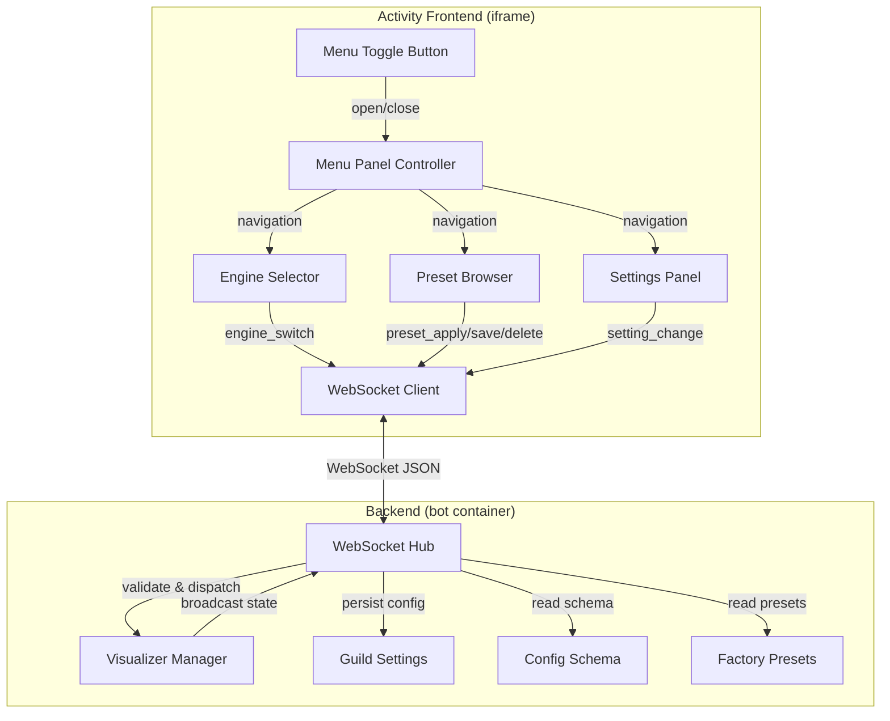
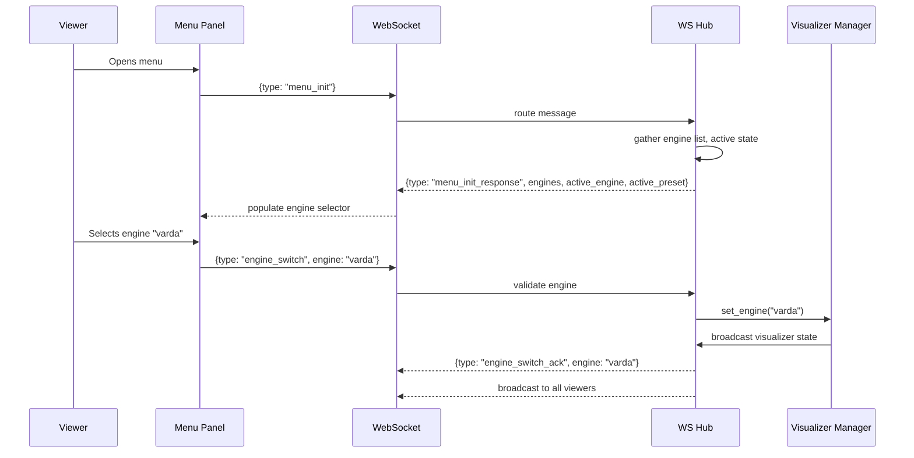
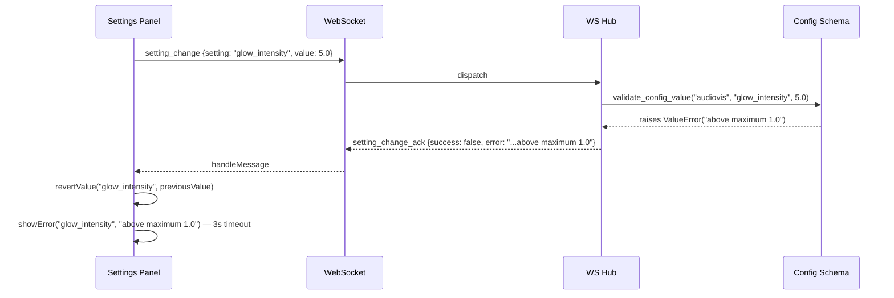

# Design Document: Visualizer Menu System

## Overview

The Visualizer Menu System adds a client-side UI overlay to the HelloDJ Activity frontend that allows viewers to browse engines, apply presets, and adjust engine-specific settings — all synchronized in real-time across connected viewers via the existing WebSocket hub.

The menu operates as a slide-in panel (side panel on desktop, bottom sheet on mobile) built with the dark glassmorphism aesthetic (OKLCH colors, backdrop blur, animated borders). It communicates with the backend through new WebSocket message types, leveraging the existing `ws_hub.py` infrastructure for state broadcasting.

Key design decisions:
- **No build step**: Pure vanilla JS ES modules, same as the existing Activity frontend
- **WebSocket-only communication**: No new HTTP endpoints — all menu data flows over the existing WS connection
- **Optimistic UI with server confirmation**: Settings changes apply immediately in the UI and revert on rejection
- **State sync via broadcast**: Any viewer's change is broadcast to all connected viewers in the guild

## Architecture



### Integration with Existing Frontend

The menu system integrates into `app.js` as a new module loaded via `<script type="module">`. It hooks into the existing WebSocket connection (`ws` variable) by registering a message handler for menu-related message types. The toggle button is added to the `.controls-row` in the bottom controls area alongside existing buttons (lyrics, whiteboard, search).



## Components and Interfaces

### Frontend Components

#### 1. VisualizerMenu (menu_panel.js)

The top-level controller managing panel state, navigation, and WS communication.

```javascript
// menu_panel.js — ES module, no build step
export class VisualizerMenu {
  constructor(containerEl, wsSend, onClose) { ... }

  // Panel lifecycle
  open()          // Slide-in animation, request menu_init
  close()         // Slide-out animation, return focus to toggle
  destroy()       // Cleanup event listeners

  // Navigation between sub-panels
  showEngines()   // Display engine selector (default view)
  showPresets()   // Display preset browser for active engine
  showSettings()  // Display settings panel for active engine

  // WS message handler (registered with main WS dispatcher)
  handleMessage(data)  // Routes menu_init_response, presets_list_response, etc.

  // State sync (called by main WS handler on broadcast messages)
  onVisualizerStateChange(state)  // Updates active engine/preset indicators
}
```

#### 2. EngineSelector (engine_selector.js)

Renders the engine grid with Glass_Panel cards.

```javascript
export class EngineSelector {
  constructor(containerEl, onEngineSelect) { ... }

  render(engines, activeEngine)  // Render engine grid cards
  setLoading(engineId)           // Show loading indicator on card
  clearLoading(engineId)         // Remove loading indicator
  setActive(engineId)            // Update active highlight
  setError(engineId, message)    // Show error indicator on card
}
```

#### 3. PresetBrowser (preset_browser.js)

Renders preset cards grouped by factory/user with apply, save, delete actions.

```javascript
export class PresetBrowser {
  constructor(containerEl, { onApply, onSave, onDelete }) { ... }

  render(presets, activePreset)  // Render grouped preset cards
  setLoading(presetName)         // Loading indicator on apply
  clearLoading(presetName)       // Remove loading indicator
  setActive(presetName)          // Update active highlight
  addPreset(preset)              // Add new preset without full re-render
  removePreset(presetName)       // Remove preset card
  showEmpty()                    // "No presets available" message
}
```

#### 4. SettingsPanel (settings_panel.js)

Renders dynamic controls based on engine config schema.

```javascript
export class SettingsPanel {
  constructor(containerEl, { onChange, onSavePreset }) { ... }

  render(schema, currentValues)  // Generate controls from schema
  updateValue(setting, value)    // Update single control (server confirmation)
  revertValue(setting, value)    // Revert on rejection
  showError(setting, message)    // Error indicator for 3s
}
```

#### 5. SavePresetModal (save_preset_modal.js)

Glass_Panel modal for naming and saving presets.

```javascript
export class SavePresetModal {
  constructor(onSubmit, onCancel) { ... }

  show()     // Display modal with focus trap
  hide()     // Close modal, return focus
  validate() // Validate preset name (1-50 chars, [a-zA-Z0-9 -])
}
```

### Backend Components

#### 6. Menu Message Handler (in ws_hub.py)

New message routing added to the existing `_handle_message` method:

```python
# New handler methods in WebSocketHub
async def _handle_menu_init(self, guild_id: int, ws: WebSocketResponse, data: dict) -> None:
    """Respond with engine list, metadata, and current active state."""

async def _handle_presets_list(self, guild_id: int, ws: WebSocketResponse, data: dict) -> None:
    """Respond with factory + user presets for requested engine."""

async def _handle_settings_schema(self, guild_id: int, ws: WebSocketResponse, data: dict) -> None:
    """Respond with engine config schema + current values."""

async def _handle_engine_switch(self, guild_id: int, ws: WebSocketResponse, data: dict) -> None:
    """Validate engine, delegate to VisualizerManager, broadcast result."""

async def _handle_preset_apply(self, guild_id: int, ws: WebSocketResponse, data: dict) -> None:
    """Validate preset, apply config via guild_settings, broadcast."""

async def _handle_setting_change(self, guild_id: int, ws: WebSocketResponse, data: dict) -> None:
    """Validate value against schema, persist, broadcast."""

async def _handle_preset_save(self, guild_id: int, ws: WebSocketResponse, data: dict) -> None:
    """Validate name, save current config as user preset, broadcast."""

async def _handle_preset_delete(self, guild_id: int, ws: WebSocketResponse, data: dict) -> None:
    """Validate ownership (not factory), delete, broadcast."""
```

## Data Models

### Engine Metadata (served in menu_init_response)

```python
# Each engine entry in the response
{
    "id": "audiovis",           # engine identifier
    "name": "AudioVis",         # display name
    "description": "Spectrum analyzer with bars, waveforms, and circular modes",  # ≤60 chars
    "icon": "audiovis",         # icon identifier (maps to CSS class or SVG)
    "server_rendered": True,    # whether engine runs on GPU backend
}
```

Static engine metadata (hardcoded in a new `engine_metadata.py`):

```python
ENGINE_METADATA: dict[str, dict] = {
    "projectm": {
        "name": "ProjectM",
        "description": "Milkdrop-compatible music visualizer presets",
        "icon": "projectm",
        "server_rendered": True,
    },
    "audiovis": {
        "name": "AudioVis",
        "description": "Spectrum analyzer with bars, waveforms, and effects",
        "icon": "audiovis",
        "server_rendered": True,
    },
    "fosfora": {
        "name": "Fosfora",
        "description": "GPU particle system driven by audio energy",
        "icon": "fosfora",
        "server_rendered": True,
    },
    "varda": {
        "name": "Varda",
        "description": "GLSL shader gallery with audio-reactive effects",
        "icon": "varda",
        "server_rendered": True,
    },
    "drift": {
        "name": "Drift",
        "description": "Multipass feedback visualizer with organic trails",
        "icon": "drift",
        "server_rendered": True,
    },
    "dvd": {
        "name": "DVD Bounce",
        "description": "Classic bouncing logo screensaver with hue shift",
        "icon": "dvd",
        "server_rendered": False,
    },
}
```

### Preset Data Structure (served in presets_list_response)

```python
# Single preset entry
{
    "name": "neon-city",
    "engine": "audiovis",
    "factory": True,            # immutable factory preset
    "config": {
        "style": "bars",
        "color_scheme": "synthwave",
        "fft_bins": 32,
        "glow_intensity": 0.9,
    },
    "tags": ["bars", "synthwave", "32 bins", "glow: 0.9"],  # up to 4 metadata tags
}
```

### Settings Schema (served in settings_schema_response)

```python
# Per-setting schema entry, enriched with current value
{
    "setting": "glow_intensity",
    "type": "float",
    "label": "Glow Intensity",     # human-readable label
    "default": 0.5,
    "current": 0.9,                # guild's current value
    "min": 0.0,
    "max": 1.0,
    "group": "Visual",             # grouping for display
}
```

Setting groups (for engines with >4 parameters):

```python
SETTING_GROUPS: dict[str, dict[str, str]] = {
    "projectm": {
        "preset_category": "Presets",
        "blend_duration": "Transitions",
        "preset_duration": "Transitions",
        "brightness": "Visual",
        "sensitivity": "Audio",
    },
    "audiovis": {
        "style": "Style",
        "color_scheme": "Style",
        "fft_bins": "Audio",
        "glow_intensity": "Visual",
        "background_opacity": "Visual",
    },
    "fosfora": {
        "particle_count": "Particles",
        "gravity": "Physics",
        "emission_style": "Particles",
        "color_mode": "Visual",
        "trail_length": "Visual",
    },
    "varda": {
        "shader_name": "Shader",
        "color_intensity": "Visual",
        "speed": "Animation",
        "complexity": "Quality",
    },
    "dvd": {
        "speed": "Animation",
        "hue_shift": "Visual",
        "icon_size": "Visual",
    },
}
```

### WebSocket Message Protocol

All messages use JSON with a `type` field. Request messages from the client include a `request_id` for response correlation.

#### Client → Server Messages

| Type | Payload | Purpose |
|------|---------|---------|
| `menu_init` | `{}` | Request engine list + current state |
| `presets_list` | `{engine: string}` | Request presets for engine |
| `settings_schema` | `{engine: string}` | Request settings schema + values |
| `engine_switch` | `{engine: string, request_id: string}` | Switch active engine |
| `preset_apply` | `{preset_name: string, request_id: string}` | Apply a preset |
| `setting_change` | `{setting: string, value: any, request_id: string}` | Change a setting |
| `preset_save` | `{name: string, request_id: string}` | Save current config as preset |
| `preset_delete` | `{name: string, request_id: string}` | Delete a user preset |

#### Server → Client Messages (unicast responses)

| Type | Payload | Purpose |
|------|---------|---------|
| `menu_init_response` | `{engines: [...], active_engine, active_preset, error?}` | Menu initialization data |
| `presets_list_response` | `{engine, factory_presets: [...], user_presets: [...]}` | Preset list for engine |
| `settings_schema_response` | `{engine, settings: [...]}` | Schema + current values |
| `engine_switch_ack` | `{request_id, success, engine?, error?}` | Engine switch confirmation |
| `preset_apply_ack` | `{request_id, success, preset_name?, error?}` | Preset apply confirmation |
| `setting_change_ack` | `{request_id, success, setting?, value?, error?}` | Setting change confirmation |
| `preset_save_ack` | `{request_id, success, preset?, error?}` | Preset save confirmation |
| `preset_delete_ack` | `{request_id, success, name?, error?}` | Preset delete confirmation |

#### Server → All Clients (broadcast)

| Type | Payload | Purpose |
|------|---------|---------|
| `visualizer_state` | `{engine, preset?, config, hls_ready?}` | Full state sync after any change |
| `preset_added` | `{engine, preset: {...}}` | New user preset available |
| `preset_removed` | `{engine, name}` | User preset deleted |

### User Preset Persistence

User presets are stored per-guild in `guild_settings.json` under a `visualizer_presets` key:

```python
# In guild_settings.json
{
    "123456789": {
        "mode": "restrictive",
        "visualizer_engine": "audiovis",
        "visualizer_config": {"audiovis": {"style": "bars", "glow_intensity": 0.9}},
        "visualizer_presets": {
            "my-chill-bars": {
                "engine": "audiovis",
                "config": {"style": "bars", "glow_intensity": 0.3, "fft_bins": 7},
                "factory": false
            }
        }
    }
}
```


## Correctness Properties

*A property is a characteristic or behavior that should hold true across all valid executions of a system — essentially, a formal statement about what the system should do. Properties serve as the bridge between human-readable specifications and machine-verifiable correctness guarantees.*

### Property 1: Engine selector renders complete cards

*For any* list of engine metadata objects returned by menu_init_response, the rendered engine selector should contain exactly one card per engine, and each card should display the engine name, an icon identifier, and a description of no more than 60 characters.

**Validates: Requirements 2.1, 2.2**

### Property 2: Engine switch message dispatch

*For any* pair (currentEngine, selectedEngine) where currentEngine ≠ selectedEngine, clicking the selected engine's card should emit exactly one `engine_switch` WebSocket message with the selected engine's identifier.

**Validates: Requirements 2.4**

### Property 3: Preset grouping correctness

*For any* presets_list_response containing a mix of factory and user presets, the rendered preset browser should display factory presets in the "Factory" section and user presets in the "User" section, with no preset appearing in the wrong section.

**Validates: Requirements 3.1**

### Property 4: Preset tag generation

*For any* preset config dictionary, the generated metadata tags array should have at most 4 entries, and each tag should correspond to an actual key-value pair from the preset config.

**Validates: Requirements 3.2**

### Property 5: Schema-to-control type mapping

*For any* settings schema entry, the rendered control should be a slider for type "float" or "int" (with min/max bounds), a toggle for type "bool", and a dropdown for type "choice" (with all valid choices as options). The control should display the setting's label and its current value.

**Validates: Requirements 4.1, 4.2**

### Property 6: Settings grouping

*For any* engine with more than 4 configurable parameters in ENGINE_CONFIG_SCHEMAS, the rendered settings panel should group controls under labeled sections matching the SETTING_GROUPS mapping for that engine.

**Validates: Requirements 4.6**

### Property 7: Broadcast state sync

*For any* visualizer_state broadcast message received while the menu is open, the menu UI should reflect the engine, active preset, and current config values from that message — the engine selector's active highlight, preset browser's active preset, and settings panel's control values should all match the broadcast payload.

**Validates: Requirements 5.2**

### Property 8: Preset name validation

*For any* string input, the preset name validation function should accept it if and only if it is 1–50 characters long and contains only alphanumeric characters, hyphens, and spaces (regex: `^[a-zA-Z0-9 -]{1,50}$`).

**Validates: Requirements 6.2**

### Property 9: Factory preset deletion protection

*For any* preset object, the delete action should be blocked (returning an error or preventing the action) if and only if `preset.factory === true`.

**Validates: Requirements 6.5**

### Property 10: Bottom sheet height clamping

*For any* drag position value during bottom sheet resize, the resulting menu height should be clamped between 30% and 70% of the viewport height.

**Validates: Requirements 8.3**

### Property 11: menu_init_response completeness

*For any* guild state (with any valid active engine), the menu_init_response should contain metadata for all engines in ENGINE_METADATA, each with non-empty name, description (≤60 chars), and icon fields, plus the correct active_engine matching the guild's current visualizer engine.

**Validates: Requirements 10.1**

### Property 12: presets_list_response correctness

*For any* engine name in ENGINE_CONFIG_SCHEMAS, the presets_list_response should include all factory presets from FACTORY_PRESETS where `preset.engine == requested_engine`, plus all user presets stored for that engine in the guild's settings.

**Validates: Requirements 10.2**

### Property 13: settings_schema_response fidelity

*For any* engine name in ENGINE_CONFIG_SCHEMAS, the settings_schema_response should contain one entry per schema key matching ENGINE_CONFIG_SCHEMAS[engine], with type, min, max, and default fields matching the schema, and current values matching the guild's persisted config (or defaults if not set).

**Validates: Requirements 10.3**

### Property 14: Invalid request error responses

*For any* request with an unknown engine name, an out-of-range setting value, or an invalid preset name, the WS_Hub's ack response should have `success: false` and a non-empty `error` string describing the validation failure.

**Validates: Requirements 10.5**

## Error Handling

### Frontend Error Handling

| Scenario | Behavior |
|----------|----------|
| WebSocket disconnection | Menu disables all interactive controls, shows "Disconnected" indicator in panel header. Re-enables on reconnect after state re-sync. |
| Engine switch timeout (10s) | Loading indicator removed, previous active engine restored, error indicator shown on the failed card for 3s. |
| Preset apply rejected | Loading indicator removed, error toast shown in preset card ("Could not apply preset") for 3s. |
| Setting value rejected | Control reverts to previous value, red highlight shown for 3s with error tooltip. |
| Preset save rejected | Modal remains open with inline error message (e.g., "Name already taken" or "Invalid characters"). |
| menu_init_response error | Menu shows "Unable to load menu data" with a retry button. |
| Malformed WS message | Silently ignored (console.warn for debugging). |

### Backend Error Handling

| Scenario | Response |
|----------|----------|
| Unknown engine in engine_switch | `{success: false, error: "Unknown engine 'xyz'. Valid: projectm, audiovis, ..."}` |
| Out-of-range value in setting_change | `{success: false, error: "Setting 'glow_intensity' value 5.0 is above maximum 1.0"}` |
| Invalid preset name format | `{success: false, error: "Preset name must be 1-50 characters (alphanumeric, hyphens, spaces)"}` |
| Delete factory preset attempt | `{success: false, error: "Cannot delete factory preset 'neon-city'"}` |
| Delete nonexistent preset | `{success: false, error: "Preset 'foo' not found"}` |
| Engine switch during video playback | `{success: false, error: "Cannot switch visualizer while video is playing"}` |
| GPU capacity exceeded on engine switch | `{success: false, error: "GPU capacity exceeded — try a different engine or wait"}` |

### Error propagation flow



## Testing Strategy

### Property-Based Tests (Hypothesis — Python)

Property-based testing applies to the backend message handlers and validation logic. The frontend rendering properties are better served by example-based DOM tests.

**Library**: Hypothesis (Python) — already in use in this project (`.hypothesis/` directory exists)
**Minimum iterations**: 100 per property test
**Tag format**: `Feature: visualizer-menu-system, Property {N}: {title}`

Backend properties to implement with PBT:
- **Property 8**: Preset name validation — generate random strings, verify acceptance iff matches regex
- **Property 9**: Factory preset protection — generate random preset objects, verify delete blocked iff factory=true
- **Property 11**: menu_init_response completeness — generate random guild states, verify response structure
- **Property 12**: presets_list_response correctness — generate random engine + preset combinations
- **Property 13**: settings_schema_response fidelity — generate random engines + guild configs
- **Property 14**: Invalid request error responses — generate random invalid inputs

Frontend properties (JavaScript, using fast-check):
- **Property 1**: Engine card rendering completeness
- **Property 4**: Preset tag generation (≤4, from config)
- **Property 5**: Schema-to-control mapping
- **Property 10**: Bottom sheet height clamping

### Example-Based Unit Tests

| Test | Coverage |
|------|----------|
| Toggle button opens/closes menu | Req 1.2, 1.3 |
| Active engine highlight updates on ack | Req 2.3, 2.5 |
| Loading indicator timeout at 10s | Req 2.6 |
| Empty preset list shows empty state | Req 3.5 |
| Debounce sends single message after rapid slider changes | Req 4.3 |
| Open menu sends menu_init message | Req 5.1 |
| Disconnect disables controls | Req 5.4 |
| Save button opens modal | Req 6.1 |
| Delete shows confirmation prompt | Req 6.4 |
| Escape key closes menu | Req 9.2 |
| Focus trap within menu | Req 9.1 |

### Integration Tests

| Test | Coverage |
|------|----------|
| Two clients: engine switch broadcasts to both | Req 5.3, 10.4 |
| Preset save → other client sees preset_added | Req 6.3, 10.4 |
| Setting change → other client gets updated value | Req 5.3, 10.4 |
| Late joiner receives current state on menu_init | Req 5.1, 10.1 |

### CSS / Accessibility Audits

- Automated contrast ratio check against OKLCH palette (Req 9.4)
- ARIA attribute presence check on all interactive elements (Req 9.3)
- Touch target size audit (Req 1.5)
- Reduced motion media query coverage (Req 7.6)

