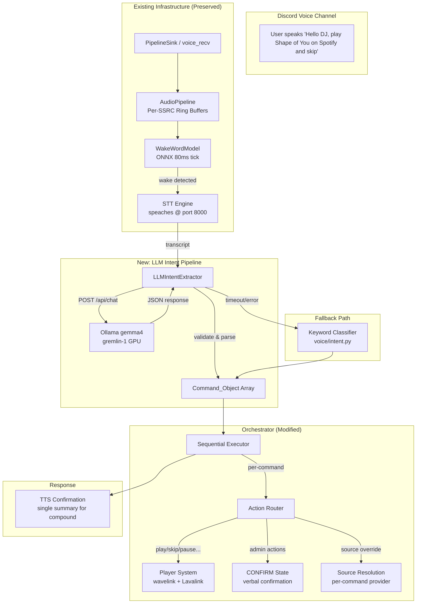
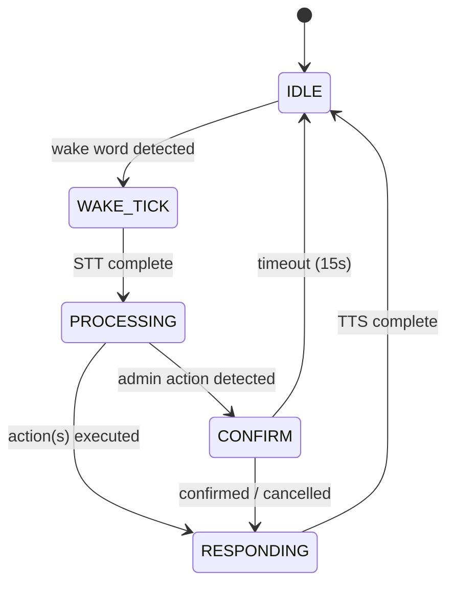
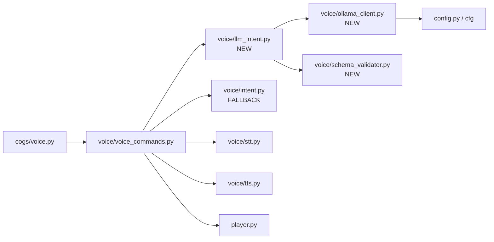

# Design Document: Wakeword Voice Pipeline (LLM Intent Extraction)

## Overview

This design replaces the keyword-based intent classifier (`voice/intent.py`) with an Ollama gemma4 LLM-powered pipeline while preserving all existing infrastructure: the ONNX wake word model, per-SSRC audio pipeline, STT (speaches), TTS (speaches/kokoro/polly), hybrid player, and orchestrator state machine.

The core change is a new `voice/llm_intent.py` module that sends STT transcripts to a local Ollama instance (on gremlin-1's NVIDIA GPU) via the native `/api/chat` endpoint and receives structured JSON `Command_Object` arrays. The existing keyword classifier is retained as a fallback when Ollama is unreachable or returns malformed responses.

**Key design decisions:**
- **Ollama native API over OpenAI-compatible**: Uses `/api/chat` directly for lower overhead and native JSON mode support
- **Fallback-first resilience**: Any LLM failure (timeout, bad response, unreachable) degrades gracefully to the keyword classifier
- **Sequential command execution**: Compound utterances produce an ordered array; the orchestrator processes them in sequence
- **Source override is per-command**: Each Command_Object carries its own source field; guild defaults are never mutated
- **Separate `/wakeword` command**: Decoupled from `/voice` to allow independent toggling

## Architecture

### High-Level System Diagram



### State Machine (Preserved, Extended)



The state machine is unchanged. The only difference is that PROCESSING now handles arrays of commands (compound utterances) by iterating sequentially before transitioning to RESPONDING.

### Module Dependency Graph



## Components and Interfaces

### New Module: `voice/ollama_client.py`

Handles HTTP communication with the Ollama `/api/chat` endpoint.

```python
"""Ollama HTTP client for intent extraction via gemma4."""

import asyncio
import json
import logging
from typing import Any

import aiohttp

from config import cfg

log = logging.getLogger(__name__)

# Defaults matching Requirement 9
_DEFAULT_URL = "http://localhost:11434"
_DEFAULT_MODEL = "gemma4"
_REQUEST_TIMEOUT = 10.0  # seconds (Requirement 3.5)


class OllamaClient:
    """Async HTTP client for the Ollama /api/chat endpoint."""

    def __init__(self):
        self._session: aiohttp.ClientSession | None = None

    @property
    def url(self) -> str:
        """Read endpoint from credential store on each call (Req 9.1)."""
        return cfg("ollama.url") or _DEFAULT_URL

    @property
    def model(self) -> str:
        """Read model name from credential store on each call (Req 9.2)."""
        return cfg("ollama.model") or _DEFAULT_MODEL

    async def _ensure_session(self) -> aiohttp.ClientSession:
        if self._session is None or self._session.closed:
            self._session = aiohttp.ClientSession()
        return self._session

    async def chat(
        self,
        system_prompt: str,
        user_message: str,
    ) -> dict[str, Any] | None:
        """Send a chat request to Ollama.

        Returns the parsed JSON response dict, or None on failure.
        Raises asyncio.TimeoutError if the 10s deadline is exceeded.
        """
        session = await self._ensure_session()
        endpoint = f"{self.url.rstrip('/')}/api/chat"

        payload = {
            "model": self.model,
            "messages": [
                {"role": "system", "content": system_prompt},
                {"role": "user", "content": user_message},
            ],
            "stream": False,
            "format": "json",  # request JSON mode from Ollama
        }

        timeout = aiohttp.ClientTimeout(total=_REQUEST_TIMEOUT)
        async with session.post(endpoint, json=payload, timeout=timeout) as resp:
            if resp.status != 200:
                log.warning(
                    "Ollama returned HTTP %d from %s", resp.status, endpoint
                )
                return None
            data = await resp.json()
            return data

    async def close(self) -> None:
        if self._session and not self._session.closed:
            await self._session.close()
```

### New Module: `voice/llm_intent.py`

The LLM-based intent extractor that replaces keyword matching.

```python
"""LLM-powered intent extraction using Ollama gemma4.

Replaces the keyword-based classifier with structured JSON extraction.
Falls back to keyword classification on any failure.
"""

import asyncio
import json
import logging
import re
from typing import Any

from .ollama_client import OllamaClient
from .intent import classify_intent as keyword_classify
from .schema_validator import validate_command_objects, strip_json_fences

log = logging.getLogger(__name__)

# Recognized actions (Requirement 3.3, 10.4)
RECOGNIZED_ACTIONS = frozenset({
    "play", "skip", "pause", "resume", "stop", "shuffle",
    "remove", "repeat", "queue", "join", "leave",
    "load_playlist", "save_playlist",
    # Admin actions
    "mute", "kick", "ban", "timeout", "revoke", "restart", "shutdown",
})

ADMIN_ACTIONS = frozenset({
    "mute", "kick", "ban", "timeout", "revoke", "restart", "shutdown",
})

# Source mapping (Requirement 4.2)
SOURCE_MAP = {
    "spotify": "spotify",
    "tidal": "tidal",
    "youtube": "youtube",
    "youtube music": "youtube_music",
    "soundcloud": "soundcloud",
    "deezer": "deezer",
}

SYSTEM_PROMPT = '''You are a voice command parser for a Discord music bot called HelloDJ.
Extract commands from the user's spoken transcript and return ONLY valid JSON.

Return a JSON array of command objects. Each command object has:
- "action": one of: play, skip, pause, resume, stop, shuffle, remove, repeat, queue, join, leave, load_playlist, save_playlist, mute, kick, ban, timeout, revoke, restart, shutdown
- "source": the music source if specified (spotify, tidal, youtube, youtube_music, soundcloud, deezer), or null
- "query": the search query or target name (e.g., song title, playlist name, user name), or null
- "arguments": an object with additional args (e.g., {"index": 3}, {"mode": "single"}, {"name": "chill vibes"}), or {}

Rules:
- If the user says "on spotify" or "on tidal" etc., set source to the normalized name and do NOT include "on spotify" in the query.
- Source names map: "youtube music" → "youtube_music"
- Multiple commands in one utterance should produce multiple objects in order.
- For "remove", extract the track number as {"index": N} in arguments.
- For "repeat", extract mode as {"mode": "off"|"single"|"queue"} in arguments.
- For "load_playlist"/"save_playlist", put the playlist name in arguments as {"name": "..."}.
- For admin commands (mute/kick/ban/timeout), put the target user name in query.
- Return ONLY the JSON array, no explanation.'''


class LLMIntentExtractor:
    """Extracts intents from transcripts using Ollama gemma4."""

    def __init__(self):
        self._client = OllamaClient()

    async def extract(self, transcript: str) -> list[dict[str, Any]]:
        """Extract Command_Objects from a transcript.

        Returns a list of validated Command_Objects.
        Falls back to keyword classification on any failure.
        """
        # Requirement 3.7: empty transcript → empty array
        if not transcript or not transcript.strip():
            return []

        try:
            response = await asyncio.wait_for(
                self._client.chat(SYSTEM_PROMPT, transcript),
                timeout=10.0,
            )
        except asyncio.TimeoutError:
            log.warning("Ollama intent extraction timed out (10s)")
            return self._fallback(transcript)
        except Exception as exc:
            log.warning("Ollama request failed: %s", exc)
            return self._fallback(transcript)

        if response is None:
            return self._fallback(transcript)

        # Extract the message content from Ollama response
        content = response.get("message", {}).get("content", "")
        if not content:
            log.warning("Ollama returned empty content")
            return self._fallback(transcript)

        # Strip markdown fences (Requirement 11.3)
        content = strip_json_fences(content)

        # Parse JSON
        try:
            parsed = json.loads(content)
        except json.JSONDecodeError:
            log.warning("Ollama response is not valid JSON: %s", content[:200])
            return self._fallback(transcript)

        # Validate schema (Requirements 11.1, 11.2, 11.4)
        if not isinstance(parsed, list):
            log.warning("Ollama response is not a JSON array")
            return self._fallback(transcript)

        if not parsed:
            log.warning("Ollama returned empty array")
            return self._fallback(transcript)

        # Validate individual Command_Objects
        valid_commands = validate_command_objects(parsed)

        # Filter unrecognized actions (Requirement 3.8)
        filtered = []
        for cmd in valid_commands:
            if cmd["action"] in RECOGNIZED_ACTIONS:
                # Normalize source (Requirement 4.5)
                if cmd.get("source") and cmd["source"] not in SOURCE_MAP.values():
                    log.warning("Unrecognized source '%s', setting to null", cmd["source"])
                    cmd["source"] = None
                filtered.append(cmd)
            else:
                log.warning("Discarding unrecognized action: %s", cmd["action"])

        if not filtered:
            return self._fallback(transcript)

        # Enforce max 10 commands (Requirement 5.1)
        return filtered[:10]

    def _fallback(self, transcript: str) -> list[dict[str, Any]]:
        """Fall back to keyword-based classification."""
        log.info("Falling back to keyword classifier for: %s", transcript[:80])
        intent = keyword_classify(transcript)
        return self._intent_to_commands(intent)

    def _intent_to_commands(self, intent: dict) -> list[dict[str, Any]]:
        """Convert legacy intent dict to Command_Object format."""
        action = intent.get("subcommand") or intent.get("intent", "")
        if action == "music":
            action = intent.get("subcommand", "play")
        elif action == "general":
            return []  # General queries handled separately

        cmd = {
            "action": action,
            "source": None,
            "query": intent.get("args", {}).get("song") or intent.get("query"),
            "arguments": intent.get("args", {}),
        }
        return [cmd]

    async def close(self) -> None:
        await self._client.close()
```

### New Module: `voice/schema_validator.py`

Pure validation functions for Command_Object schema enforcement.

```python
"""JSON schema validation for Command_Object arrays.

Pure functions — no I/O, no side effects. Suitable for property-based testing.
"""

import json
import logging
import re
from typing import Any

log = logging.getLogger(__name__)


def strip_json_fences(text: str) -> str:
    """Strip markdown code fences and non-JSON preamble/trailing text.

    Handles:
    - ```json ... ```
    - ``` ... ```
    - Leading/trailing whitespace and prose
    """
    # Remove ```json or ``` fences
    text = re.sub(r"^```(?:json)?\s*\n?", "", text.strip())
    text = re.sub(r"\n?```\s*$", "", text.strip())

    # Try to find the JSON array boundaries
    start = text.find("[")
    end = text.rfind("]")
    if start != -1 and end != -1 and end > start:
        text = text[start : end + 1]

    return text.strip()


def validate_command_object(obj: Any) -> dict[str, Any] | None:
    """Validate a single Command_Object against the schema.

    Schema:
        action: str (required, non-empty)
        source: str | None
        query: str | None
        arguments: dict | None (defaults to {})

    Returns the normalized Command_Object or None if invalid.
    """
    if not isinstance(obj, dict):
        return None

    # action is required and must be a non-empty string
    action = obj.get("action")
    if not isinstance(action, str) or not action.strip():
        return None

    # source: string or null
    source = obj.get("source")
    if source is not None and not isinstance(source, str):
        source = None
    if isinstance(source, str) and not source.strip():
        source = None

    # query: string or null
    query = obj.get("query")
    if query is not None and not isinstance(query, str):
        query = None

    # arguments: dict or null (default to {})
    arguments = obj.get("arguments")
    if not isinstance(arguments, dict):
        arguments = {}

    return {
        "action": action.strip().lower(),
        "source": source.strip().lower() if source else None,
        "query": query.strip() if query else None,
        "arguments": arguments,
    }


def validate_command_objects(objects: list[Any]) -> list[dict[str, Any]]:
    """Validate a list of objects, returning only valid Command_Objects.

    Invalid elements are discarded and logged (Requirement 11.4).
    """
    valid = []
    for i, obj in enumerate(objects):
        result = validate_command_object(obj)
        if result is not None:
            valid.append(result)
        else:
            log.warning("Discarding invalid Command_Object at index %d: %s", i, obj)
    return valid
```

### Modified: `voice/voice_commands.py` (Orchestrator Changes)

The orchestrator is updated to:
1. Use `LLMIntentExtractor` instead of `classify_intent`
2. Process `Command_Object[]` arrays sequentially
3. Handle per-command source overrides
4. Produce summary TTS for compound utterances
5. Separate admin commands into CONFIRM flow

Key changes (pseudocode for modified methods):

```python
class VoiceCommandOrchestrator:
    def __init__(self, wakeword_model, bot):
        # ... existing init ...
        self.llm_intent = LLMIntentExtractor()  # NEW

    async def _process_transcript(self, session, transcript):
        """Replace single-intent flow with Command_Object array processing."""
        commands = await self.llm_intent.extract(transcript)
        if not commands:
            await self._speak(session, guild, "I didn't understand that.")
            return

        # Separate admin and non-admin commands (Req 10.5)
        results = []
        for cmd in commands:
            if cmd["action"] in ADMIN_ACTIONS:
                # Enter CONFIRM state for each admin command
                result = await self._execute_admin_command(session, guild, member, cmd)
            else:
                result = await self._execute_command(session, guild, member, cmd)
            results.append(result)
            if result.get("failed"):
                # Halt on failure (Req 5.3)
                break

        # Single summary TTS (Req 8.2)
        summary = self._build_summary(results)
        await self._speak(session, guild, summary)

    async def _execute_command(self, session, guild, member, cmd):
        """Execute a single Command_Object with source override."""
        state = player.get_state(guild.id)
        # Source override (Req 4.3, 4.4)
        source = cmd.get("source") or state.get("source_provider", "youtube")
        # Route to action handler...

    def _build_summary(self, results):
        """Build a ≤150 char summary of all executed commands (Req 8.1, 8.2)."""
        if len(results) == 1:
            return results[0].get("message", "Done.")
        succeeded = sum(1 for r in results if not r.get("failed"))
        failed = len(results) - succeeded
        parts = [f"{succeeded} commands executed"]
        if failed:
            parts.append(f"{failed} failed")
        return ". ".join(parts)
```

### New: `/wakeword` Slash Command (in `cogs/voice.py`)

```python
@app_commands.command(
    name="wakeword",
    description="Toggle wake word listening for this server",
)
@app_commands.describe(state="Enable or disable wake word listening")
@app_commands.choices(
    state=[
        app_commands.Choice(name="On", value="on"),
        app_commands.Choice(name="Off", value="off"),
    ]
)
async def wakeword_toggle(
    self, interaction: discord.Interaction, state: str
) -> None:
    """Toggle wake word listening independently of /voice."""
    if not interaction.user.guild_permissions.manage_guild:
        await interaction.response.send_message(
            "You need Manage Server permission to toggle wake word.",
            ephemeral=True,
        )
        return

    guild_id = interaction.guild.id
    if state == "on":
        self._wakeword_guilds.add(guild_id)
        await interaction.response.send_message(
            "🎙️ Wake word listening **enabled**. Say 'Hello DJ' to interact.",
            ephemeral=True,
        )
    else:
        self._wakeword_guilds.discard(guild_id)
        await interaction.response.send_message(
            "🎙️ Wake word listening **disabled**.",
            ephemeral=True,
        )
```

## Data Models

### Command_Object Schema

```json
{
  "action": "play",
  "source": "spotify",
  "query": "Shape of You",
  "arguments": {}
}
```

| Field | Type | Required | Description |
|-------|------|----------|-------------|
| `action` | `string` | Yes | One of the recognized action verbs |
| `source` | `string \| null` | No | Normalized source identifier or null for guild default |
| `query` | `string \| null` | No | Search query, target name, or null |
| `arguments` | `object` | Yes | Additional args (may be empty `{}`) |

### Source Mapping Table

| Spoken | Normalized Identifier |
|--------|----------------------|
| "spotify" | `spotify` |
| "tidal" | `tidal` |
| "youtube" | `youtube` |
| "youtube music" | `youtube_music` |
| "soundcloud" | `soundcloud` |
| "deezer" | `deezer` |

### Credential Store Keys (New)

| Key | Default | Description |
|-----|---------|-------------|
| `ollama.url` | `http://localhost:11434` | Ollama API endpoint |
| `ollama.model` | `gemma4` | Model name for intent extraction |

### Execution Result (Internal)

```python
@dataclass
class CommandResult:
    action: str
    success: bool
    message: str  # TTS-friendly description (≤150 chars)
    target: str | None = None  # track title, channel name, etc.
```


## Correctness Properties

*A property is a characteristic or behavior that should hold true across all valid executions of a system — essentially, a formal statement about what the system should do. Properties serve as the bridge between human-readable specifications and machine-verifiable correctness guarantees.*

### Property 1: SSRC Isolation

*For any* set of active SSRCs in the audio pipeline, when a wake word is detected on SSRC X, the audio captured and forwarded to STT shall contain only samples from SSRC X's ring buffer — no samples from any other active SSRC shall be present in the captured audio.

**Validates: Requirements 2.1, 2.3**

### Property 2: Whitespace Transcript Produces Empty Commands

*For any* string composed entirely of whitespace characters (spaces, tabs, newlines, or the empty string), calling `LLMIntentExtractor.extract()` shall return an empty list without making any HTTP request to the Ollama endpoint.

**Validates: Requirements 3.7**

### Property 3: Unrecognized Action Filtering

*For any* JSON array of Command_Objects where some elements have action values not in RECOGNIZED_ACTIONS, the extractor shall return only those Command_Objects whose action IS in RECOGNIZED_ACTIONS, preserving their relative order.

**Validates: Requirements 3.8**

### Property 4: Source Mapping Roundtrip

*For any* key in SOURCE_MAP, looking up that key shall produce the expected normalized identifier, and for any string NOT in SOURCE_MAP keys or values, the source field shall be set to null.

**Validates: Requirements 4.2, 4.5**

### Property 5: Source Override Does Not Mutate Guild State

*For any* Command_Object with a non-null source field, after the orchestrator executes that command, the guild's `source_provider` setting shall equal its value immediately before execution — source overrides are per-command only and never persist.

**Validates: Requirements 4.3, 4.4**

### Property 6: Command Array Truncation at 10

*For any* Command_Object array with length N > 10, the extractor shall return exactly 10 elements, and those 10 elements shall be the first 10 elements of the original array in order.

**Validates: Requirements 5.1**

### Property 7: Sequential Execution Halts on Failure

*For any* ordered Command_Object array of length N where the command at index i (0-based) fails execution, exactly i+1 commands shall have been attempted (indices 0 through i), and commands at indices i+1 through N-1 shall not be executed.

**Validates: Requirements 5.3**

### Property 8: TTS Confirmation Length Bound

*For any* CommandResult (success or failure), the generated TTS confirmation message shall have a character length of at most 150.

**Validates: Requirements 8.1**

### Property 9: Admin Action Classification

*For any* Command_Object whose action field is one of {mute, kick, ban, timeout, revoke, restart, shutdown}, the orchestrator shall route that command through the CONFIRM state before execution. Conversely, for any command whose action is NOT in that set, the command shall execute immediately without entering CONFIRM.

**Validates: Requirements 10.4**

### Property 10: Command_Object Schema Validation

*For any* Python dict, `validate_command_object` shall return a normalized Command_Object (with action, source, query, arguments fields) if and only if the dict contains a non-empty string `action` field. If the dict lacks `action` or `action` is not a non-empty string, validation shall return None. Valid objects shall have `arguments` default to `{}` when missing or non-dict.

**Validates: Requirements 11.1, 11.4**

### Property 11: Markdown Fence Stripping

*For any* valid JSON array string S, wrapping S in markdown code fences (`` ```json\n{S}\n``` `` or `` ```\n{S}\n``` ``) and passing the result to `strip_json_fences` shall produce a string that, when parsed as JSON, equals the original parsed value of S.

**Validates: Requirements 11.3**

### Property 12: Partial Validation Preserves Valid Elements

*For any* list containing a mix of valid and invalid Command_Object dicts, `validate_command_objects` shall return exactly the valid elements (those with non-empty string `action` fields) in their original relative order, discarding all invalid elements.

**Validates: Requirements 11.4**

## Error Handling

### Ollama Unavailability

| Failure Mode | Detection | Recovery |
|---|---|---|
| Connection refused / DNS failure | `aiohttp.ClientConnectorError` | Log WARNING, fall back to keyword classifier |
| HTTP 4xx/5xx | Response status check | Log WARNING with status code, fall back |
| Timeout (>10s) | `asyncio.wait_for` timeout | Cancel request, log timeout event, fall back |
| Malformed JSON response | `json.JSONDecodeError` | Log WARNING with response snippet, fall back |
| Valid JSON but empty array | Array length check | Log WARNING, fall back |
| Partial schema failure | Per-element validation | Discard invalid elements, continue with valid ones |

### TTS Failures

- TTS synthesis failure: Log at WARNING, skip spoken confirmation, continue processing
- TTS playback failure (no voice connection): Log at WARNING, skip, don't interrupt pipeline
- Never crash or halt the pipeline due to TTS issues

### Audio Pipeline Errors

- Unknown SSRC (no user mapping): Discard wake word detection silently
- STT returns empty transcript: Reset session to IDLE, no error surfaced to user
- STT audio too short (<100ms): Reset session, no LLM call made

### Compound Execution Errors

- Any command failure halts the sequence
- Already-succeeded commands are NOT rolled back (they're side-effectful)
- TTS reports which commands succeeded and which failed
- Session returns to IDLE after error reporting

### Admin Command Errors

- Permission check failure: TTS reports insufficient permissions, no state change
- Confirmation timeout (15s): TTS reports cancellation, return to IDLE
- Action execution failure (e.g., can't kick user): TTS reports failure reason

## Testing Strategy

### Property-Based Tests (Hypothesis)

The project already uses Hypothesis (`.hypothesis/` directory exists). Each correctness property maps to a property-based test running **minimum 100 iterations**.

**Library**: `hypothesis` (already in use)
**Tag format**: `# Feature: wakeword-voice-pipeline, Property N: <title>`

Tests target the pure-function modules:
- `voice/schema_validator.py` — Properties 10, 11, 12 (schema validation, fence stripping, partial validation)
- `voice/llm_intent.py` — Properties 2, 3, 4, 6 (whitespace handling, action filtering, source mapping, truncation)
- TTS message builder — Property 8 (length bound)
- Orchestrator routing logic — Property 9 (admin classification)

Properties 1, 5, 7 require mocked orchestrator/pipeline state but are still property-testable with generated inputs.

### Unit Tests (pytest)

Specific examples and edge cases:
- Each recognized action produces correct orchestrator routing
- Default config values (`gemma4`, `http://localhost:11434`)
- `/wakeword on/off` permission checks
- Blacklisted user wake word discard
- Unmapped SSRC discard
- Playlist name length boundaries (1–64 chars)
- Each confirmation/denial phrase recognized correctly

### Integration Tests

- Ollama endpoint communication (mocked HTTP)
- STT → LLM → Orchestrator full pipeline (with mocked Ollama responses)
- Fallback activation on timeout/error
- TTS synthesis failure resilience
- Admin CONFIRM flow end-to-end

### Test File Layout

```
tests/
  test_schema_validator.py      # Properties 10, 11, 12 + unit tests
  test_llm_intent.py            # Properties 2, 3, 4, 6 + integration mocks
  test_orchestrator_routing.py  # Properties 5, 7, 8, 9 + action routing
  test_audio_isolation.py       # Property 1
  test_wakeword_command.py      # Slash command unit tests
  test_ollama_client.py         # Client integration tests (mocked HTTP)
```
