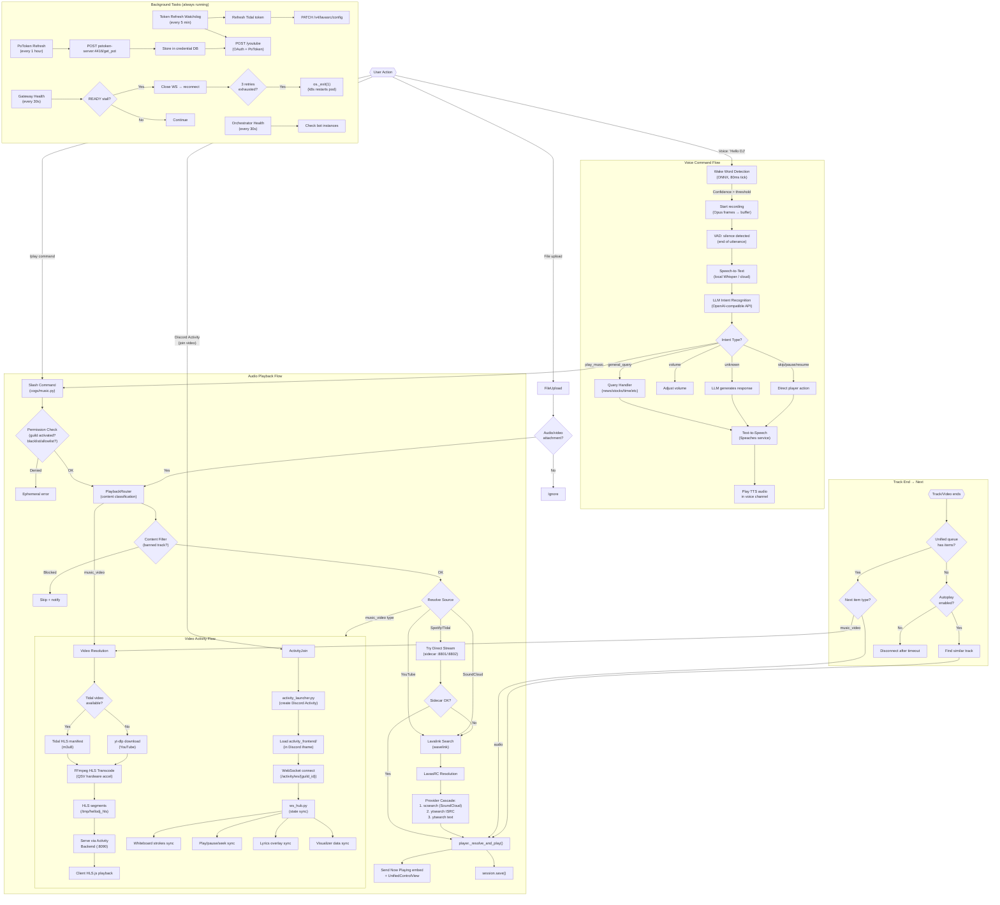

# HelloDJ Architecture Diagram

```mermaid
graph TB
    %% External Services
    subgraph External["External Services"]
        Discord["Discord API<br/>(Gateway + REST)"]
        YouTube["YouTube"]
        Spotify["Spotify API"]
        Tidal["Tidal API"]
        SoundCloud["SoundCloud"]
        OpenAI["LLM API<br/>(OpenAI-compatible)"]
        Google["Google OAuth2<br/>(YouTube token exchange)"]
    end

    %% Ingress
    subgraph Ingress["Traefik Ingress (hellodj.celestium.life)"]
        IngressRule1["/ → web-ui:8080"]
        IngressRule2["/activity/ → bot:8090"]
    end

    %% Main Pod
    subgraph MainPod["hellodj Pod (namespace: hellodj-service)"]
        direction TB

        subgraph Init["Init Container"]
            RenderConfig["render-lavalink-config<br/>(Python, reads credential DB)"]
        end

        subgraph BotContainer["Bot Container (port 8090)"]
            Bot["bot.py<br/>(discord.py + wavelink 3.5)"]
            Player["player.py<br/>(per-guild state)"]
            StreamResolver["stream_resolver.py<br/>(sidecar routing)"]
            VoicePipeline["Voice Pipeline<br/>(wakeword → STT → LLM → TTS)"]
            ActivityBackend["Activity Backend<br/>(aiohttp :8090)"]
            WSHub["WebSocket Hub<br/>(state sync)"]
            HLSTranscode["HLS Transcode<br/>(FFmpeg 9 + QSV)"]
            UnifiedPlayback["Unified Playback<br/>(orchestrator + router)"]
            CredStore["Credential Store<br/>(Fernet SQLite)"]
            LyricsService["Lyrics Service<br/>(LRC + Genius)"]
            Visualizer["Visualizer Manager"]
        end

        subgraph LavalinkContainer["Lavalink Container (port 2333)"]
            Lavalink["Custom Lavalink v4<br/>(fMP4 HLS + SABR)"]
            YTPlugin["youtube-plugin-sabr"]
            LavaSrc["lavasrc-plugin-4.8.3<br/>(Spotify/Tidal resolve)"]
        end

        subgraph TidalStream["Tidal Stream (port 8801)"]
            TidalSidecar["Direct Tidal<br/>Audio Stream"]
        end

        subgraph SpotifyStream["Spotify Stream (port 8802)"]
            SpotifySidecar["Direct Spotify<br/>Audio Stream"]
        end
    end

    %% Separate Deployments
    subgraph SupportPods["Support Deployments"]
        YTCipher["yt-cipher<br/>(port 8001)<br/>Deno signature decipher"]
        PoToken["potoken-server<br/>(port 4416)<br/>BotGuard PoToken gen"]
        WebUI["Web UI<br/>(port 8080)<br/>Flask/Gunicorn"]
    end

    subgraph OtherCluster["Other Cluster Services"]
        Speaches["Speaches TTS<br/>(port 8000)"]
        Redis["Redis 7.x<br/>(port 6379)<br/>redis-service namespace<br/>Sessions, PubSub, Rate Limits"]
    end

    %% Storage
    subgraph Storage["Persistent Storage"]
        LonghornPVC["hellodj-data-pvc<br/>(Longhorn 1Gi)<br/>hellodj.db, sessions, oauth"]
        NFSConfig["hellodj-config-pvc<br/>(NFS → Synology)<br/>bot.log, shared config"]
        NFSModels["hellodj-models-pvc<br/>(NFS → Synology)<br/>Hello_DJ.onnx"]
        NFSBackups["hellodj-backups-pvc<br/>(NFS → Synology)<br/>config backups"]
        HLSTmp["hls-tmp<br/>(tmpfs 2Gi RAM)<br/>HLS segments"]
        DevDRI["/dev/dri<br/>(hostPath)<br/>Intel iGPU QSV"]
    end

    %% Connections - External
    Bot <-->|"Gateway WS +<br/>REST API"| Discord
    Lavalink -->|"Stream audio"| YouTube
    Lavalink -->|"LavasRC resolve"| SoundCloud
    LavaSrc -->|"Track metadata"| Spotify
    LavaSrc -->|"Track metadata"| Tidal
    TidalSidecar -->|"Direct stream"| Tidal
    SpotifySidecar -->|"Direct stream"| Spotify
    VoicePipeline -->|"Chat completions"| OpenAI
    Bot -->|"Token exchange"| Google

    %% Connections - Internal
    Bot --> Player
    Player --> StreamResolver
    StreamResolver -->|"localhost:8801"| TidalSidecar
    StreamResolver -->|"localhost:8802"| SpotifySidecar
    Player -->|"wavelink"| Lavalink
    Bot --> ActivityBackend
    ActivityBackend --> WSHub
    ActivityBackend --> HLSTranscode
    Bot --> VoicePipeline
    Bot --> UnifiedPlayback
    VoicePipeline -->|"TTS"| Speaches
    HLSTranscode -->|"QSV encode"| DevDRI

    %% Lavalink to support services
    YTPlugin -->|"Cipher requests"| YTCipher
    Bot -->|"POST /get_pot"| PoToken
    Bot -->|"POST /youtube<br/>(OAuth + PoToken)"| Lavalink

    %% Init container
    RenderConfig -->|"Read creds"| LonghornPVC
    RenderConfig -->|"Write YAML"| Lavalink

    %% Storage connections
    Bot --- LonghornPVC
    Bot --- NFSConfig
    Bot --- NFSModels
    Bot --- HLSTmp
    TidalSidecar --- LonghornPVC
    SpotifySidecar --- LonghornPVC
    WebUI --- LonghornPVC
    WebUI --- NFSConfig

    %% Ingress connections
    IngressRule1 --> WebUI
    IngressRule2 --> ActivityBackend

    %% Lyrics + Visualizer
    LyricsService --> WSHub
    Visualizer --> WSHub
```

# HelloDJ Control Flow

```mermaid
flowchart TD
    %% Entry Points
    Start{{"User Action"}}
    Start -->|"/play command"| SlashCmd
    Start -->|"Voice: 'Hello DJ'"| WakeWord
    Start -->|"Discord Activity<br/>(join video)"| ActivityJoin
    Start -->|"File upload"| FileUpload

    %% === AUDIO PLAYBACK FLOW ===
    subgraph AudioFlow["Audio Playback Flow"]
        SlashCmd["Slash Command<br/>(cogs/music.py)"]
        SlashCmd --> PermCheck{"Permission Check<br/>(guild activated?<br/>blacklist/allowlist?)"}
        PermCheck -->|"Denied"| PermDenied["Ephemeral error"]
        PermCheck -->|"OK"| Router

        Router["PlaybackRouter<br/>(content classification)"]
        Router --> ContentFilter{"Content Filter<br/>(banned track?)"}
        ContentFilter -->|"Blocked"| Blocked["Skip + notify"]
        ContentFilter -->|"OK"| ResolveSource

        ResolveSource{"Resolve Source"}
        ResolveSource -->|"Spotify/Tidal"| TryDirect["Try Direct Stream<br/>(sidecar :8801/:8802)"]
        ResolveSource -->|"YouTube"| LavalinkSearch["Lavalink Search<br/>(wavelink)"]
        ResolveSource -->|"SoundCloud"| LavalinkSearch
        ResolveSource -->|"music_video type"| VideoFlow

        TryDirect --> DirectOK{"Sidecar OK?"}
        DirectOK -->|"Yes"| PlayTrack
        DirectOK -->|"No"| LavalinkSearch

        LavalinkSearch --> LavalinkResolve["LavasRC Resolution"]
        LavalinkResolve --> ProviderOrder["Provider Cascade:<br/>1. scsearch (SoundCloud)<br/>2. ytsearch ISRC<br/>3. ytsearch text"]
        ProviderOrder --> PlayTrack

        PlayTrack["player._resolve_and_play()"]
        PlayTrack --> SendNP["Send Now Playing embed<br/>+ UnifiedControlView"]
        PlayTrack --> SaveSession["session.save()"]
    end

    %% === VIDEO/ACTIVITY FLOW ===
    subgraph VideoFlow["Video Activity Flow"]
        direction TB
        ActivityJoin --> ActivityLaunch["activity_launcher.py<br/>(create Discord Activity)"]
        ActivityLaunch --> Frontend["Load activity_frontend/<br/>(in Discord iframe)"]
        Frontend --> WSConnect["WebSocket connect<br/>(/activity/ws/{guild_id})"]
        WSConnect --> WSHub2["ws_hub.py<br/>(state sync)"]

        VideoResolve["Video Resolution"]
        VideoResolve --> TidalVideo{"Tidal video<br/>available?"}
        TidalVideo -->|"Yes"| TidalHLS["Tidal HLS manifest<br/>(m3u8)"]
        TidalVideo -->|"No"| YTDownload["yt-dlp download<br/>(YouTube)"]

        TidalHLS --> Transcode
        YTDownload --> Transcode
        Transcode["FFmpeg HLS Transcode<br/>(QSV hardware accel)"]
        Transcode --> HLSSegments["HLS segments<br/>(/tmp/hellodj_hls)"]
        HLSSegments --> ServeHLS["Serve via Activity<br/>Backend (:8090)"]
        ServeHLS --> ClientHLS["Client HLS.js playback"]

        WSHub2 --> Whiteboard["Whiteboard strokes sync"]
        WSHub2 --> PlaybackSync["Play/pause/seek sync"]
        WSHub2 --> LyricsSync["Lyrics overlay sync"]
        WSHub2 --> VisualizerSync["Visualizer data sync"]
    end

    %% === VOICE PIPELINE FLOW ===
    subgraph VoiceFlow["Voice Command Flow"]
        WakeWord["Wake Word Detection<br/>(ONNX, 80ms tick)"]
        WakeWord -->|"Confidence > threshold"| StartListening["Start recording<br/>(Opus frames → buffer)"]
        StartListening --> VAD["VAD: silence detected<br/>(end of utterance)"]
        VAD --> STT["Speech-to-Text<br/>(local Whisper / cloud)"]
        STT --> Intent["LLM Intent Recognition<br/>(OpenAI-compatible API)"]
        Intent --> IntentType{"Intent Type?"}

        IntentType -->|"play_music"| SlashCmd
        IntentType -->|"skip/pause/resume"| PlayerAction["Direct player action"]
        IntentType -->|"volume"| VolumeAction["Adjust volume"]
        IntentType -->|"general_query"| QueryHandler["Query Handler<br/>(news/stocks/time/etc)"]
        IntentType -->|"unknown"| LLMResponse["LLM generates response"]

        QueryHandler --> TTS["Text-to-Speech<br/>(Speaches service)"]
        LLMResponse --> TTS
        PlayerAction --> TTS
        TTS --> PlayAudio["Play TTS audio<br/>in voice channel"]
    end

    %% === BACKGROUND TASKS ===
    subgraph Background["Background Tasks (always running)"]
        TokenWatch["Token Refresh Watchdog<br/>(every 5 min)"]
        TokenWatch --> RefreshTidal["Refresh Tidal token"]
        RefreshTidal --> PushTidal["PATCH /v4/lavasrc/config"]
        TokenWatch --> PushYT["POST /youtube<br/>(OAuth + PoToken)"]

        PoTokenTask["PoToken Refresh<br/>(every 1 hour)"]
        PoTokenTask --> FetchPot["POST potoken-server:4416/get_pot"]
        FetchPot --> StorePot["Store in credential DB"]
        StorePot --> PushYT

        GatewayWatch["Gateway Health<br/>(every 30s)"]
        GatewayWatch --> StallCheck{"READY stall?"}
        StallCheck -->|"Yes"| ForceReconnect["Close WS → reconnect"]
        StallCheck -->|"No"| Continue["Continue"]
        ForceReconnect --> MaxRetries{"3 retries<br/>exhausted?"}
        MaxRetries -->|"Yes"| PodRestart["os._exit(1)<br/>(k8s restarts pod)"]

        OrcHealth["Orchestrator Health<br/>(every 30s)"]
        OrcHealth --> CheckInstances["Check bot instances"]
    end

    %% === TRACK END / AUTO-ADVANCE ===
    subgraph AutoAdvance["Track End → Next"]
        TrackEnd{{"Track/Video ends"}}
        TrackEnd --> CheckQueue{"Unified queue<br/>has items?"}
        CheckQueue -->|"Yes"| NextItem{"Next item type?"}
        CheckQueue -->|"No"| CheckAutoplay{"Autoplay<br/>enabled?"}
        NextItem -->|"audio"| PlayTrack
        NextItem -->|"music_video"| VideoResolve
        CheckAutoplay -->|"Yes"| AutoplayResolve["Find similar track"]
        CheckAutoplay -->|"No"| Idle["Disconnect after timeout"]
        AutoplayResolve --> PlayTrack
    end

    %% File upload path
    FileUpload --> FileCheck{"Audio/video<br/>attachment?"}
    FileCheck -->|"Yes"| Router
    FileCheck -->|"No"| Ignore["Ignore"]

    %% Cross-links
    Router -->|"music_video"| VideoResolve
```
