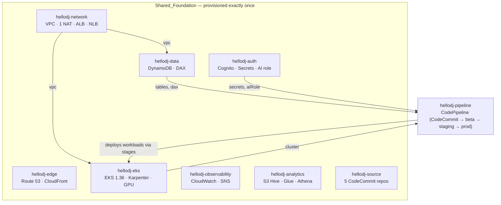

# HelloDJ AWS Platform — CDK Infrastructure Architecture

This document describes the AWS infrastructure synthesized and deployed by the
CDK app at `platform/infra` (`bin/hellodj.ts`). It is the source of truth for
the deployed state of the platform.

## Governing Principle

One stage's worth of HARDWARE, three stages' worth of SOFTWARE.

The VPC, EKS control plane, shared CPU node fleet, DAX cluster, ALB, and NLB are
provisioned **exactly once** and **shared** across Beta, Staging, and Production.
The three stages are three namespaced sets of container workloads
(`hellodj-<stage>`) deployed onto that one Shared_Foundation, isolated only by
**endpoint** (namespace + hostname), never by separate infrastructure.

## Deployed State (2026-08-26)

All 9 infrastructure stacks are deployed in `us-east-1` under the `hellodj` AWS
profile (account `874927898283`).

| Stack | Status | Principal Resources |
|-------|--------|---------------------|
| `hellodj-network` | ✅ deployed | VPC (3 AZ, /16, single NAT), shared ALB + NLB |
| `hellodj-edge` | ✅ deployed | Route 53 `hellodj.bot`, ACM cert, CloudFront, S3 buckets |
| `hellodj-data` | ✅ deployed | DynamoDB (core + search-cache + session), DAX cluster |
| `hellodj-auth` | ✅ deployed | Cognito, 4 Secrets Manager entries, keyless AI IAM role |
| `hellodj-eks` | ✅ deployed | EKS 1.36 cluster, 3 node groups, Karpenter, GPU NodePool |
| `hellodj-observability` | ✅ deployed | CloudWatch logs/dashboard/alarms, SNS topic |
| `hellodj-analytics` | ✅ deployed | S3 Hive Log_Store, Glue DB + crawler, Athena, QuickSight |
| `hellodj-source` | ✅ deployed | 5 private CodeCommit repos |
| `hellodj-pipeline` | ✅ deployed | CodePipeline (CodeCommit source, self-mutating) |

Workloads (`hellodj-workloads-beta/staging/production`) deploy through the
pipeline's promotion stages — not as standalone stacks.

## Source of Truth: CodeCommit (not GitHub)

All source code is hosted in private AWS CodeCommit repositories. There are no
GitHub-hosted inputs for HelloDJ-owned code.

| Repo | Branch | Purpose |
|------|--------|---------|
| `hellodj` | `main` | Application + platform infra (this repo) |
| `Lavalink` | `dev` | Custom Lavalink fork (fMP4 HLS + SABR) |
| `lavaplayer` | `main` | lavaplayer fork (fMP4 HLS patch) |
| `LavaSrc` | `tidal-v2-api` | LavaSrc fork (Tidal v2 API) |
| `youtube-source` | `main` | youtube-source fork (SABR support) |

Flake inputs use the `git+https://git-codecommit.<region>.amazonaws.com/v1/repos/<repo>?ref=<branch>` form. Authentication is via the AWS git credential helper (IAM-based, no static tokens).

## Stack Composition and Dependencies

## Pipeline Architecture

The pipeline sources from the `hellodj` CodeCommit repository (branch `main`).
On push, it:

1. **Installs tooling** — Nix (Determinate Systems installer, flakes enabled,
   wired to the S3 binary cache `s3://hellodj-nix-cache` as a substituter),
   ruff, and the AWS git credential helper for CodeCommit
2. **Synths** the CDK app (runs `assertFoundationSingleton`, gates)
3. **Self-mutates** if the pipeline definition changed
4. **Deploys beta** — `WorkloadsStack` into `hellodj-beta` namespace
5. **Deploys staging** — `WorkloadsStack` into `hellodj-staging` namespace
6. **Deploys production** — `WorkloadsStack` into `hellodj-production` namespace

A failed stage halts promotion. Earlier stages keep running. The pipeline does
NOT provision foundation hardware — only software workloads (K8s manifests).

The foundation is passed to the pipeline via cross-stack references (real
cluster, real tables, real secrets) — no fabricated imports or made-up role names.

### Build-Stage Gates (synth step)

All gates run from the repo root with `cd platform/infra` for CDK commands and
`cd platform` for Python tools:

| Gate | Command | Fails build on |
|------|---------|----------------|
| Foundation singleton (R1.8) | `npx cdk synth` | Duplicate VPC/EKS/DAX/NAT/ALB/NLB |
| Closure resolution (R7.2-7.7) | `resolve_closure.py --ami --verify` | Missing/unretrievable closure (bootstrap mode: placeholder hashes pass) |
| Nix base-image (R5.4) | `gate_base_image.py` | Non-Nix (ubuntu/debian) base |
| PEP 8 + line-count (R13.2-13.4) | `gate_style.py` | ruff violations or >500-line files |
| Pin verification (R11.1-11.6) | `gate_pins.py` | Mismatched or unresolved pin |

Per-component steps run `resolve_closure.py --component <c> --verify` and
`gate_dependencies.py --component <c>` for ARM64 compatibility documentation.

### CodeBuild Environment

The pipeline uses `CodeBuildStep` (not `ShellStep`) for both the synth step and
per-component steps, which provides `installCommands` support. The install phase
provisions:

- Nix (Determinate Systems installer, `nix-command flakes` experimental features)
- S3 binary cache configured as an `extra-substituters` entry
- AWS git credential helper for CodeCommit
- ruff (pinned at 0.6.9)

The `primaryOutputDirectory` is set to `platform/infra/cdk.out` so CDK Pipelines
finds the synthesized cloud assembly.

## GPU Hybrid Transcode Model

GPU-default, CPU-fallback. One shared time-sliced GPU pool serves all stages.

- **GPU path**: Karpenter `transcode-gpu` NodePool, `g5g.xlarge` Spot, time-sliced
  T4G (4 `nvidia.com/gpu` units), scale-to-zero after 300s idle
- **CPU path**: `c7g.xlarge` transcode node group, scale-to-zero, bridges GPU
  spin-up (≤5s) and Spot reclaim only — not sized for sustained render

## Nix Build (GitHub Actions)

The actual build happens in GitHub Actions (`.github/workflows/nix-build.yml`),
NOT in CodeBuild. The pipeline's build steps are metadata-only (verify prebuilt
closures from S3 cache). This means zero CodeBuild compute cost for building.

Build flow:
1. GHA runner assumes IAM role via OIDC
2. Git credential helper authenticates to CodeCommit
3. Local Nix store cache (`actions/cache`) checked first
4. S3 binary cache checked second
5. Build from source only if both miss
6. Sign + push closure to S3, verify retrievable, then mark available

## Tiered Nix Cache

| Tier | Location | Scope |
|------|----------|-------|
| Local (GHA) | `actions/cache` keyed by `flake.lock` hash | Per-runner acceleration |
| Local (EKS) | hostPath `/var/lib/nix` PV | Per-node acceleration |
| S3 binary cache | Signed, shared | Cross-stage source of truth |

The local tier is never the cross-stage source. S3 remains the build-once store
for Beta/Staging/Production.

## Pin Gate

`platform/tools/gate_pins.py` verifies every pinned input against its recorded
upstream identifier. It accepts both CodeCommit (`type = "codecommit"`) and
legacy github entries. A `path:` input is always rejected. Temurin is held at
feature version 25.

## Idle cost model

Region: us-east-1. Pricing reference date: 2026-08-24.

Single-stage baseline (prior architecture): $340–$400/mo. The shared-foundation
approach delivers three software stages at **$220/mo** — well below 1.5× of the
single-stage baseline ($510 ceiling).

| Resource | Monthly Idle (USD) |
|----------|--------------------|
| EKS control plane (1 cluster) | **$73** |
| Node_Floor (1× m7g.large) | **$49** |
| NAT gateway (1) | **$33** |
| DAX (1× dax.t3.small) | **$29** |
| Application Load Balancer (1 shared) | **$18** |
| Network Load Balancer (1 shared) | **$18** |
| transcode-gpu NodePool (scale-to-zero) | **$0** |
| Total (itemized idle) | **$220/mo** |

Three software stages for the price of less than one old single-stage deployment.

## Key Files

| Path | Purpose |
|------|---------|
| `platform/infra/bin/hellodj.ts` | CDK app composition |
| `platform/infra/lib/pipeline-stack.ts` | Pipeline + promotion stages |
| `platform/infra/lib/eks-stack.ts` | EKS cluster + node groups + Karpenter |
| `platform/infra/lib/workloads-stack.ts` | Per-stage K8s workloads |
| `platform/infra/lib/source-stack.ts` | CodeCommit repositories |
| `platform/pins.toml` | Pinned upstream versions |
| `platform/tools/gate_pins.py` | Pin verification gate |
| `platform/tools/apply_bump.py` | Atomic dependency bump |
| `platform/tools/migrate_repos.py` | CodeCommit migration procedure |
| `platform/tools/gate_python_migration.py` | Python 3.14 readiness gate |
| `.github/workflows/nix-build.yml` | Nix build trigger (GHA) |
