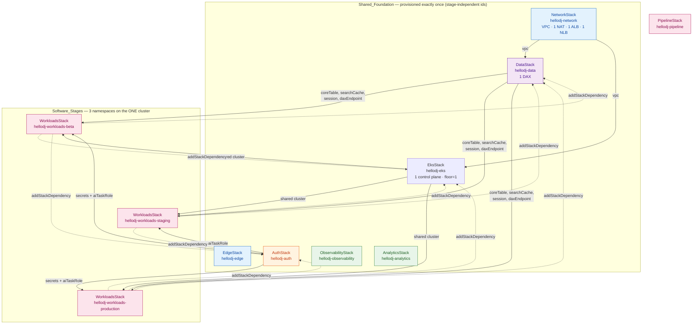
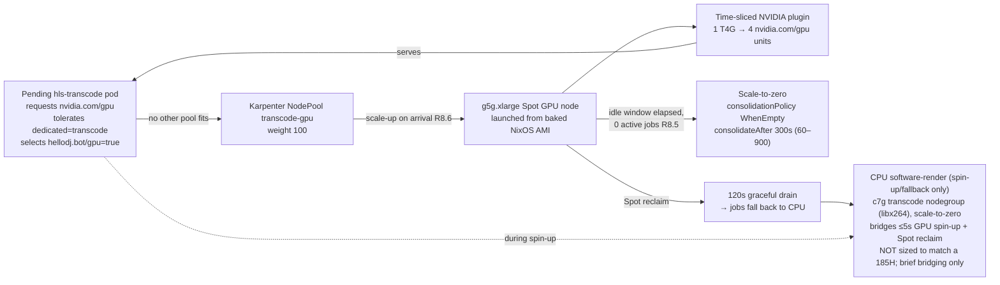
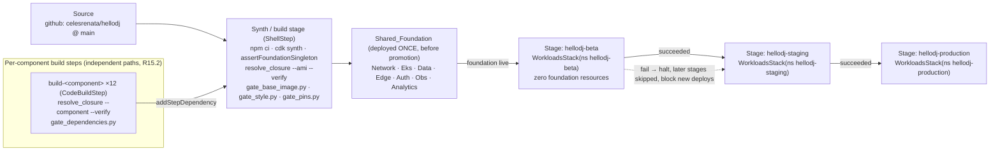

# HelloDJ AWS Platform — CDK Infrastructure Architecture

This document describes the AWS infrastructure synthesized by the CDK app at
`platform/infra` (`bin/hellodj.ts`). It is generated from the actual stack
sources under the **shared-foundation topology**: one stage's worth of
HARDWARE, three stages' worth of SOFTWARE.

The governing principle: the VPC, the EKS control plane, the shared CPU node
fleet, the DAX cluster, the ALB, and the NLB are provisioned **exactly once**
and **shared** across Beta, Staging, and Production. The three stages are not
three copies of the hardware — they are three namespaced sets of container
workloads (`hellodj-<stage>`) deployed onto that one Shared_Foundation, isolated
only by **endpoint** (a `hellodj-<stage>` namespace plus a
`<stage>.<region>.hellodj.bot` hostname), never by separate infrastructure.

## Validation status

| Check | Result |
|---|---|
| `npx tsc --noEmit` | clean (0 errors) |
| Stack count (`bin/hellodj.ts`) | **11 stacks** — 7 foundation singletons + 3 `hellodj-workloads-<stage>` + 1 pipeline |
| `npx jest` | 16 suites / 167 tests total; **14 suites / 150 tests pass** (shared-foundation suites green: `foundation`, `software-stages`, `endpoint-isolation`, `eks-*`, `network`, `data`, `auth`, `edge`, `analytics`, `observability`, `config`, `dns-naming`, `stage-model-properties`) |
| Known-failing suites | `beta-smoke.test.ts` and `pipeline-stack.test.ts` — legacy `aws-saas-replatform` tests that construct old per-stage stack ids / the old placeholder pipeline; superseded by the shared-foundation suites and cleared by their own refactor tasks |
| `npx cdk synth` | in progress — the foundation + 3 workloads synth; full-app synth currently halts in the **pipeline** stage while `pipeline-stack.ts` is being reworked to deploy `WorkloadsStack` inside each `HelloDjStage` against the imported shared cluster |
| Stage names | `beta → staging → production` (zero `gamma`/`prod`) |

The synthesized app **always models all three software stages** on the one
shared foundation; `HELLODJ_STAGE` no longer selects *the* stage to deploy.

## Stack composition and dependencies

Seven **stage-independent** foundation stacks (singletons, no `-<stage>`
suffix), three per-stage `hellodj-workloads-<stage>` software stacks on the one
shared cluster, plus a region-agnostic pipeline stack are instantiated in
`bin/hellodj.ts`. Each `WorkloadsStack` declares explicit stack dependencies on
EKS, Data, and Auth so a single `cdk deploy` orders them. Before `app.synth()`,
`assertFoundationSingleton(app)` enforces the Foundation_Singleton_Invariant
(fail synth, name the duplicated type, if any foundation resource appears more
than once).

The `-<stage>` suffix is dropped from all seven shared stacks: `hellodj-network`,
`hellodj-eks`, `hellodj-data`, `hellodj-edge`, `hellodj-auth`,
`hellodj-observability`, `hellodj-analytics`. The `EksStack` cluster name is now
stage-independent (`hellodj`) and node-group names lose their `-<stage>` token
(`hellodj-app-ondemand`, `hellodj-app-spot`, `hellodj-transcode`); the GPU
NodePool name `transcode-gpu` was already stage-independent and is unchanged.

## End-to-end runtime topology (one shared foundation, three namespaced stages)

Traffic flows from clients through CloudFront/Route 53 (EdgeStack) and the one
shared ALB (NetworkStack) into the one shared EKS fleet (EksStack). The ALB uses
**host-based Ingress rules** to route each `<stage>.<region>.hellodj.bot`
hostname to that stage's `hellodj-<stage>` namespace only. Each namespace runs
its own copy of the 12 components (one `WorkloadsStack` per stage) that read the
shared DynamoDB/DAX (DataStack), Secrets Manager + the keyless AI role
(AuthStack), and emit logs/metrics to CloudWatch → S3/Athena (Observability +
Analytics). The diagram below shows a single stage's flow; all three stages
share the same edge, VPC, cluster, node fleet, DAX, and load balancers.

```mermaid
flowchart TB
    subgraph clients["Clients"]
        BR["Browser / Discord Activity iframe"]
        DG["Discord Gateway (WSS/TCP)"]
    end

    subgraph edge["EdgeStack (hellodj-edge) — Route 53 + ACM + CloudFront (shared)"]
        R53["Route 53 zone hellodj.bot (shared)<br/>per-stage A-alias: &lt;stage&gt;.&lt;region&gt;.hellodj.bot<br/>(prod: apex hellodj.bot)"]
        ACM["ACM cert (DNS-validated)<br/>envName (+apex on prod)"]
        CF["CloudFront Distribution (shared)<br/>default → web static (S3, OAC)<br/>/hls/* → HLS segments (S3, OAC)"]
        S3W["S3 web-static bucket (shared)"]
        S3H["S3 HLS bucket (shared)<br/>(1-day expiry)"]
    end

    subgraph net["NetworkStack — VPC 10.0.0.0/16, 3 AZ, single NAT"]
        ALB["ALB (internet-facing, shared)<br/>host-based rules per stage<br/>albSG: 80/443 from 0.0.0.0/0"]
        NLB["NLB (internet-facing, shared)<br/>Discord gateway sockets"]
        NAT["1 NAT gateway (natGateways: 1)<br/>egress for all private subnets"]
        FLEETSG["fleetSG: app ports from ALB<br/>+ intra-fleet all-traffic"]
    end

    subgraph eks["EksStack — Amazon EKS (K8s v1.36, private endpoints), shared"]
        direction TB
        APPOD["Nodegroup app-ondemand (Node_Floor)<br/>Graviton m7g.large default, 1–10<br/>(m7g.xlarge single-node fallback)"]
        APPSPOT["Nodegroup app-spot<br/>Graviton, 0–20 (scale-to-zero)"]
        TRAN["Nodegroup transcode (Spot c7g.xlarge)<br/>taint dedicated=transcode:NoSchedule<br/>label workload=transcode, 0–8 (scale-to-zero)<br/>CPU software-render = spin-up/fallback only"]
        KARP["Karpenter (Helm 1.0.6)<br/>runs on app fleet"]
        GPU["Karpenter NodePool transcode-gpu<br/>g5g.xlarge Spot from baked NixOS AMI<br/>time-sliced nvidia.com/gpu ×4<br/>scale-to-zero after idle 300s [60–900]<br/>120s drain on Spot reclaim"]
        NVDP["NVIDIA device plugin (time-slicing)"]
        KARP --> GPU
        GPU -.->|advertises nvidia.com/gpu| NVDP
    end

    subgraph wl["WorkloadsStack — 12 components per namespace (×3: hellodj-beta/-staging/-production)"]
        direction TB
        WEB["web-ui :8080 (Ingress /)"]
        ACT["activity-backend :8090 (Ingress /activity)"]
        ORCH["playback-orchestrator :8080"]
        LAV["lavalink :2333"]
        TID["tidal-stream :8801"]
        SPO["spotify-stream :8802"]
        YTC["yt-cipher :8001"]
        POT["potoken-server :4416"]
        BOT["discord-bot-core (no svc)"]
        VOICE["voice-pipeline (no svc, AI role)"]
        HLS["hls-transcode :8095<br/>GPU-default; CPU render = spin-up/fallback"]
        CR["config-renderer (Job)"]
    end

    subgraph data["DataStack — DynamoDB + DAX (in VPC)"]
        CORE["DynamoDB hellodj-core<br/>PK/SK + GSI1 (PITR, RETAIN)"]
        SCACHE["DynamoDB hellodj-search-cache<br/>queryKey + ttl"]
        SESS["DynamoDB hellodj-session<br/>PK/SK (PITR, RETAIN)"]
        DAX["DAX cluster hellodj-dax<br/>fronts hot tables (R7.6)"]
        DAX --> SCACHE
        DAX --> SESS
    end

    subgraph auth["AuthStack (hellodj-auth) — Cognito + Secrets + keyless AI (shared)"]
        COG["Cognito user pool (shared)<br/>admins group + hosted UI + web client"]
        SEC["Secrets Manager (shared)<br/>discord-bot-token, tidal-refresh,<br/>spotify, yt-cipher-secret"]
        AIROLE["IAM aiTaskRole (keyless, EKS Pod Identity)<br/>Bedrock / Transcribe / Polly"]
    end

    subgraph obs["ObservabilityStack (hellodj-observability) — CloudWatch (shared)"]
        CWL["Log group /hellodj/platform (shared)"]
        DASH["Dashboard hellodj-platform (shared)"]
        ALM["Alarms: CPU/GPU transcode pressure,<br/>component errors"]
        SNS["SNS hellodj-alarms (shared)"]
        ALM --> SNS
    end

    subgraph ana["AnalyticsStack — S3 Hive + Glue + Athena + QuickSight"]
        S3L["S3 Log_Store (year/month/day/hour)"]
        GLUE["Glue DB + hourly crawler"]
        ATH["Athena workgroup + named query"]
        QS["QuickSight Athena data source"]
        S3L --> GLUE --> ATH --> QS
    end

    %% client edges
    BR -->|HTTPS| CF
    CF --> S3W
    CF -->|hls/*| S3H
    CF -->|dynamic| ALB
    R53 --> CF
    ACM -.-> CF
    DG -->|TCP| NLB

    %% edge/net into fleet
    ALB -->|/ | WEB
    ALB -->|/activity| ACT
    NLB --> BOT
    FLEETSG -.-> APPOD

    %% workloads land on node groups
    WEB & ACT & ORCH & LAV & TID & SPO & YTC & POT & BOT & VOICE & CR -->|idle on Node_Floor| APPOD
    APPOD -.->|burst| APPSPOT
    HLS -->|GPU-default jobs| GPU
    HLS -.->|spin-up/fallback CPU render| TRAN

    %% data/secret/AI wiring
    ORCH & WEB & BOT & ACT & CR -->|table R/W| CORE
    ORCH -->|hot reads| DAX
    TID -->|read| SEC
    SPO -->|read| SEC
    YTC -->|read| SEC
    LAV -->|read| SEC
    VOICE -->|assume| AIROLE
    WEB -->|OAuth/admin| COG

    %% observability
    HLS -->|CPU/GPU pressure metrics| ALM
    wl -.->|logs| CWL
    CWL -->|export| S3L
```

## GPU "gas/electric" hybrid transcode model (Decision D3)

The single shared GPU pool serves all three stages — there is no per-stage GPU
instance. Stages are isolated only by their `StageEndpoint` (namespace +
hostname), not by separate GPU fleets.

This mirrors the pure `gpu_idle_decision` function: scale-to-zero iff
`active_jobs == 0 AND idle_elapsed >= window`; scale-up the moment a
GPU-requiring pod is pending. The `EksStack` validates `gpuIdleWindowSeconds`
against `[60, 900]` at synth time, matching Python `GpuIdleConfig.__post_init__`.

**Transcode/visualizer is GPU-default (CPU is spin-up/fallback only).** One
active software-render session (libx264 / CPU visualizer) consumes roughly
50–75% of an Intel Core Ultra 185H — far more than the scale-to-zero
`c7g.xlarge` (4 Graviton vCPU) transcode node can sustain. So sustained render
runs on the shared time-sliced `transcode-gpu` NodePool (a `g5g.xlarge` T4G,
time-sliced across concurrent sessions), and **CPU software-render is demoted to
the spin-up/fallback path only**: it bridges the sub-second-to-≤5s window while
the GPU scales from zero and covers a Spot GPU reclaim. The `c7g.xlarge`
transcode node is therefore **not** sized to match a 185H — it only carries
brief bridging — and the heavy render never touches the always-on Node_Floor.
Both the GPU pool and the CPU transcode group remain scale-to-zero, so neither
adds idle cost. This is why the always-on floor stays a single small
`m7g.large` (2 vCPU / 8 GiB) node carrying only the three namespaces' idle pods
(three bounded-heap `lavalink` JVMs plus ~30 small idle Python pods and the
system/Karpenter/ALB-controller daemonsets); `m7g.xlarge` is the recorded
single-node fallback if measured idle memory pressure exceeds `m7g.large`.

## Delivery pipeline (PipelineStack)

The pipeline promotes **software only**. The Shared_Foundation is deployed
**once, before** the three promotion stages — never inside a per-stage
`cdk.Stage` — so CDK Pipelines' per-stage deploy can never triple the hardware.
Each promotion stage deploys only that stage's namespaced `WorkloadsStack`
(Kubernetes manifests referencing the pre-provisioned shared cluster/data/auth);
its synthesized template contains **zero** foundation resources (no
`AWS::EC2::VPC`, EKS control-plane, `AWS::EC2::NatGateway`, `AWS::DAX::Cluster`,
`AWS::ElasticLoadBalancingV2::LoadBalancer`, or `AWS::EKS::Nodegroup`).

CDK Pipelines models the fixed promotion order `beta → staging → production`;
sequential stages + halt-on-failure realize `promotion.promote()`. A failed
stage leaves earlier stages running (independent namespaces on a still-healthy
cluster) and blocks a new promotion until resolved. Per Requirement 6, the build
steps are metadata-only (resolve/verify prebuilt closures from the S3 Nix cache
/ ECR) — GitHub Actions with Nix is the actual build trigger, so no CodeBuild
compute is billed for building images or the AMI.

## Key resource inventory (per stack)

| Stack | Principal resources |
|---|---|
| **NetworkStack** (`hellodj-network`) | VPC (3 AZ, /16, public + private-egress, **single NAT** `natGateways: 1`), 1 shared ALB (80/443, host-based rules), 1 shared NLB (gateway), ALB SG, fleet SG |
| **EdgeStack** (`hellodj-edge`) | 1 shared Route 53 `hellodj.bot` zone, per-stage A-alias (+ prod apex), ACM cert, CloudFront (web default + `/hls/*`), S3 web-static + HLS buckets (OAC) |
| **DataStack** (`hellodj-data`) | DynamoDB `hellodj-core` (+GSI1), `hellodj-search-cache` (ttl), `hellodj-session`; **1 shared DAX cluster** (`dax.t3.small`, rf=1) + subnet group + SG + service role |
| **AuthStack** (`hellodj-auth`) | 1 shared Cognito user pool + `admins` group + hosted UI domain + web client; 4 Secrets Manager entries; keyless `aiTaskRole` (Bedrock/Transcribe/Polly) |
| **EksStack** (`hellodj-eks`) | 1 shared EKS v1.33 cluster (`hellodj`, private+public endpoint); app on-demand (**Node_Floor min/desired 1, `m7g.large` default / `m7g.xlarge` single-node fallback**) + app spot (0) + transcode (0) node groups (Graviton, scale-to-zero); Karpenter Helm; GPU `EC2NodeClass`+`transcode-gpu` `NodePool` (scale-to-zero); NVIDIA time-slicing device plugin |
| **ObservabilityStack** (`hellodj-observability`) | CloudWatch log group, dashboard, 3 alarms (CPU/GPU pressure, errors) → SNS topic |
| **AnalyticsStack** (`hellodj-analytics`) | S3 Hive Log_Store + Athena-results bucket; Glue DB + hourly crawler; Athena workgroup + named query; QuickSight Athena data source |
| **WorkloadsStack** ×3 (`hellodj-workloads-beta`/`-staging`/`-production`) | Per namespace `hellodj-<stage>`: 12 component Deployments/Services/HPAs, host-based ALB Ingress for `<stage>.<region>.hellodj.bot` (`/`, `/activity`), IRSA/Pod-Identity env + IAM wiring; all three share the one cluster/DAX/secrets/AI role and provision **no** foundation hardware |
| **PipelineStack** (`hellodj-pipeline`) | CodePipeline (self-mutating), synth ShellStep + gates + `assertFoundationSingleton`, 12 per-component CodeBuildSteps; foundation deployed once ahead of promotion; software-only beta→staging→production stages |

## Idle cost model

The `Idle_Cost_Model` itemizes the **one** Shared_Foundation's monthly cost when
**no stage is under load** (every component at its HPA `minReplicas`; the Spot,
CPU-transcode, and GPU NodePools all scaled to zero). It proves the design goal:
three software stages cost **≈ 1×** a single stage's hardware, not 3×.

- **Region:** `us-east-1`.
- **Pricing-reference date:** `2026-08-24` (the same on-demand basis the
  `aws-saas-replatform` design recorded, extended with the single-NAT and
  single-node-floor changes this spec makes).

### Itemized idle lines (USD/month, on-demand)

| Foundation resource | Idle configuration | Est. monthly idle cost (USD) |
|---|---|---|
| EKS control plane | 1 cluster @ $0.10/hr | **$73** |
| `Node_Floor` | 1× `m7g.large` on-demand, always-on (idle pods only; transcode is off-floor) | **$49** |
| NAT gateway | **1** NAT (was 3) @ ~$0.045/hr + minimal idle data processing | **$33** |
| DAX cluster | 1× `dax.t3.small`, `replicationFactor: 1` | **$29** |
| Application Load Balancer (ALB) | 1 shared ALB (LCU-minimal at idle) | **$18** |
| Network Load Balancer (NLB) | 1 shared NLB (LCU-minimal at idle) | **$18** |
| Shared `transcode-gpu` NodePool | scaled to **zero** nodes at idle | **$0** |
| **Total (itemized idle)** | all three Software_Stages on the one Shared_Foundation, at the `m7g.large` floor (default) | **$220/mo** |

The six itemized foundation lines sum to **$73 + $49 + $33 + $29 + $18 + $18 = $220/mo**
(the `transcode-gpu` NodePool adds **$0** while scaled to zero), so the itemized
total idle cost is **$220/mo** — landing at the top of the inclusive
**$180–220/mo** target for region **us-east-1** at pricing-reference date
**2026-08-24**.

> **Single-node fallback (out of band, not the itemized total).** If measured
> idle memory pressure forces the one always-on node up to `m7g.xlarge`, the
> `Node_Floor` line rises from **$49** to ~**$98**, taking the total to ≈
> **$269/mo**. This is still **one** node and still **≤ 1.5×** a single stage's
> recorded hardware; it is recorded here as the documented fallback, separate
> from the **$220/mo** itemized default above.

### How each cost acceptance criterion is met

- **Six itemized USD lines (R6.1).** The table gives a separate USD line for the
  EKS control plane, the `Node_Floor`, the single NAT, DAX, the ALB, and the NLB.
- **GPU $0 idle (R6.2).** The shared time-sliced `transcode-gpu` NodePool
  contributes exactly **$0** while scaled to zero (`consolidationPolicy:
  WhenEmpty` + `consolidateAfter`); the CPU-transcode node group is likewise
  scale-to-zero, so neither adds idle cost.
- **≤ 1.5× a single stage's recorded hardware (R6.3).** A single stage's
  foundation was recorded at ≈ **$340–400/mo** (EKS $73 + two on-demand app nodes
  ~$110 + three NAT ~$99 + DAX $29 + ALB+NLB ~$36 + GPU $0). This shared
  foundation is ≈ **$220/mo** — *below* one single stage's recorded cost, and far
  below **1.5×** it (1.5 × $340 = $510). Three software stages therefore cost
  roughly **0.55–0.65×** one old single-stage foundation, decisively not 3×.
- **Inclusive $180–220/mo target (R6.4).** The **`m7g.large` floor** (the default,
  per the [node-floor capacity analysis](#gpu-gaselectric-hybrid-transcode-model-decision-d3))
  lands at ≈ **$220/mo**. This is achievable because the CPU-heavy
  transcode/visualizer workload is **off the floor** (GPU-default, scale-to-zero),
  so the always-on node only carries idle pods and can be the small `m7g.large`.
  If measured idle memory pressure exceeds it, the single node bumps to
  `m7g.xlarge` (≈ **$269/mo**, still one node, still ≤ 1.5× a single stage) as a
  recorded fallback.
- **Region + date (R6.5).** `us-east-1`, priced `2026-08-24` (stated above).

The topology above reflects the decisions that make this cost achievable: one
shared foundation, a single-node floor, one NAT, and GPU-default scale-to-zero
transcode. These figures are the source of truth kept in sync with the stack
changes and are asserted by the cost-model doc-lint (task 9.3).

## Notes / caveats surfaced during validation

- The foundation stacks and the three `hellodj-workloads-<stage>` stacks
  synthesize; the **full-app** `cdk synth` currently halts in the pipeline stage
  while `pipeline-stack.ts` is being reworked to deploy `WorkloadsStack` inside
  each `HelloDjStage` against the imported shared cluster (`addServiceAccount`
  on an imported cluster). This is tracked by the pipeline-refactor task, not the
  doc-sync task.
- Two legacy `aws-saas-replatform` test suites (`beta-smoke.test.ts`,
  `pipeline-stack.test.ts`) still reference old per-stage stack ids / the old
  placeholder pipeline and fail under the refactor; they are superseded by the
  shared-foundation suites (`foundation`, `software-stages`, `endpoint-isolation`)
  and are cleared by their own tasks.
- `synth` emits deprecation warnings only where it runs: `pointInTimeRecovery`
  (DataStack), `CfnResource.addDependency` (Analytics), CodePipeline V1 type, and
  a cross-stack-reference strength default.
- The GPU AMI id is a clearly-marked placeholder (`ami-PLACEHOLDER-baked-nixos-gpu`)
  until the GitHub Actions Nix build registers and injects the real id.
- The pipeline source repo is the placeholder `celesrenata/hellodj`; the real
  `hellodj`-account connection is injected at deploy time.
